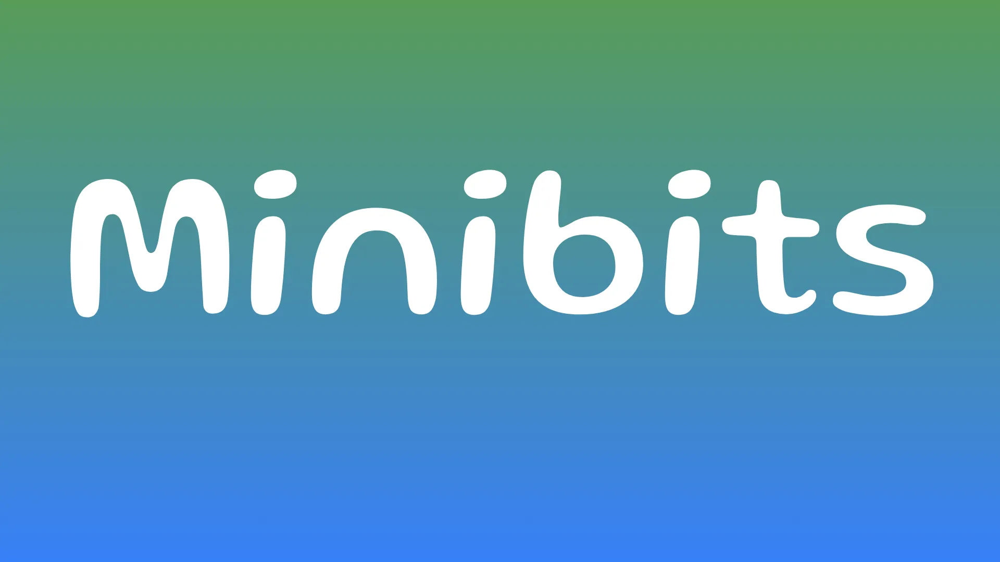

I den här handledningen går jag igenom hur du konfigurerar Minibits Wallet för att använda ecash. En kraftfull integritetsfokuserad betalningsteknik som fungerar tillsammans med Bitcoin. Minibits är en ecash och Lightning Wallet som möjliggör omedelbara, billiga och privata värdeöverföringar, vilket gör den idealisk för vardagliga transaktioner där integriteten är viktig.

Innan vi dyker in i Minibits, låt oss skapa en tydlig förståelse för vad ecash är och inte är. Många människor förväxlar ecash med Bitcoin- eller Blockchain-teknik, men de är fundamentalt olika koncept.

Ecash är INTE Bitcoin. Det ersätter inte din självförvaltande Bitcoin Wallet utan kompletterar den snarare. Ecash är INTE en Blockchain och lever INTE på någon offentlig Ledger. Intressant nog är ecash INTE en ny teknik - den föregår faktiskt den globala webben, med koncept som utvecklades på 1980- och 1990-talen.

Vad ecash ÄR: otroligt privat (transaktioner lämnar ingen spårbar historia), peer-to-peer (direkta överföringar utan mellanhänder) och fungerar som ett digitalt innehavarinstrument (om du äger det, kontrollerar du det). En viktig fördel är att ecash kan användas offline - antingen avsändaren eller mottagaren kan vara bortkopplade från internet under transaktionerna. Ecash kan präglas av en enda part eller av en federation av betrodda enheter, och det är en perfekt kompletterande teknik till Bitcoin, som hanterar små, frekventa transaktioner medan Bitcoin fungerar som avveckling Layer.

Observera att denna Minibits-installation representerar en "custodial solution", vilket innebär att du litar på att Mint-operatören förvaltar dina pengar. Detta medför specifika risker som du måste förstå innan du fortsätter.

Projektet visar denna viktiga ansvarsfriskrivning:

- Denna Wallet bör endast användas för forskningsändamål.
- Wallet är en betaversion med ofullständig funktionalitet och både kända och okända buggar.
- Använd den inte med stora mängder ecash.
- De ecash som lagras i Wallet utfärdas av myntverket
- du litar på att myntverket backar upp den med Bitcoin tills du överför ditt innehav till en annan Bitcoin blixt Wallet.
- Cashu-protokollet som Wallet implementerar har ännu inte genomgått någon omfattande granskning eller testning.

Behandla Minibits som en vardaglig Wallet, inte som ett sparkonto, och förvara aldrig betydande värden här.

## 1️⃣ Konfigurera din Wallet

Börja med att besöka [Minibits webbplats] (https://www.minibits.cash/) där du hittar nedladdningsalternativ för alla större plattformar. iOS-användare kan ladda ner från [App Store] (https://testflight.apple.com/join/defJQgTD), medan EU iOS-användare har det extra alternativet att installera från [Freedom Store] (https://freedomstore.io/). Android-användare kan hämta appen från [Google Play Store] (https://play.google.com/store/apps/details?id=com.minibits_wallet) eller ladda ner APK-filen direkt från sidan [GitHub Releases] (https://github.com/minibits-cash/minibits_wallet/releases).

När du installerar Minibits kommer du att se introduktionsskärmar som förklarar de grundläggande begreppen - du kan läsa igenom dem eller hoppa över dem om du redan är bekant med tekniken. När du har slutfört dessa inledande steg uppmanas du att välja mellan:

- "Nu vet jag, ta mig till Wallet" för nya användare eller
- `Recover lost Wallet` om du återställer från en säkerhetskopia.

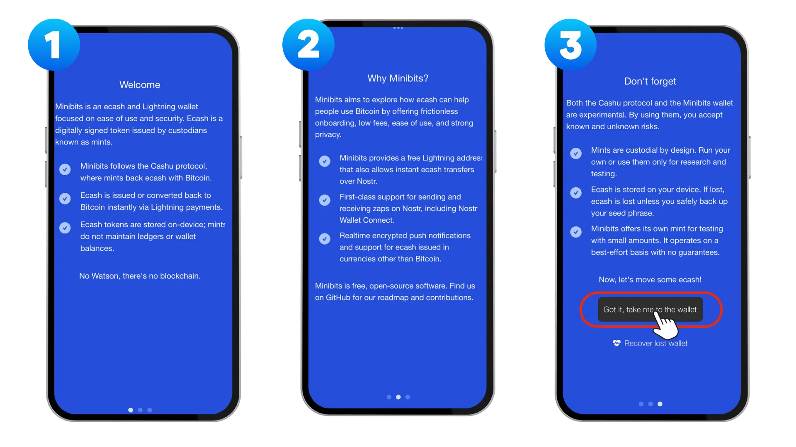

När du har slutfört den första installationen kommer du till startskärmen, som har flera viktiga Elements att notera. ① Profilikonen i det övre hörnet tar dig till din profilsida där du kan komma åt dina Minibits Wallet Address och välja alternativ för `batchmottagning`. ② I mitten av skärmen ser du de mintsorter du kan använda, med Minibits mintsort vald som standard. ③ Åtgärdsraden nedan ger alternativ för att skicka ecash- eller lightning-betalningar, skanna en QR-kod och ta emot betalningar. ④ Slutligen innehåller det nedre navigeringsfältet genvägar till startskärmen, transaktionshistorik, kontakter och inställningar.

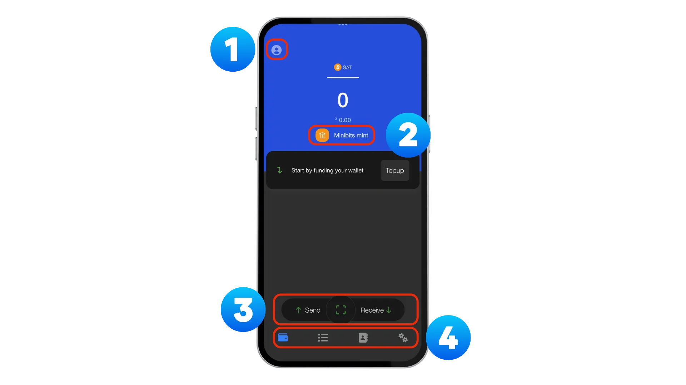

## 2️⃣ Hantera minttabletter

Som standard är Minibits mint aktiverat när du startar appen. En av ecashs styrkor är dock möjligheten att använda flera myntsorter för ökad decentralisering och säkerhet. För att lägga till en annan myntapparat, navigera till "Inställningar", välj sedan "Hantera myntapparater" och tryck slutligen på "Lägg till myntapparat".

[Bitcoinmints.com](Bitcoinmints.com) ger en omfattande lista över tillgängliga myntverk med användarnas betyg för att hjälpa dig att välja ansedda alternativ. Att använda flera myntverk minskar din risk. Om ett myntverk upplever problem förblir dina medel på andra myntverk tillgängliga.

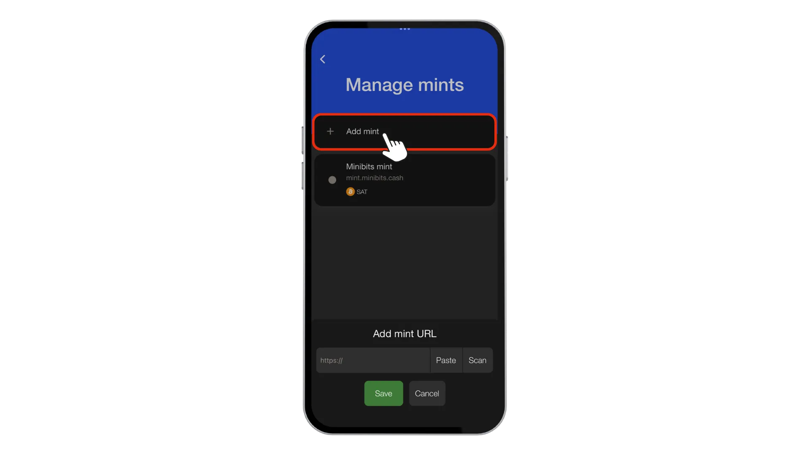

## 3️⃣ Skapa en säkerhetskopia

Backup är utan tvekan det mest kritiska steget i hela installationsprocessen. För att komma åt Backup-alternativen, navigera till `Settings`-> `Backup` Här hittar du två viktiga alternativ:

1. "Din seed-fras" som innehåller "12 ord" som gör att du kan återställa ditt ecashsaldo vid förlust av enheten. Denna seed-fras är din huvudnyckel till alla ecash i alla myntverk som du har lagt till. Skriv ner den på ett fysiskt medium (papper eller metall) och förvara den på ett säkert sätt på flera platser. Förvara aldrig din seed-fras digitalt där den kan äventyras. Överväg att besöka denna [handledning](https://planb.network/en/tutorials/wallet/backup/backup-mnemonic-22c0ddfa-fb9f-4e3a-96f9-46e2a7954270) för bästa praxis för att skydda din Wallet.

2. `Wallet backup` som innehåller en lång backup-sträng.

**Attention**: Du kommer fortfarande att behöva din seed-fras när du använder den här säkerhetskopian för att återställa din Wallet.

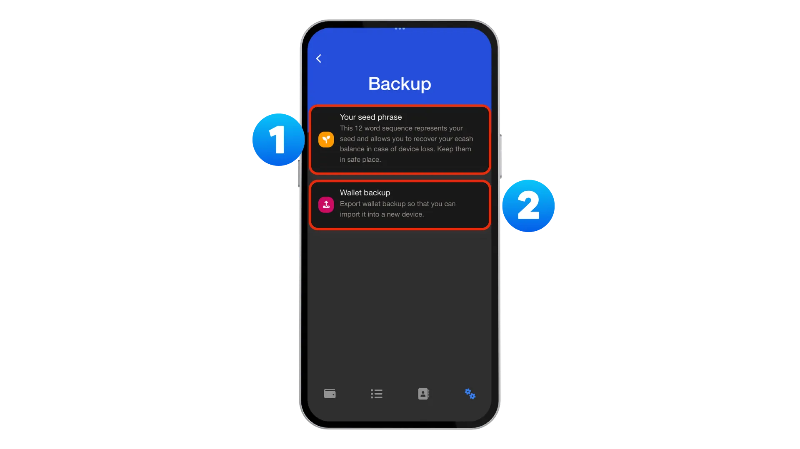

## 4️⃣ Skapa minibitar Wallet Address

Navigera sedan till `Kontakter` längst ner och anpassa din dedikerade `Minibits Wallet Address` genom att trycka på `Change` -> `Change Wallet Address`. Ange önskad Address och kontrollera tillgängligheten.

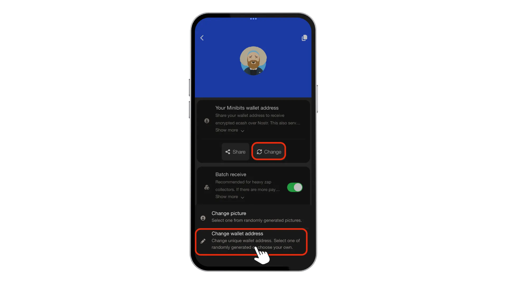

När du har ställt in din Address kommer du att bli ombedd att göra en liten "donation" för att stödja projektet. Även om detta är valfritt rekommenderar jag starkt att du överväger det om du planerar att använda tjänsten regelbundet. Open source-projekt som Minibits är beroende av stöd från samhället för att fortsätta utveckling och underhåll. Även ett litet bidrag bidrar till att säkerställa projektets livslängd.

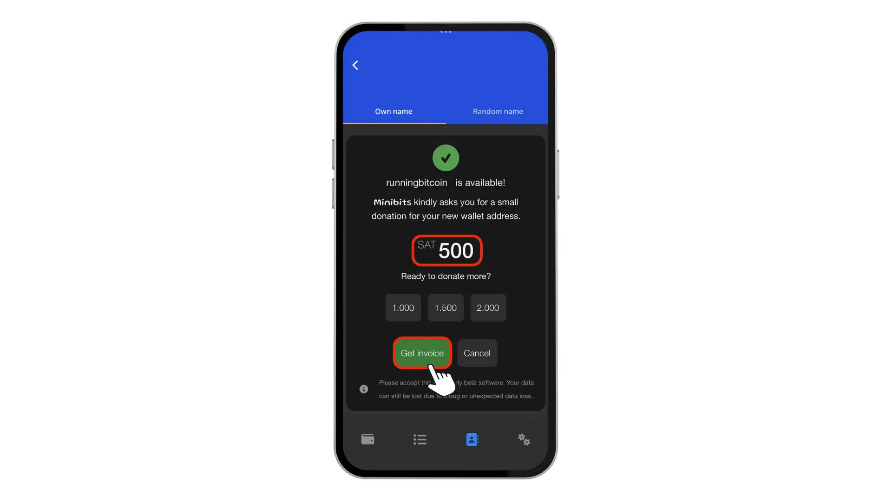

## 5️⃣ Nostr Inställning

Om du vill ge dricks till personer som du följer på Nostr kan du "Lägga till din npub-nyckel" genom att välja "Kontakter" och sedan "Offentlig". Detta kopplar din Minibits Wallet till det sociala nätverket Nostr, vilket möjliggör sömlös dricksgivning.

Du har också möjlighet att `Använda din egen profil` genom att gå till `Inställningar` och sedan `Privacy` för att importera din egen Nostr Address och nyckel. Var dock medveten om att om du gör detta kommer din Wallet att sluta kommunicera med minibits.cash Nostr och LNURL Address servrar, vilket inaktiverar blixt Address funktioner för att ta emot zaps och betalningar.

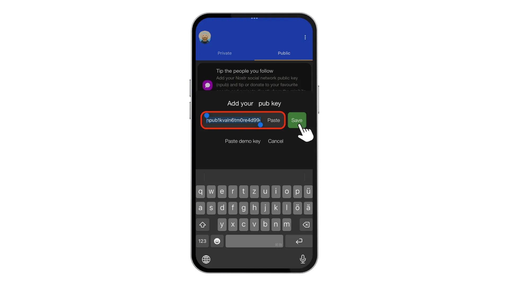

## 6️⃣ Ta emot medel

För att initialt få pengar måste du fylla på din Wallet via en blixt Invoice. Denna process är enkel: tryck på `Topup` , ange det `Amount` du vill lägga till, lägg eventuellt till en `Memo` och tryck sedan på `Create Invoice`. Du måste sedan betala denna Invoice med en annan Lightning Wallet, detta omvandlar Bitcoin Lightning-betalningar till ecash-tokens i din Minibits Wallet.

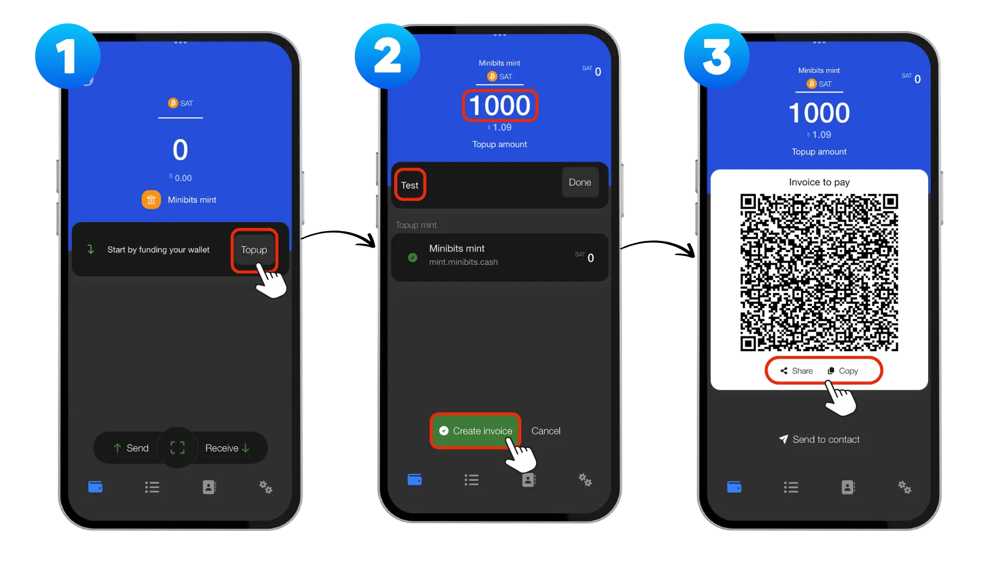

## 7️⃣ Skicka pengar

Nu när du har finansierat din Wallet kan du skicka pengar på två olika sätt.

### Skicka ecash

Det första alternativet är att skicka ecash direkt. Tryck på "Skicka", välj sedan "Skicka ecash", ange "Belopp" och tryck på "Skapa token". Detta kommer att generate en QR-kod som du kan dela med mottagaren eller låta dem skanna direkt med sin enhet. Mottagaren kommer att se tokens visas i sin Wallet nästan omedelbart, utan Blockchain avgifter eller bekräftelsefördröjningar.

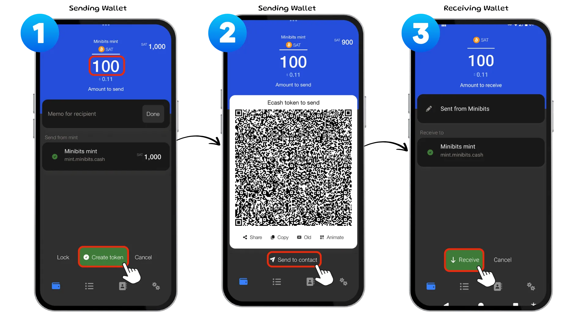

### Betala med blixten

Det andra alternativet är att betala via Lightning. Tryck på `Sänd` och välj sedan `Betala med Lightning`. Du kan välja bland dina Nostr-kontakter (om du har anslutit din npub), eller ange/klistra in en Lightning Address, Invoice eller LNURL-betalkod med hjälp av alternativet "Klistra in" eller "Skanna". När du har bekräftat mottagaren uppmanas du att ange "belopp att betala", eventuellt lägga till ett memo och sedan trycka på "Bekräfta" följt av "Betala nu" för att slutföra Lightning-transaktionen.

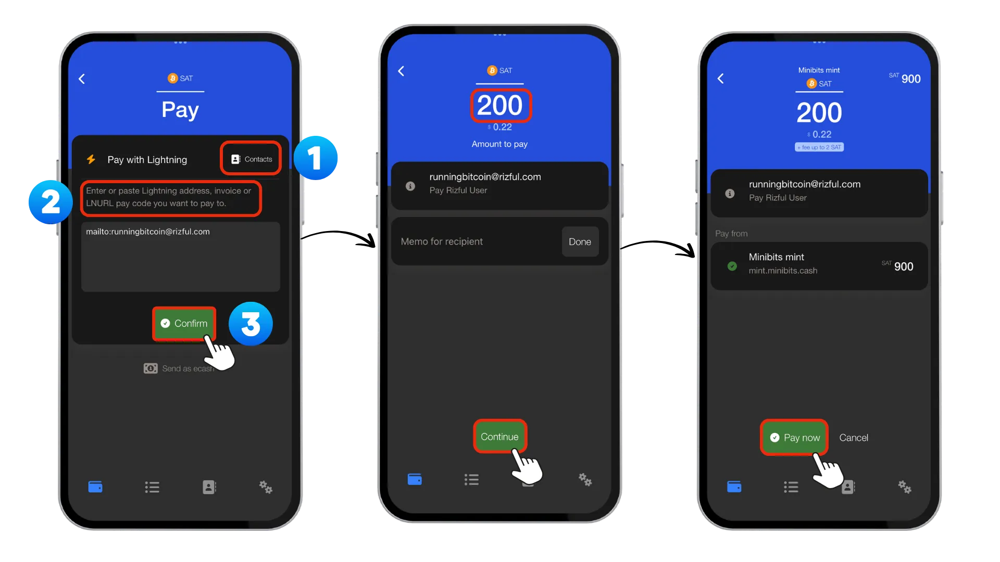

## 8️⃣ Skapa en NWC-anslutning

En annan kraftfull funktion i Minibits är möjligheten att skapa `Nostr Wallet Connect (NWC)`-anslutningar, som gör det möjligt för andra applikationer att begära betalningar från din Wallet utan att avslöja dina privata nycklar.

För att ställa in detta, gå till `Inställningar`, välj sedan `Nostr Wallet Connect` och tryck på `Lägg till anslutning`. Ge din anslutning ett beskrivande namn som identifierar både programmet och det associerade användarkontot. Ställ in en rimlig maximal daglig gräns för att kontrollera hur mycket som kan spenderas via den här anslutningen och tryck sedan på `Spara` för att slutföra installationen.

Den här funktionen är särskilt användbar för tjänster som Nostr Clients där du vill aktivera automatisk dricks utan att manuellt godkänna varje transaktion.

## 🎯 Slutsats

Minibits ger en tillgänglig ingångspunkt till ecash-världen och erbjuder integritetsfokuserade betalningar som kompletterar dina Bitcoin-innehav. Kom ihåg att alltid ha ordentliga säkerhetskopior, överväg att använda flera myntverk för redundans och förvara endast lämpliga mängder i denna förvaringslösning.

För ytterligare resurser, kolla in Minibits GitHub-arkivet, den officiella webbplatsen och deras Telegram-kanal där samhället aktivt diskuterar utveckling och felsöker problem

- [Github] (https://github.com/minibits-cash/minibits_wallet)
- [Webbplats] (https://www.minibits.cash/)
- [Telegram] (https://t.me/MinibitsWallet)

Ecash-ekosystemet är fortfarande under utveckling, men verktyg som Minibits gör denna kraftfulla integritetsteknik alltmer tillgänglig för vanliga användare.