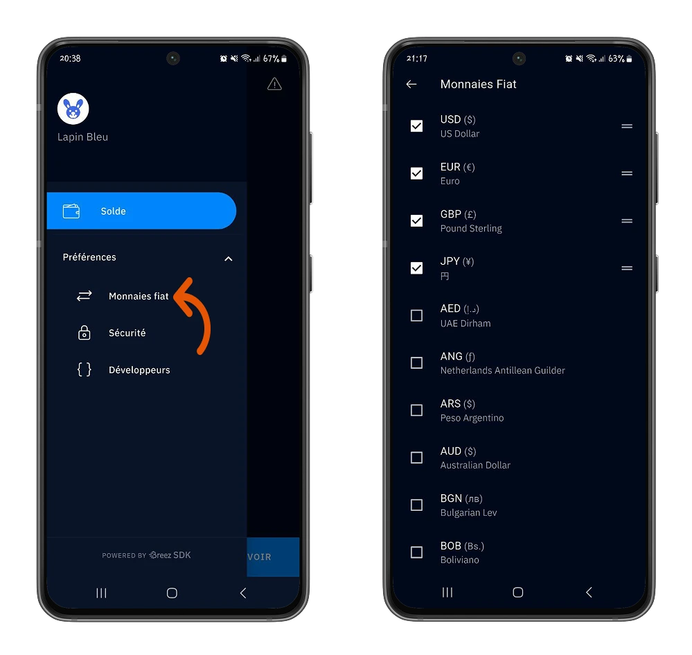

Misty Breez, Breez tarafından Yazılım Geliştirme Kiti ve BlockStream tarafından geliştirilen **Liquid** ağına dayalı olarak geliştirilen bir Lightning kendi kendini tutan Wallet'dir.

Lightning düğümü olmadan çalışmaya yönelik tamamen yeni bir yaklaşımla birlikte geliyor: Bitcoin ağlar arası aktarımlarda potansiyel bir **OYUN DEĞİŞTİRİCİ**.

Bu eğitimde, bu Wallet'ün nasıl çalıştığını açıklayacağız ve size tam bir genel bakış sunacağız.

## Misty Breez nasıl çalışır?

Misty Breez, arka uç olarak Lightning düğümü olmayan bir uygulamadır. Breez SDK ve Liquid temelinde geliştirilmiştir.

Liquid, Bitcoin ağına paralel bir Layer olup hız ve işlem maliyetlerinde önemli iyileştirmeler sunmaktadır. Bu Layer, Misty Breez'in bir Lightning düğümünden vazgeçmesine ve bunun yerine Liquid Network ile Lightning Network arasında birlikte çalışabilirliği sağlamak için **Boltz** gibi üçüncü taraf Exchange hizmetlerini kullanmasına olanak tanır. Acele etmeyin, buna geri döneceğiz.

Şimdilik maceramıza Misty Breez Wallet ile başlayalım.

## Misty Breez ile çalışmaya başlama

Misty Breez mobil uygulaması Google Play Store (Android'de) ve Apple Store (iOS'ta) gibi resmi indirme platformlarında mevcuttur. Ayrıca resmi [Misty Breez] web sitesinden (https://breez.technology/misty/) doğru uygulamaya yönlendirilebilirsiniz.

⚠️ Misty Breez'i Breez Wallet ile karıştırmadığınızdan emin olun.

⚠️ **ÖNEMLİ**: Bitcoinlerinizin güvenliği için, uygulamanın gerçekliğinden emin olmak için resmi platformlardan indirilmesi önemlidir.

Bu eğitimde, bir Android cihazdan başlayacağız. Bununla birlikte, bu bölümde ayrıntılı olarak açıklanan adımların ve belirli özelliklerin her biri iOS için de geçerlidir.

Kurulumun ardından Misty Breez size yeni bir Wallet oluşturma veya kurtarma sözcüklerine sahip olduğunuz eski bir Lightning Wallet'ü geri yükleme seçeneği sunar.

Bu eğitimde, yeni bir Wallet oluşturmayı seçiyoruz.

⚠️Misty Breez şu anda geliştirme aşamasındadır, bu nedenle makul miktarlarla başlamanızı tavsiye ederiz.

### Kurtarma kelimelerinizi kaydedin :

Yeni bir Wallet oluştururken yapmanız gereken ilk şeylerden biri 12 kurtarma sözcüğünüzü yedeklemektir.

İşte yedekleme ifadenizi nasıl yedekleyeceğinize dair bazı ipuçları.

https://planb.network/tutorials/wallet/backup/backup-mnemonic-22c0ddfa-fb9f-4e3a-96f9-46e2a7954270

İfadelerinizi yedeklemek için **Tercihler > Güvenlik** menüsünü ve ardından **Yedek İfadenizi Kontrol Edin** seçeneğini seçin.

Daha fazla güvenlik için, Wallet'nize erişimi doğrulamak üzere **bir PIN kodu** da oluşturabilirsiniz.

Misty Breez tarafından kabul edilen çok sayıda para birimi arasından yerel para biriminizi bulun. Para biriminizi **Tercihler > Fiat Para Birimleri** menüsünden yapılandırın, ardından istediğiniz para birimini veya para birimlerini seçin.

### İlk işlemlerinizi yapmak

Breez Wallet'a zaten aşinaysanız, Misty Breez'in sezgisel Interface'i sizi hiç şaşırtmayacaktır.

Interface **Balance** menüsünde, Wallet'inizdeki bitcoinlerinizi almak üzere faturalar oluşturmak için **Receive** seçeneğine tıklayın.

⚠️ Misty Breez, Lightning Address'ye hak kazanmanız için telefonunuzun ayarlarında uygulama için bildirimleri etkinleştirmenizi isteyecektir.

Misty Breez ile şunları yapabilirsiniz:

- Lightning Network'te **100 satoshis** ile **25.000.000 satoshis** arasında bitcoin alın.
- Bitcoin ana ağında **25.000 satoshis'ten** bitcoin alın.

Misty Breez'in büyüsü burada başlıyor.

Size bir Lightning düğümü sağlayan ve ödeme kanallarını açma ve kapatma maliyetlerini kendiniz karşılamanızı isteyen Breez Wallet'in aksine, Misty Breez sizden hiçbir şey yapmanızı istemez. Daha önce de belirtildiği gibi, Misty Breez bir Lightning düğümü temelinde bile çalışmaz.

Gelin perde arkasına daha yakından bakalım.

Gerçekte, Misty Breez Wallet'unuzla ilişkili bir Liquid Wallet'a sahipsiniz. Mantıksal olarak, Lightning Network ile birlikte çalışmanızı sağlayacak üçüncü taraf denizaltı satoshis dönüştürme hizmetleriyle ilişkili sabit oranlarda L-BTC (Liquid Bitcoin) kullanacaksınız.

Misty Breez Wallet'inizde bir ödeme aldığınızda, göndericiniz size Boltz (şu anda Misty Breez tarafından kullanılmaktadır) gibi bir dönüştürme hizmetinden geçerek gönderilen satoshileri Misty Breez Wallet'inizde (ilişkili Liquid Wallet) alınacak olan L-BTC'ye dönüştürmek için satoshiler gönderir.

İşte perde arkasındaki sürecin basitleştirilmiş bir diyagramı.

Bakiye** menüsündeki Interface'ye tıklayın, Yıldırım Invoice'ü ödemek için **Gönder** seçeneğine tıklayın.

Lightning Invoice'i, alıcınızın Lightning Address'ünü takın veya ödemenizi yapmak için Invoice'in üzerindeki QR kodunu tarayın.

Perde arkasında, Misty Breez Wallet'inizle ilişkili Liquid Wallet'in L-BTC eşdeğerini Boltz aracılığıyla satoshiye dönüştürmesini sağlar, ardından bu satoshileri alıcınızın Lightning Wallet'ine (Lightning Network'da mevcut) aktarırsınız.

Misty Breez'in altyapısının bu özelliği, kullanıcıların Misty Breez çevrimdışı olduğunda bile işlem yapabilmelerini sağlar.

Daha deneyimli olanlar için ayrıca **Tercihler > Geliştiriciler** menüsü de bulunmaktadır:

- Breez Yazılım Geliştirme Kitinin sürümü.
- Misty Breez Wallet'unuzun genel anahtarı.
- Borçlu, birincil genel anahtardan türetilen benzersiz tanımlayıcı.
- Wallet bakiyeniz.
- İpucu Liquid, küçük miktarlarda L-BTC göndermek için.
- Bitcoin Ucu, küçük miktarlarda Bitcoin göndermek için.

Ayrıca Liquid Network ile senkronizasyon, anahtarlarınızı yedekleme, etkinlik günlüğünüzü paylaşma ve Liquid Network'ü yeniden taramayı seçme gibi belirli eylemleri de gerçekleştirebilirsiniz.

Tebrikler! Artık Misty Breez Wallet ve Bitcoin ağlar arası işlemlere katkısı hakkında iyi bir anlayışa sahipsiniz. Bu öğreticiyi faydalı bulduysanız, lütfen bize bir Green başparmağı verin. Sizden haber almaktan mutluluk duyarız.

Daha ileri gitmek için, Misty Breez ile benzer şekilde çalışan Aqua Wallet hakkındaki eğitimimizi keşfetmenizi de tavsiye ederim:

https://planb.network/tutorials/wallet/mobile/aqua-8e6d7dd3-8c03-45cc-90dd-fe3899a7d125