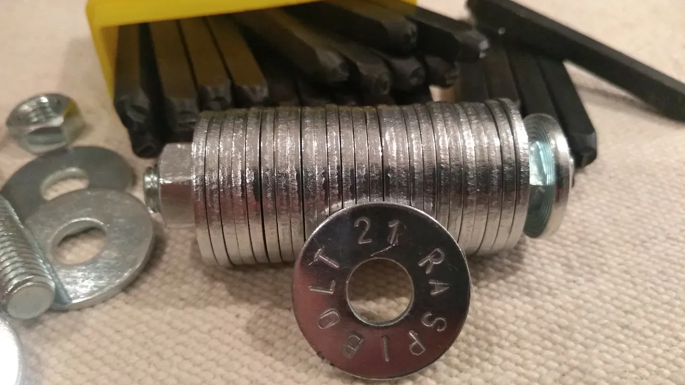
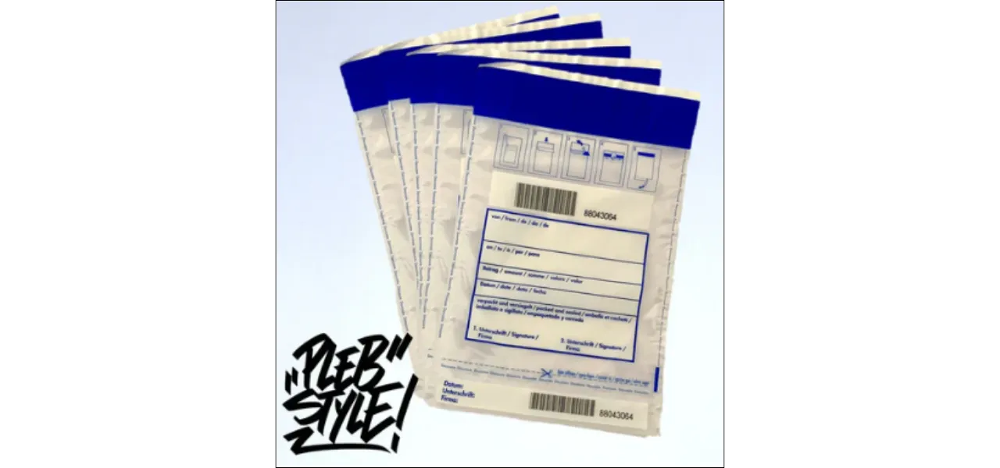

## 1.簡介

忍者 **SAFU** 方法是一種**DIY（自己動手）**解決方案，可讓您建立**可持續、安全且隱密**的**seed 詞組**備份（**BIP-39** 標準所定義的 12 或 24 個字的 Mnemonic 詞組）。這個詞組對於還原 Bitcoin Wallet 或任何其他相容的 Wallet 非常重要。

您可以將文字鐫刻在**Bolt**上的不銹鋼墊圈上，而不需要將文字寫在紙上（這是一種簡單但容易受損的方法）。結果就是一個小巧、防火、防腐蝕、防水、防震的備份。紙張可能會被火焰、濕度或時間破壞，不鏽鋼則不同，即使在極端條件下（高達 1300°C 或 20 噸的壓力），也能保證長期保存。

Ninja SAFU 方法具有多項優點：

- **保密性**：您所購買的產品不會被認定為用於加密貨幣備份。這些元件都是標準元件 (墊圈、螺栓、金屬盒)，在硬體商店就能買到，這能降低資料外洩時被專門供應商盯上的風險。

- **經濟實惠**：此解決方案的成本介於 **15 到 140 歐元之間**，視您已有的工具而定。

- **可靠性**：該方法自 2020 年起進行測試，經過 [Jameson Lopp](https://jlopp.github.io/metal-Bitcoin-storage-reviews/reviews/safu-ninja/)等安全專家的嚴格壓力測試（極熱、腐蝕、機械壓力）。

本分步指南將告訴您如何製作您自己的 Ninja SAFU 備份，以更好地保護您的比特幣免於丟失或破壞。如果您想了解更多關於備份和保護seed短語的資訊，請參閱附錄。

## 2.硬體

若要建立 Ninja SAFU 備份，您需要下列元件，這些元件都可從硬體商店或線上取得。

### 2.1 所需材料

- 不銹鋼墊圈（建議使用 M8）：
- 材質：**不銹鋼（例如 304 或 V4A，可增強耐腐蝕性）**
- 尺寸：M8（內徑 8 mm，外徑 ~24 mm）。M6 墊圈太小，難以雕刻。
- 數量：標準 seed 句子的 12 或 24 個墊圈，加上選購的墊圈（請參閱第 3.4 節），以及 10 個左右的測試或錯誤用墊圈。

- 不銹鋼 Bolt 和螺帽 (M8)：
- 規格：Bolt 2.5 至 5 cm 長，視墊圈數量和厚度而定，直徑 8mm。翼型螺帽方便免工具開啟，但也可以使用簡單的螺帽。

- **字母和數字打孔器組（3 mm 或 6 mm）**：
- 規格：6 mm 高的字體有助於易讀性，如果部分字體已退化，可能會更適合。請選擇堅固的套裝，以便重複使用。

- **錘子或大錘**：
    - 最好使用大錘，以獲得足夠且精確的沖壓力

- **鐵砧或堅固的表面**：
 - 厚的 Hard 表面 (例如 1 公斤的鐵砧或 10 公分的鋪路石) 以吸收震動。

如果您不想投資一套打孔機，也可以用雕刻筆在墊圈上雕刻。這種解決方案通常比較經濟，但需要更加小心才能獲得令人滿意的效果。

### 2.2 選購工具

- 燙印裝置：可固定墊圈並引導打孔器，讓燙印更精準、乾淨，字母方向更準確、間距更均勻

- 密封裝置：密封袋或密封條

- 密封容器：用於儲存墊圈塊

### 2.3 安全

- 建議使用手套**和安全眼鏡**。
- 管扳手，用來滑動打孔機，這樣您就可以用管扳手而不是手指握住打孔機。

### 2.4 數量和估計成本

- 24 字備份的數量：24 個墊圈 (最少)、1 個 Bolt、1 個翼型螺帽、1 組衝頭、1 個鎚子/錘子、1 個砧座/支撐架。

- **總費用**：
 - 墊圈和螺栓/螺帽：~ 15 歐元
 - 打孔器組：~ 45 歐元
 - 保護套：~ 55 歐元
 - 含所有配件：~ 140 歐元

- 有關設備範例，請參閱附錄。

## 3.逐步說明

1. **Getting ready:**

 - 私人地點、無攝影機（包括智慧型手機）
 - 堅固的吸震表面
 - 手套和安全眼鏡
 - 清洗墊圈上的所有油脂和污垢
 - 在測試墊圈上練習

2. **Burn Mnemonic words** ：

    - 在一側雕刻完整的字。不要僅限於前 4 個字母，以防第 4 個字母損壞。
    - 用錘子用力敲打，用管子扳手握住沖頭

3. ** 墊圈編號** ：

    - 在同一端，刻上位置號碼的字樣，如果墊圈鬆脫，這是必要的。

4. **記錄資訊**（可選且建議） ：

    - 在冰球的另一面刻上多餘的文字
    - 在額外的華司上雕刻 Wallet 識別碼
    - 將您使用的帳戶的衍生路徑刻印在額外的洗碗機上。您可以在投資組合軟體的設定中找到此資訊。例如，對於標準的 Taproot 組合，預設的衍生路徑為`m / 86' / 0' / 0' /`
    - 燒入 PIN 碼來解鎖您的 Hardware Wallet，如果您使用的是 COLDCARD，則燒入防釣魚字樣。

5. **請勿燒毀 passphrase :**

 - 如果您使用 passphrase，請確定不要將其寫在與 Mnemonic 相同的卡片上。passphrase 是為了在 Mnemonic 失竊時保護您的 Wallet 而設計的。更多資訊請參閱附錄。

6. **檢查可讀性** ：

    - 確保每個字和數字都清晰可辨。

7. ** 組裝墊圈** ：

    - 依序將墊圈套在 Bolt 上。
    - 可選：在兩端加上空白墊圈。
    - 鎖上翼型螺帽以固定電池。
    - 牢牢鎖緊，以增加防水、防火和機械應力的保護。

8. **測試備份** ：

    - 嘗試從新備份中復原您的投資組合
- **密封備份**（可選，建議使用）：
 - 以密封條或密封袋的方式。
 - 如果您使用小袋，請記下其獨特的識別號碼，以便檢查是否是正確的小袋，而不是取代原來小袋的誘餌。

## 4.儲存

### 4.1 選擇合適的地點

將您的備份存放在**隱密的地方，不要讓人看見，並可定期檢查。選擇防火防水的儲存**，存放在家中或您**獨自控制的地方**。

避免您依賴第三方（銀行保險箱、公證人）的地點：您將失去自主存取資金的權利，這違反 Bitcoin 的主權原則。

切勿透露您使用 Ninja SAFU 之類的方法。謹慎本身就是一種 Layer 安全性。

### 4.2 備援

如果需要，請建立**多份副本**，並儲存在**不同的地理位置**。

即使您為裝置選擇的材質具有防水和防火功能，但如果裝置被埋在家中堆積的瓦礫下，您將無法取用，而且即使不是無法取回，也會非常困難。

## 5.跟進與維護

即使儲存得很好，您的備份也需要定期**檢查**：

- 在視線範圍外，每年**檢查備份一次或兩次**。
- 如果雕刻**退化，請重新建立新的備份，**測試**，然後再**小心地銷毀舊的副本。
- 如果備份在密封袋中 ：
 - 檢查您的登入
 - 檢查其完整性
 - 定期打開信封檢查雕刻品的狀況，如果一切正常，請將備份放入新的口袋中。

**保持安全！**

## 附錄

### A.1 儲存您的復原短語

https://planb.network/tutorials/wallet/backup/backup-mnemonic-22c0ddfa-fb9f-4e3a-96f9-46e2a7954270

### A.2 瞭解 passphrase BIP39

https://planb.network/tutorials/wallet/backup/passphrase-a26a0220-806c-44b4-af14-bafdeb1adce7

### A.3 Bitcoin 組合如何運作

https://planb.network/courses/46b0ced2-9028-4a61-8fbc-3b005ee8d70f

### A.4 Ninja SAFU 方法的分類

根據 Jameson Lopp

- [報告](https://jlopp.github.io/metal-Bitcoin-storage-reviews/reviews/safu-ninja/) 關於忍者 SAFU 方法

- 比較表 [完整](https://jlopp.github.io/metal-Bitcoin-storage-reviews/?ref=blog.lopp.net)

- 部分表格 ：

### A.5 硬體範例

- 墊圈用於
 - [Titan](https://pleb.style/fr-fr/products/disques-de-seed-supplementaires-titan-Wallet)
- 墊圈 + 螺帽 + **保護盒** (用於墊圈)
 - [Titan](https://pleb.style/fr-fr/products/titan-Wallet-premium-acier-steel-Wallet-backup?variant=50022696419664)
 - [TerraSteel](https://pleb.style/fr-fr/products/terrasteel-Wallet-plebstyle-acier-backup)
- 打孔器組
 - [PlebStyle](https://pleb.style/fr/products/schlagstempelset-a-z-0-9-3mm)
- **打字基礎**
 - [PlebStyle](https://pleb.style/fr/products/schlagunterlage-10cm-x-10cm-x-1-5cm)
- **攻牙裝置**（導軌）
 - [TerraSteel](https://pleb.style/fr-fr/products/zubehor-einschlag-vorrichtung?_pos=1&_sid=2767fd66f&_ss=r)
- 密封裝置
 - [密封袋](https://pleb.style/fr/products/zubehor-5x-sicherheitstasche-tamper-evident)
 - [密封條](https://pleb.style/fr/products/zubehor-5x-siegel-streifen-fur-dein-seed-backup)
- 完整**套件**
 - [Titan](https://pleb.style/fr-fr/products/titan-Wallet-diy-kit-premium-seed-backup-steelwallet-plebstyle?pr_prod_strat=e5_desc&pr_rec_id=aa9f36359&pr_rec_pid=8728733155664&pr_ref_pid=8730877788496&pr_seq=uniform)
 - [TerraSteel](https://pleb.style/fr-fr/products/kopie-von-terrasteel-Wallet-starter-kit)

注意：提供的線上商店連結僅供參考。

Plan B 與上述銷售商和生產商之間不存在任何商業夥伴關係。

Plan B 不對瑕疵、價格變動或與產品品質或交貨有關的問題負責。 **DYOR**

### A.6 照片來源

https://pleb.style/fr/

https://x.com/lopp/status/1463155802345193475

https://bitcointalk.org/index.php?topic=5389446.0

https://x.com/econoalchemist/status/1329271981712289797

https://www.waivio.com/@themarkymark/create-your-own-metal-seed-key-backup

https://github.com/minibolt-guide/minibolt/blob/main/bonus/Bitcoin/safu-ninja.md