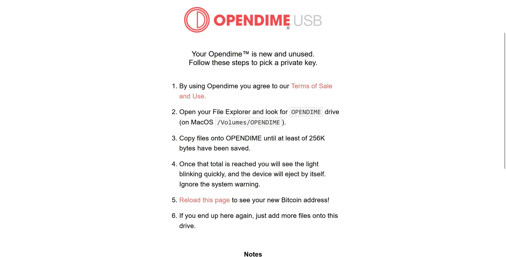
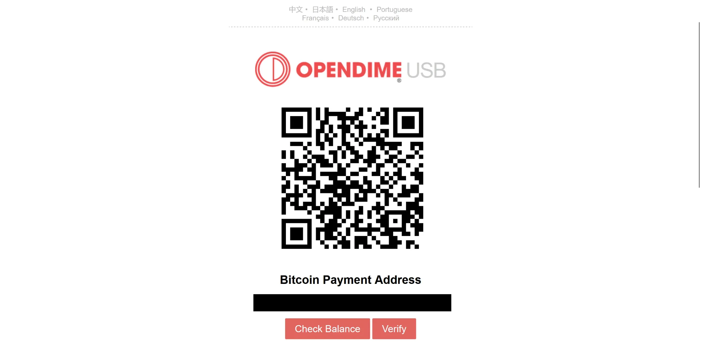
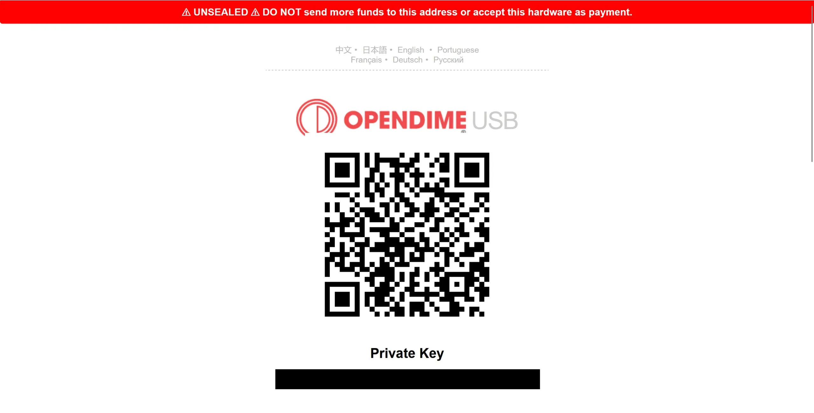
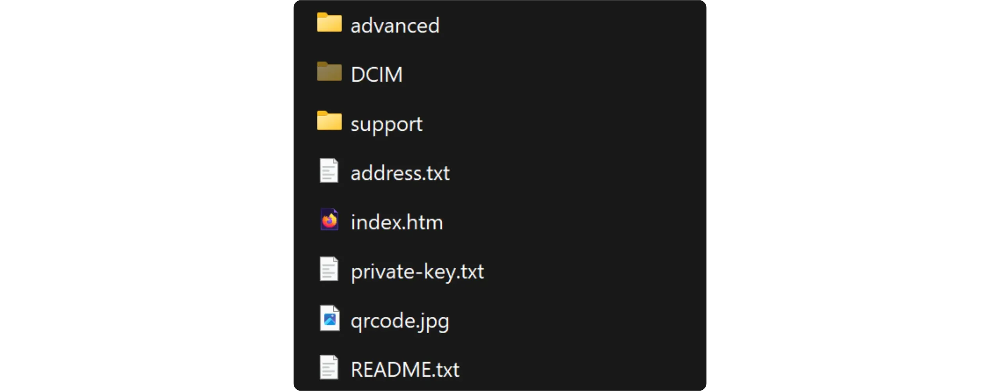
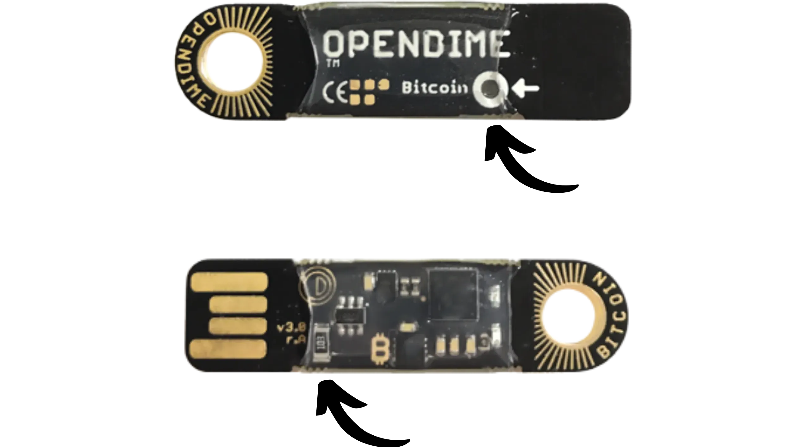
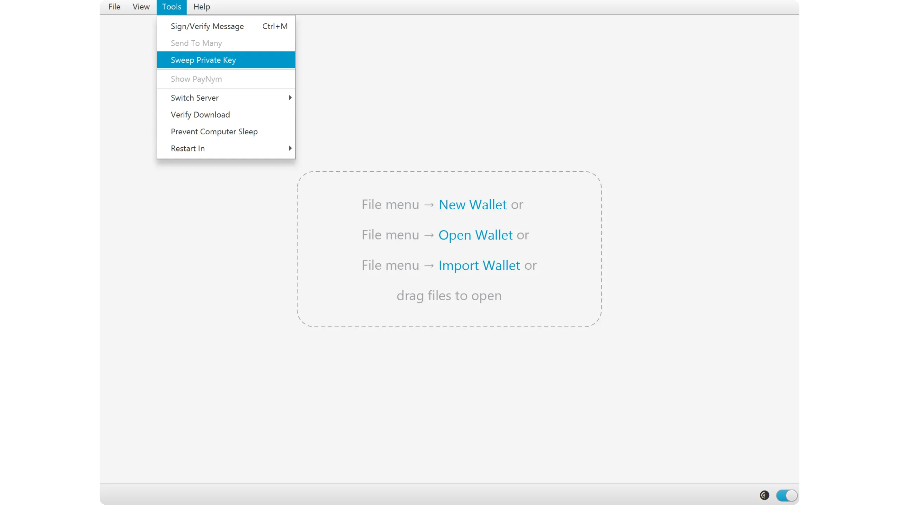
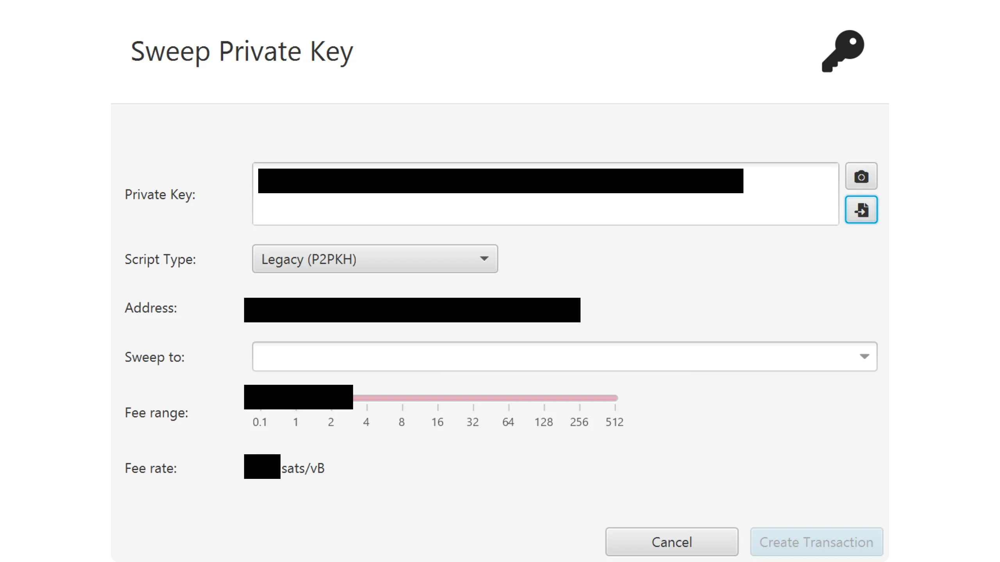
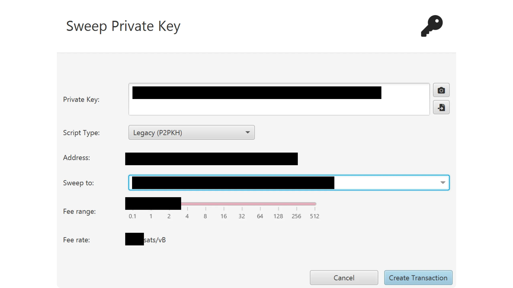
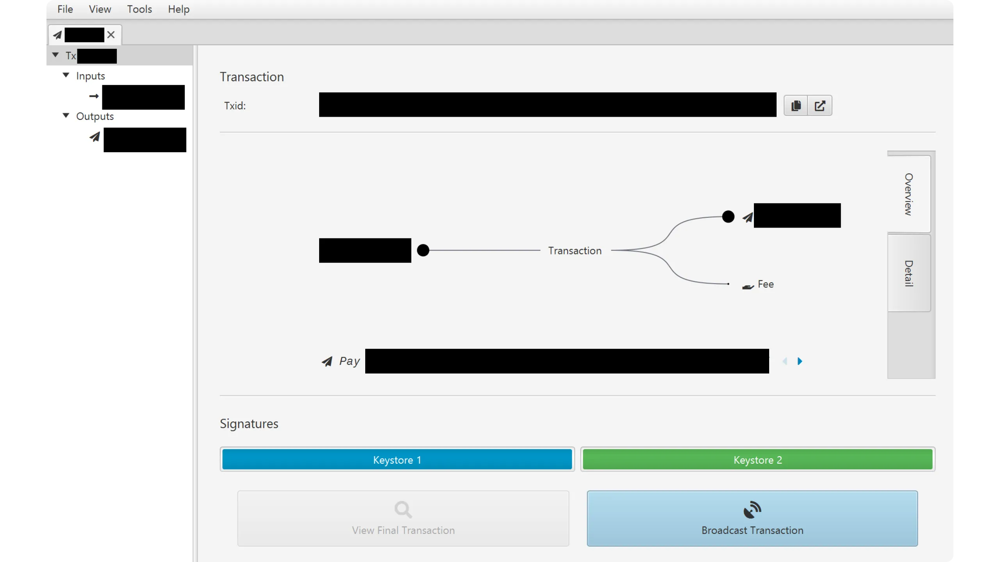

L'OPENDIME répond à un besoin que Bitcoin couvre assez mal nativement dans les échanges physiques : transférer de la valeur comme on le ferait avec du cash, c’est-à-dire immédiatement, de manière tangible, et avec une certitude que le transfert de valeur a bien eu lieu pour le bénéficiaire.

Sur Bitcoin, pour être sûr qu’une autre personne vous a bien donné ses bitcoins, la seule méthode efficace consiste à recevoir une transaction on-chain sur une adresse que vous contrôlez. Une autre méthode, que l’on pourrait croire fonctionnelle de prime abord, consisterait à transmettre au bénéficiaire directement la clé privée contrôlant les fonds, afin qu’il puisse les dépenser. Le problème est qu’il est impossible pour le bénéficiaire d’avoir la certitude que le payeur a bien supprimé toute copie de cette clé privée. Rien ne garantit donc que le payeur ne puisse pas, ultérieurement, récupérer les fonds qu’il avait prétendument transférés, par exemple après l’échange d’un bien ou d’un service.

La limite d’une transaction Bitcoin onchain classique est qu’elle n'est pas à un échange immédiat, comme celui d’un bien physique remis contre paiement en cash. Elle implique des frais, une propagation sur le réseau, puis un temps d’attente pour les confirmations. Dans un contexte d’achat physique, ces inconvénients techniques peuvent parfois rendre le paiement plus difficile, par exemple pour un achat entre particuliers lorsque les deux parties souhaitent conclure l’échange immédiatement.

C’est précisément ici que l'OPENDIME est utile. C'est un **dispositif matériel qui transforme des bitcoins en instrument au porteur**. Concrètement, l'OPENDIME génère et conserve une clé privée de manière à ce qu’elle ne soit pas accessible tant que l’appareil n’a pas été descellé physiquement. Tant que l’OPENDIME reste scellé, on peut y charger des fonds en envoyant des bitcoins vers l’adresse de réception associée, puis remettre l’appareil à quelqu’un d’autre. Le bénéficiaire n’a pas besoin de vous faire confiance sur parole : il peut vérifier lui-même que les fonds sont bien présents sur l’adresse, et que l’appareil n’a pas été descellé (donc que la clé privée n’a pas pu être extraite pour dépenser les bitcoins avant lui).

Cette garantie repose sur un mécanisme de scellement matériel avec une partie à casser. OPENDIME intègre une zone conçue pour laisser une trace irréversible lorsqu’on tente d’accéder à la clé privée : tant que cette zone n’est pas cassée physiquement, on peut être sûr que la clé privée contenue dans l'OPENDIME n'a pas été consultée. Au moment où le bénéficiaire souhaite dépenser les bitcoins, il casse ce scellement et l'OPENDIME révèle alors la clé privée afin que les fonds puissent être dépensés. Cette approche inverse la logique habituelle des paiements en BTC : au lieu de recevoir une transaction, vous recevez un support physique qui détient la capacité de dépenser des fonds déjà positionnés sur une adresse connue.

Prenons un exemple simple pour bien comprendre l'utilité de ce type de dispositif : l’achat d’une voiture entre particuliers, payée en bitcoins. Avec un paiement on-chain classique, le vendeur va exiger plusieurs confirmations avant de remettre les clés de la voiture (pour éviter de se faire RBF), ce qui peut signifier attendre longtemps, ou bien accepter une incertitude tant que la transaction n’est pas confirmée (*zeroconf*), ce qui implique une prise risque et souvent n'est pas souhaitable avec de gros achats. Une autre solution aurait consisté à envoyer les fonds via une transaction onchain avant de rencontrer le vendeur du véhicule. Mais dans ce cas, c’est l'acheteur qui assume le risque que le vendeur ne se présente jamais au rendez-vous. Il n'y a donc aucune solution satisfaisante, mis à part attendre 6 confirmations sur le lieu du rendez-vous (parfois plus d'une heure).

Avec un OPENDIME, l’acheteur peut préparer à l’avance l’appareil en y chargeant le montant convenu, puis, au moment de la vente, remettre physiquement le dispositif au vendeur. Celui-ci vérifie visuellement que l’appareil est toujours scellé et que l’adresse associée détient bien les fonds, puis il peut donner le bien à l'acheteur en échange. Le vendeur repart avec un équivalent cash : un objet tangible qu’il peut conserver et desceller pour transférer les bitcoins vers un portefeuille classique.

L'OPENDIME est produit par COINKITE, l’entreprise à l’origine du célèbre hardware wallet COLDCARD.

## Comment mettre des bitcoins sur un OPENDIME ?

Après avoir reçu votre OPENDIME, branchez-le simplement à votre ordinateur, puis ouvrez-le comme un périphérique de stockage à l’aide de votre explorateur de fichiers.

Ouvrez le fichier `index.htm` dans votre navigateur en double-cliquant dessus. Cela affichera une page dédiée dans votre navigateur.

Nous allons maintenant générer la clé privée de l’OPENDIME. Pour cela, l’appareil utilise un fichier que vous allez lui fournir. Ce fichier sera haché et servira de base d’entropie pour la génération de la clé privée, ce qui permet de s’assurer que Coinkite ne puisse pas produire la même clé. Toutefois, l’OPENDIME ne se contente pas de cette seule source d’entropie, sinon, l’utilisateur qui initialise l’appareil pourrait recalculer la clé privée sans avoir à desceller physiquement l’OPENDIME. L’appareil ajoute donc trois autres sources d’entropie au hachage de votre fichier :
- une source d’entropie générée par un TRNG (*True Random Number Generator*) présent dans l’élément sécurisé ;
- quelques bits issus des fluctuations temporelles des communications entre l’OPENDIME et votre ordinateur ;
- une source d’entropie supplémentaire, également générée par un TRNG, intégrée directement dans l’OPENDIME lors de sa fabrication.

En combinant l’ensemble de ces sources d’entropie, on garantit que ni Coinkite ni l’utilisateur qui initialise l’OPENDIME ne peuvent déduire la clé privée générée, tant que l’appareil n’est pas descellé.

Vous devez donc déposer un ou plusieurs fichiers directement à la racine du périphérique, jusqu’à atteindre au minimum 256 kB de données provenant de vous. Par exemple, dans mon cas, j’ai drop 2 images.

Dès que le volume de données ajoutées dépasse 256 kB, l’OPENDIME génère automatiquement sa clé privée et supprime les données d’entropie que vous avez fournies.

Sur la page `index.htm`, après actualisation, vous avez désormais accès à l’adresse de réception de l’OPENDIME. Cette adresse est également disponible dans les fichiers du périphérique, sous forme de QR code et de fichier texte.

*Remarque : un fichier `private-key.txt` est désormais présent, mais si vous l’ouvrez, vous constaterez qu’il ne contient évidemment pas la clé privée tant que le sceau physique de l’OPENDIME n’a pas été cassé.*

Il est maintenant temps d’envoyer les bitcoins que vous souhaitez transmettre sur l’adresse de réception fournie.

Une fois l’envoi effectué, cliquez sur le bouton `Check Balance` depuis la page `index.htm`.

*Attention : cette opération peut entraîner une fuite de données, car elle peut associer l’adresse de votre OPENDIME à votre adresse IP. Plutôt que d’utiliser l’explorateur de blocs de Coinkite, je vous recommande de vérifier le montant reçu directement via votre propre explorateur de blocs en local ou depuis votre nœud Bitcoin. À défaut, utilisez Tor ou un VPN.*

Vous pouvez constater que l’adresse de réception de votre OPENDIME a bien été créditée.

Si vous le souhaitez, vous pouvez envoyer d’autres sats sur cette adresse afin d’augmenter le montant détenu. Toutefois, il est préférable de charger l’OPENDIME en une seule fois, afin d’éviter les pertes de confidentialité liées à la réutilisation d’adresse.

## Comment vérifier les bitcoins présents sur un OPENDIME ?

Plaçons-nous maintenant de l’autre côté de l’échange : vous venez de recevoir un OPENDIME censé contenir une certaine somme de bitcoins. La première étape consiste évidemment à vérifier visuellement que le sceau n’a pas été cassé. Le plastique entourant l’OPENDIME ne doit présenter ni déformation ni perforation, et le circuit situé à l’arrière, en face du trou de descellement, doit être intact. En cas de doute, refusez la vente.

La personne qui vous a remis l'OPENDIME vous a probablement communiqué l’adresse de réception afin que vous puissiez vérifier à l'avance via un explorateur de blocs que cette adresse détient bien le montant convenu. Toutefois, avant de conclure définitivement l’échange, vous souhaitez vous assurer que l’adresse fournie correspond bien à l’OPENDIME que vous avez physiquement entre les mains.

Pour cela, commencez par connecter l’OPENDIME à votre ordinateur, puis ouvrez-le dans votre gestionnaire de fichiers et accédez à la page `index.htm`. Après connexion, l’OPENDIME doit clignoter uniquement en vert. S’il clignote en alternance rouge et vert, cela signifie qu’il a été descellé et que le payeur peut potentiellement connaître la clé privée ; dans ce cas, refusez la vente.

*Cette opération peut également être réalisée sur un smartphone de la même manière, à condition de disposer d’un adaptateur.*

Sur cette page, vérifiez dans un premier temps que l’adresse affichée correspond bien à celle que le payeur vous a communiquée auparavant. Si ce n’est pas le cas, vous êtes très probablement face à une tentative d’arnaque. Toutefois, même si les adresses correspondent, cela ne constitue pas une preuve suffisante : le fichier `index.htm` pourrait avoir été modifié manuellement par le payeur. Il est donc nécessaire d’effectuer une vérification supplémentaire.

Cliquez sur le bouton `Verify`.

Vous êtes alors normalement redirigé vers le site officiel d’OPENDIME. Assurez-vous bien que le nom de domaine est bien `https://opendime.com/`. Si l’OPENDIME détient effectivement la clé privée permettant de dépenser les fonds associés à cette adresse, le message `VERIFIED` s’affichera, accompagné de l’adresse correspondante. Pour finaliser la vérification, copiez cette adresse et collez-la dans l’explorateur de blocs de votre nœud Bitcoin afin de confirmer qu’elle contrôle bien les fonds qui vous sont dus.

Une fois la vente conclue, l’étape suivante consiste à desceller l’OPENDIME et à transférer les bitcoins qu’il contient vers un portefeuille classique dont vous avez le contrôle. Je vous déconseille fortement de conserver des sats sur un OPENDIME sur une longue durée. Toute personne disposant d’un accès physique à l’appareil peut voler les fonds qu’il contient : il n’existe aucune protection supplémentaire, ni mot de passe, ni passphrase, ni mécanisme de verrouillage. Il suffit de casser le sceau pour révéler la clé privée et récupérer les fonds. Ne tardez donc pas à les transférer vers un portefeuille plus sécurisé !

## Comment desceller un OPENDIME ?

Pour desceller un OPENDIME et libérer la clé privée permettant de dépenser les fonds, il suffit de percer l’appareil sur toute son épaisseur à l’endroit indiqué. Vous pouvez, par exemple, utiliser une punaise ou un petit clou. Cette action casse un élément sacrificiel du circuit imprimé et rend la clé privée accessible. Attention, **l’opération est assez délicate** : il faut appuyer suffisamment fort pour briser réellement cet élément sacrificiel. Si vous ne percez que le plastique, la clé privée ne sera pas libérée. Il faut véritablement casser le petit composant noir présent sur le circuit de l'autre côté du trou. Mais veillez à ne rien endommager d’autre sur l’OPENDIME, au risque de perdre définitivement les bitcoins qu’il sécurise.

Après avoir descellé l’OPENDIME, rebranchez-le : il clignotera désormais en rouge et vert. Cela confirme que le dispositif a bien été descellé. En retournant sur la page `index.htm`, vous avez maintenant accès à la clé privée permettant de dépenser les fonds.

## Comment retirer les bitcoins d'un OPENDIME ?

Il existe de nombreuses méthodes pour retirer les bitcoins stockés sur un OPENDIME. Sur mobile, vous pouvez par exemple utiliser Ashigaru, Blue Wallet ou encore Zeus, simplement en scannant le QR code présent sur la page `index.htm`. Ici toutefois, je vais vous montrer comment procéder sur Sparrow Wallet, depuis un ordinateur.

Sur Sparrow, deux possibilités s’offrent à vous pour récupérer les fonds d’un OPENDIME :
- Envoyer les bitcoins vers un portefeuille géré directement dans Sparrow (par exemple un hardware wallet) ;
- Envoyer les bitcoins vers un portefeuille externe à Sparrow.

Si vous souhaitez recevoir les fonds sur un portefeuille déjà géré dans Sparrow, commencez par ouvrir ce portefeuille.

Dans les deux cas, cliquez ensuite sur le menu `Tools > Sweep Private Key`.

Une fenêtre s’ouvre pour créer la transaction de balayage. Commencez par renseigner la clé privée dans le champ `Private Key`. Vous pouvez soit la copier-coller manuellement depuis `index.htm`, soit importer directement le fichier `private-key.txt` présent sur votre OPENDIME.

Sparrow dérive alors automatiquement l’adresse correspondante. Vous pouvez également ajuster le type de script si nécessaire.

Choisissez ensuite la destination dans le champ `Sweep to`. Plusieurs options sont possibles :
- Si le portefeuille de destination est déjà ouvert dans Sparrow, sélectionnez-le simplement dans le menu déroulant ;
- Si vous souhaitez envoyer les bitcoins vers un portefeuille externe à Sparrow, collez directement l’adresse de réception dans ce champ.

Sélectionnez ensuite le taux de frais en fonction de l’état actuel du marché on-chain, puis cliquez sur le bouton `Create Transaction`.

Sparrow vous affiche alors un récapitulatif de la transaction de balayage. Vérifiez soigneusement que toutes les informations sont correctes, en particulier l’adresse de réception en output, puis cliquez sur `Broadcast Transaction` pour diffuser la transaction sur le réseau.

Après confirmation, les bitcoins seront disponibles sur le portefeuille de destination, et l’OPENDIME sera vidé de ses fonds.

Pour conclure proprement, une fois que vous avez vérifié que l’adresse de réception de l’OPENDIME est bien vide, je vous recommande de détruire l’appareil. Il n’a plus d’utilité, et s’il tombait entre de mauvaises mains, l’adresse associée pourrait être utilisée comme point de départ pour une analyse de chaîne.

Vous savez désormais comment utiliser un OPENDIME, que ce soit en tant que payeur ou receveur. Pour aller plus loin, je vous invite à découvrir notre tutoriel consacré à la SATSCARD, une carte au porteur proche de l’OPENDIME, mais reposant sur un fonctionnement différent.

https://planb.academy/tutorials/wallet/hardware/satscard-befeb794-8e6b-4d38-a17e-bffd0712fdc6
