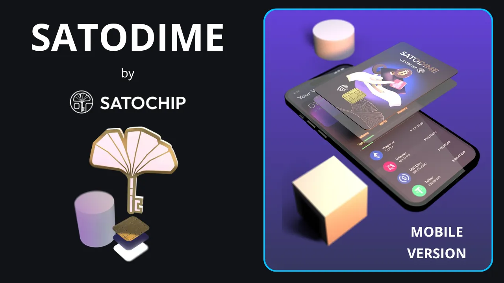

Denne veiledningen tar deg gjennom installasjon, konfigurasjon og bruk av Satodimes mobilapplikasjon. Du lærer hvordan du tar kortet ditt i besittelse, oppretter safer, legger til penger, opphever forseglingen og gjenoppretter de private nøklene dine. Vedleggene inneholder ressurser, beste praksis og tekniske forklaringer.

## Innledning

**Satodime**, utviklet av **[Satochip](https://satochip.io/fr/)**, er et sikkert bærerkort for lagring av Bitcoin på en håndgripelig og enkel måte. Det fungerer som en selvforvaltende wallet-maskinvare, der du har full kontroll over de private nøklene dine uten å være avhengig av en tredjepart. Det er åpen kildekode og EAL6+-sertifisert, og støtter opptil tre uavhengige safer.

### Produktbakgrunn

Satodime, et **carte au porteur, tilhører den som fysisk besitter det**, uten behov for forhåndsregistrering eller identifikasjon. Det oppfyller behovet for sikker, bærbar bitcoin-lagring, slik at alle som har kortet, kan bruke det eller overføre bitcoins ved å skanne det via mobilappen for å ta det i besittelse eller låse opp safer. I motsetning til en papirregning bruker kortet en sikker chip til å forsegle de private nøklene, som først avsløres etter at forseglingen er åpnet, noe som gjør kortet til et kontantkort der eierskapet avgjøres av fysisk besittelse. Kortet er ideelt for å gi bort bitcoins som gaver, og gjør det mulig å overføre bitcoins fra hånd til hånd på en sikker måte, samtidig som mobilapplikasjonen utnytter NFC for tilgjengelig interaksjon med smarttelefonen.

- Sikkerhet**: Private nøkler generert og lagret i den sabotasjesikre brikken; synlig status (forseglet, uforseglet, tom).
- Funksjoner**: Kjøp bitcoins direkte via appen (Paybis-partner); administrer Mainnet og Testnet.
- Åpen kildekode**: Kode under AGPLv3-lisens, verifiserbar på GitHub.

### Kontinuerlig utvikling

Programmet utvikles regelmessig. Sjekk Satochips nettsted eller butikker for oppdateringer. For eksempel kan nye blokkjeder eller kjøpsfunksjoner bli lagt til. Sjekk [Satochip GitHub] (https://github.com/Toporin/Satodime-Applet) for løpende utvikling.

## 1. Forutsetninger

Før du begynner å bruke **Satodime**, må du sørge for at du har følgende utstyr:

- Kompatibel smarttelefon**: Android- eller iOS-enhet med NFC-aktivering.
- Satodime**-kort: Nytt eller uinitialisert.
- Internett-tilkobling**: For å laste ned appen.
- Grunnleggende kunnskap**: Forståelse av private/offentlige nøkler og risikoen for tap (irreversible).
- Sikkert medium**: Et sikkert sted å oppbevare private nøkler når de er åpnet (papir, metall; aldri digitalt).

## 2. Installasjon

- Last ned søknaden** :
 - [App Store] (https://apps.apple.com/be/app/satodime/id1672273462)** (iOS)
 - [Google Play Store] (https://play.google.com/store/apps/details?id=org.satochip.satodimeapp)** (Android)
 - Sjekk utvikleren (Satochip) for å unngå svindel.
 - Satodime er **åpen kildekode**. Kildekode : [Satochips GitHub] (https://github.com/Toporin/Satodime-Applet).

- Installer og start applikasjonen**: Aktiver NFC på telefonen om nødvendig.

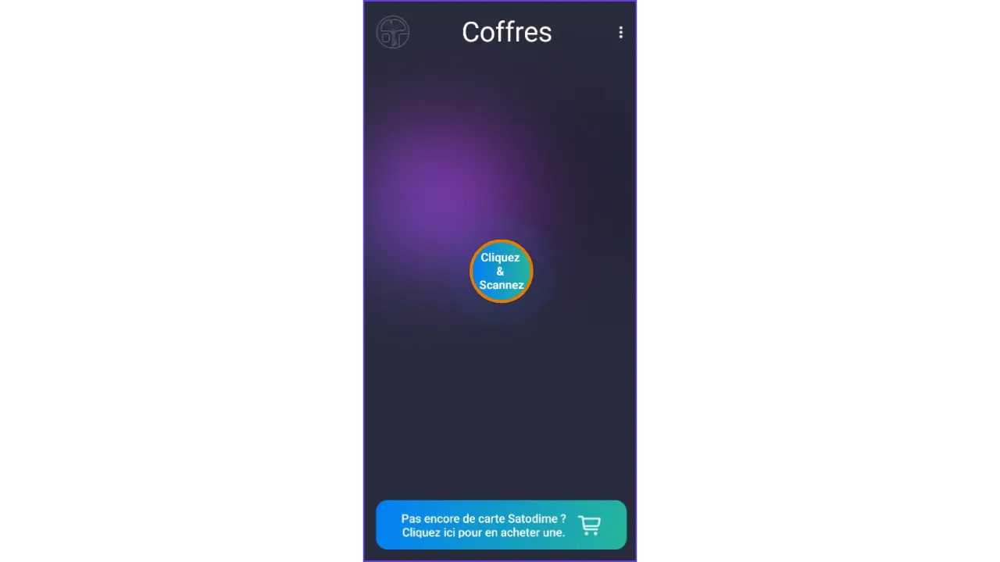

## 3. Opprinnelig konfigurasjon

### 3.1 Start programmet og skann

Åpne appen og følg veiviseren. Plasser Satodime-kortet på telefonens NFC-leser (vanligvis på baksiden). Hold det nede under hele operasjonen for å sikre en stabil tilkobling.

- Hvis NFC ikke fungerer, må du sjekke telefonens innstillinger.
- En skål bekrefter suksessen: "Vellykket lesning".

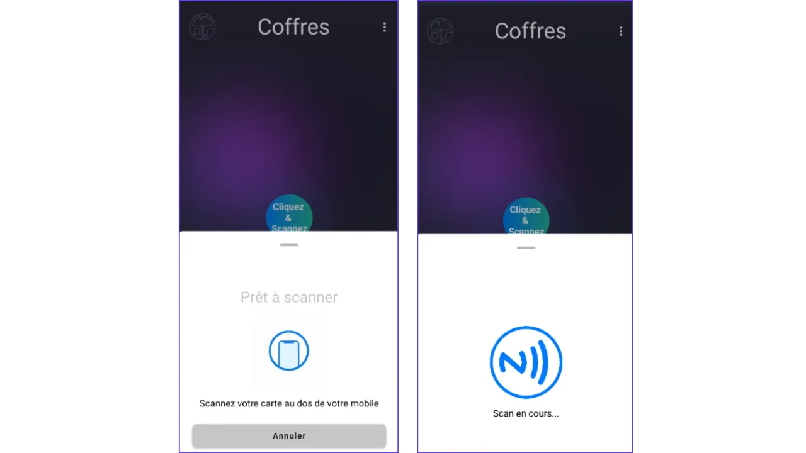

Som en generell regel vil **alle følgende operasjoner kreve bekreftelse ved å skanne Satodime-kortet**

### 3.2 Overtakelse av kortet (*Ownership*)

Ved første gangs bruk må du bli eier av kortet for å sikre det:

- Klikk på "*Take Ownership*" i appen.
- Bekreft operasjonen: Dette genererer en unik eiernøkkel.
- Skann kartet på nytt for å bruke endringene.
- Advarsel**: Dette trinnet er irreversibelt. Vennligst se [artikkelen om *eierskap*] (https://satochip.io/satodime-ownership-explained/).

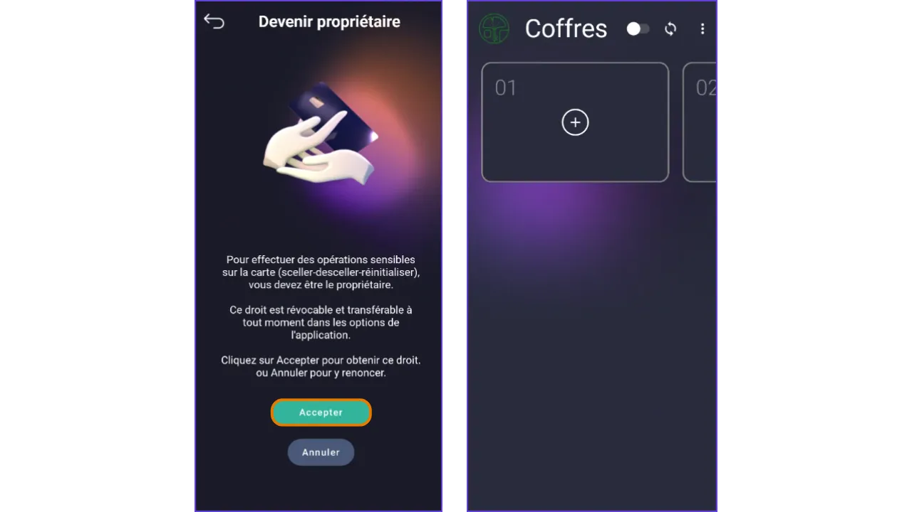

## 4. Skap en trygg

Satodime støtter opptil tre safer. Opprett en for å lagre bitcoin:

- Velg en tom safe (f.eks. Safe 01).
- Velg blokkjede (Bitcoin).
- Klikk på "*Opprett og Seal*".
- Skann kortet til generate og forsegl den private nøkkelen (ukjent inntil den blir åpnet).
- Gratulerer**: Safen din er nå forseglet og klar til å motta penger.

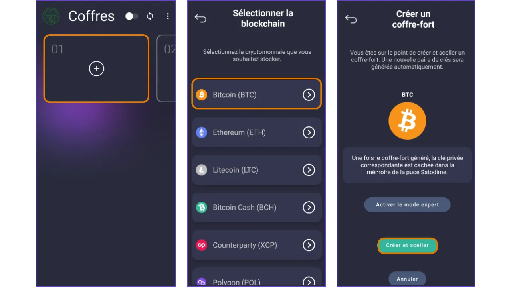

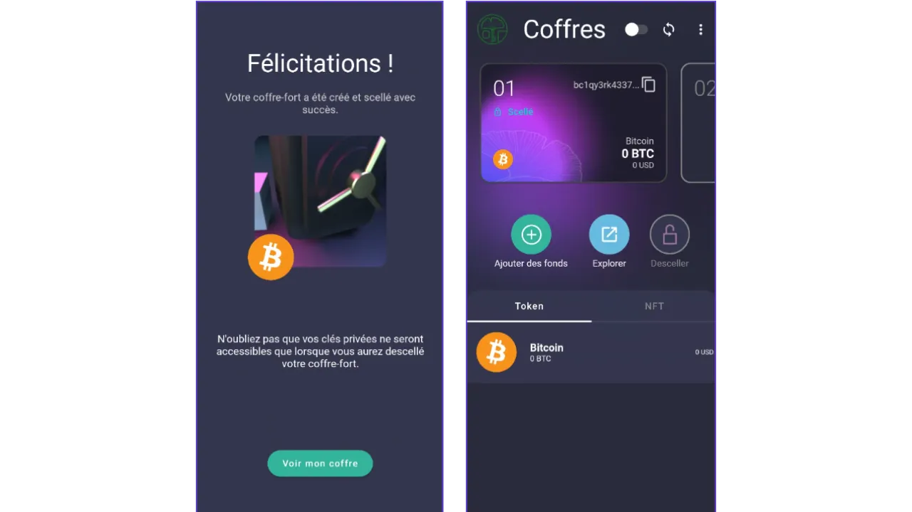

## 5. Legg til midler

Når safen er forseglet, fyller du den med bitcoins:

- Velg safen.
- Klikk på "*Legg til midler*".
- Kopier den offentlige adressen eller skann QR-koden.
- Send penger fra en annen wallet.
- Sjekk saldoen etter bekreftelse på blokkjeden.
- Mulighet for kjøp: Klikk på "*Kjøp*" for å kjøpe direkte via Paybis (Visa, Mastercard osv.). Gjeldende avgifter.

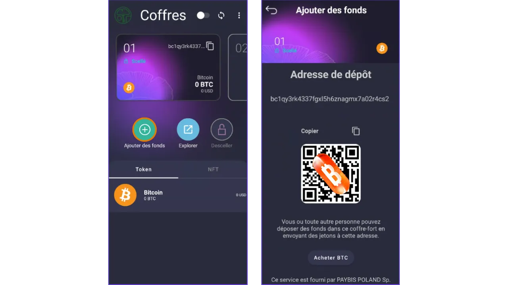

## 6. Åpne en safe

For å få tilgang til den private nøkkelen og overføre pengene til et annet sted, åpner du safen:

- Velg den forseglede safen.
- Klikk på "Fjern forseglingen".
- Bekreft advarselen: Denne operasjonen er irreversibel.
- Skann kortet for å åpne forseglingen.
- Safen er satt til "*Unsealed*"; den private nøkkelen kan nå vises/eksporteres.
- Advarsel**: Når forseglingen er åpnet, er den private nøkkelen tilgjengelig. Hvis noen tar smarttelefonen din, kan de få tilgang til denne nøkkelen og dermed få tilbake pengene i safen din (irreversibelt).

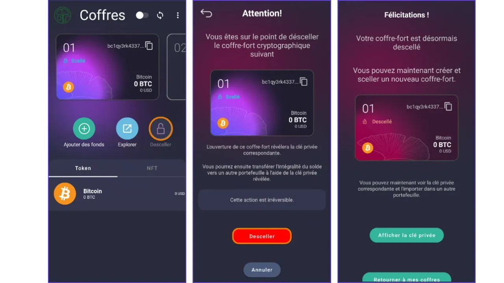

## 7. Gjenopprett privat nøkkel

Etter at forseglingen er fjernet, eksporterer du nøkkelen for bruk i en annen wallet :

- Sørg for at du er i trygge omgivelser.
- Klikk på "*Vis privat nøkkel*".
- Velg format: Legacy, SegWit, WIF osv.
- Kopier nøkkelen eller skann QR-koden.
- Sikkerhet**: Del aldri den private nøkkelen din. Lagre den offline.
- Importer den til et wallet-program som er kompatibelt med fondsforvaltning (for eksempel Sparrow, Wallet eller Electrum).

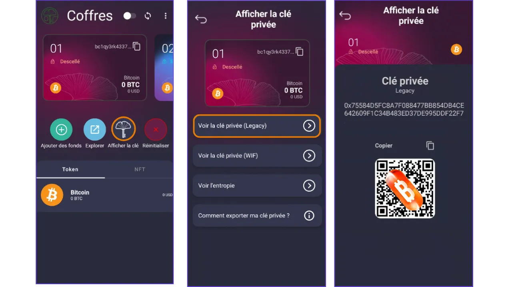

## 8. Tilbakestill bagasjerommet

Hvis du tilbakestiller safen, slettes den tilhørende private nøkkelen irreversibelt. Med andre ord, hvis du ikke har sikret deg en kopi av den private nøkkelen eller importert den til en annen wallet, vil tilbakestilling av safen føre til et irreversibelt tap av midlene i den.

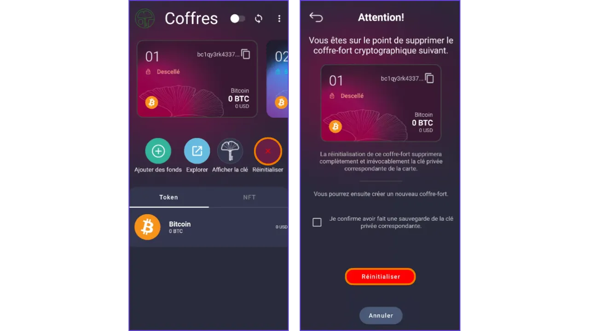

Når du tilbakestiller bagasjerommet, blir sporet tomt og klart for en ny bagasjerom.

## 9. Overfør eierskap

For å - for eksempel - tilby bitcoins gjennom Satodime, må du :

- Ta eierskap til kortet,
- Opprett en Bitcoin-safe,
- Transfer satt der,
- Overfør eierskap til kortet: Den neste personen som skanner kortet, blir eier av det,
- Gi Satodime-kortet til den personen du ønsker, og inviter vedkommende til å laste ned applikasjonen og deretter skanne kortet for å ta eierskap til det - og dermed få tilgang til bitcoinsene som er "lagret" på det.

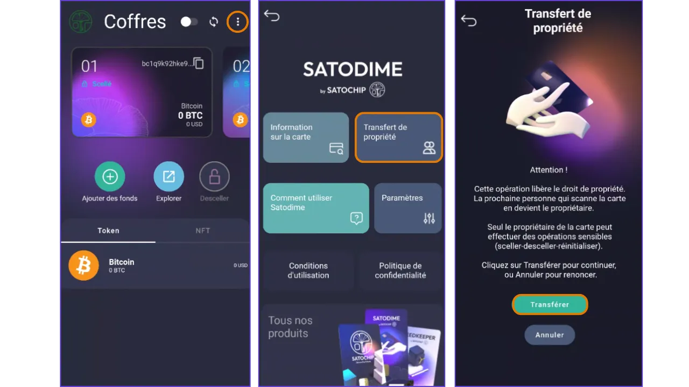

## VEDLEGG

### A1. Beste praksis

For å bruke **Satodime** sikkert :

- Sikre kortet**: Behandle det som kontanter; tap = tapte midler hvis det ikke er eieren.
- Sikkerhetskopiering av nøkler**: Etter at forseglingen er fjernet, skal private nøkler lagres på et sikkert fysisk medium. Aldri digitalt.
- Sjekk status**: Skann alltid for å bekrefte kortets eierskap og safens status som forseglet/uforseglet.
- Konfidensialitet**: Bruk nye adresser; unngå sentraliserte sentraler for overføringer.
- Oppdateringer**: Hold appen oppdatert via butikkene.
- Gjenoppretting**: Hvis kortet er tapt, men eies, er pengene på blokkjeden; bruk den private nøkkelen hvis forseglingen åpnes.

### A2. Ytterligere ressurser

Spesifikt for Satodime :

- [Satodime-produkt](https://satochip.io/fr/product/satodime/)
- [Mobilguide] (https://satochip.io/wp-content/uploads/2024/11/Satodime-FR-Short-tuto-app-mobile.pdf)

[Plan ₿ Academy] (https://planb.academy/) for opplæring i selvoppbevaring, private nøkler osv.

**Lagre gjenopprettingsfrasen din** :

https://planb.academy/tutorials/wallet/backup/backup-mnemonic-22c0ddfa-fb9f-4e3a-96f9-46e2a7954270

**Tutorial om Satochip (merkets første produkt) :**

https://planb.academy/tutorials/wallet/hardware/satochip-e9bc81d9-d59b-420d-9672-3360212237ba

**Seedkeeper-opplæringer:**

https://planb.academy/tutorials/wallet/backup/seedkeeper-906dfff8-1826-4837-92d1-8669e216d356

https://planb.academy/tutorials/wallet/hardware/seedkeeper-seedsigner-45cca4c4-1f22-46bb-87ae-9cddb68aa579

https://planb.academy/tutorials/computer-security/authentication/seedkeeper-password-64ffaf68-53aa-43c3-bc7a-c1dc2a17fee3

### A3. Om Satochip

**Offisielle lenker** :

- [Site Satochip](https://satochip.io/fr/)
- [GitHub] (https://github.com/Toporin/Satodime-Applet)
- Støtte: info@satochip.io

**Satochip** er et belgisk selskap som utvikler maskinvare- og programvareløsninger for håndtering og lagring av bitcoins og andre kryptovalutaer. Flaggskipet, Satochip-maskinvaren wallet, er et NFC-kort utstyrt med en EAL6+-sertifisert secure element. Sammen med Seedkeeper, en mnemoteknisk frase- og hemmelighetshåndterer, og Satodime, et bærerkort, tilbyr Satochip et omfattende utvalg skreddersydd til brukernes behov. Enhetene, som drives av programvare med åpen kildekode, har som mål å demokratisere sikkerheten på Bitcoin.