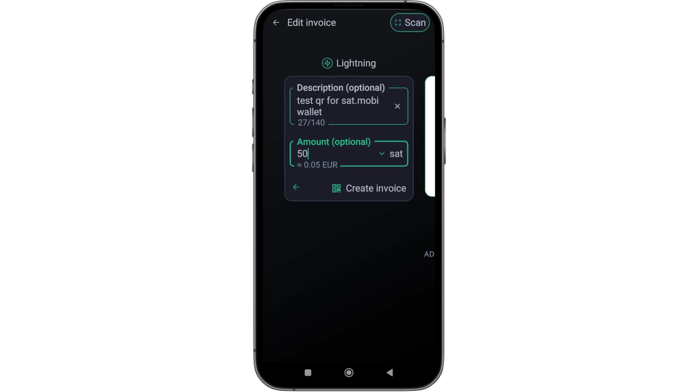

_Den här handledningen skrevs av_ [Bitcoin Campus] (https://linktr.ee/bitcoincampus_)

## Sats.Mobi

SatsMobi är en Wallet som fungerar på Telegram, med alla funktioner hos en Lightning Network (custodial) Wallet, plus en rad mycket underhållande funktioner. Den härstammar från en Fork av den numera nedlagda LightningTipBot, och ärvde alla dess funktioner samtidigt som den lade till mer aktuella funktioner, vilket gjorde den mer modern. Liksom LNTipBot omfattar Sats.Mobi också open source-filosofin. Wallet kan konfigureras och hanteras oberoende genom att klona den från detta [arkiv] (https://github.com/massmux/SatsMobiBot).

Om du föredrar att använda det helt enkelt kommer att starta en chatt på Telegram att avslöja att det är en bot.

## Inställningar

I Telegram-sökfältet letar du efter "satsmobi" och länken till [bot] (@SatsMobiBot) visas.

** Uppmärksamhet**: Om du inte är säker på att du vill söka via Telegram kan du komma åt boten på ett säkert sätt genom att använda följande [länk](https://t.me/SatsMobiBot)

Allt du behöver göra för att komma igång är att trycka på _START_

Om du vill utforska Wallet kan du välja _Menu_ längst ned till vänster.

Välj nu _/help_ bland huvudkommandona.

Sats.Mobi välkomnar oss genom att visa ett meddelande som listar alla huvudfunktioner. Vid start skapade bot också en LN Address, länkad till det valda handtaget på Telegram (som är unikt som standard). Kommandon för att skicka och ta emot Sats med denna Wallet är synliga, liksom andra funktioner som vi kommer att se senare. Det är intressant att också ta en titt på _/avancerad_-menyn

Det märks att Sats.Mobi också skapade en anonym LN Address, som ska användas för att få integritet. Bot fungerar med kommandon: klicka bara på motsvarande ord, eller skriv snedstrecket "/" i meddelandefältet, följt av kommandot du vill utföra. Även om Wallet just har skapats, välj till exempel _/transaktioner_

Detta kommando visar en lista över de senaste transaktionerna, i detta fall lika med noll.

## Mottagning Sats

Kommandot för att skapa en Invoice och ta emot Sats är _/invoice_. Sats.Mobi fungerar uteslutande i Satoshi, den minsta enheten i Bitcoin; för att skapa Invoice är det därför nödvändigt att skriva beloppet i Sats i meddelandefältet och sedan skicka det i chatten med boten.

I följande exempel gjordes valet att ta emot ett belopp på 210 Sats.

Efter en stunds väntan på att Invoice ska förberedas är den tillgänglig som text och som QR-kod. När du betalar Invoice visar Wallet saldot. Om summan av någon anledning inte uppdateras, skriv _/balance_ och tryck på `enter`.

## Sändning av Sats

Även om Sats är en extremt värdefull tillgång, som man inte bör dela med lätt, Sats.Mobi gör den här delen tilltalande, att utföra några korta tester (dvs. ett par provtransaktioner) kommer inte att vara ett problem.

### Betalning av en Invoice

Det enklaste sättet att betala en Invoice är att kopiera meddelandesträngen `lnbc1xxxxx` och klistra in den i meddelandefältet efter att ha skrivit kommandot _/pay_. **Den korrekta syntaxen** kräver att ett mellanslag lämnas efter kommandot.

Wallet skickar ett meddelande och ber om bekräftelse. Genom att klicka på _Pay_ betalas Invoice.

Sats.Mobi kan förlita sig på en effektiv och väl ansluten Lightning-nod, sällan misslyckas betalningar eftersom den alltid lyckas hitta rätt routing.

### Betala bekvämt från mobilen

Sats.Mobi, som surfar på Telegram, är också tillgängligt på mobilen. Den mest praktiska funktionen för att betala med mobilen är att skanna en QR-kod, men denna Wallet saknar det genom design, eftersom det inte är en fristående app utan finns i ett socialt nätverk. Sats.Mobi är därför programmerad för att underlätta den mobila upplevelsen så mycket som möjligt: den kan faktiskt avkoda en bild, som ett fotografi som tagits av QR-koden för den Invoice du vill betala.

Anta till exempel att du vill betala en Invoice på 50 Sats.

När detta visas för oss kan vi ta ett foto av den relaterade QR-koden.

Vi öppnar sedan Telegram på mobilen och bifogar i chatten med Sats.Mobi det foto som just tagits av QR-koden

När vi har valt ut den skickar vi den till boten:

Sats.Mobi avkodar fotot och **presenterar omedelbart betalningsbegäran**, med rätt beskrivning. Chatten ber om bekräftelse, för att fortsätta måste du trycka på _/pay_

Vänligen vänta ett ögonblick så att betalningen kan behandlas.

Invoice för 50 Sats har betalats, ett resultat som uppnåtts utan användning av en kamera och dess integrerade skanningsfunktion.

### Sats.Mobi i Telegramgrupper

Bland de funktioner som gjorde LNTipBot berömd och som Sats.Mobi tar med sig till Telegram, är den som gör upplevelsen rolig och interaktiv för medlemmar i en grupp.

Ägare kan bjuda in boten att gå med i gruppchatten och sedan nominera Sats.Mobi som administratör. Från det ögonblicket börjar det roliga, eftersom medlemmar kan börja belöna andra användare för deras bidrag till gruppen.

- _/tip_ lägger till ett tips genom att svara på ett meddelande;
- _/send_ skickar pengar med angivande av en LN Address eller ett Telegram-handtag som mottagare;
- _/faucet_ (i menyn _/advanced_) gör det möjligt att skapa en serie tips som de snabbaste medlemmarna i gruppen kan samla in genom att klicka på _/collect_;
- _/tipjar_ (i menyn _/avancerat_) skapar en annan typ av distribution som kan skickas till användare i gruppen.

Varje kommando har sin egen syntax, som förklaras i huvudmenyn för kommandon.

Och om vi inte är ägare till en grupp? Inga problem: be bara grundaren att bjuda in Sats.Mobi, lägg till det som administratör för gruppen så är du klar!

## Försäljningsställe (POS)

När Sats.Mobi lanseras för första gången skapar boten också en annan funktion för användaren: ** POS**. "Enheten" aktiveras av användaren med kommandot _/pos_ eller genom att klicka på den relaterade knappen från konsolen längst ner till höger. Faktum är att POS är en webbapp som öppnas som en popup på Telegram-chatten

Interface visar användarens personliga Telegram-handtag längst upp till vänster och används på samma enkla sätt som alla andra POS: genom att skriva in beloppet på knappsatsen. Låt oss anta att vi nu vill samla in 21 eurocent för en tjänst. Med tanke på att Sats.Mobi endast hanterar Sats är det inte lätt att göra omvandlingen i huvudet. På kassan visas däremot euro som kontoenhet, samtidigt som motsvarande belopp i Satoshi visas.

Genom att klicka på _/OK_ visas Invoice som kan visas för kunden via en QR-kod, eller som kan skickas som en sträng via snabbmeddelanden, så att den kan betalas.

Kassan är naturligtvis också tillgänglig på mobiltelefoner, som nås på samma sätt som tidigare visats.

Den visas också bra på mobiltelefonens skärm:

## Ytterligare funktioner

Det finns andra funktioner som kompletterar erbjudandet av Sats.Mobi Wallet, som, som vi har sett, utökar konceptet med en Wallet utöver att ta emot och skicka betalningar:

- _/nostr_: för att ansluta Wallet till din egen Nostr-användare för att ta emot zappar;
- _/cashback_: visar en kod som kan visas upp för en handlare för att få tillbaka pengar på ett köp;
- _/buy_: startar en guidad procedur inom botten, som gör det möjligt att köpa Sats för euro;
- _/activatecard_: för att begära aktivering av ett NFC-debetkort, som kan laddas genom Sats.Mobi Wallet och för vilket aviseringar kan aktiveras;
- _/link_: skapar en länk till din egen Zeus eller Blue Wallet, som kan användas som fjärrkontroller för denna Wallet.

## Slutsats

Sats.Mobi är en trevlig och rolig Wallet att använda, som ger tillbaka erfarenheterna från LNTipBot med de mer avancerade funktionerna i LNBits. Det är dock viktigt att komma ihåg att **det är en förvaringstjänst**. Därför bör den användas för att hålla mycket få Sats, det är inte en huvudsaklig Wallet för dina Lightning Network-fonder. Det finns också en inneboende kapacitetsgräns, lika med 500 000 Sats, en gräns som rekommenderas att inte överskrida.

Om du letar efter Lightning Network-plånböcker som inte är frihetsberövande är det definitivt tillrådligt att titta på andra produkter.

---
### Dokumentation

- [Github] (https://github.com/massmux/SatsMobiBot)
- Spellista med [videor](https://www.youtube.com/results?search_query=Sats.mobi) demo