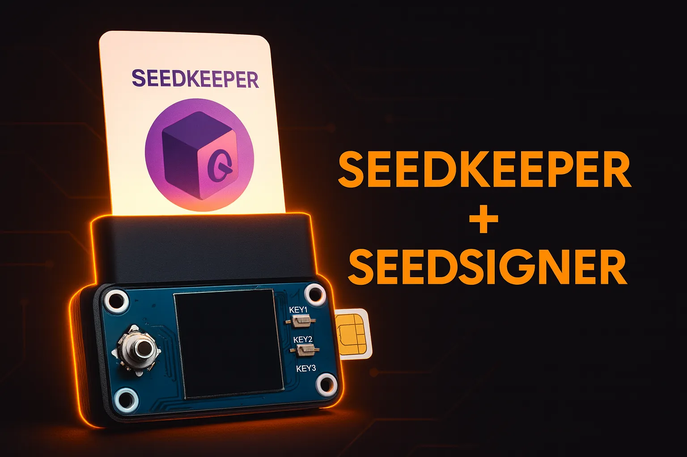

*感谢 [Satochip](https://satochip.io/) 团队同意在本教程中重复使用 [他们的视频](https://www.youtube.com/@satochip/videos)。还要感谢 [Crypto Guide](https://www.youtube.com/@CryptoGuide/)对 SeedSigner 固件的 fork 支持，使其能够支持智能卡。

---

SeedSigner 是一种 wallet 硬件，由标准硬件（通常是 Raspberry Pi Zero）自行组装而成。这种 wallet 被称为 "*无状态*"：与市场上的大多数其他型号（Coldcard、Trezor、Ledger 等）不同，它不在永久内存中存储任何数据，仅通过 RAM 实时运行。因此，您的 seed 投资组合永远不会存储在 SeedSigner 上。每次重新启动时，您都需要填写它，以使设备能够签署您的交易。最常用的方法是将 seed 保存为 QR 码，每次使用时扫描一下 (*SeedQR*)。

不过，这种方法也存在很大的风险：seed 必须以明文形式存在，以便扫描。如果发生失窃或入侵，攻击者很容易掌握它并窃取你的比特币。

为了克服这一弱点，SeedSigner 可以与 Satochip 开发的智能卡 [**Seedkeeper**](https://satochip.io/product/seedkeeper/) 结合使用。这样，记忆短语（或其他秘密）就可以存储在由 PIN 码保护的 secure element 中。Seedkeeper applet 是开源的，其 secure element 已通过 EAL6+ 认证。它与 SeedSigner 结合使用，可以提供非常有趣的安全功能：你的密钥完全离线管理，你可以在一个可信的屏幕上签署交易，seed 在智能卡中受到物理保护，可以抵御物理攻击。

完成安装只需以下物品：

- 经典的 SeedSigner 通常需要以下设备：一个 Raspberry Pi Zero、一个 Waveshare 1.3 英寸屏幕、一个兼容摄像头和一张 microSD 卡（更多详情请参见下面的 SeedSigner 教程）；
- SeedSigner扩展套件（可在Satochip官方商店购买）(https://satochip.io/product/seedsigner-extension-kit/)可让你直接从SeedSigner读写智能卡。另一种方法是使用外部智能卡读写器，它可以通过电缆连接到 Raspberry Pi 上的 Micro-USB 端口。不过，我还没有亲自测试过这种解决方案；
- 一张 Seedkeeper，或者一张安装 Seedkeeper 小程序的空白智能卡（Satochip 出售的扩展工具包已包含一张空白智能卡）。

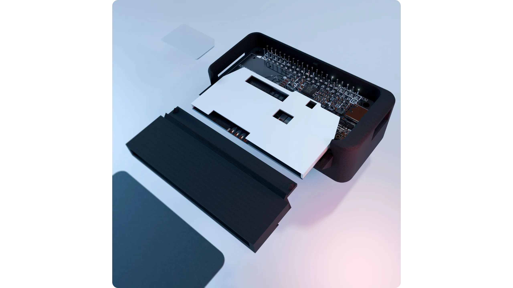

本教程包括两种情况：

- 如果您已经拥有通过 SeedSigner 管理的 Bitcoin 组合，只需安装新固件即可。然后，您就可以继续使用现有的 wallet，这次将使用 Seedkeeper 来提高安全性。
- 如果您还没有与 SeedSigner 关联的 Bitcoin wallet，则需要按照下面提到的教程中的**5**和**6**步骤进行操作。这两节说明了如何使用 SeedSigner 生成 generate 记忆短语，通过 *SeedQR* 保存该短语，然后将 wallet 连接到 Sparrow Wallet 对其进行管理。我不会在这里详细介绍这些步骤，**我假设你已经有了一个正常工作的 Bitcoin wallet，并配置了 Sparrow 和你的 SeedSigner**。

https://planb.academy/tutorials/wallet/hardware/seedsigner-2b274bff-6fc8-407a-92d7-f6ec4d1fadfb

## 1.安装固件

要将 SeedSigner 与 Seedkeeper 结合使用，需要安装不同于原始 SeedSigner 的其他固件，以支持智能卡读取。为此，[我建议使用 "*3rdIteration*"的 fork](https://github.com/3rdIteration/seedsigner)。下载与你使用的 Raspberry Pi 型号相对应的 [最新版本的图片](https://github.com/3rdIteration/seedsigner/releases) (`.zip`)。

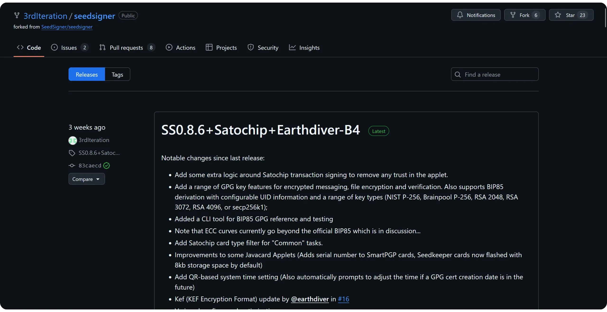

如果还没有，请下载 [Balena Etcher] 软件 (https://etcher.balena.io/)，然后按以下步骤操作：

- 将 microSD 卡插入电脑；
- 启动蚀刻机 ；
- 选择刚刚下载的 `.zip` 文件；
- 选择 microSD 卡作为目标；
- 点击 "Flash!"。

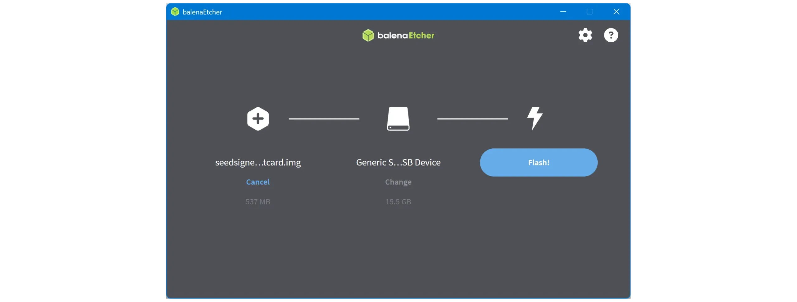

等待该过程完成：您的 microSD 现在可以使用了。现在您可以继续组装设备。

有关固件安装和软件验证的更多详情（我强烈建议您采取这一步骤），请参阅以下教程：

https://planb.academy/tutorials/wallet/hardware/seedsigner-2b274bff-6fc8-407a-92d7-f6ec4d1fadfb

## 2.组装智能卡读卡器

首先将摄像头安装到 Raspberry Pi Zero 上，小心地将其插入摄像头针脚并用黑色卡扣锁紧。然后将 Pi 放在机箱底部，确保将端口对准相应的开口。

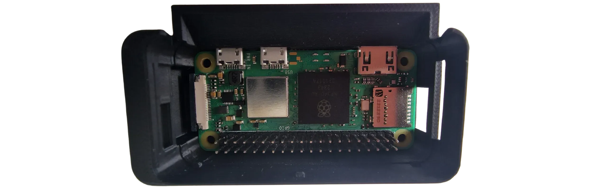

然后将智能卡读写器连接到 Raspberry Pi Zero 的 GPIO 引脚上。

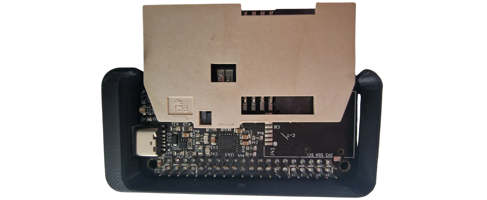

将塑料盖滑到智能卡读卡器上，直到正确定位。

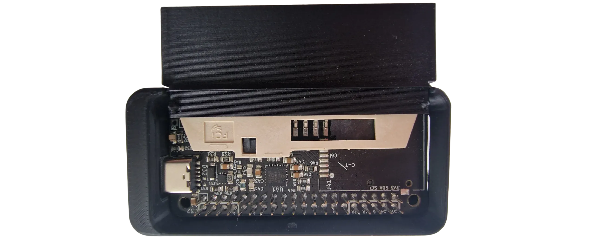

然后将屏幕添加到扩展的 GPIO 引脚上。

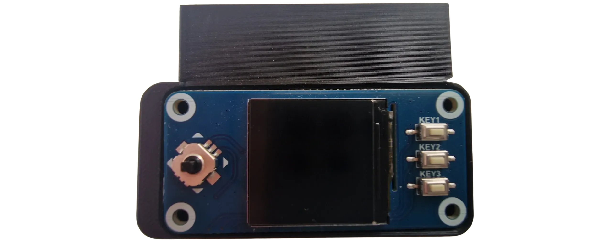

最后，将装有固件的 microSD 卡插入 Raspberry Pi Zero 的侧接口。

现在，您可以通过 Raspberry Pi Zero 的 Micro-USB 端口或扩展的 USB-C 端口连接 SeedSigner。两种方式都可以。等待几秒钟启动后，你会看到欢迎屏幕出现。

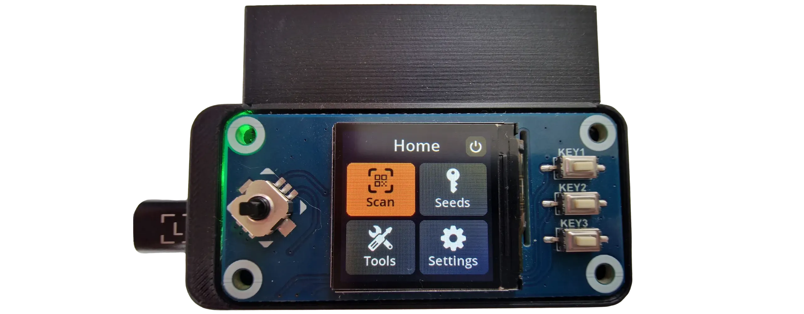

有关 SeedSigner 初始设置的更多详情，我推荐使用以下教程：

https://planb.academy/tutorials/wallet/hardware/seedsigner-2b274bff-6fc8-407a-92d7-f6ec4d1fadfb

## 3.使用 Seedkeeper 小程序闪存智能卡（可选）

如果你已经拥有了 Seedkeeper，可以跳过这一步，直接进入第 4 步。在本节中，我们将介绍如何在空白智能卡上安装 Seedkeeper applet（DIY 方法）。

要开始使用，请打开 SeedSigner 上的 "工具 > 智能卡工具 "菜单。

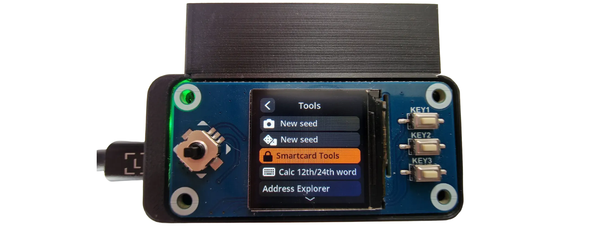

然后选择 "DIY 工具 > 安装 Applet"。

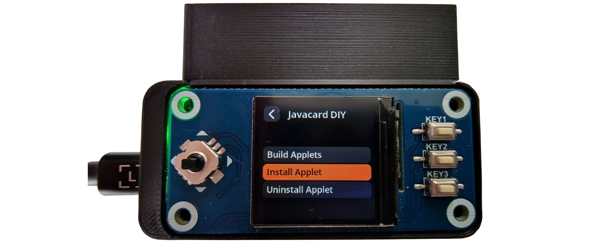

将智能卡插入 SeedSigner 阅读器，芯片朝下，然后选择 "SeedKeeper "小程序。

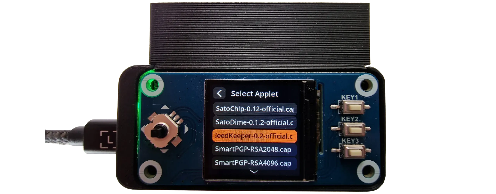

安装过程可能需要几十秒，请耐心等待。

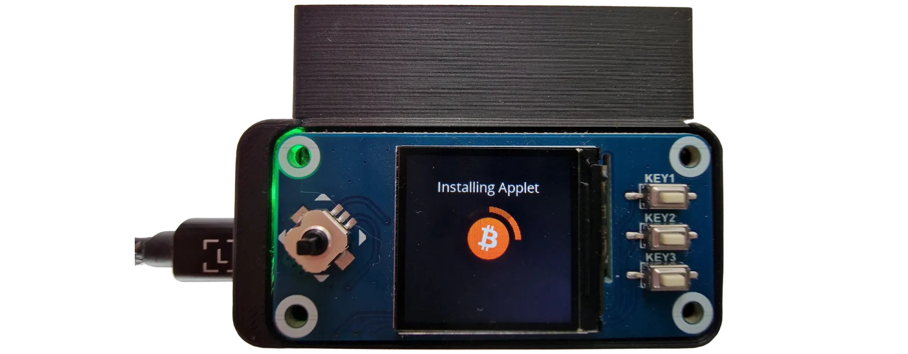

小程序安装成功后，就可以进入步骤 4。

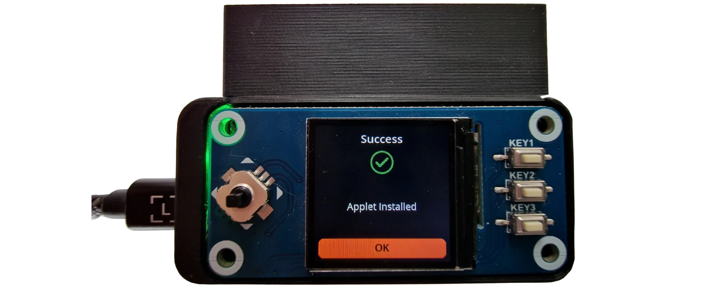

## 4.保存 Seedkeeper 上现有的 SeedQR

现在您的 Seedkeeper 已经可以使用了，您可以在智能卡上保存 Bitcoin wallet 的助记符。首先，像往常一样打开 SeedSigner，然后扫描 wallet 的 *SeedQR* 将其加载到设备中。导入 seed 后，只需选择 "完成"。

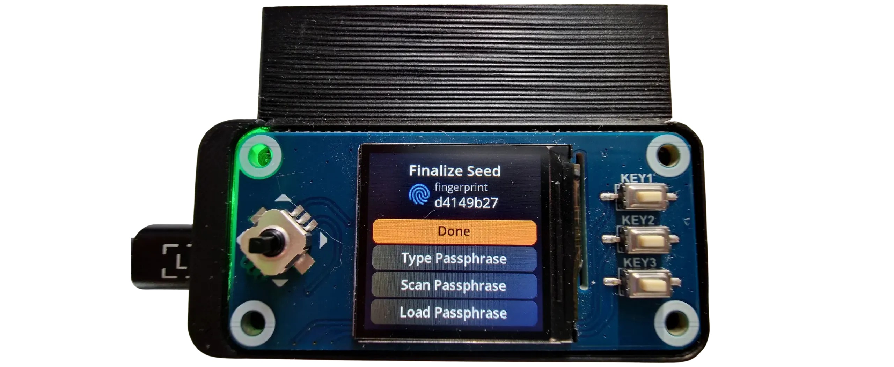

加载 seed 后，进入 "备份种子 "菜单。

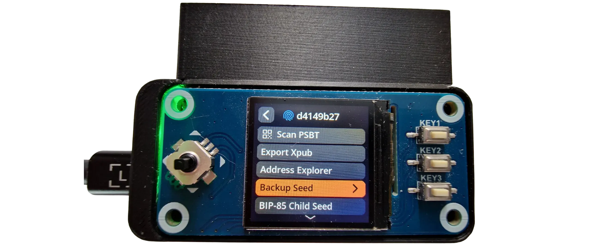

然后将 Seedkeeper 插入 SeedSigner 驱动器，并选择 "至 SeedKeeper "选项。

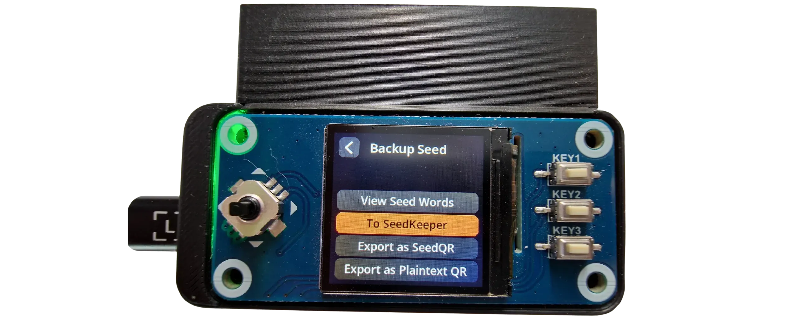

然后，SeedSigner 会要求您输入 Seedkeeper 的 PIN 码。由于这是一张空白卡，因此尚未定义密码。请输入任何代码跳过这一步，然后进行验证。

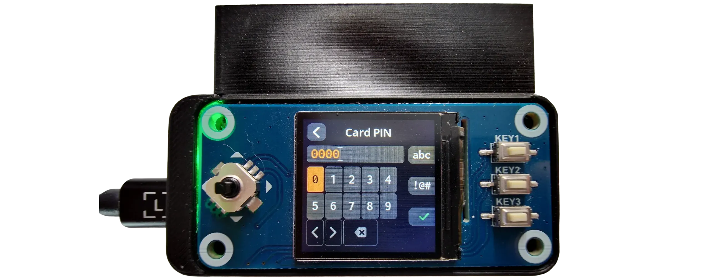

SeedSigner 检测到 Seedkeeper 尚未初始化（即未设置密码）。点击 "我明白 "继续。

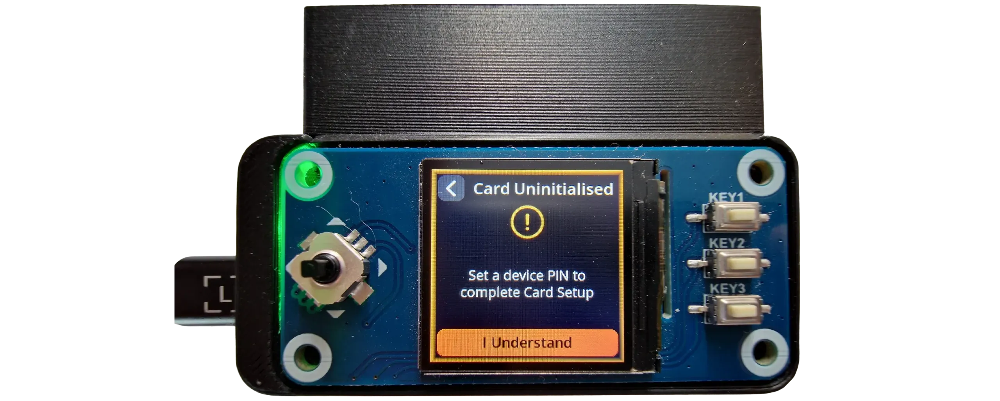

现在选择 Seedkeeper 的新 PIN 码，长度在 4 到 16 个字符之间。为了提高安全性，请选择一个随机的长密码：这是保护您的记忆短语物理访问的唯一屏障。

请记住，一旦创建了 PIN 码，就应立即将其保存在可靠的密码管理器中，或保存在单独的物理介质中，这取决于你的策略。在后一种情况下，请确保不要将包含 PIN 码的介质与 Seedkeeper 放在同一个地方，否则保护将失效。备份副本非常重要： **没有这个 PIN 码，您将无法访问您的 seed，您的比特币也将丢失**。

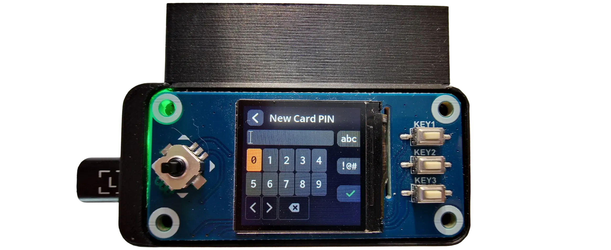

然后，你可以定义一个与记忆短语相关的 "标签"。如果你在 Seedkeeper 上存储了多个秘密，这个标签就很有用，这样你就可以很容易地识别它们。

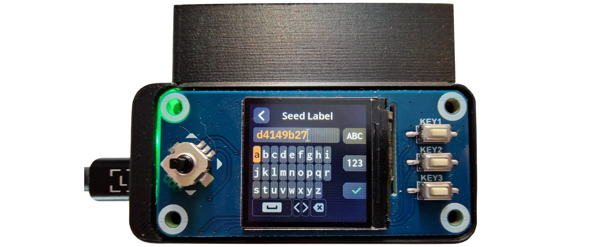

您的记忆短语现已保存在智能卡上。

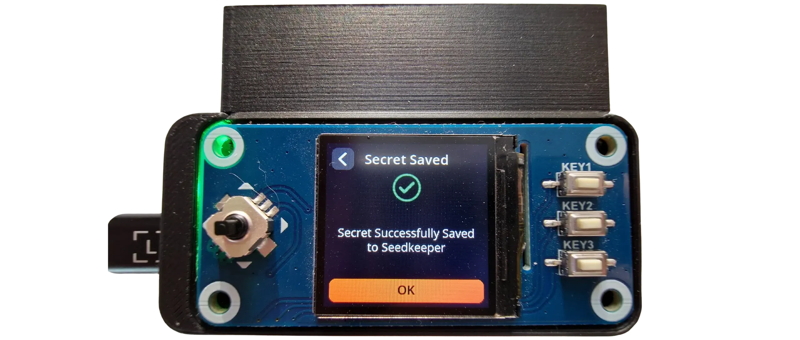

在安全策略方面，根据您的需求和面临风险的程度，有几种可行的方法。我个人建议您至少保留两份 seed 副本：

- 这是智能卡的首创，你可以方便地使用智能卡进行日常操作，如验证地址或签署交易。这种方法很实用（我们将在第 5 部分中看到），而且由于有 PIN 码的保护，它仍然是安全的，所以你可以随时取用它，而不会有太大的风险；
- 第二份未加密的记忆短语副本，作为您投资组合的最终备份，仅在 Seedkeeper 丢失或被盗时使用。由于该版本未加密，因此必须保存在另一个更安全的地方，以防止两个备份同时受到破坏。

根据您的保护策略和风险状况，您还可以在多个不同的 Seedkeepers 上复制 seed，或创建多个助记符的物理副本。要了解有关这些做法的更多信息，请参阅以下教程：

https://planb.academy/tutorials/wallet/backup/backup-mnemonic-22c0ddfa-fb9f-4e3a-96f9-46e2a7954270

## 5.从 Seedkeeper 载入 seed

现在，您可以使用 Seedkeeper 在启动时将记忆短语加载到 SeedSigner 中，从而签署 Bitcoin 交易。首先，将 SeedSigner 插上电源，然后打开 "种子 "菜单。

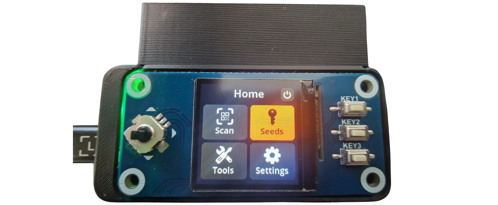

然后选择 "来自 SeedKeeper "选项。

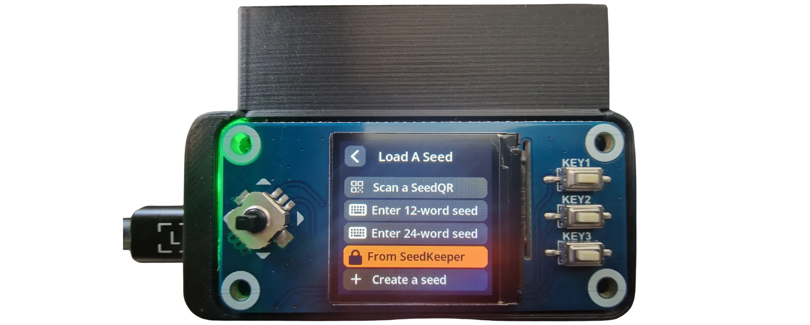

将 Seedkeeper 插入智能卡读卡器，然后输入 PIN 码解锁。按右下角的确认按钮 "KEY3 "确认输入。

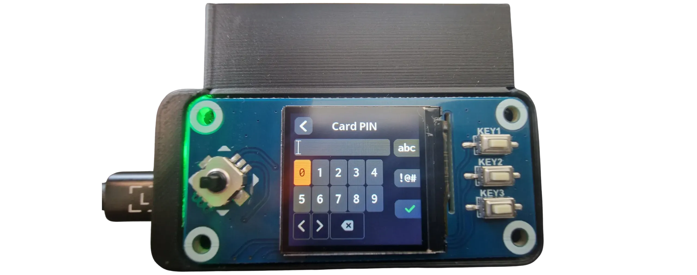

Seedkeeper 可以包含多个秘密，因此 SeedSigner 会提示您选择要加载的秘密。显示的标签与您在步骤 4 中定义的名称相对应。如果像我这样，只注册了一个 seed，则只有一个选项可用。

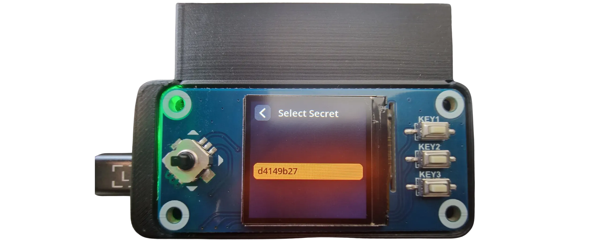

您的 seed 现在已加载。请将屏幕上显示的指纹与 Sparrow Wallet 设置中指定的指纹进行比较，检查这是否是正确的 wallet。该指纹也是在首次创建 wallet 时提供的。

如果您使用的是 passphrase，可以在此阶段应用它（参见本教程第 6 部分）。否则，只需点击 "完成"。

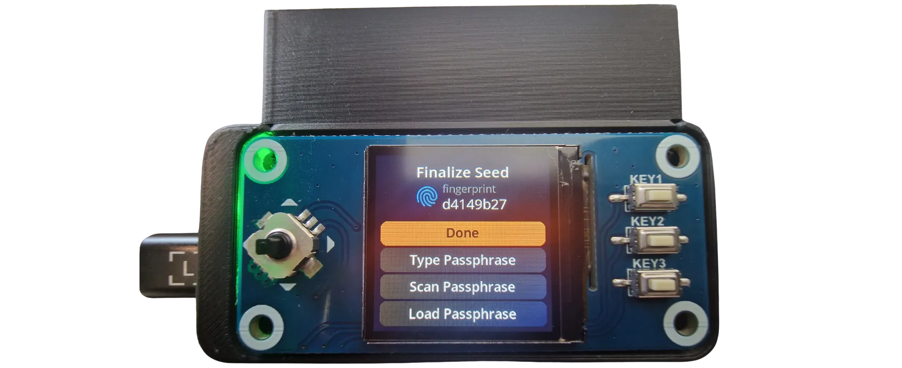

然后，您就可以像往常一样使用 wallet：检查您的收货地址并签署交易，就像使用传统的 SeedSigner 一样。要了解更多使用方法，请参阅专门的教程 ：

https://planb.academy/tutorials/wallet/hardware/seedsigner-2b274bff-6fc8-407a-92d7-f6ec4d1fadfb

## 6.将 Seedkeeper 与 passphrase BIP 一起使用39

您是否在使用 passphrase 保护您的 Bitcoin 组合？您也可以将其与 seed 一起注册到 Seedkeeper 中。这样，您就可以将 wallet 快速加载到 SeedSigner 上，而不必每次使用时都在小键盘上手动输入 passphrase。

我觉得这种方法特别有趣，因为它既能让你受益于 passphrase 的安全优势，又能消除与日常使用相关的限制。下面是我推荐的一个配置示例：

- 将您的 seed 和 passphrase 保存在 Seedkeeper 中，并使用强大的 PIN 码进行保护（这一点非常重要）。有了这个备份，您就可以方便地每天使用 wallet。如果您愿意，可以在第二个 Seedkeeper 上复制这些信息；
- 同时，用纸张或金属保存一份清晰的助记符和 passphrase 的副本。这是您丢失 Seedkeeper 或其 PIN 码时的最后备份。请务必将这些副本分别存放在不同的地方，以免它们同时遭到破坏。

在这种配置下，如果有人只掌握了你的明文助记词，那么他们在不知道 passphrase 的情况下就无法窃取任何东西（当然，前提是 passphrase 足够强大，能够抵御暴力破解攻击）。反之，如果有人发现了你的 passphrase 明文，如果没有相应的助记词组，它仍然无法使用。

最后，如果有人设法进入装有 seed 和 passphrase 的 Seedkeeper，如果不知道 PIN 码，就无法提取任何东西。与 passphrase 不同的是，该密码无法被暴力破解，因为智能卡在 5 次无效尝试后会自动锁定。

因此，这种配置的安全性基于两个基本点：

- 一个 **passphrase 强**：它必须很长、随机，并包含多种字符。它的复杂性对您来说不是问题，因为您只需在初始化过程中在键盘上输入一次；之后，它将由 Seedkeeper ；
- 种子管理器的**强 PIN 码**：也是随机的，由 16 个字符组成。

要设置此设置，首先要按常规方法将 passphrase 载入 SeedSigner。您可以按照本教程中的详细步骤进行操作：

https://planb.academy/tutorials/wallet/backup/seedsigner-passphrase-7a61f64d-aa03-4bcf-8308-00c89a74cffe

将带有 passphrase 的投资组合正确载入 SeedSigner 后，打开 "种子 "菜单，选择与该投资组合相对应的足迹。请注意，该足迹与不带 passphrase 的投资组合的足迹不同。

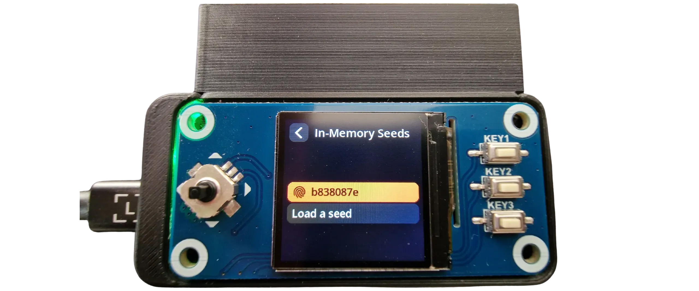

然后点击 "备份种子"，将 Seedkeeper 插入驱动器，并选择 "到 SeedKeeper"。

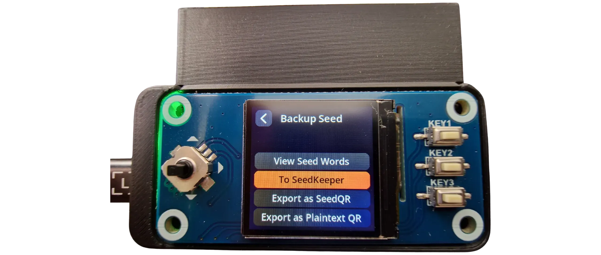

输入 PIN 码解锁 Seedkeeper，然后为这个秘密指定一个标签。你可以将指纹作为标签，以保持某种形式的可信度，或者明确说明 "密码 Wallet"。

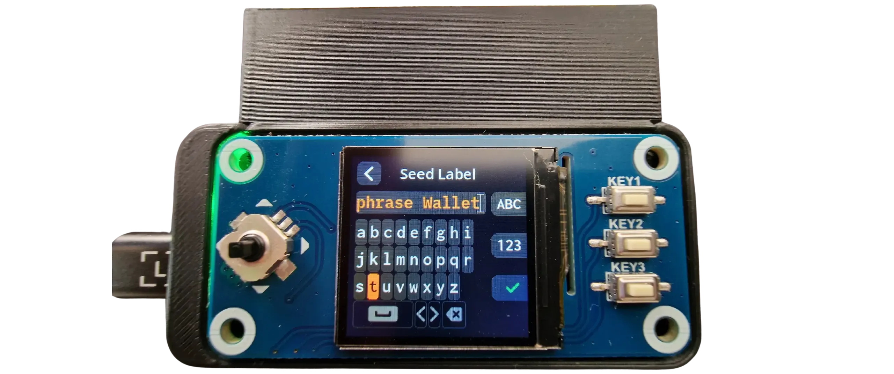

您的 passphrase 投资组合已在 Seedkeeper 上注册。

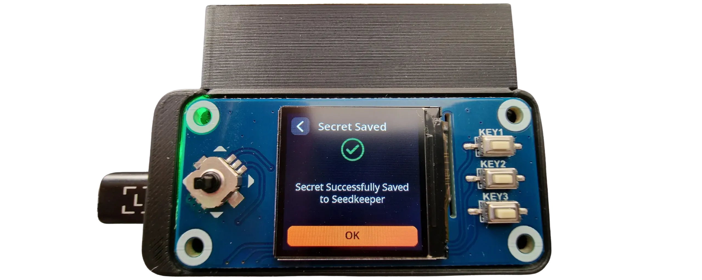

下次启动时，只需将 Seedkeeper 插入驱动器，然后导航到 "种子 > 从 SeedKeeper"。

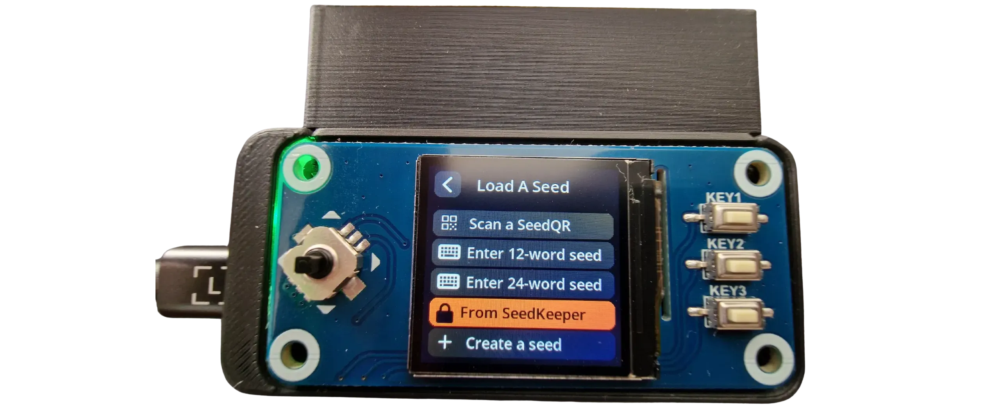

输入密码解锁智能卡，然后选择与 passphrase 相对应的 wallet。

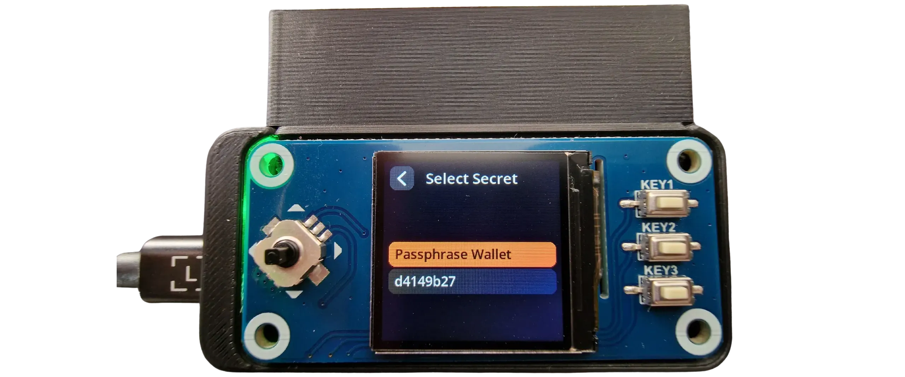

检查 passphrase 和您的 wallet 打印，然后确认。

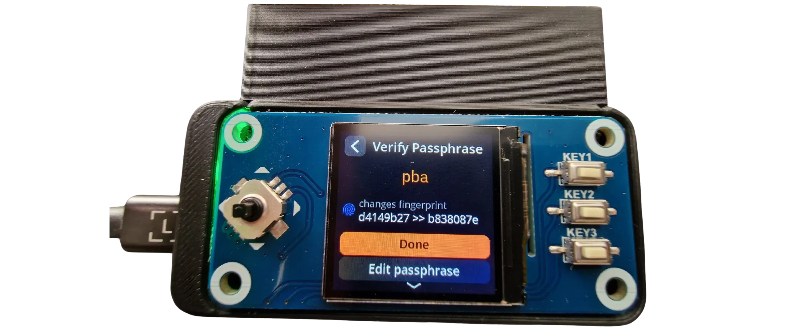

现在，您可以使用 passphrase 访问您的投资组合，并像通常在 SeedSigner 上一样签署您的交易。

## 7.附加选项

在 "工具 > 智能卡工具 "菜单中，你可以找到几个管理 Seedkeeper 的选项：

- 在 "常用工具 "菜单中，您可以 ：
 - 检查卡片真伪；
 - 更改 PIN 码 ；
 - 更改与机密相关的标签 ；
 - 禁用 NFC 功能（建议仅使用芯片读取器） ；
 - 执行出厂重置。

- 在 "种子管理器功能 "菜单中，您可以 ：
 - 请查阅已登记的秘密清单 ；
 - 保存新的秘密 ；
 - 删除现有秘密 ；
 - 保存或加载描述符（对 multi-sig 投资组合很有用的功能）。

- 在 "DIY 工具 "菜单中，您可以 ：
 - 编译 Seedkeeper 小程序 ；
 - 在空白卡上安装小程序 ；
 - 删除 Seedkeeper 小程序可将其重置并恢复空白。

现在你知道如何结合 SeedSigner 使用 Seedkeeper 安全备份你的投资组合了吧。

如果这些设置让您信服，请不要犹豫，支持那些使之成为可能的项目：

- 直接[在 Satochip 网站上]购买设备(https://satochip.io/shop/)；
- 向 SeedSigner 项目捐款](https://seedsigner.com/donate/)；
- 通过订阅[Crypto Guide 的 YouTube 频道](https://www.youtube.com/@CryptoGuide/)，该频道由维护托管修改后固件的 GitHub 存储库的人员运营。