Seedkeeper ni smartcard yakozwe na Satochip, ishirahamwe ry’Ababirigi ryitaho ivy’ugutorera umuti ibibazo vy’ubuhinga bwo gucunga no kurinda amabanga y’ubuhinga bwa none. Satochip izwi cane kubera urutonde rw’amakarata y’ubwenge y’ibidukikije vya Bitcoin, yahinguye Seedkeeper nk’ubundi buryo bwo kubika amajambo y’ubwenge.

Mu majambo nyayo, Seedkeeper ifata uburyo bw'ikarata y'ubwenge ikora vyinshi, yemejwe na EAL6, ifise umurongo w'ubuhinga n'ubuhinga bwo kwibuka bushobora guhindurwa (ico bita "Ikintu gitekanye"). Nk’uko izina ryayo rivyerekana, uruhara rwayo ni ugubika amajambo y’ibanga n’amajambo y’ibanga ya Bitcoin wallet mu buryo buziguye kandi burindwa. Na Seedkeeper, urashobora generate, kwinjiza, gutunganya no kubika amabanga yawe ataco uhinduye mu gice c’ikarita gitekanye.

Mu vyiyumviro vyanje, Seedkeeper ifise imikoreshereze ibiri nyamukuru, tuzoyitohoza mu nyigisho 2 zitandukanye:

- Bitcoin** ububiko bw’amajambo y’ukwibuka: aho kwandika amajambo yawe 12 canke 24 ku mpapuro, urashobora kuyashira muri smartcard ukayakingira ukoresheje kode ya PIN.
- Ugucungera ijambobanga**: ushobora generate amajambobanga akomeye biciye ku rubuga rwa Seedkeeper maze ukayabika ataco uhinduye muri smartcard, bikaguha ubuhinga bwo gucunga ijambobanga ryoroshe kandi ryoroshe gukoresha utari mu nzira.

Mu buryo bw’ubuhinga, Seedkeeper ifise ubushobozi bwa bytes 8192, bikaba biyishoboza kubika amabanga 50 atandukanye (umubare nyawo uzovana n’ubunini bwayo be n’amakuru y’imbere ajanye na buri rimwe). Seedkeeper ishobora gushikwako [biciye ku gikoresho co gusoma ikarita y’ubwenge gihuye](https://satochip.io/accessories/) kuri mudasobwa, canke biciye ku gikoresho co kuri telefone ngendanwa gihuye na NFC. Ubuhinga bwose bukora mu buryo butajanye n’umurongo, ata n’imwe ikoreshwa kuri Internet, bikaba vyemeza ko ata gitero gishobora gutera.

Ikintu gishimishije cane ni ubushobozi bwo gusubiramwo ibiri muri Seedkeeper imwe mu yindi kugira ngo umuntu ashobore gukora backup. Muri iyi nyigisho, tuzokwereka ingene wobikora.

Seedkeeper nayo iraryoshe cane iyo ifatanijwe n’ibikoresho bitagira igihugu vya wallet nka SeedSigner canke Spectre DIY. Muri ivyo, nta nkeka ko ukoresha umukiriya wa Satochip kuri mudasobwa canke kuri telefone ngendanwa. Igikoresho co gucungera imbuto kigumya seed muri secure element yaco kandi gishobora gukoreshwa ata guca ku ruhande n’igikoresho co gusinya, ivyo bikaba bituma udakenera gukoresha kode ya QR y’impapuro. Sinzotegura iyi nkuru y'ikoreshwa muri iyi nyigisho, kuko ari ikiganiro c'iyindi nyigisho yihariye :

https://planb.academy/tutorials/wallet/hardware/seedkeeper-seedsigner-45cca4c4-1f22-46bb-87ae-9cddb68aa579

## 1. Ni igiki gikoreshwa ku Mucungezi w’Imbuto?

Muri iyi nyigisho, nzovuga gusa ku bijanye n’ikoreshwa ry’ibintu bijanye na Bitcoin, kuko nivyo iyi nyigisho ivuga. Ntituzoja mu mikorere yo gucunga ijambobanga, ivyo bizoba ari ivy’iyindi nyigisho.

Ugereranije n’ugushiramwo urupapuro rworoshe rw’ijambo ry’uruyeri, gukoresha Seedkeeper birafise ivyiza vyinshi:

- Ishobora guhangana n’ubusuma:** seed iri muri wallet yawe ntishobora gushikwako mu nyandiko zitomoye. Kugira ngo uyikuremwo, ukeneye kumenya PIN y’Umucungezi w’Imbuto. Umusuma afata ico gikoresho ntaco azoshobora kugikoresha ataco akoresheje iyo kode.

- Gukwiragiza ingorane ku bintu bibiri:** ushobora kugabanya umutekano hagati y’ikintu ca digitale n’ikintu c’umubiri. Nk’akarorero, niwabika PIN ya Seedkeeper mu mucungerezi wawe w’ijambobanga, uzokenera vyose bibiri, ushobora gushika kuri uwo mucungerezi be n’ukugira ikarita y’ubwenge kugira ngo ubone seed (ivyo bikaba bigabanya cane ubushobozi bwo guterwa).

- Uburongozi bushingiye hagati:** Umucungezi w’imbuto afasha mu gucunga imbuto nyinshi zivuye mu bice bitandukanye.

- Ivyiyumviro vyoroshe:** gusa gusubiramwo ivyimburwa vy'ibanga ku bandi Bacungera Imbuto.

Ariko rero, hariho ingorane zitari nke ugereranije n’ugushiramwo urupapuro rworoshe rwo gukingira urupapuro rwawe rwa seed:

- Igiciro:** naho ari gito (hafi €25), kiracari hejuru y’icy’urupapuro.

- Gushingira ku gikoresho c’ubuhinga rusangi:** kwinjira no gucunga seed bisaba mudasobwa canke telefone ngendanwa, ivyo bisigura ko mnemonic yawe ica mu mashini ifise ahantu hagari cane ho gutera kuruta ibikoresho vya wallet. Ivyo birashobora guserura ingorane iyo iyo mashini ishobora gushikirwa n’ingorane. Ni co gituma ntasaba gukoresha Seedkeeper kugira ngo ubike seed y’ibikoresho vya wallet (kiretse mu gukoresha ata gihugu ata mudasobwa, nk’uko biri kuri SeedSigner). Uruhara rw’ibikoresho vya wallet ni ugubika seed mu kibanza gifise umutekano muke cane. Mu kwinjiza seed yawe n’amaboko kuri mudasobwa yawe isanzwe, ntikiguma ku bikoresho vya wallet: irahera kandi ku mashini ikoreshwa muri rusangi, ishobora gushikirwa n’ibitero vyinshi. Rero ni vyiza gukoresha Seedkeeper ku wallet ishushe aho gukoresha iyo ikanye (kiretse SeedSigner / ibikoresho vya wallet bitagira igihugu).

- Ico kibazo co gutakaza gifitaniye isano na PIN:** ukudashobora gushikira seed ataco ushizeko, bitandukanye n’impapuro zo gukingira, biratanga vy’ukuri uburinzi ku busuma bw’umubiri. Ariko nk’uko vyama, umutekano ni igikorwa co gushiramwo uburinganire hagati y’akaga ko kwibwa n’akaga ko gutakaza. Nimba ububiko bwawe busaba PIN, gutakaza iyo kode bizokugirira akamaro ko ushobora gusubira kuronka ijambo ryawe ry’ukwibuka, gutyo ushobore gushika ku bitcoins zawe.

Hakurikijwe ivyo vyiza n’ibibi, mbona ko uburyo bwiza bwo gukoresha Seedkeeper (uretse igikorwa cayo co gucunga ijambobanga) ari, ku ruhande rumwe, kubika imbuto zivuye mu **bitabo vyawe vy’amaporogarama**, kuko zisanzwe ziri kuri telefone yawe canke kuri mudasobwa yawe, canke zivuye kuri wallet handre,sing the Sa n’ibikoresho vya wallet bitagira igihugu nka SeedSigner, aho vy’ukuri biza mu vyavyo.

Ikindi kintu gishimishije cane co gukoresha Seedkeeper ni ubushobozi bwo gushigikira *Ibisobanuro* vy'ibitabo vyawe.

## 2. Noronka gute Umucungezi w’Imbuto?

Hari uburyo bubiri nyamukuru bwo kuronka Umucungezi wawe w’Imbuto. Ushobora [kuyigura ataco uhinduye mu iduka ryemewe rya Satochip](https://satochip.io/igicuruzwa/umucungezi w’imbuto/) canke ku mucuruzi yemerewe. Ariko kuko [applet ya Seedkeeper ari inkomoko yuguruye](https://github.com/Toporin/Seedkeeper-Applet), urafise kandi uburenganzira bwo kuyishira wewe nyene ku [ikarita y’ubwenge idafise ikintu]

Niba wipfuza gukoresha ubuhinga bwo gucungera amakuru bwa Seedkeeper, biragaragara ko uzokenera kugura amakarita abiri y’ubwenge.

## 3. Gushiramwo umukiriya wa Seedkeeper

Muri iyi nyigisho, tuzosubiramwo igitabu cacu ca seed ku Mucungezi wacu w'Imbuto. Intambwe ya mbere ni ugushira iyo porogarama kuri mudasobwa yawe canke kuri telefone yawe. Kuri PC, uzokenera [gukuraho verisiyo nshasha ya Satochip-Utils](ibisohoka). Ku mbuga ngurukanabumenyi, porogarama ya Seedkeeper iraboneka ku [Iduka rya Google Play](Iduka ry’Imbuto) be no kuri [Iduka ry’Imbuto rya Apple](Iduka ry’Imbuto ry’Imbuto).

## 4. Gutangura umucungezi w'imbuto

Ufungure porogaramu hanyuma ukande kuri buto ya "*Click & Scan*".

Uzosabwa PIN code y’Umucungezi w’Imbuto yawe. Kubera ko iyi ari ikarita nshasha, nta PIN irasobanurwa. Injira kode iyo ari yo yose kugira ngo usimbuke iyi ntambwe, hanyuma ukande "*Ibikurikira*".

Hanyuma ushire iyo karata inyuma ya telefone yawe. Iryo koraniro rizomenya ko Seedkeeper itaratangura, kandi rizogusaba gushinga kode ya PIN y’ikarita yawe y’ubwenge, ifise uburebure buri hagati y’inyuguti 4 na 16. Kugira ngo ubone umutekano mwiza, hitamwo ijambobanga rikomeye rirerire uko bishoboka kwose, ridasanzwe kandi rigizwe n’inyuguti zitandukanye. Iyi kode ya PIN ni yo yonyene ishobora gutuma udashobora gushika ku majambo yawe yo gukira.

**Ibuka kandi kubika iyi PIN ubu**, nk'akarorero mu mucungerezi w'ijambobanga, canke ku buryo butandukanye. Mu gihe ca nyuma, ntukigere ubika umurongo urimwo PIN ahantu hamwe n’Umucungezi wawe w’Imbuto, ahandi ho uwo mutekano uzoba ubusa. Ni vyiza kugira ububiko bwo kwizigirwa: ata PIN, ntuzoshobora gusubirana amabanga yabitswe kuri Seedkeeper yawe.

Wemeze kode yawe ya PIN ubugira kabiri.

Umucungezi w’Imbuto yawe ubu yaratanguje. Ushobora kuyifungura winjije kode ya PIN uherutse gushiramwo.

Ubu uzojanwa kuri paji y’uburongozi bw’ikarita yawe y’ubwenge.

## 5. Kwandika seed ku Mucungezi w'Imbuto

Igihe Umucungezi wawe w'Imbuto amaze gufungurwa, ukande kuri buto ya "*+*".

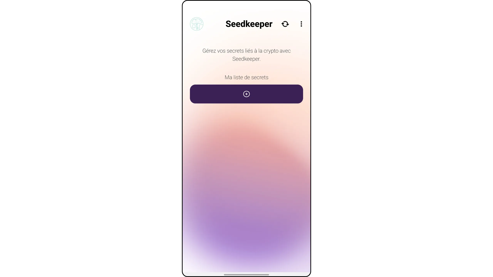

Hitamwo "Ibanga ry'imbere*". Ihitamwo rya "*Generate secret*" rigufasha kurema ijambo rishasha ry'ukwibuka rivuye muri porogaramu.

Ku bijanye natwe, turashaka kubika seed mu vyo dufise. Fyonda kuri "*Mnemonic*".

Ushire "*Ikimenyetso*" kuri iri banga kugira ngo rishobore kumenyekana bitagoranye iyo ubitse amakuru menshi mu Mucungezi wawe w'Imbuto.

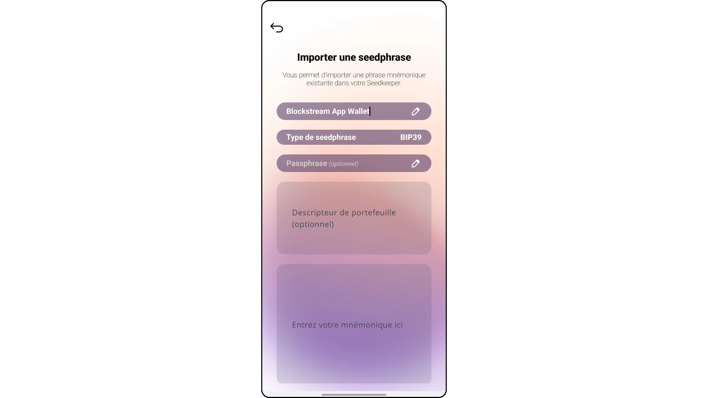

Hanyuma winjize ijambo ryawe ryo gukira mu kibanza catanzwe. Niba ubishaka, urashobora no kwongerako passphrase BIP39 canke *Ibidondora* vyawe. Hanyuma ukande kuri "Import*".

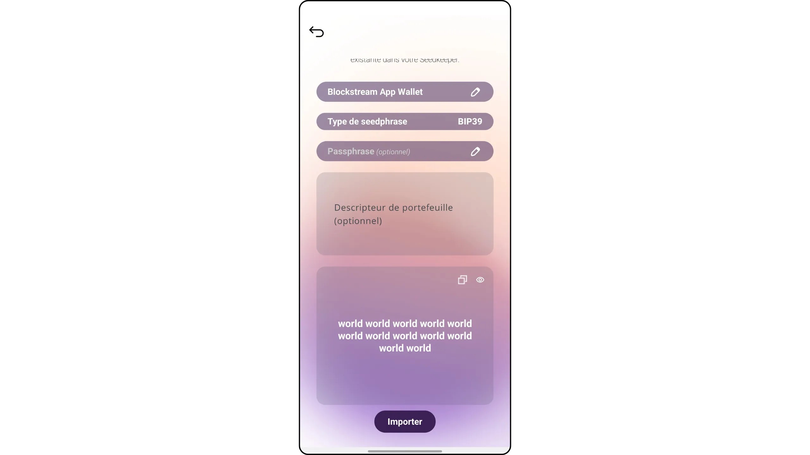

*Ivyiyumviro vyerekanywe muri iri shusho ni ivy’ibinyoma kandi nta n’umwe ari ivy’umuntu. Ni akarorero gusa. Ntukigere uhishurira umuntu uwo ari we wese mnemonic yawe bwite, canke bitcoins zawe zizokwibwa

Shira Seedkeeper yawe inyuma ya telefone yawe y’amaboko.

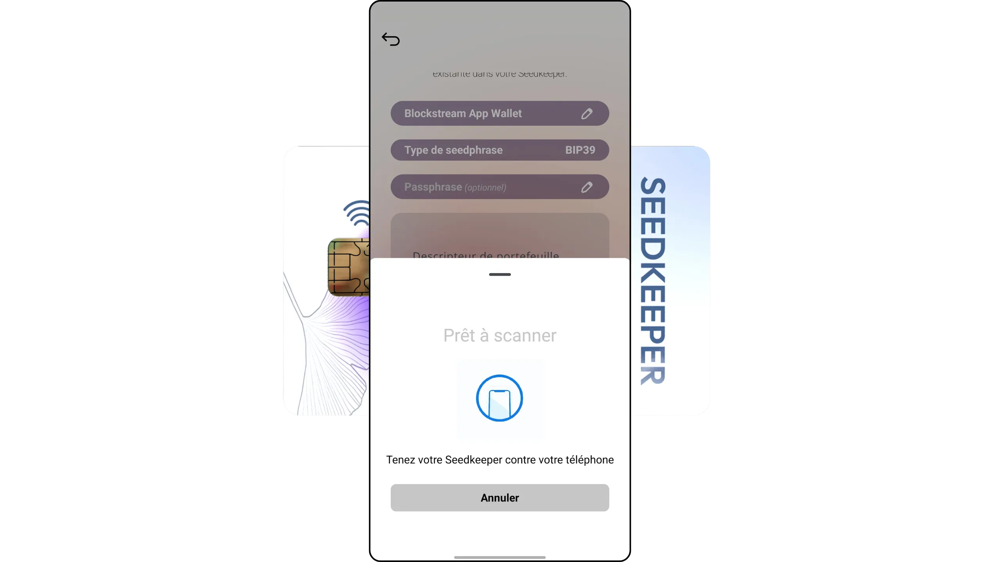

seed yawe yaranditswe.

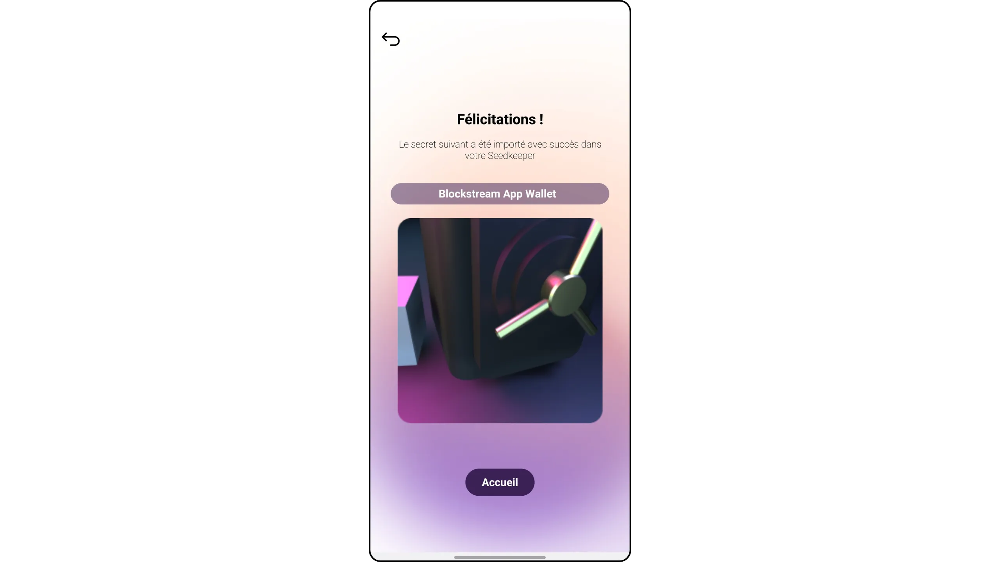

## 6. Ushike kuri seed yawe kuri Seedkeeper .

Niba ushaka gusuzuma ijambo ryawe ry'ukwibuka, fata Seedkeeper yawe ukande kuri buto ya "*Click & Scan*".

Injira kode yawe ya PIN, hanyuma ukande "*Ibikurikira*".

Shira Seedkeeper yawe inyuma ya telefone yawe y’amaboko.

Ivyo bigushikana ku rutonde rw’amabanga yawe yose yanditswe. Muri aka karorero, nshaka kwerekana seed y'igitabu canje ca "*Blockstream App*", rero ndagifyondako.

Kanda kuri buto ya "*Hishura*".

Scan Umucungezi w’Imbuto yawe kandi.

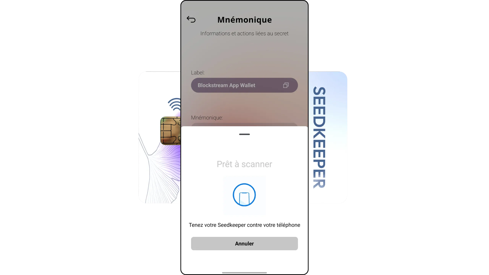

Invugo yawe y’ukwibuka wari waranditse mbere ubu iraboneka ku rubuga.

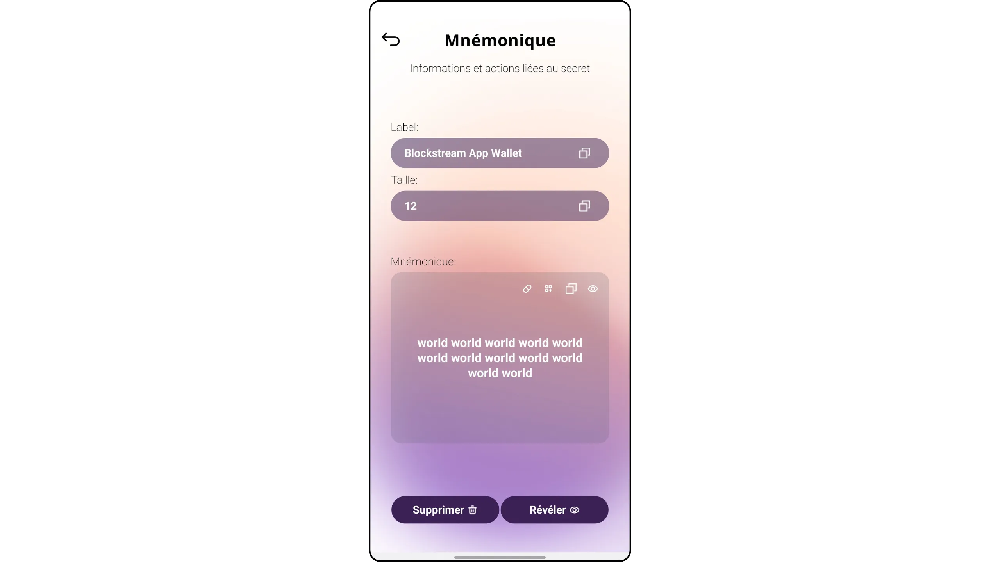

## 7. Gushigikira Umucungezi w'Imbuto

Ubu tugiye gukora backup y’Umucungezi wanje w’Imbuto ku Mucungezi w’Imbuto wa kabiri kugira ngo tugire kopi zibiri. Ivyo bishobora kuba igice c’ingene wokingira amafaranga yawe y’ibiceri: nk’akarorero, kubika ijambo ryawe ahantu habiri hatandukanye kugira ngo ugabanye ingorane zo ku mubiri, canke kwizigira kopi incuti wizigirwa nk’igice c’umugambi w’iragi.

Kugira ngo ubikore, jana n’Umucungezi wawe wa kabiri w’Imbuto (wibuke kumenya umwe muri abo babiri afise ikimenyetso kugira ngo ntihagire uwugutera urujijo). Tangana n’ugutangura, nk’uko vyavuzwe mu ntambwe ya 4 y’iyi nyigisho. Hitamwo ijambobanga rikomeye kandi. Bivanye n’ingene ukoresha, woshobora guhitamwo ijambobanga ritandukanye canke ukaguma ukoresha iryo banga nyene.

Ugurure porogaramu, ukande kuri "*Click & Scan*", winjize ijambobanga ry'Umucungezi wawe w'Imbuto n°1 (inkomoko), hanyuma uyi scanner.

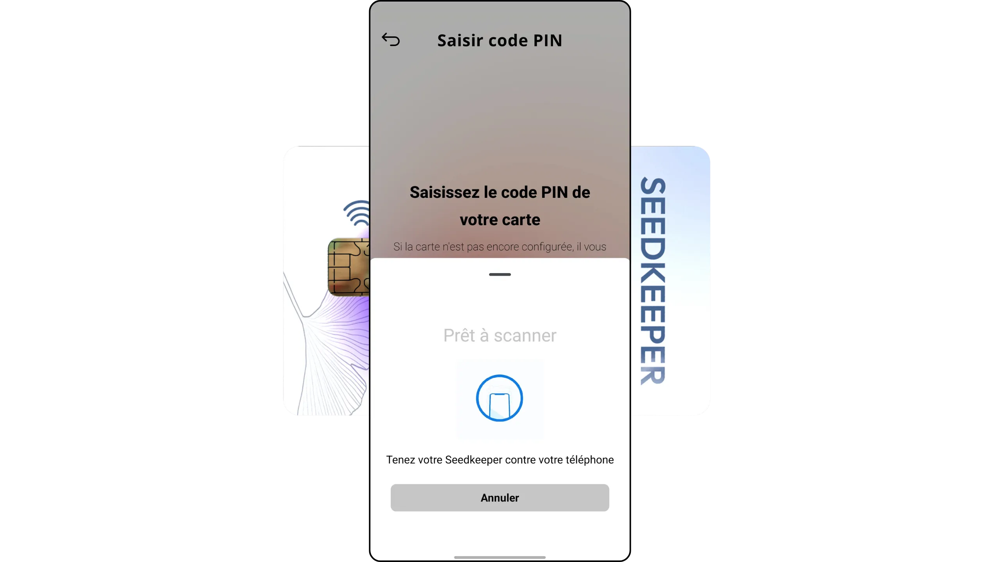

Ivyo bigushikana kuri paji y’intango, harimwo urutonde rw’amabanga yawe. Fyonda ku tudodo dutoduto dutatu turi hejuru iburyo bw’ibarabara.

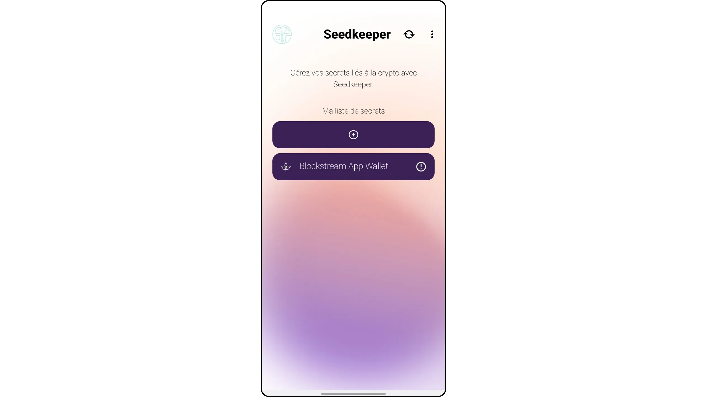

Hitamwo "*Kora ububiko*", hanyuma ukande "*Tangira*".

Injira muri PIN code y’ikarita yawe y’inyuma (Umucungezi w’imbuto n°2).

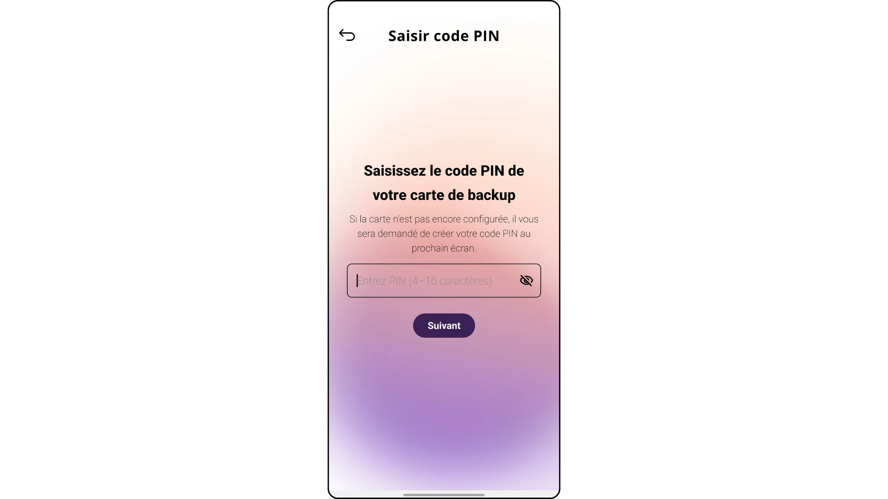

Hanyuma ushireko iyo karata.

Kora ukwo nyene n'ikarata nyamukuru (Umucungezi w'imbuto n°1), hanyuma ukande kuri "*Kora ububiko*".

Umucungezi wawe w'Imbuto n°2 ubu arimwo amabanga yose abitswe ku Mucungezi w'Imbuto n°1.

Ushobora gucapura Seedkeeper yawe n°2 kugira ngo umenye ko amabanga yakopiwe.

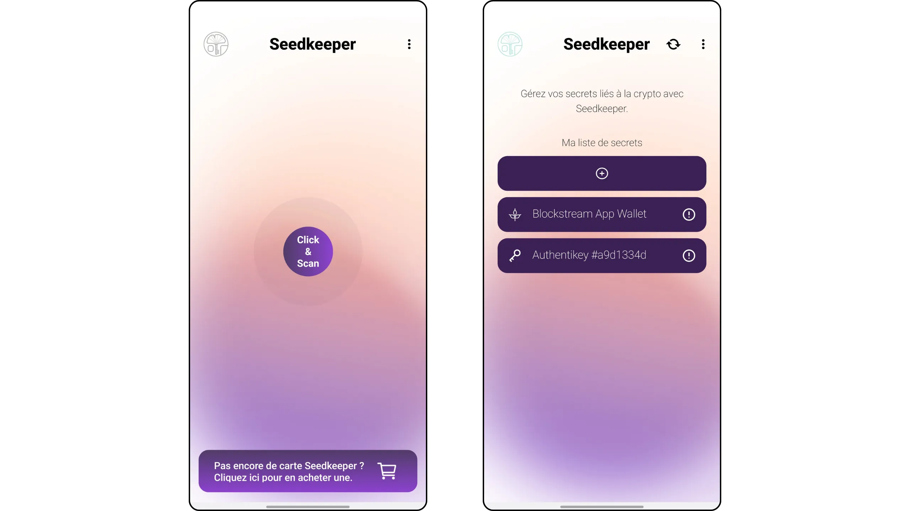

Ivyo ni vyo vyose birimwo! Ubu urazi uko ukoresha Seedkeeper kugira ngo uzigame amajambo y'ukwibuka ya Bitcoin wallet. Mu nyigisho izoza, turaza kuraba ingene wokoresha Seedkeeper kugira ubike amajambo banga yawe. Ndabatumiye kandi kumenya uko ikoreshwa hamwe na SeedSigner :

https://planb.academy/tutorials/wallet/hardware/seedkeeper-seedsigner-45cca4c4-1f22-46bb-87ae-9cddb68aa579

https://planb.academy/tutorials/computer-security/authentication/seedkeeper-password-64ffaf68-53aa-43c3-bc7a-c1dc2a17fee3

Muri iyi nyigisho, twavuze ***Ibisobanuro*** biri mu gitabu cawe ca Bitcoin incuro nyinshi. Ntimuzi ivyo arivyo? Muri ivyo, ndagusavye gufata inyigisho yacu y’ubuntu ya CYP 201, ija mu ndondoro yimbitse ku buryo bwose bujanye n’ugukoresha ibitabo vya HD!

https://planb.academy/courses/46b0ced2-9028-4a61-8fbc-3b005ee8d70f