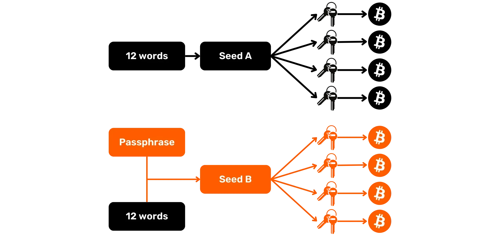
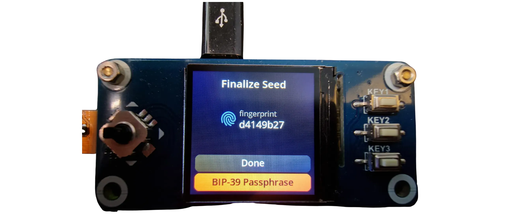
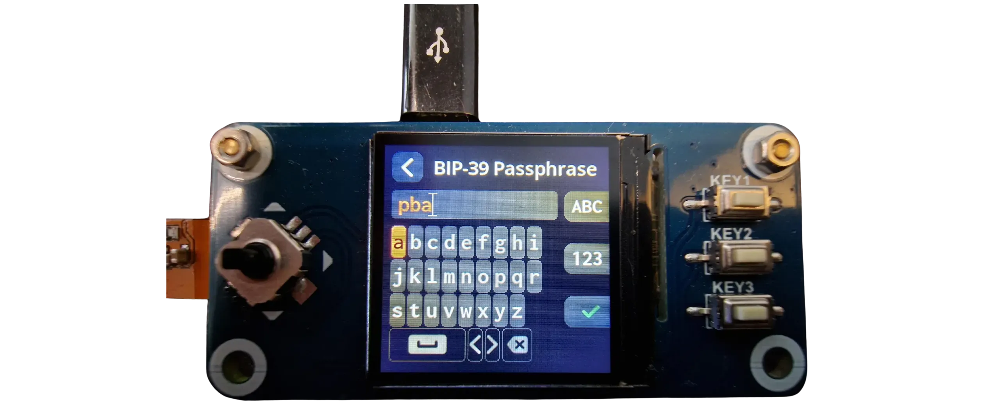
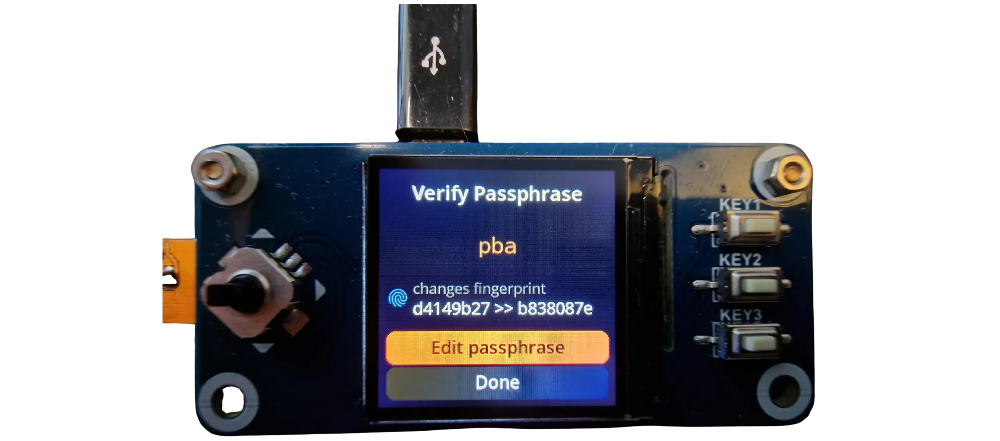
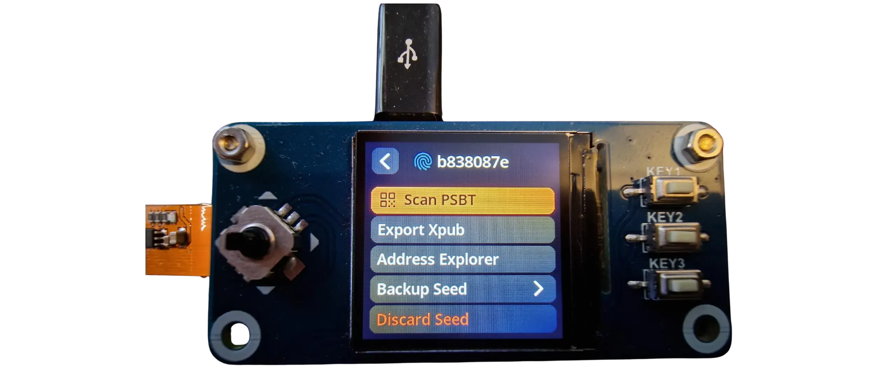

En passphrase BIP39 är ett valfritt lösenord som, i kombination med den mnemoniska frasen, ger ett extra lager av säkerhet för deterministiska och hierarkiska Bitcoin-plånböcker. I denna handledning kommer vi tillsammans att upptäcka hur man ställer in en passphrase på din Bitcoin wallet som används med en SeedSigner.

## Förutsättningar innan du lägger till en lösenfras

Innan du börjar denna handledning, om du inte är bekant med passphrase-konceptet, hur det fungerar och dess konsekvenser för din Bitcoin wallet, rekommenderar jag starkt att du läser den här andra teoretiska artikeln där jag förklarar allt (detta är mycket viktigt, eftersom att använda en passphrase utan att helt förstå hur den fungerar kan sätta dina bitcoins i fara) :

https://planb.academy/tutorials/wallet/backup/passphrase-a26a0220-806c-44b4-af14-bafdeb1adce7

Innan du påbörjar denna handledning bör du också se till att du redan har initialiserat din SeedSigner och genererat din minnesfras. Om du inte har gjort det, och din SeedSigner är helt ny, följ handledningen på Plan ₿ Academy. När du har slutfört detta steg kan du återgå till denna handledning:

https://planb.academy/tutorials/wallet/hardware/seedsigner-2b274bff-6fc8-407a-92d7-f6ec4d1fadfb

## Hur lägger jag till en passphrase i SeedSigner?

Om du lägger till en passphrase till din portfölj som hanteras via SeedSigner skapas en helt ny portfölj som genererar en helt separat uppsättning nycklar. Om du redan har en portfölj som innehåller satss kommer du därför inte längre att kunna komma åt den med passphrase, eftersom den genererar en helt annan portfölj.

För att använda en passphrase på din SeedSigner, slå på enheten och skanna din SeedQR som vanligt. SeedSigner kommer då att visa fingeravtrycket för din nuvarande wallet, motsvarande den **utan passphrase**. wallet med passphrase kommer att ha ett annat fingeravtryck.

Klicka på knappen `BIP-39 Passphrase`.

Ange sedan den passphrase som du väljer i det angivna fältet med hjälp av skärmtangentbordet. Se till att göra en eller flera fysiska säkerhetskopior (papper eller metall): förlust av denna passphrase kommer att leda till permanent förlust av tillgång till dina bitcoins. ** För att återställa en wallet är både den mnemoniska koden och passphrase nödvändiga ** Om någon av dem går förlorad kommer dina bitcoins att blockeras oåterkalleligt.

När du har fyllt i din post, validera genom att trycka på "KEY3" -knappen längst ner till höger på SeedSigner.

*I det här exemplet använde jag passphrase `pba`. I ditt fall bör du dock se till att du väljer en robust passphrase. För att ta reda på hur man definierar en optimal passphrase, se denna andra artikel:*

https://planb.academy/tutorials/wallet/backup/passphrase-a26a0220-806c-44b4-af14-bafdeb1adce7

SeedSigner visar sedan det nya fingeravtrycket för din passphrase wallet. Gör flera kopior av detta fingeravtryck: det är viktigt när du använder en wallet med passphrase, eftersom det gör att du kan kontrollera, varje gång du anger passphrase, att du inte har gjort några skrivfel och att du kommer åt rätt wallet.

Om jag till exempel i mitt fall av misstag skriver ner passphrase `Pba` när jag startar SeedSigner istället för `pba`, kommer denna enkla ändring från gemener till versaler att resultera i skapandet av en helt annan portfölj än den jag vill ha tillgång till.

Detta fingeravtryck utgör ingen risk för säkerheten eller sekretessen för din wallet. Det avslöjar inte någon information, offentlig eller privat, om dina nycklar. Så till skillnad från mnemoniken och passphrase kan du spara fingeravtrycket på ett digitalt medium. Jag rekommenderar att du förvarar en kopia på flera ställen: på ett papper, i en lösenordshanterare osv.

När du har sparat ditt fingeravtryck klickar du på "Klar".

Du har då tillgång till alla funktioner i din portfölj, precis som på en klassisk SeedSigner.

Du kan nu importera keystore till Sparrow Wallet och använda din wallet som vanligt. Varje gång du startar om måste du både skanna din SeedQR och skriva in din passphrase igen med tangentbordet, som vi gjorde här.

Innan du faktiskt använder din wallet med passphrase rekommenderar jag starkt att du utför ett helt tomt återställningstest. På så sätt kan du bekräfta att dina säkerhetskopior av den mnemotekniska frasen och passphrase är giltiga. För att lära dig hur du utför denna kontroll, se följande handledning:

https://planb.academy/tutorials/wallet/backup/recovery-test-5a75db51-a6a1-4338-a02a-164a8d91b895