*Gracias a [CryptoGuide](https://www.youtube.com/@CryptoGuide/) por su fork del firmware SeedSigner para soporte de tarjetas inteligentes, que utilizaremos en este tutorial


---

El Satochip es un hardware en formato de tarjeta inteligente wallet con un elemento de seguridad certificado EAL6+, una de las normas de seguridad más exigentes. Está diseñado y fabricado por la empresa belga del mismo nombre: Satochip.


Con un precio de unos 25 euros, el Satochip destaca entre la competencia por su excelente relación calidad-precio. Gracias a su chip seguro, es resistente a los ataques físicos. Además, el código fuente de su applet es totalmente de código abierto, con licencia *AGPLv3*.


Por otra parte, su formato impone ciertas limitaciones funcionales. El principal inconveniente del Satochip es la ausencia de una pantalla integrada: por tanto, los usuarios deben firmar las transacciones a ciegas, basándose únicamente en la pantalla de su ordenador.


Para superar esta debilidad, una configuración especialmente interesante es utilizarlo junto con un SeedSigner. En esta configuración, la comunicación ya no tiene lugar directamente entre el ordenador y el Satochip, sino a través de intercambios de códigos QR entre el ordenador y el SeedSigner. El SeedSigner actúa entonces como una pantalla de confianza: muestra la información que debe firmarse, mientras que la firma propiamente dicha la realiza el Satochip. A diferencia del uso convencional del SeedSigner (o incluso del uso en combinación con Seedkeeper), el seed nunca se carga en el SeedSigner. El SeedSigner se convierte así en la pantalla del Satochip, eliminando los riesgos asociados a la firma ciega.


Si miramos el problema al revés, el uso del SeedSigner con un Satochip llena una laguna importante del SeedSigner: la capacidad de almacenar y utilizar el seed dentro de un secure element.


En mi opinión, esta configuración ofrece varias ventajas sobre los monederos hardware convencionales:


- El Satochip cuesta unos 25 euros y, como el applet es de código abierto, puedes instalarlo tú mismo en una tarjeta inteligente vacía. A esto hay que añadir el coste de los componentes SeedSigner y la extensión para leer tarjetas inteligentes: dependiendo de dónde compres este hardware, el total debería oscilar entre 70 y 100 euros.
- Todo el software que interviene en la configuración es de código abierto: el firmware SeedSigner y el applet Satochip.
- Usted se beneficia de un elemento de seguridad certificado.
- La configuración puede llevarse a cabo de forma totalmente autodidacta, sin recurrir a hardware explícitamente destinado al uso de Bitcoin, lo que puede proporcionar una forma de negación plausible y resistencia a ciertas amenazas externas (incluyendo, dependiendo del país, la presión del Estado). También es una solución interesante si el acceso a los monederos de hardware comerciales está restringido o es imposible en tu región.


## 1. Material necesario


Para llevar a cabo esta configuración, necesitarás los siguientes elementos:


- El equipo habitual que necesita un SeedSigner clásico :
 - una Raspberry Pi Zero con pines GPIO,
 - 1.pantalla Waveshare de 3",
 - una cámara compatible,
 - una tarjeta microSD.


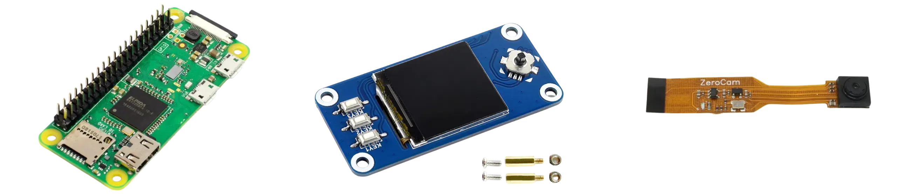


- El kit de extensión SeedSigner, disponible [en la tienda oficial de Satochip](https://satochip.io/product/seedsigner-extension-kit/), que te permite leer y escribir en una tarjeta inteligente directamente desde tu SeedSigner. Otra opción es utilizar [un lector externo de tarjetas inteligentes](https://satochip.io/product/chip-card-reader/), que se puede conectar por cable a un puerto Micro-USB de la Raspberry Pi. Sin embargo, no he probado esta solución por mí mismo;
- [Un Satochip](https://satochip.io/product/satochip/), o bien una [smartcard en blanco](https://satochip.io/product/card-for-diy-project/) en la que instalar el applet Satochip (el kit de extensión vendido por Satochip ya incluye una smartcard en blanco). El kit de extensión de Satochip también soporta el formato [SIM JavaCard](https://satochip.io/product/blank-sim-javacard-for-diy-project/). Así que puedes optar por este formato si lo prefieres.


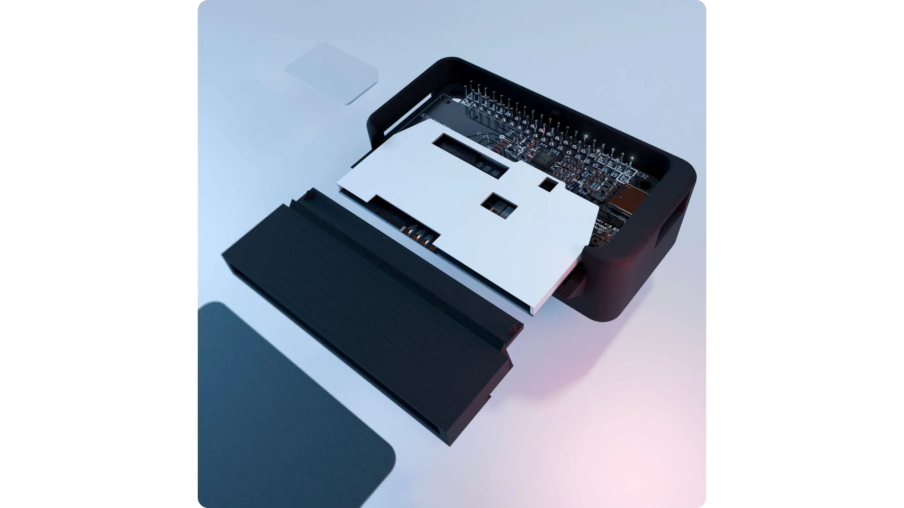


Para más detalles sobre el equipo necesario para montar un SeedSigner, consulta la Parte 1 de este otro tutorial:


https://planb.academy/tutorials/wallet/hardware/seedsigner-2b274bff-6fc8-407a-92d7-f6ec4d1fadfb

## 2. Instalar firmware


Para usar tu SeedSigner con un Satochip, necesitas instalar un firmware alternativo, diferente al del SeedSigner original, para soportar la lectura de tarjetas inteligentes. Para ello, [recomiendo utilizar fork de "**3rdIteration**"](https://github.com/3rdIteration/seedsigner). Descarga [la última versión de la imagen](https://github.com/3rdIteration/seedsigner/releases) (`.zip`) correspondiente al modelo de Raspberry Pi que estés utilizando.


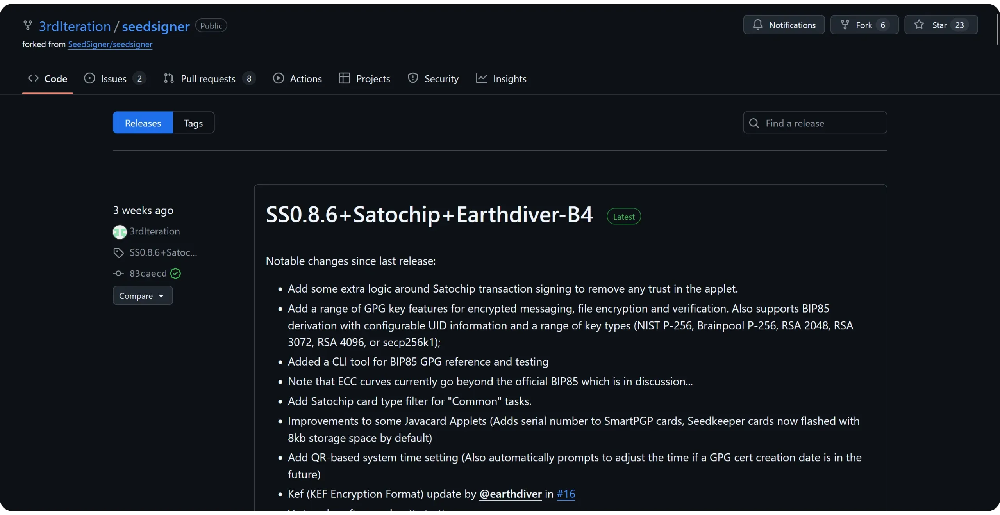


Si aún no lo tiene, descargue el software [Balena Etcher] (https://etcher.balena.io/) y, a continuación, proceda como se indica a continuación:


- Inserta la tarjeta microSD en tu ordenador;
- Lanzamiento Etcher ;
- Selecciona el archivo `.zip` que acabas de descargar;
- Selecciona la tarjeta microSD como destino;
- Haga clic en "Flash".


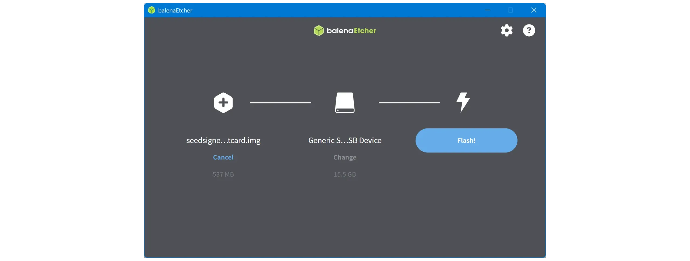


Espera a que el proceso finalice: tu microSD ya está lista para ser utilizada. Ya puedes pasar a montar tu dispositivo.


Para más detalles sobre la instalación del firmware y la verificación del software (un paso que te recomiendo encarecidamente que realices), consulta el siguiente tutorial:


https://planb.academy/tutorials/wallet/hardware/seedsigner-2b274bff-6fc8-407a-92d7-f6ec4d1fadfb

## 3. Montaje del lector de tarjetas inteligentes


Empieza instalando la cámara en la Raspberry Pi Zero, introduciéndola con cuidado en el pasador de la cámara y bloqueándola con la pestaña negra. A continuación, coloca la Pi en la parte inferior de la carcasa, asegurándote de alinear los puertos con las aberturas correspondientes.


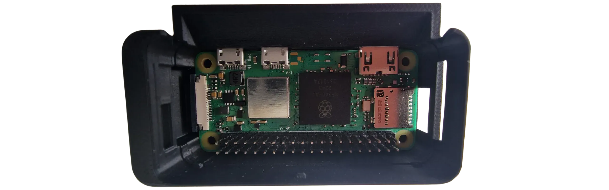


A continuación, conecta el lector de tarjetas inteligentes a los pines GPIO de la Raspberry Pi Zero.


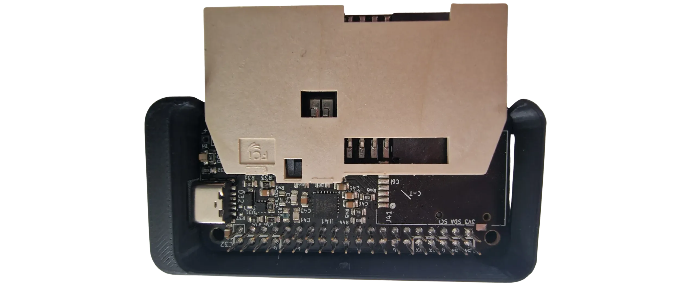


Deslice la cubierta de plástico sobre el lector de tarjetas inteligentes hasta que quede correctamente colocada.


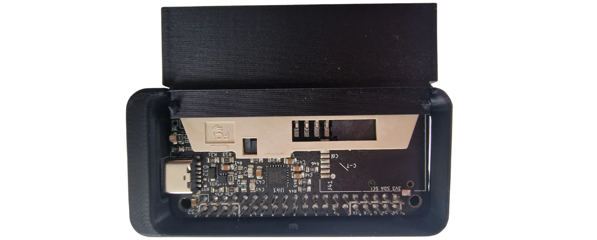


Luego añade la pantalla a los pines GPIO de la extensión.


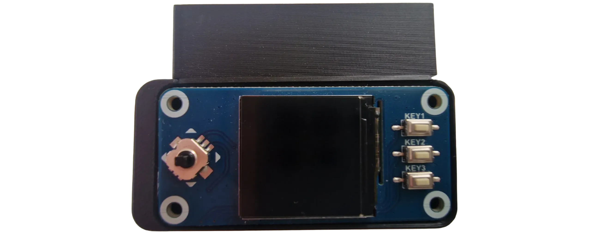


Por último, inserta la tarjeta microSD que contiene el firmware en el puerto lateral de la Raspberry Pi Zero.


Ahora puedes conectar tu SeedSigner a través del puerto Micro-USB de la Raspberry Pi Zero o a través del puerto USB-C de la extensión. Ambas opciones funcionan. Espera unos segundos a que se inicie y deberías ver la pantalla de bienvenida.


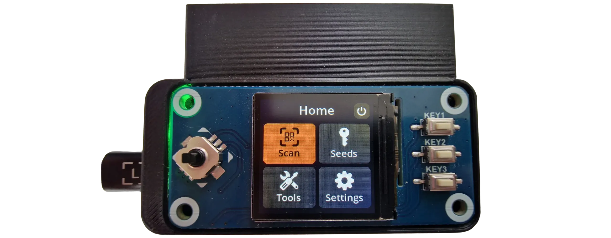


Para más detalles sobre la configuración inicial de tu SeedSigner, te recomiendo que consultes la parte 4 del siguiente tutorial:


https://planb.academy/tutorials/wallet/hardware/seedsigner-2b274bff-6fc8-407a-92d7-f6ec4d1fadfb


## 4. Flashear una tarjeta inteligente con el applet Satochip (opcional)


Si ya tienes un Satochip, puedes saltarte este paso e ir directamente al paso 4. En esta sección, veremos cómo instalar el applet Satochip en una smartcard en blanco (método DIY). El applet es simplemente un pequeño programa que se ejecuta en la tarjeta inteligente y que nos permite gestionar funciones específicas.


Para empezar, abra el menú `Herramientas > Herramientas de tarjeta inteligente` de su SeedSigner.


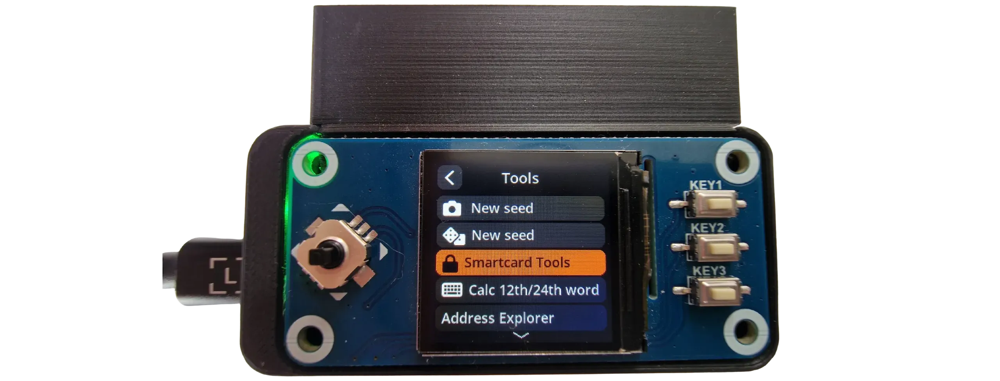


A continuación, seleccione `Herramientas DIY > Instalar Applet`.


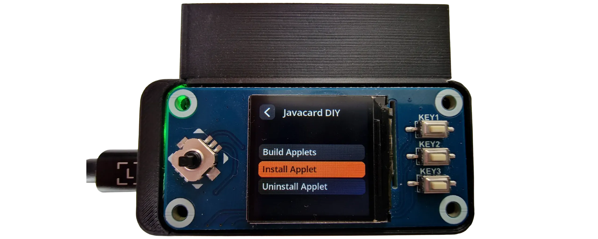


Inserte su tarjeta inteligente en el lector SeedSigner, con el chip hacia abajo, y seleccione el applet `Satochip`.


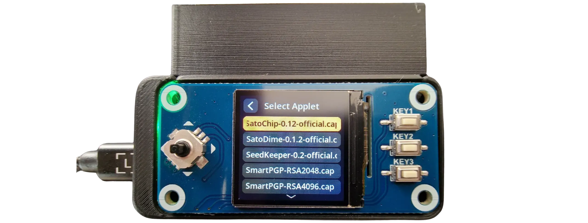


Tenga paciencia durante la instalación: el proceso puede durar varias decenas de segundos.


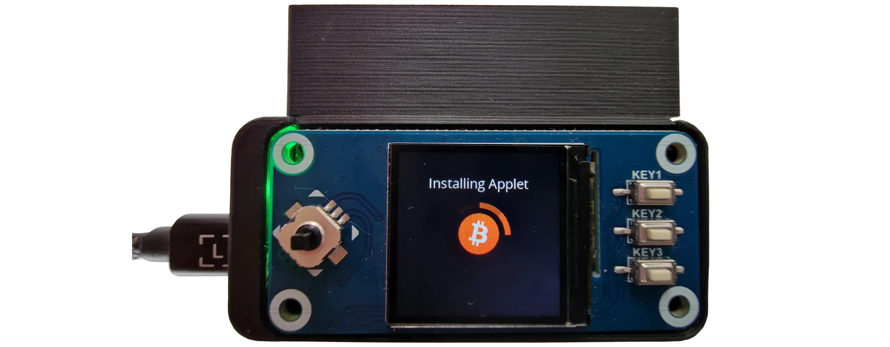


Una vez que el applet se haya instalado correctamente, puede continuar con el paso 4.


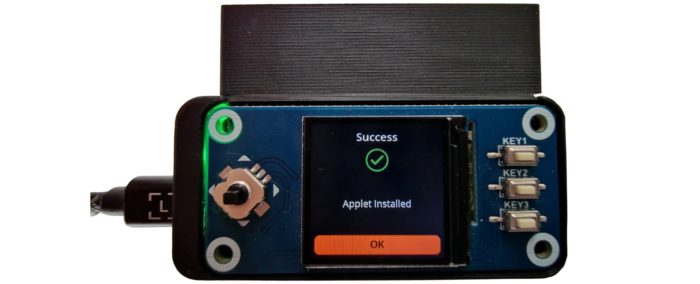


## 5. Crear y guardar seed


### 5.1. Generar seed


Ahora que ya tienes todo tu hardware y software funcionando correctamente, puedes proceder a crear tu cartera Bitcoin. Para ello, conecte su SeedSigner, luego generate su seed como con un SeedSigner convencional, ya sea tirando los dados o tomando una foto:


- Ve al menú `Herramientas > Cámara / Tiradas de Dados`;
- A continuación, sigue el proceso de generación de entropía según el método elegido;
- Por último, haz una copia de seguridad de la seed en un soporte físico y comprueba la copia de seguridad cuidadosamente.


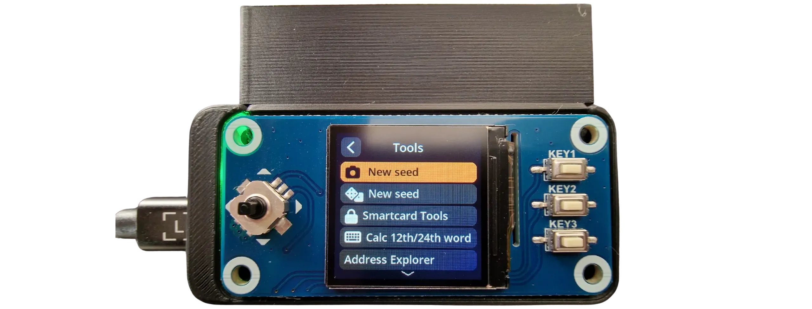


Si desea ver los detalles de este procedimiento, siga la parte 5 de este tutorial:


https://planb.academy/tutorials/wallet/hardware/seedsigner-2b274bff-6fc8-407a-92d7-f6ec4d1fadfb

### 5.2. Guardar el seed en un Seedkeeper


Una vez generado el seed, es la única vez que reside en la RAM del SeedSigner. En mi caso, quiero guardarlo en un [Seedkeeper](https://satochip.io/product/seedkeeper/), otro producto Satochip diseñado para almacenar secretos. Utilizaré este dispositivo como último recurso, en caso de pérdida de mi Satochip.


La estrategia de copia de seguridad elegida aquí depende de tus preferencias, pero es imprescindible tener al menos una copia de tu frase mnemotécnica, ya sea en soporte físico (papel o metal) o, como aquí, en un Seedkeeper. También puede multiplicar el número de copias de seguridad según sus necesidades. Para más información sobre estrategias de copia de seguridad de carteras, le sugiero que lea este tutorial :


https://planb.academy/tutorials/wallet/backup/backup-mnemonic-22c0ddfa-fb9f-4e3a-96f9-46e2a7954270

Para hacer una copia de seguridad de su seed en un Seedkeeper, vaya directamente al menú `Backup Seed`.


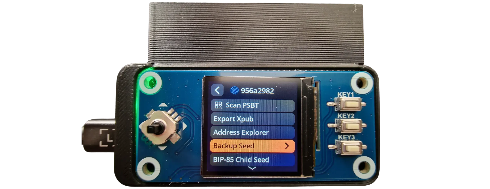


A continuación, inserta tu Seedkeeper en el lector de tarjetas inteligentes y selecciona `A SeedKeeper`.


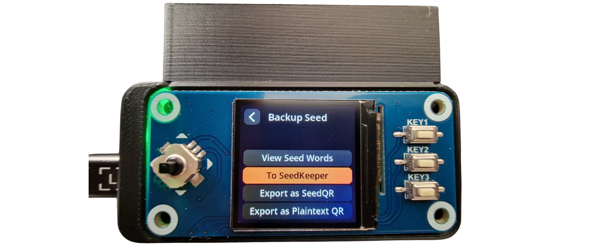


Introduce tu PIN para desbloquearlo.


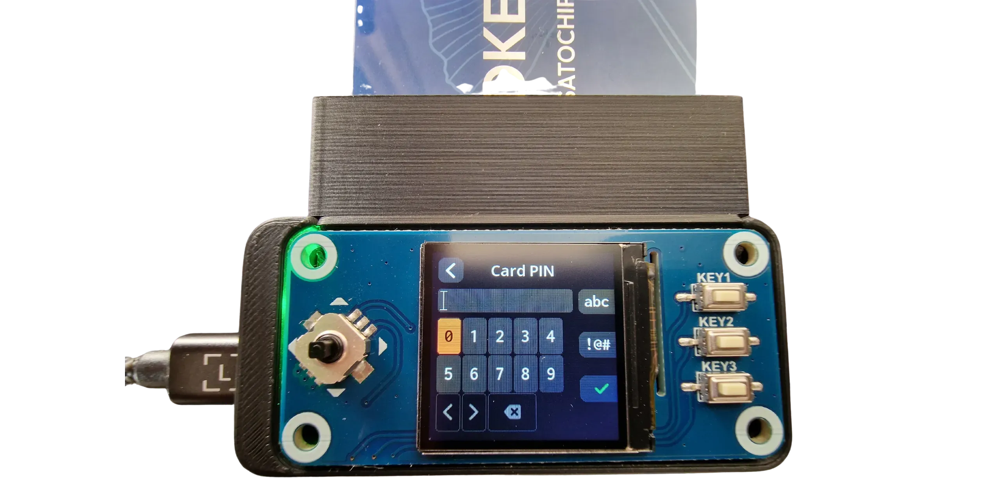


Elija una `Etiqueta` para identificar fácilmente sus diferentes secretos almacenados en Seedkeeper. Puede, por ejemplo, mantener simplemente la impresión wallet o indicar explícitamente `Seed`. La elección depende de sus preferencias y riesgos.


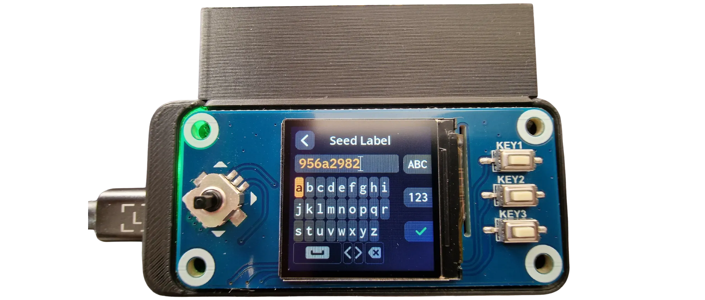


Si su estrategia de copia de seguridad se basa únicamente en este Seedkeeper, le recomiendo encarecidamente que ejecute ahora una prueba de recuperación en vacío y, a continuación, compare las huellas digitales para comprobar que la copia de seguridad funciona.


https://planb.academy/tutorials/wallet/backup/recovery-test-5a75db51-a6a1-4338-a02a-164a8d91b895

El código PIN de Seedkeeper debe ser lo más largo y aleatorio posible, para evitar intentos de fuerza bruta en caso de compromiso físico de la tarjeta. También debes guardar una copia de seguridad de este código PIN, almacenada en un lugar separado de Seedkeeper. Sin este PIN, no podrás acceder a la mnemónica almacenada en Seedkeeper, y tus bitcoins se perderán permanentemente.


### 5.3. Ahorra seed en el Satochip


Ahora que su cartera ha sido generada, guardada y verificada, vamos a transferirla al Satochip. Para ello, asegúrate de que la seed está cargada en la RAM del SeedSigner. A continuación, vaya a `Herramientas > Herramientas de tarjeta inteligente > Funciones de Satochip`.


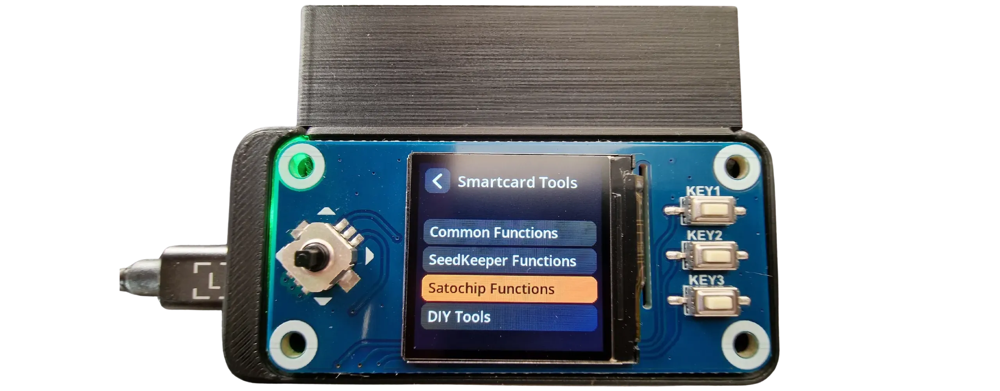


Inserte su Satochip en el lector de tarjetas inteligentes y seleccione "Inicializar con semilla".


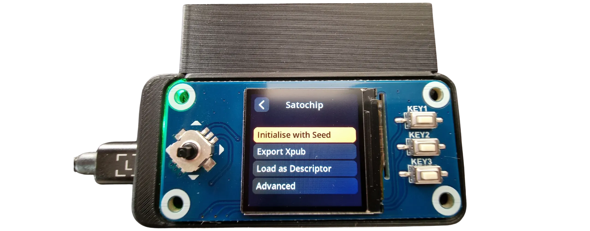


El dispositivo le pedirá que introduzca el código PIN de Satochip; como la tarjeta es nueva y no está inicializada, aún no existe ningún PIN. Introduce cualquier código para saltarte este paso (no es de bloqueo).


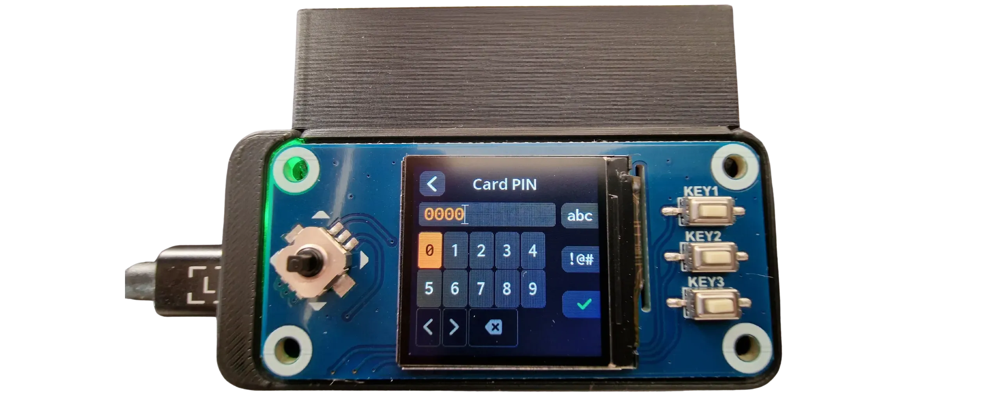


El SeedSigner detecta que tu Satochip no ha sido inicializado. Haga clic en `Entiendo` para confirmar.


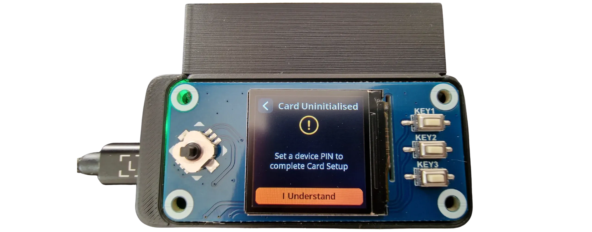


A continuación, puede configurar el código PIN Satochip, de 4 a 16 caracteres. Para reforzar la seguridad de su wallet, elija un código largo y aleatorio: es la única protección contra el acceso físico a su frase mnemotécnica.


No olvide guardar este PIN en cuanto lo cree, ya sea en un gestor de contraseñas seguro o en un soporte físico, según su estrategia personal. En este último caso, asegúrese de no guardar nunca el soporte que contiene el PIN en el mismo lugar que su Satochip, de lo contrario la protección será inútil. Es importante tener una copia de seguridad: **Sin este PIN, no podrás acceder a tu seed, y tus bitcoins se perderán para siempre**.


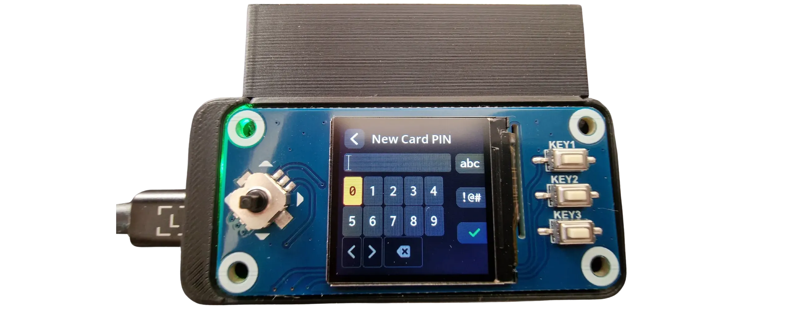


A continuación, el SeedSigner te preguntará qué seed quieres importar al Satochip. Selecciona aquel cuya huella dactilar coincida con la cartera que acabas de crear.


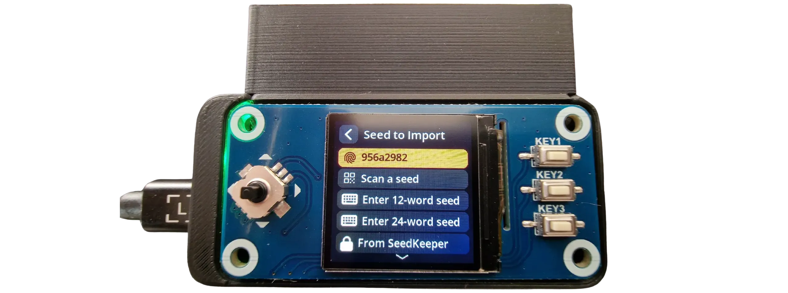


Tu seed ya está importado en el Satochip.


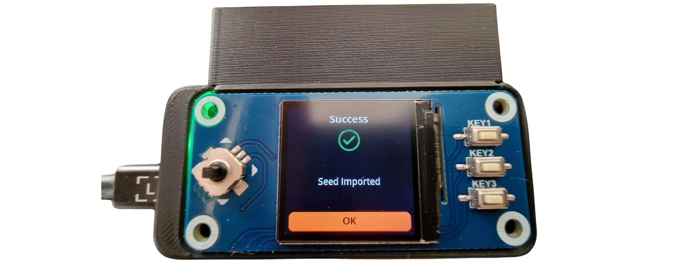


Ya puedes apagar tu SeedSigner.


Si desea utilizar un BIP39 de passphrase para mejorar la seguridad de su wallet, consulte la parte 6 de este tutorial:


https://planb.academy/tutorials/wallet/hardware/seedkeeper-seedsigner-45cca4c4-1f22-46bb-87ae-9cddb68aa579

## 6. Importar wallet en Sparrow


Ahora que su cartera está en marcha, importaremos su información pública (el "*keystore*") a Sparrow Wallet u otro software de gestión de carteras. Este software se utilizará para crear, distribuir y realizar el seguimiento de sus operaciones. Sin embargo, no podrá firmarlas, ya que sólo el Satochip (y cualquier copia de seguridad) posee las claves privadas necesarias para esta operación.


### 6.1 Preparación del SeedSigner y del Satochip


Inserta la tarjeta microSD que contiene el sistema operativo y enciende tu SeedSigner. De momento, no puede hacer nada, ya que aún no conoce tu seed. Tendrás que empezar por insertar el Satochip en el lector de tarjetas inteligentes, ya que es el que contiene tu seed.


Desde la pantalla de inicio, acceda al menú `Herramientas > Herramientas tarjeta inteligente > Funciones Satochip`.


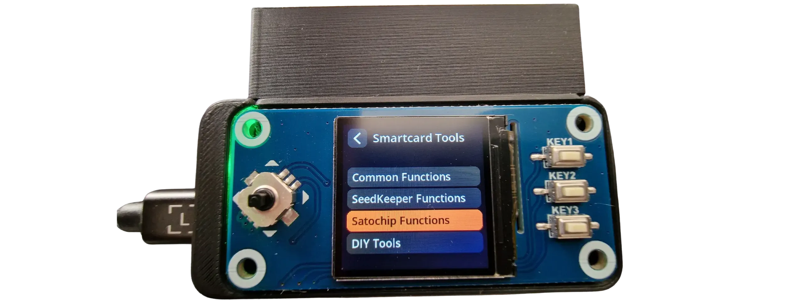


A continuación, haga clic en `Exportar Xpub`.


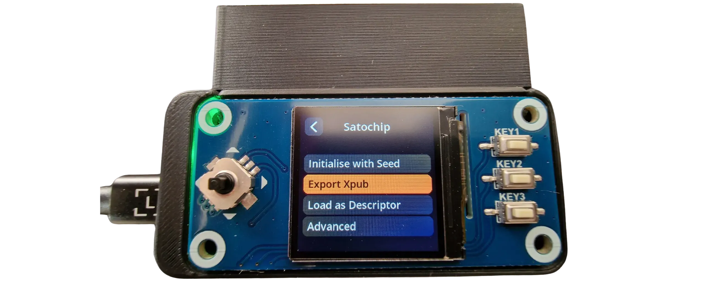


Seleccione el tipo de cartera. En nuestro caso, se trata de una cartera única: seleccione `Single Sig`.


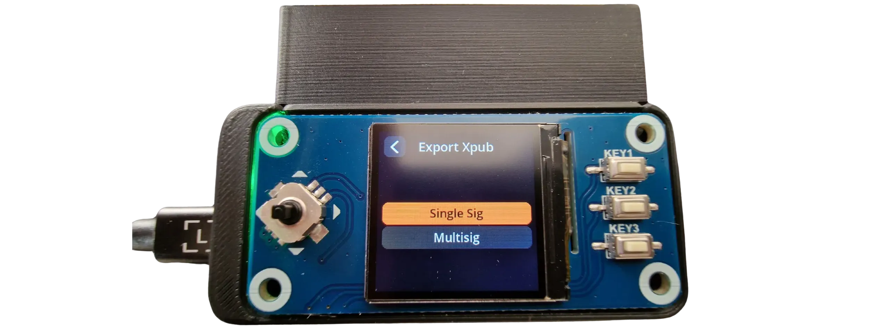


Luego viene la elección del estándar de scripting. Elija el más reciente: `Native SegWit`.


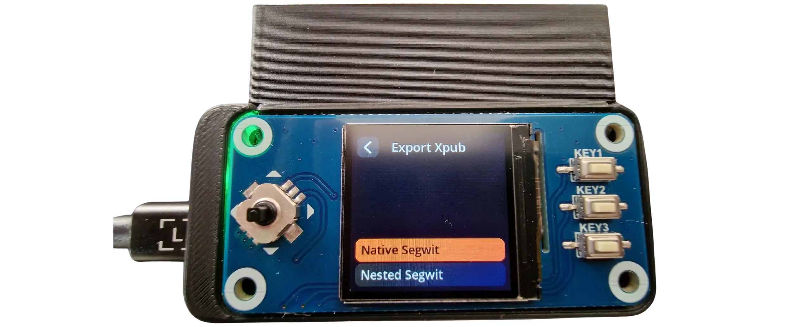


Por último, seleccione el `Coordinador`, es decir, el software de gestión de carteras que desea utilizar. En este caso, utilizaremos Sparrow Wallet.


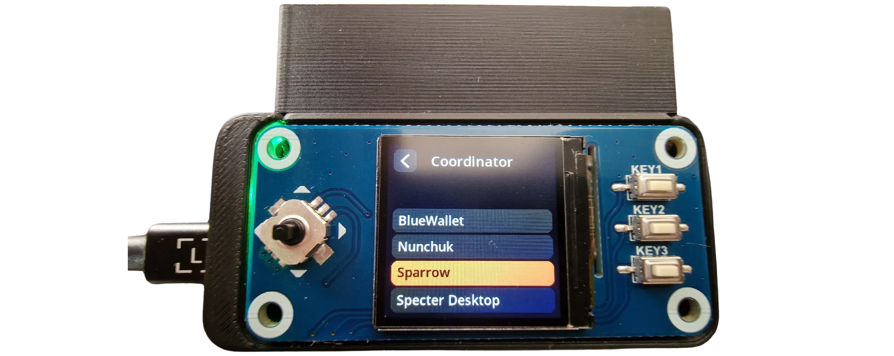


Aparece un mensaje de advertencia: esto es perfectamente normal. La clave pública extendida (`xpub`) te permite ver todas las direcciones derivadas de tu seed (en la primera cuenta). Sin embargo, no da acceso a tus fondos: su divulgación comprometería tu privacidad, pero no la seguridad de tus bitcoins. En otras palabras, te permite observar tus saldos, pero no gastarlos.


Haga clic en "Comprendo".


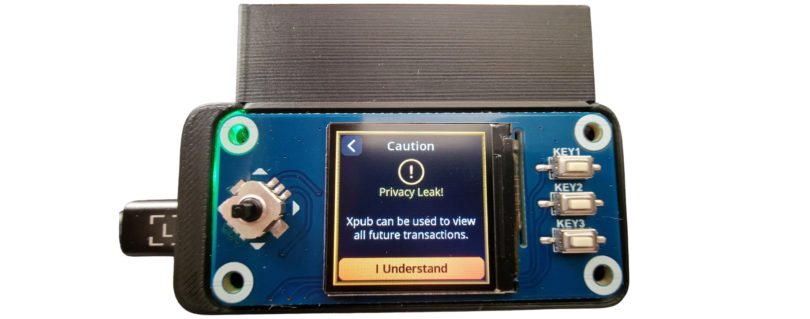


A continuación, introduce el código PIN de tu Satochip para desbloquearlo. Se trata del código que definiste y guardaste en el paso 5.


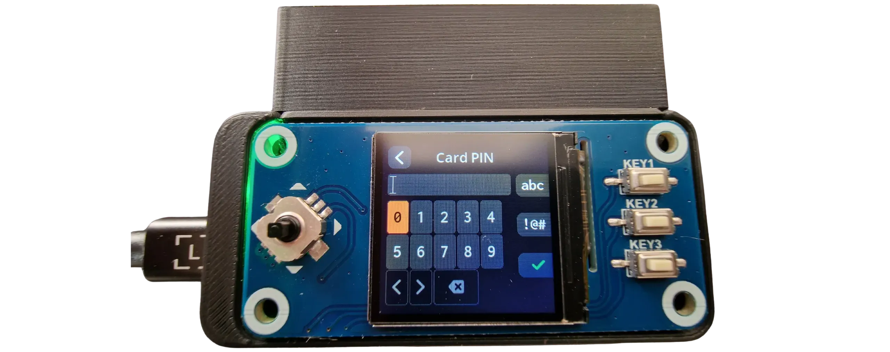


Por último, haga clic en `Exportar Xpub` si está satisfecho con la información mostrada.


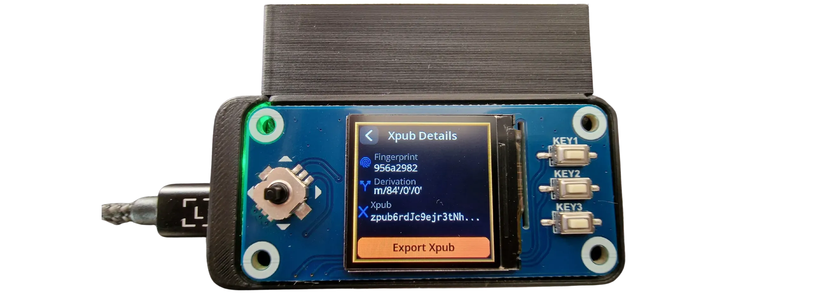


El SeedSigner genera entonces su xpub en forma de código QR dinámico, que contiene todos los datos que necesita para gestionar su cartera en Sparrow Wallet. Puede ajustar el brillo de la pantalla mediante el joystick para facilitar el escaneado del código QR.


### 6.2 Importar una nueva cartera en Sparrow Wallet


Asegúrese de que el software Sparrow Wallet está instalado en su ordenador. Si no sabes cómo descargarlo, comprobar su autenticidad e instalarlo correctamente, consulta nuestro tutorial completo sobre el tema..:


https://planb.academy/tutorials/wallet/desktop/sparrow-c674e2ac-d46f-4c82-92a7-7d1b0e262f5d

En su ordenador, abra Sparrow Wallet y, a continuación, en la barra de menús, haga clic en `Archivo → Importar Wallet`.


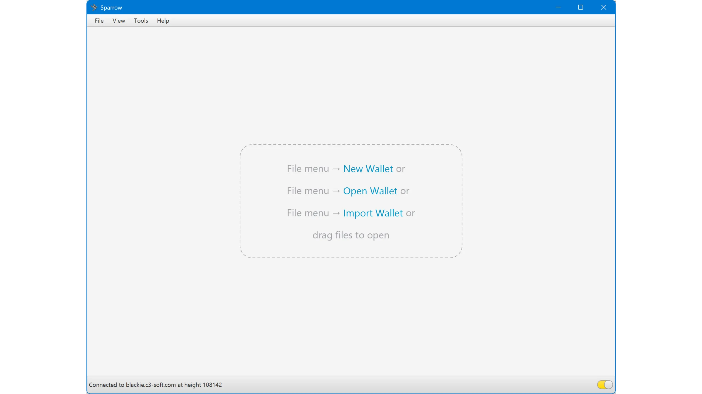


Desplácese hasta `SeedSigner` y seleccione `Escanear...`. Tu webcam se activará: escanea el código QR dinámico que aparece en la pantalla de SeedSigner.


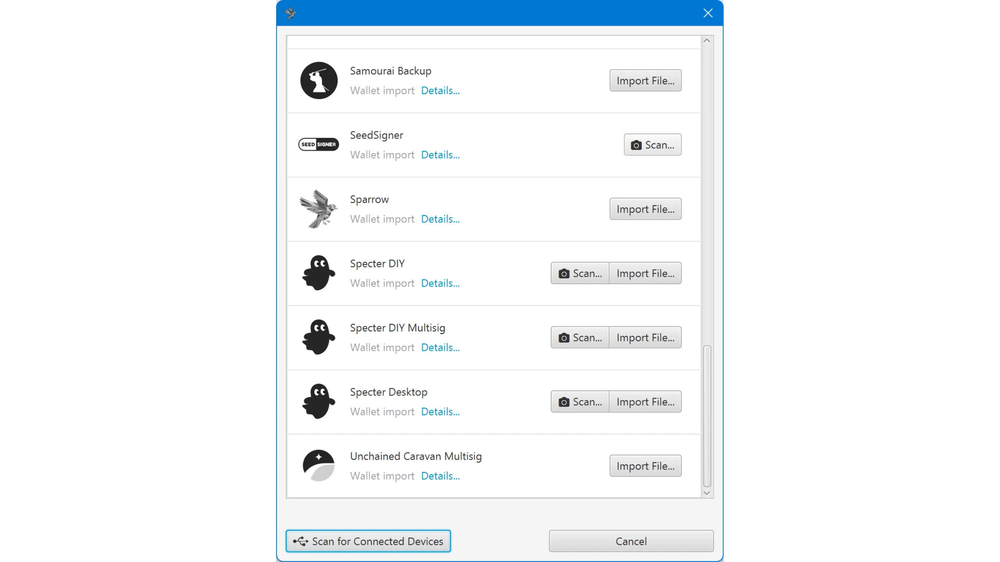


Asigne un nombre a su cartera y haga clic en `Crear Wallet`. A continuación, Sparrow le pedirá que establezca una contraseña para bloquear el acceso local a esta wallet. Elija una contraseña segura: protege sus datos en Sparrow (claves públicas, direcciones, etiquetas e historial de transacciones). Sin embargo, esta contraseña no es necesaria para restaurar la wallet en el futuro: sólo lo será su frase mnemotécnica (y posiblemente su passphrase).


Te recomiendo que guardes esta contraseña en un gestor de contraseñas, para evitar perderla.


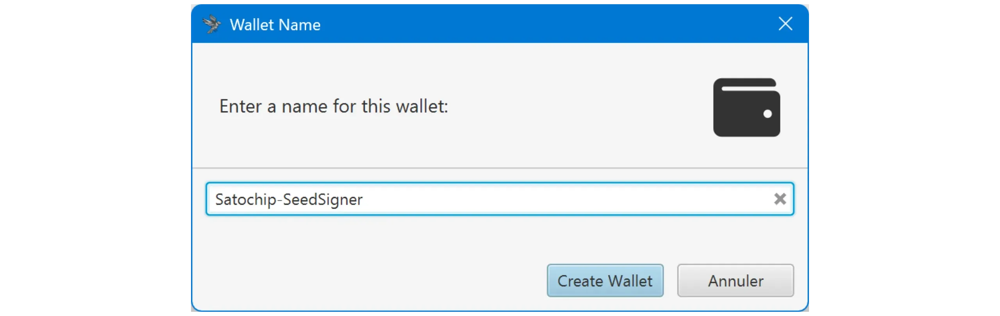


Su almacén de claves se ha importado correctamente.


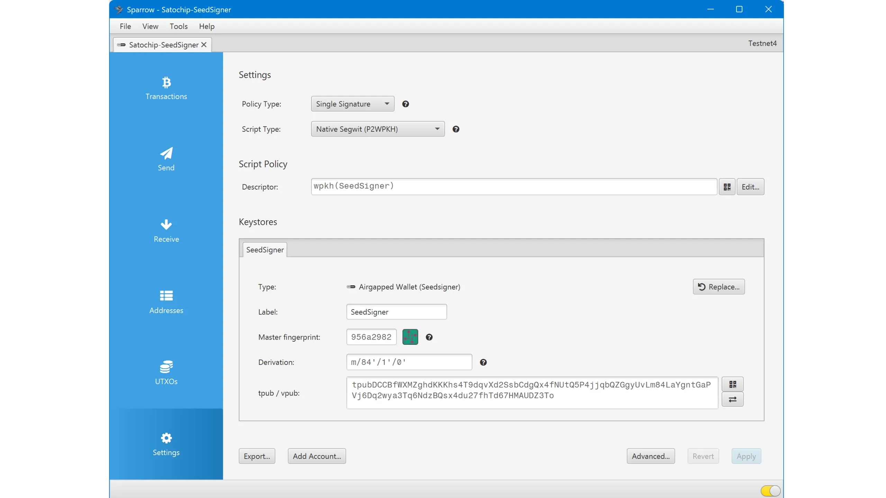


Ahora compruebe que la `Huella maestra` que aparece en Sparrow Wallet coincide con la encontrada previamente en su SeedSigner.


A continuación, el SeedSigner le pedirá que escanee una dirección de recepción aleatoria de su Sparrow wallet para confirmar la validez de la importación.


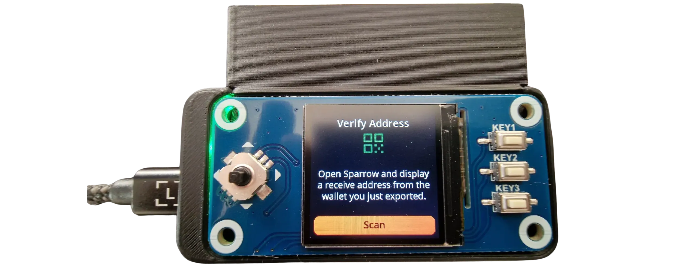


Su Satochip (a través de SeedSigner) y Sparrow Wallet están ahora conectados de forma segura. Sparrow actúa como una interfaz de gestión completa, mientras que el Satochip sigue siendo el único dispositivo capaz de firmar sus transacciones. Ya está listo para recibir y enviar bitcoins en una configuración totalmente protegida.


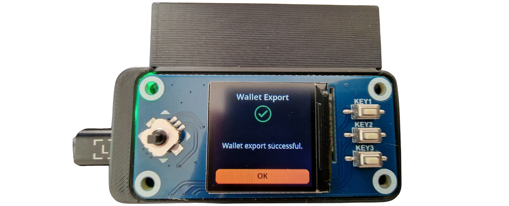


## 7. Recibir y enviar bitcoins


Tu Satochip y Sparrow Wallet están ahora configurados para trabajar juntos. En esta sección, te explicaremos paso a paso cómo recibir y enviar bitcoins en este modo.


### 7.1 Recibir bitcoins


#### 7.1.1 Generar una dirección de recepción


En su ordenador, abra Sparrow Wallet y desbloquee su `Satochip-SeedSigner` wallet utilizando su contraseña. Compruebe que el software está conectado a un servidor (indicador en la parte inferior derecha). A continuación, en la barra lateral, haga clic en `Recibir`.


Aparecerá una nueva dirección Bitcoin. Encontrará :


- La dirección en formato de texto (empezando por `bc1q...` si utiliza P2WPKH, como en este ejemplo) ;
- El código QR asociado ;
- Un campo `Label`, útil para rastrear sus transacciones.


Te recomiendo encarecidamente que añadas una etiqueta a cada recibo de bitcoin en tu wallet. Esto te ayudará a identificar fácilmente la procedencia de cada UTXO y a gestionar mejor tu privacidad. Para saber más sobre este importante tema, consulta la formación dedicada en Plan ₿ Academy :


https://planb.academy/courses/65c138b0-4161-4958-bbe3-c12916bc959c

Para añadir una etiqueta, basta con introducir un nombre en el campo `Etiqueta` y confirmar.


Por ejemplo:


```txt
Label : Sale of the Raspberry Pi Zero
```


Su dirección está ahora asociada a esta etiqueta en todas las secciones de Sparrow.


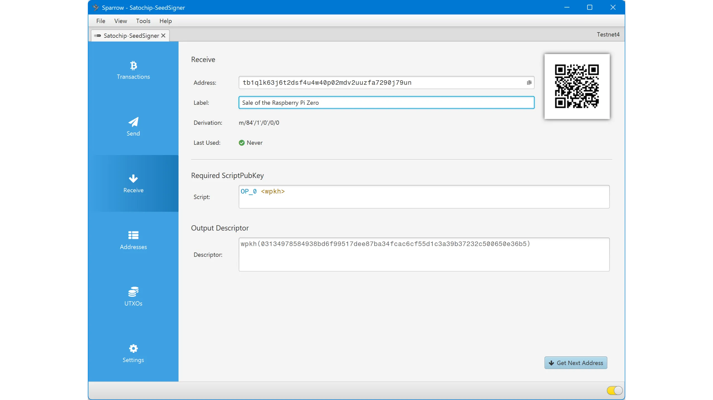


#### 7.1.2 Verificación de Address en el SeedSigner


Antes de comunicar su dirección de recepción al pagador, es importante comprobar que pertenece a su seed. Este paso garantiza que su Satochip podrá firmar las transacciones asociadas a esta dirección. También evita posibles ataques en los que Sparrow mostraría una dirección fraudulenta. Tenga en cuenta que Sparrow se ejecuta en un entorno inseguro (su ordenador), cuya superficie de ataque es mucho mayor que la de su Satochip, que está totalmente aislada. Por eso nunca debes confiar ciegamente en las direcciones mostradas en Sparrow antes de comprobarlas en tu hardware wallet.


En Sparrow, haga clic en el código QR de la dirección para ampliarlo: entonces se mostrará a pantalla completa.


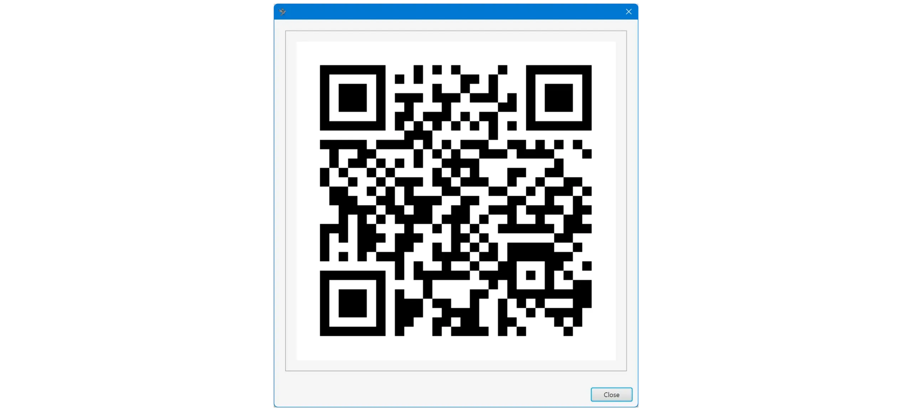


En su SeedSigner, inserte el Satochip en el lector y, en el menú principal, seleccione "Escanear". Escanee el código QR que aparece en su ordenador y seleccione "Usar tarjeta Satochip".


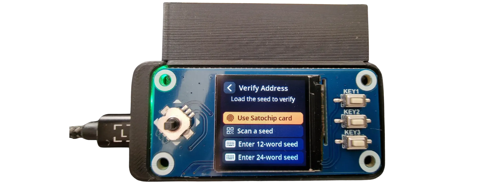


A continuación, confirma el tipo de script utilizado (en este caso, `Native SegWit`), introduce el código PIN de Satochip para desbloquearlo y valida la información de `xpub`.


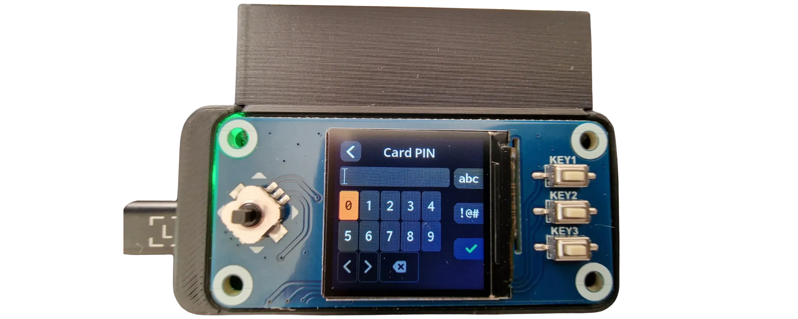


Si la dirección escaneada coincide con la derivada de su seed, el SeedSigner mostrará el mensaje: `Address Verificado`.


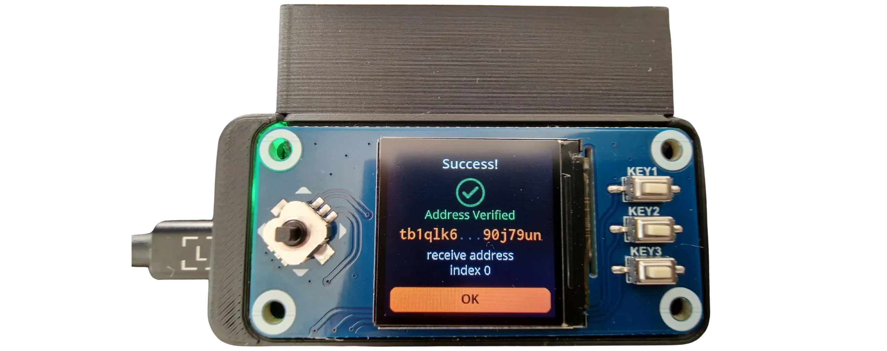


Así podrá estar seguro de que la dirección pertenece a su cartera.


#### 7.1.3 Recepción de fondos


Ahora puede transmitir esta dirección en forma de texto o a través de su código QR a la persona o departamento que necesite enviarle satss. Una vez que la transacción se haya difundido en la red, aparecerá en la pestaña `Transacciones` de Sparrow Wallet.


### 7.2 Enviar bitcoins


El envío de bitcoins con la configuración Satochip-SeedSigner implica 3 pasos:


- Creación de transacciones en Sparrow ;
- Firmando esta transacción en el Satochip, a través del SeedSigner ;
- Por último, la transacción se difunde por la red desde Sparrow.


Todos los intercambios entre los dos dispositivos se realizan exclusivamente a través de códigos QR.


#### 7.2.1 Creación de la transacción en Sparrow


En Sparrow Wallet, puede crear una transacción haciendo clic en la pestaña `Enviar` de la barra lateral izquierda. Sin embargo, yo prefiero utilizar la pestaña `UTXOs`, que te permite practicar el *Control Coin*. Este método ofrece un control preciso sobre los UTXOs gastados, para limitar la información revelada durante tus transacciones.


En la pestaña `UTXOs`, seleccione las monedas que desea gastar y haga clic en `Send Selected`.


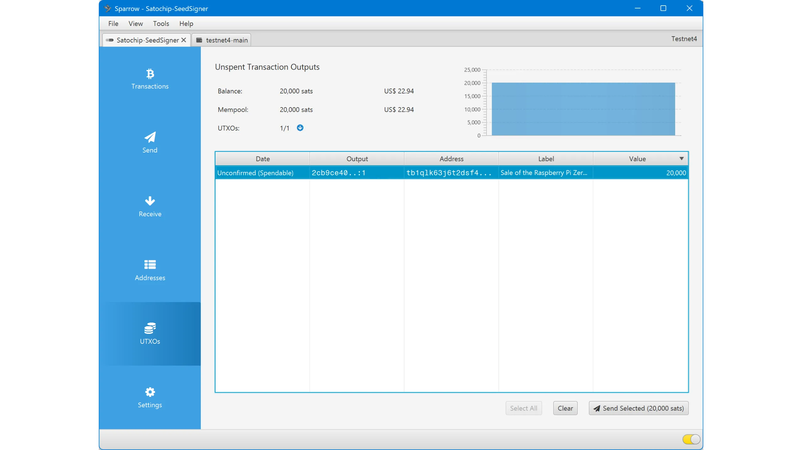


A continuación, rellene los campos de la transacción:


- En "Pagar a", pegue la dirección del destinatario o escanee su código QR con el icono de la cámara;
- En `Etiqueta`, añada una etiqueta para rastrear este gasto;
- En "Importe", introduzca el importe que desea enviar;
- Por último, elija la tasa de carga en función de las condiciones actuales de la red (las estimaciones están disponibles en [mempool.space](https://mempool.space/)).


Una vez que haya rellenado todos los campos, revise la información detenidamente y, a continuación, haga clic en `Crear transacción >>`.


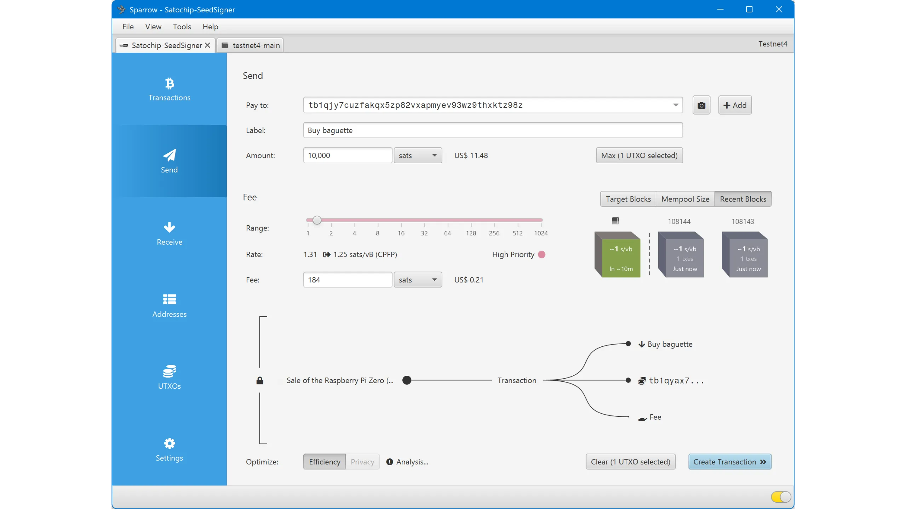


Compruebe por última vez que los detalles de la transacción son correctos y, a continuación, haga clic en "Finalizar transacción para firmar".


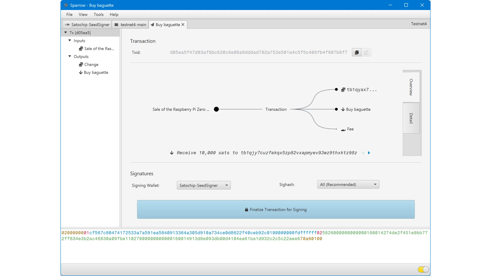


La transacción ya está lista, pero aún no se ha firmado. Para mostrar el [PSBT (*Partially Signed Bitcoin Transaction*)](https://planb.academy/en/resources/glossary/psbt) como código QR, haga clic en `Show QR`.


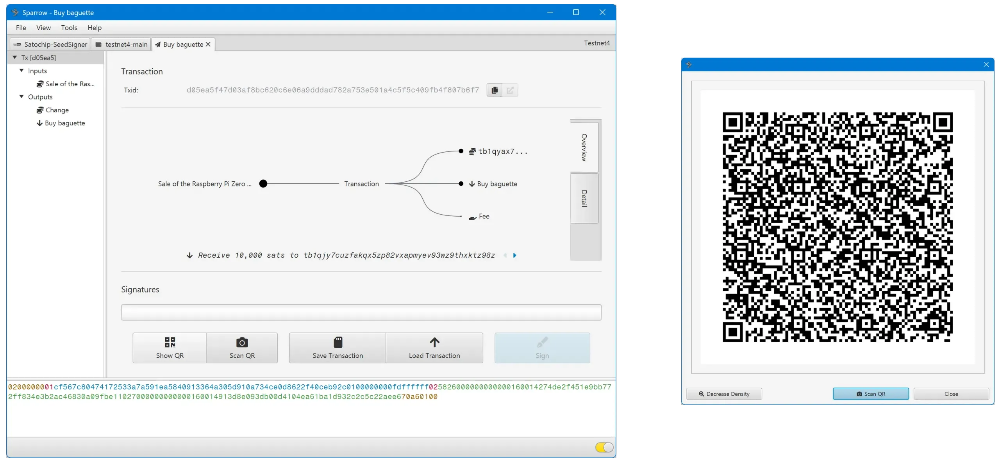


#### 7.2.2 Firma de la transacción con Satochip


Enciende tu SeedSigner e inserta tu Satochip como de costumbre. En la pantalla de inicio, selecciona "Escanear" y escanea el código QR que aparece en Sparrow.


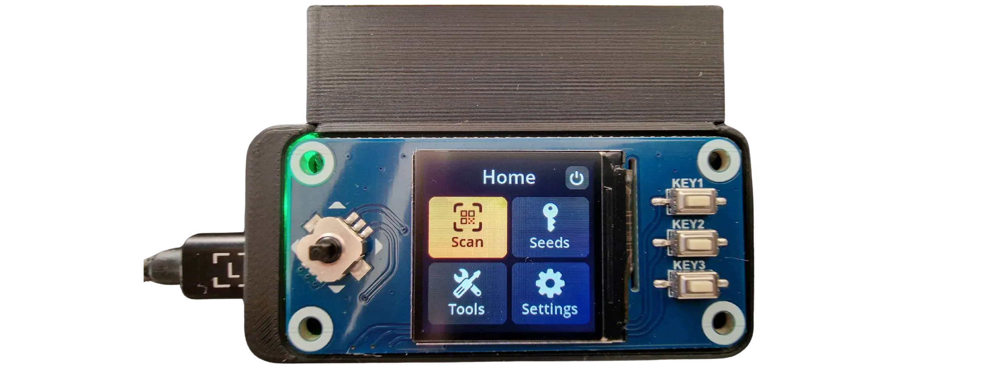


Seleccione la opción `Usar tarjeta Satochip`.


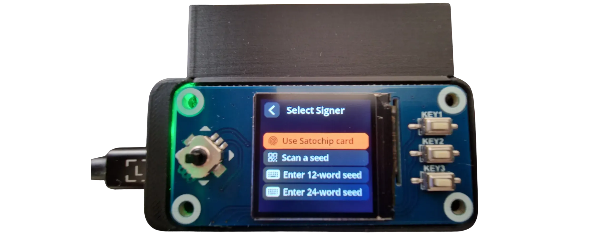


Introduzca su código PIN para desbloquear la tarjeta inteligente.


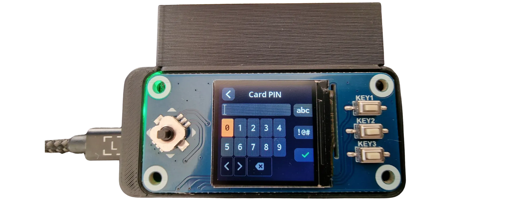


El SeedSigner detecta que se trata de un PSBT y muestra un resumen de la transacción:


   - El importe enviado,
   - Direcciones de destino,
   - Costes de transacción asociados.


Haga clic en "Revisar detalles" y examine toda la información directamente en la pantalla de SeedSigner. Los puntos más importantes a comprobar son los importes enviados, las direcciones de destino y las comisiones de transacción.


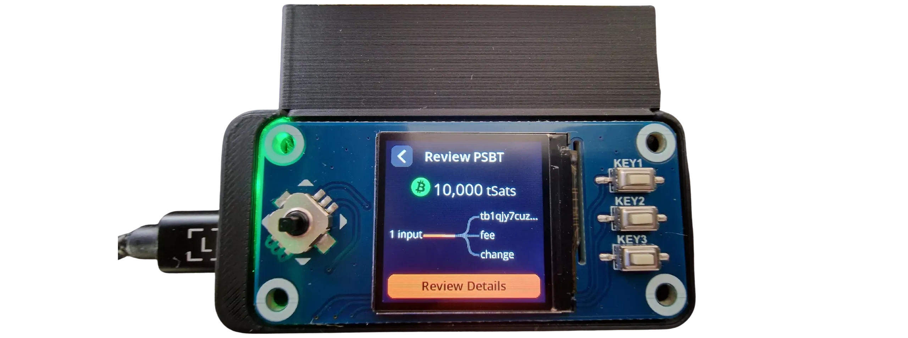


Si todo está en orden, seleccione `Aprobar PSBT` para firmar la transacción utilizando el Satochip.


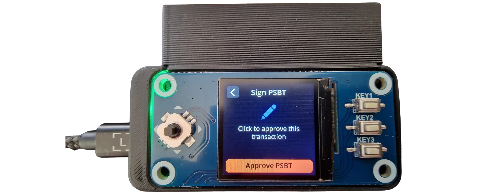


Una vez completada la firma, SeedSigner genera un nuevo código QR que contiene la transacción firmada, lista para ser escaneada por Sparrow.


#### 7.2.3 Transmisión de la transacción desde Sparrow


Ahora que la transacción está firmada y validada, sólo queda difundirla en la red Bitcoin para que un minero pueda incluirla en un bloque. En Sparrow, haz clic en `Escanear QR`.


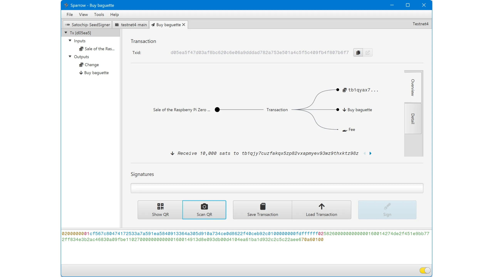


Presenta el código QR que aparece en tu SeedSigner (el que contiene la transacción firmada) a la webcam. Sparrow mostrará entonces todos los detalles de la transacción. Compruebe que toda la información es correcta y, a continuación, haga clic en "Transmitir transacción" para transmitirla a la red Bitcoin.


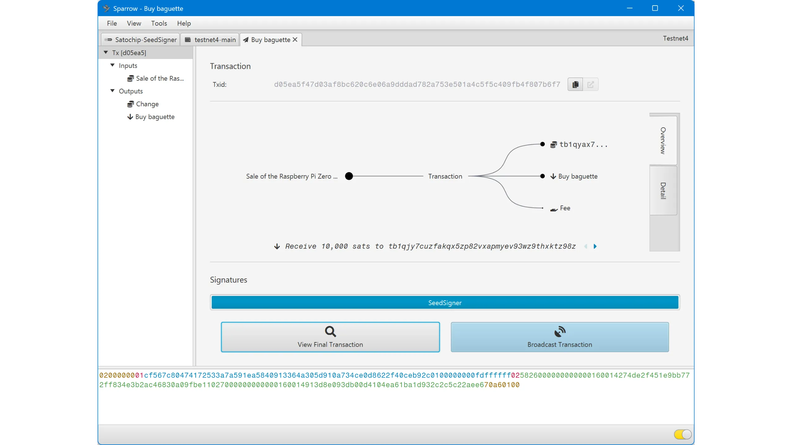


Su transacción se transmite ahora a la red. Puede seguir su confirmación en la pestaña `Transacciones` de Sparrow Wallet.


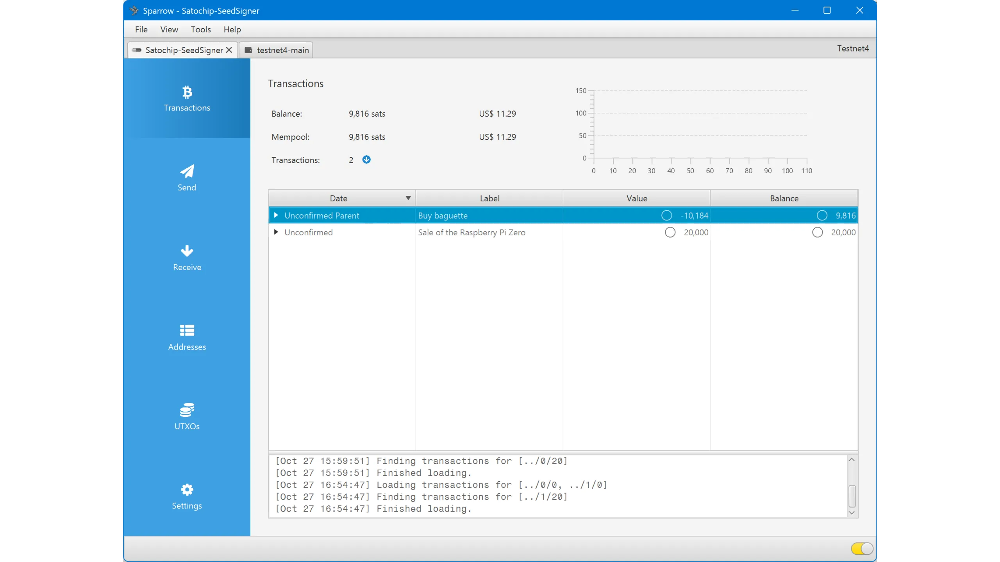


## 8. Recupera tu wallet


Como hemos visto en las secciones anteriores, dependiendo de tu estrategia de seguridad, hay varias formas de hacer una copia de seguridad de tu frase de recuperación además de tu Satochip :


- Utilización de un *SeedQR* clásico con el SeedSigner ;
- Grabando la frase mnemotécnica en un soporte físico;
- O almacenándolo en un Seedkeeper, como se explica en la sección 5.2.


En cualquier caso, hay 2 situaciones principales en las que hay que intervenir: pérdida del Satochip o pérdida del SeedSigner. Veamos cómo reaccionar en cada uno de estos escenarios.


### 8.1. Recupera tu wallet con Satochip


Si todavía tienes tu Satochip pero tu SeedSigner se ha roto o perdido, la situación es bastante sencilla de gestionar, ya que tu wallet todavía está en el Satochip.


La mejor opción es recomendar los componentes necesarios y reconstruir un nuevo SeedSigner desde cero. Al tratarse de un dispositivo "sin estado", no importa si utilizas el mismo SeedSigner u otro: mientras puedas insertar tu Satochip, todo funcionará con normalidad.


Si no quieres reconstruir uno, también puedes utilizar tu Satochip de la forma clásica, es decir, directamente desde tu ordenador, sin pasar por el SeedSigner. Este método funciona perfectamente, pero reduce considerablemente la seguridad de tu Bitcoin wallet: pierdes el aislamiento "*air-gapped*" y ahora debes firmar a ciegas, ya que el SeedSigner actuaba como pantalla de confianza. Sin embargo, ésta puede ser una solución temporal en caso de emergencia, o si no puede reconstruir un SeedSigner.


Para ello, necesitarás una tarjeta inteligente USB o un lector NFC. Abre el wallet que deseas restaurar en Sparrow, luego ve a la pestaña `Configuración` y haz clic en `Reemplazar`.


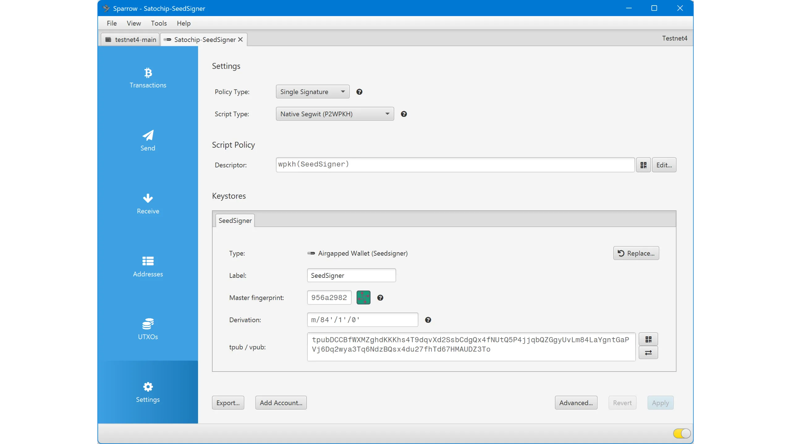


Inserte su Satochip en el lector de tarjetas inteligentes conectado al ordenador y, a continuación, haga clic en `Import` junto a `Satochip`.


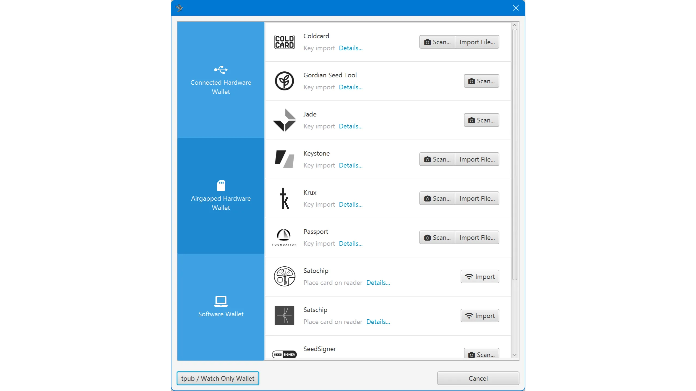


Por último, introduce el PIN de tu tarjeta inteligente para desbloquearla. Entonces podrás acceder a tu wallet, crear transacciones y firmarlas directamente utilizando el Satochip conectado.


### 8.2. Recupera tu cartera con SeedSigner


El otro escenario, más delicado, es cuando pierdes el acceso a tu Satochip que contiene la seed: ya sea porque se ha roto, la has perdido, te la han robado o has olvidado su código PIN. Si te roban o extravías tu Satochip, te recomendamos encarecidamente que, una vez restablecido el acceso a tus fondos, transfieras inmediatamente tus bitcoins a una wallet nueva, generada con una seed diferente. Esto garantiza que un atacante potencial nunca pueda acceder a sus satss.


Para recuperar el acceso a su cartera y mover sus fondos, sólo tiene que cargar su seed en SeedSigner. Dependiendo del soporte de copia de seguridad que hayas utilizado, tienes varias opciones:


- Introduzca su frase mnemotécnica manualmente en el menú `Semillas > Introducir seed de 12 palabras`.


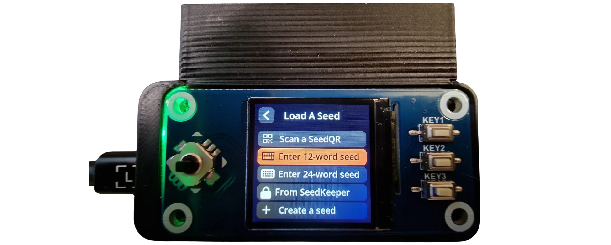


- Escanee su *SeedQR* haciendo clic en el botón `Escanear` de la página de inicio.


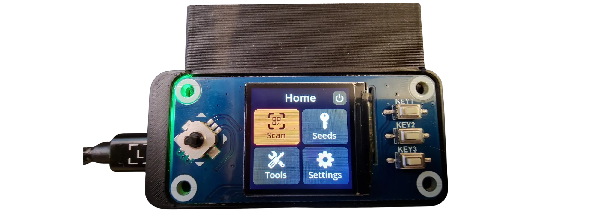


- O carga tu seed desde un Seedkeeper, a través del menú `Seeds > From SeedKeeper` (este es el método que estoy utilizando en este tutorial). Simplemente tendrás que introducir el PIN del Seedkeeper y seleccionar el secreto que se utilizará como seed en el SeedSigner.


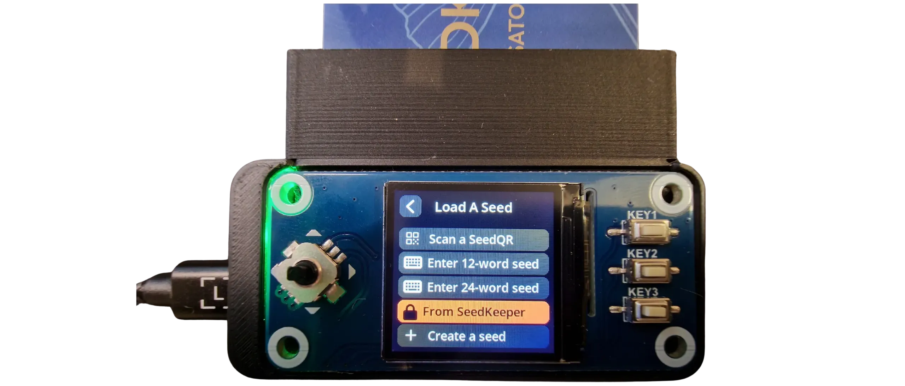


Una vez cargada la seed en el SeedSigner, sea cual sea el método que utilices, podrás firmar una o varias transacciones de escaneo para trasladar tus bitcoins a una nueva wallet no comprometida. Para saber cómo hacerlo, consulta la parte 7.2 del siguiente tutorial:


https://planb.academy/tutorials/wallet/hardware/seedsigner-2b274bff-6fc8-407a-92d7-f6ec4d1fadfb

Ahora ya sabe cómo utilizar Satochip para gestionar su cartera Bitcoin de forma segura en combinación con SeedSigner.


Si este montaje le ha convencido, no dude en apoyar los proyectos que lo hacen posible:


- Comprando su equipo directamente [en el sitio web de Satochip](https://satochip.io/shop/);
- Haciendo [una donación al proyecto SeedSigner](https://seedsigner.com/donate/);
- Suscribiéndose al [canal de YouTube de CryptoGuide](https://www.youtube.com/@CryptoGuide/), dirigido por la persona que mantiene el repositorio de GitHub que aloja el firmware modificado que utilizamos en este tutorial.