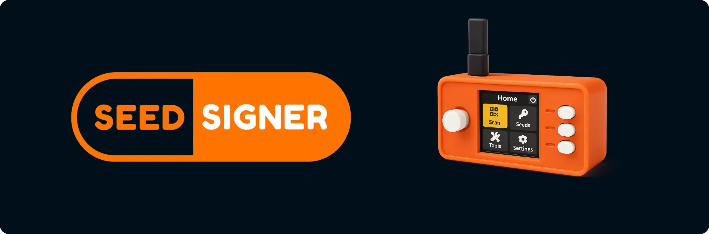


El SeedSigner es un hardware wallet Bitcoin de código abierto que cualquiera puede construir por sí mismo utilizando componentes electrónicos baratos de uso general. A diferencia de productos comerciales como Ledger, Coldcard o Trezor, no se trata de un dispositivo listo para usar fabricado por una empresa: es un proyecto comunitario que permite a cualquiera crear su propio dispositivo, controlando cada paso.


El SeedSigner está diseñado para ser 100% ***air-gapped***: nunca se conecta a Internet, no tiene Wi-Fi ni Bluetooth (en el caso de la Raspberry Pi Zero v1.3) y nunca se conecta a un ordenador para intercambiar datos. La comunicación se realiza exclusivamente a través de un sistema de intercambio de códigos QR. En concreto, su software de gestión de carteras (como Sparrow Wallet) muestra la transacción que debe firmarse en forma de códigos QR; usted los escanea con la cámara del SeedSigner y, a continuación, el dispositivo firma la transacción utilizando sus claves privadas almacenadas temporalmente en su memoria RAM. Por último, genera códigos QR que contienen la transacción firmada, que usted escanea con su software para enviarla a la red Bitcoin.


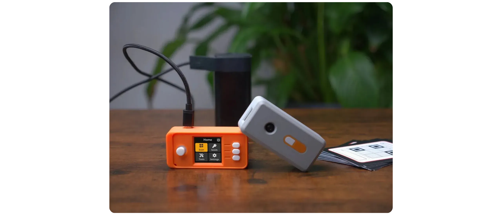


SeedSigner también es ***stateless***. En otras palabras, no guarda tu seed ni tus claves privadas de forma permanente, a diferencia de otros monederos hardware. Cada vez que reinicias, su memoria queda completamente vacía, a menos que configures el dispositivo para que guarde tu configuración en una tarjeta microSD. El método más práctico consiste en almacenarla en forma de código QR, que se escanea al inicio con la cámara del SeedSigner. Este modo de funcionamiento reduce considerablemente la superficie de ataque: incluso si un ladrón roba tu dispositivo, no encontrará ninguna información en él, ya que siempre está vacío por defecto.


Otra opción para almacenar su seed y utilizarlo con el SeedSigner es utilizar una tarjeta inteligente *SeedKeeper* junto con un lector compatible. Esto le proporciona un *Elemento Seguro* muy robusto para almacenar su seed, mientras utiliza la pantalla del SeedSigner para firmar transacciones. Pero esta configuración en particular es el tema de otro tutorial dedicado. Aquí nos concentraremos en el uso básico del SeedSigner:


https://planb.academy/tutorials/wallet/hardware/seedkeeper-seedsigner-45cca4c4-1f22-46bb-87ae-9cddb68aa579

El proyecto SeedSigner ocupa un lugar importante en el ecosistema Bitcoin, ya que ofrece a todos, en cualquier parte del mundo, la posibilidad de beneficiarse de una seguridad avanzada para proteger sus bitcoins. Su principal ventaja reside en su accesibilidad: el hardware necesario puede adquirirse por menos de 50 dólares. Además, permite a las personas que viven en países con restricciones construir su propio hardware wallet a partir de componentes informáticos estándar, fáciles de encontrar y menos sujetos a restricciones reglamentarias.


Pero incluso fuera de estos contextos particulares, SeedSigner puede ser una opción interesante para usted: es de código abierto, funciona sin estado y con airgap, y reduce los vectores de ataque vinculados a la cadena de suministro de su hardware wallet.


## 1. Equipamiento necesario


Para construir tu SeedSigner, necesitarás los siguientes componentes:


- Raspberry Pi Zero
    - Se recomienda la versión 1.3, ya que no tiene ni Wi-Fi ni Bluetooth, lo que garantiza un aislamiento total.
 - Las versiones W y v2 también son compatibles, pero incorporan un chip Wi-Fi/Bluetooth. Por lo tanto, conviene desactivarlo físicamente retirando el módulo de radio de la tarjeta. La operación es relativamente sencilla, pero requiere precisión (unos alicates finos bastan para la Zero W, mientras que para la v2 se necesita un bolígrafo caliente para retirar la placa metálica que oculta el módulo). No entraré en detalles en este tutorial, pero encontrarás todas las instrucciones en este documento: *[Desactivación de WiFi/Bluetooth por hardware](https://github.com/DesobedienteTecnologico/rpi_disable_wifi_and_bt_by_hardware)*.
 - Atención: algunos modelos de Raspberry Pi Zero se venden sin pines GPIO pre-soldados. Puedes comprar una versión con pines integrados directamente (solución más sencilla), o comprar los pines por separado y soldarlos tú mismo (solución más compleja).
 - No olvides incluir una fuente de alimentación micro-USB.


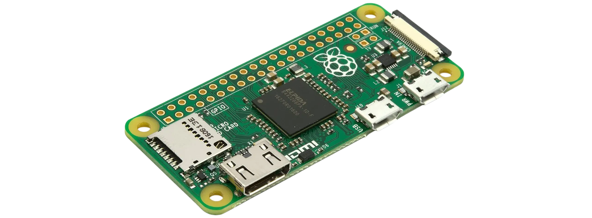


- Pantalla Waveshare de 1,3" (240×240 px)** (en francés)
    - Es esencial elegir este modelo en concreto: existen otras pantallas similares, pero con una resolución diferente. Sin una definición de 240×240 px, la pantalla será inutilizable.
    - La pantalla cuenta con tres botones y un mini joystick para la interfaz de usuario.


- Cámara compatible con Raspberry Pi Zero
    - Opción 1: la cámara estándar con una amplia alfombrilla dorada (compruebe la compatibilidad con su carcasa).
    - Opción 2: la cámara más compacta "*Zero*", diseñada específicamente para la Pi Zero.


- Tarjeta MicroSD
    - Capacidad recomendada: entre 4 y 32 GB.


- Alojamiento (opcional pero recomendado)** (opcional pero recomendado)** (opcional pero recomendado)** (opcional pero recomendado)**)
    - Protege el dispositivo y facilita su uso.
    - El modelo más popular es el "*Pastillero naranja*", para el que hay disponibles [archivos STL de código abierto para impresión 3D](https://github.com/SeedSigner/seedsigner/tree/dev/enclosureshttps://github.com/SeedSigner/seedsigner/tree/dev/enclosures).
    - Las cajas también están disponibles en [revendedores independientes vinculados al proyecto](https://seedsigner.com/hardware/).


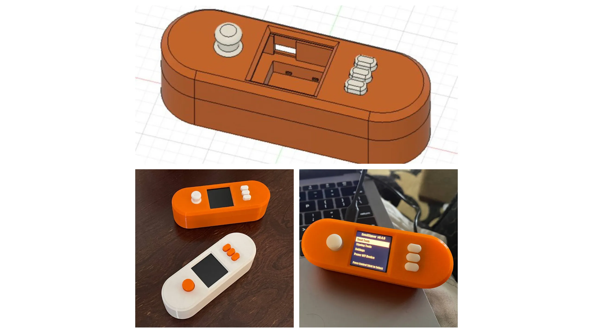


Puedes comprar estos componentes por separado o, para mayor simplicidad, optar por packs ya preparados que incluyen todo el hardware necesario. Personalmente, pedí mi pack [en este sitio francés](https://bitcoinbazar.fr/), pero también encontrarás una lista de vendedores para cada región del mundo en [la página de hardware del proyecto SeedSigner](https://seedsigner.com/hardware/). Si prefieres comprar los componentes por separado, están disponibles en las principales plataformas de comercio electrónico o en tiendas especializadas.


## 2. Preparar el software


Una vez reunido el hardware, hay que preparar la tarjeta microSD instalando en ella el sistema SeedSigner. Para ello, vaya a su ordenador personal de todos los días, y conecte su microSD destinado a SeedSigner.


### 2.1. Descargar


Vaya a [el repositorio oficial GitHub del proyecto](https://github.com/SeedSigner/seedsigner/releases). En la última versión del software, descarga :


- La imagen `.img` correspondiente a tu modelo de Pi.
- El archivo `.sha256.txt`.
- El archivo `.sha256.txt.sig`.


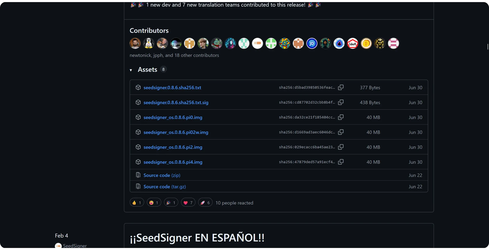


Antes de iniciar la instalación, comprobemos el software.


### 2.2 Verificación en Linux y macOS


Comienza importando la clave pública oficial del proyecto SeedSigner directamente desde Keybase :


```
gpg --fetch-keys https://keybase.io/seedsigner/pgp_keys.asc
```


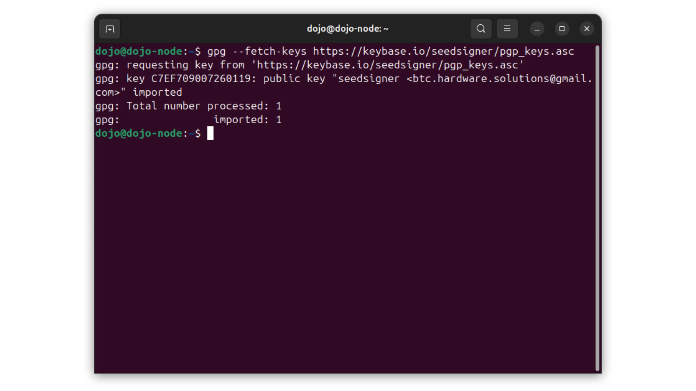


El terminal debería indicarle que se ha importado o actualizado una clave. A continuación, ejecute el comando de verificación en el fichero de firma (recuerde modificar el comando según su versión, aquí `0.8.6.`):


```
gpg --verify seedsigner.0.8.6.sha256.txt.sig
```


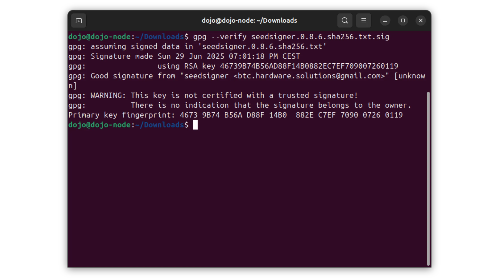


Si todo es correcto, el resultado debería ser `Good signature`. Esto significa que el fichero `.sha256.txt` ha sido firmado por la clave que acabas de importar, y que la firma es válida. Ignora el mensaje de advertencia `WARNING: This key is not certified with a trusted signature`: esto es normal, ya que ahora depende de ti comprobar que la clave utilizada pertenece al proyecto SeedSigner.


Para ello, compare los últimos 16 caracteres de la huella mostrada con los disponibles en [Keybase.io/SeedSigner](https://keybase.io/seedsigner), en su [Twitter oficial](https://twitter.com/SeedSigner/status/1530555252373704707), o en el archivo publicado en [SeedSigner.com](https://seedsigner.com/keybase.txt). Si estos identificadores coinciden exactamente, puedes estar seguro de que la clave es efectivamente la del proyecto. En caso de duda, detente inmediatamente y pide ayuda a la comunidad SeedSigner (Telegram, X, GitHub...).


Una vez validada la clave, puede comprobar que la imagen descargada no ha sido modificada (recuerde modificar el comando según su versión, aquí `0.8.6.`):


```
shasum -a 256 --ignore-missing --check seedsigner.0.8.6.sha256.txt
```


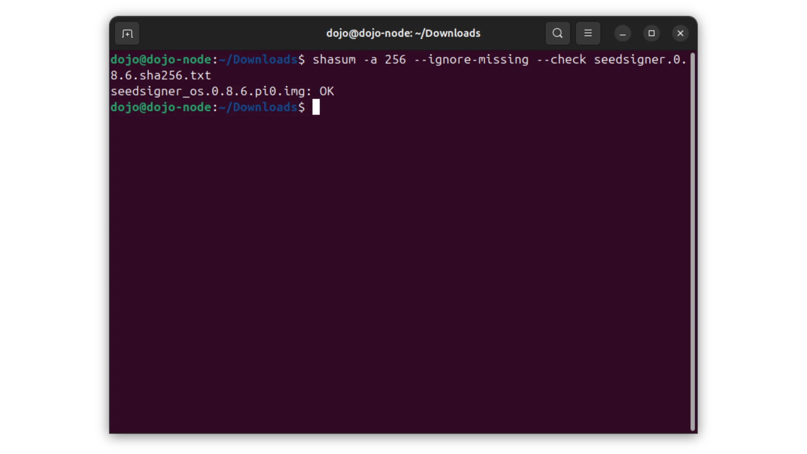


- En Linux, este comando está incorporado.
- Advertencia: las versiones de macOS anteriores a `Big Sur (11)` no reconocen la opción `--ignore-missing`. En este caso, elimínela e ignore las advertencias sobre archivos perdidos.


El resultado esperado es un `OK` junto al archivo `.img`. Esto confirma que la imagen cargada es idéntica a la publicada por el proyecto y no ha sido modificada.


### 2.3 Verificación de Windows


En Windows, el procedimiento es similar pero los comandos son diferentes. Comience instalando [Gpg4win](https://www.gpg4win.org/) y abra la aplicación *Kleopatra*. Importa la clave pública del proyecto SeedSigner desde la URL Keybase :


```
https://keybase.io/seedsigner/pgp_keys.asc
```


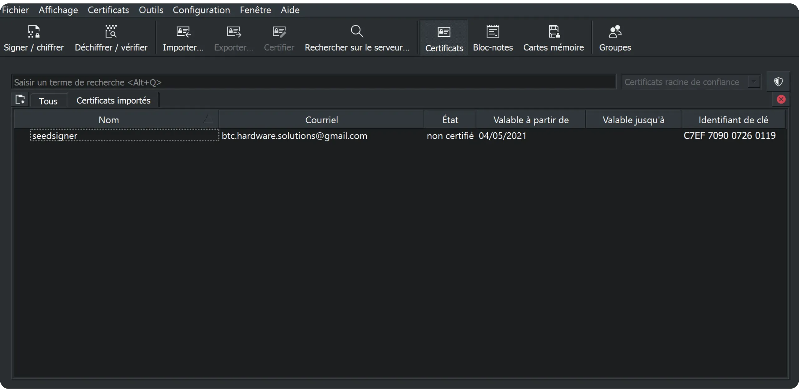


A continuación, abra PowerShell en la carpeta donde se encuentran los archivos descargados (`Mayúsculas` + botón derecho del ratón > `Abrir PowerShell aquí`). Ejecuta el siguiente comando para comprobar la firma del manifiesto (recuerda modificar el comando según tu versión, aquí `0.8.6.`):


```
gpg --verify seedsigner.0.8.6.sha256.txt.sig
```


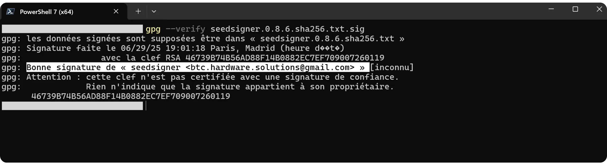


Si todo es correcto, el resultado debería ser `Good signature`. Esto significa que el fichero `.sha256.txt` ha sido firmado por la clave que acabas de importar, y que la firma es válida. Ignora el mensaje de advertencia `WARNING: This key is not certified with a trusted signature`: esto es normal, ya que ahora depende de ti comprobar que la clave utilizada pertenece al proyecto SeedSigner.


Para ello, compare los últimos 16 caracteres de la huella mostrada con los disponibles en [Keybase.io/SeedSigner](https://keybase.io/seedsigner), en su [Twitter oficial](https://twitter.com/SeedSigner/status/1530555252373704707), o en el archivo publicado en [SeedSigner.com](https://seedsigner.com/keybase.txt). Si estos identificadores coinciden exactamente, puedes estar seguro de que la clave es efectivamente la del proyecto. En caso de duda, detente inmediatamente y pide ayuda a la comunidad SeedSigner (Telegram, X, GitHub...).


Una vez validada la clave, debe comprobar que el archivo de imagen no está dañado. Para ello, utilice el siguiente comando en PowerShell :


```
CertUtil -hashfile seedsigner_os.0.8.6.[your-Pi-model].img SHA256
```


Ejemplo para una Raspberry Pi Zero 2 (recuerda modificar el comando según tu versión, aquí `0.8.6.`):


```
CertUtil -hashfile seedsigner_os.0.8.6.pi02w.img SHA256
```


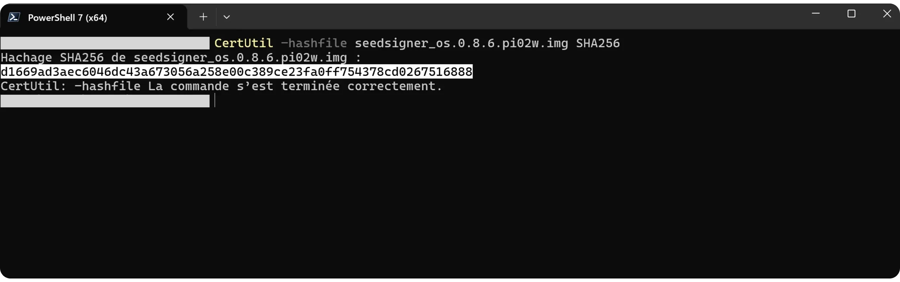


A continuación, PowerShell calcula el hash SHA256 del archivo de imagen. Compare este hash con el valor correspondiente en `seedsigner.0.8.6.sha256.txt`.


- Si los dos valores son estrictamente idénticos, la comprobación se ha realizado correctamente y puede continuar.
- Si difieren, el archivo está dañado o corrupto. No lo utilices e inicia de nuevo la descarga.


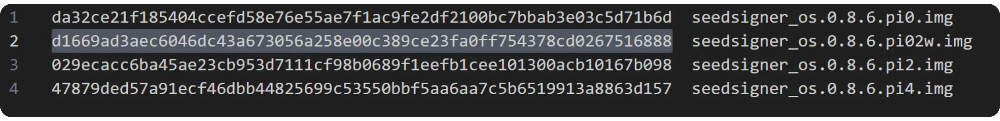


Una verificación correcta garantiza que el archivo `.img` es auténtico (firmado por SeedSigner) e inalterado (sin modificaciones). A continuación, puede pasar con seguridad al siguiente paso.


### 2.4. Flashear la imagen


Si aún no lo tiene, descargue el programa [Balena Etcher](https://etcher.balena.io/), y luego :


- Inserta la tarjeta microSD en tu ordenador.
- Lanzar Etcher.
- Seleccione el archivo `.img` descargado y verificado.
- Selecciona la tarjeta microSD como destino.
- Haga clic en "Flash".


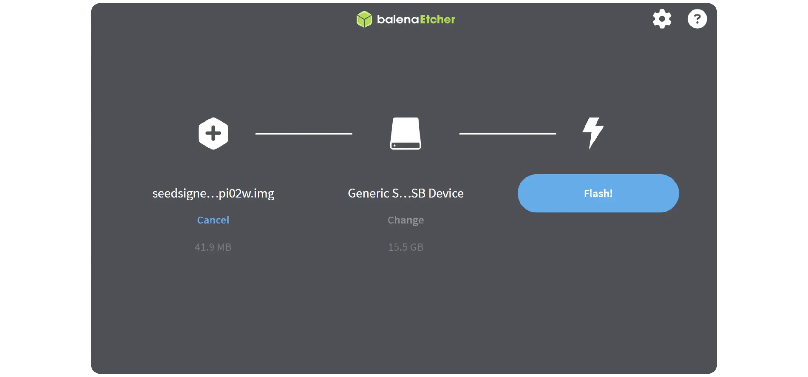


Espera a que el proceso finalice: tu microSD está lista para ser utilizada. ¡Ahora es el momento del montaje!


## 3. Conjunto SeedSigner


Una vez preparada tu tarjeta microSD y flasheada con el software SeedSigner, puedes proceder al montaje final. Tómate tu tiempo, ya que algunas piezas son frágiles (sobre todo el mantel, la cámara y los pines GPIO).


### 3.1 Preparación de la carcasa


En primer lugar, abre la carcasa. Comprueba que está limpia y que no hay restos de plástico de impresión 3D en los cierres internos. Busca :


- Ubicación de la cámara (pequeño orificio circular en la parte delantera).
- La apertura de la pantalla.
- Los recortes para los puertos micro-USB y la ranura microSD de la Raspberry Pi Zero.


### 3.2 Instalación de la cámara


Localiza el conector de cinta de la cámara en la Raspberry Pi Zero: es una fina tira negra en el lateral de la placa, que se puede levantar ligeramente para abrirla. Levántala con cuidado, sin forzarla: simplemente debería inclinarse unos milímetros.


Inserte la tapa de la cámara. La parte marrón/cobre debe mirar hacia abajo. Asegúrese de que está firmemente asentada en el conector, sin torcerla.


Cierra la barra negra para bloquear el mantel (notarás un ligero clic). Comprueba con cuidado que se mantiene en su sitio y no se mueve.


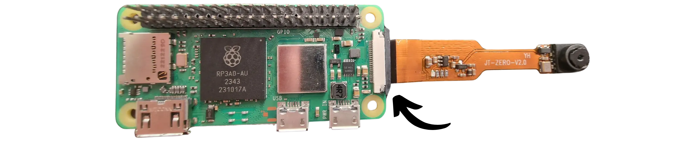


A continuación, coloque el módulo de la cámara en el orificio correspondiente de la carcasa. Según el modelo, puede encajar directamente o necesitar una pequeña tira adhesiva para sujetarlo. La lente debe estar perfectamente alineada, orientada hacia el exterior.


### 3.3 Instalación de la Raspberry Pi Zero


Si estás utilizando una carcasa, inserta la placa Raspberry Pi Zero en su interior. Alinea con cuidado los puertos con las aberturas previstas.


A continuación, coloque la pantalla Waveshare en la parte superior de la Raspberry Pi Zero. Los pines GPIO de la Pi deben alinearse perfectamente con el conector hembra de la pantalla. Presiona lentamente la pantalla sobre los pines, aplicando una presión uniforme en cada lado para evitar doblarlos.


Si tienes una caja, completa el montaje añadiendo el panel frontal y el joystick.


Por último, inserta la tarjeta microSD que contiene el software flasheado en la ranura montada en el borde de la Raspberry Pi Zero. Asegúrate de que encaje en su sitio.


### 3.4 Primera puesta en marcha


Conecta un cable de alimentación micro-USB al puerto dedicado. Espera aproximadamente un minuto. Debería aparecer el logotipo de SeedSigner, seguido de la pantalla de inicio.


Para empezar, comprueba que los distintos componentes funcionan correctamente accediendo al menú `Configuración > Prueba de E/S`.


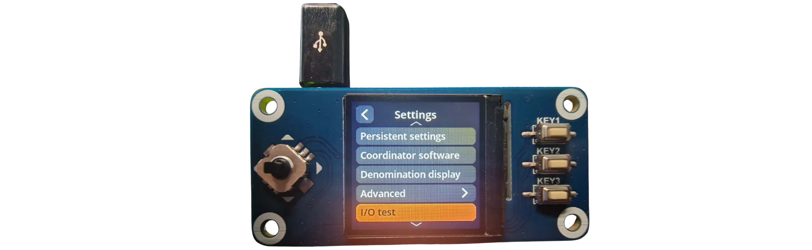


Pruebe todos los botones y asegúrese de que responden correctamente. A continuación, pulsa el botón `KEY1` para comprobar que la cámara funciona correctamente. Esto tomará una foto.


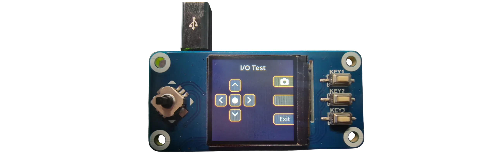


### 3.5 Ajuste de la cámara


Dependiendo de cómo hayas montado tu SeedSigner, la cámara puede mostrar una imagen invertida. Para corregirlo, ve a `Configuración > Avanzada > Rotación de la cámara` y selecciona una rotación de 180° si es necesario.


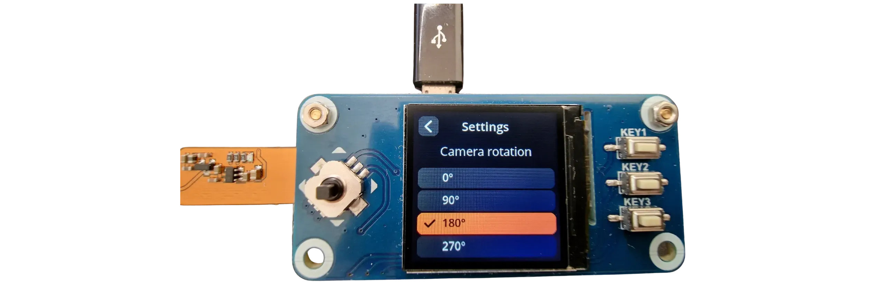


Si has cambiado la orientación de la cámara o deseas cambiar otros ajustes (como el idioma de la interfaz) más adelante, tendrás que habilitar la persistencia de los ajustes en la microSD. De lo contrario, tu configuración volverá a ser la predeterminada cada vez que reinicies, ya que la Raspberry Pi Zero no tiene memoria persistente.


Para ello, abra el menú "Ajustes > Ajustes permanentes" y seleccione "Activado".


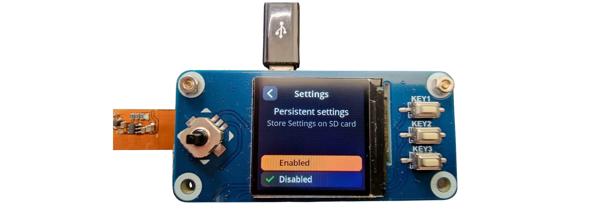


Si todo funciona correctamente, su SeedSigner está listo para ser utilizado


## 4. Configuración de SeedSigner


Antes de crear tu Bitcoin wallet, vamos a configurar el SeedSigner. Como se ejecuta en una Raspberry Pi Zero sin memoria persistente, sus ajustes no se guardan automáticamente a menos que los guardes en la tarjeta microSD. Así que asegúrate de haber activado esta opción, de lo contrario estos ajustes se perderán al reiniciar (ver paso 3.5).


### 4.1 Acceso al menú de parámetros


Arranca tu SeedSigner y espera a que aparezca la pantalla de inicio. Con el joystick, desplácese hasta la opción `Configuración` y valídela pulsando el botón central. Accederá al menú principal de configuración.


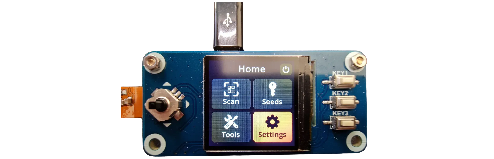


### 4.2 Elegir un software de gestión de carteras


A continuación, acceda al menú `Software de coordinación`.


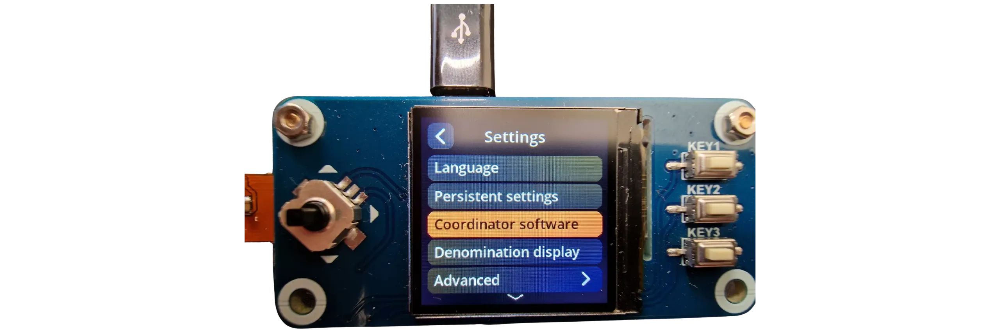


El `Coordinador` se refiere al software de gestión de cartera con el que su SeedSigner se comunicará a través de códigos QR. Este software se instala en su ordenador o en su smartphone. Le permitirá gestionar sus bitcoins, pero sin tener nunca acceso a sus claves privadas. El SeedSigner sigue siendo el único dispositivo capaz de firmar sus transacciones.


La versión actual del firmware es compatible con varios programas: Sparrow, Specter, BlueWallet, Nunchuk y Keeper. En mi caso, utilizo **Sparrow Wallet**, que recomiendo especialmente por su sencillez y rica funcionalidad.


Si no sabes cómo instalarlo, puedes seguir este tutorial:


https://planb.academy/tutorials/wallet/desktop/sparrow-c674e2ac-d46f-4c82-92a7-7d1b0e262f5d

Sólo tiene que seleccionar el programa que desee en el menú.


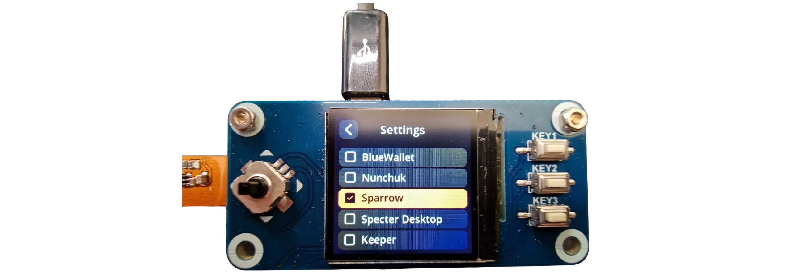


### 4.3 Indicación de unidades e importe


En el menú `Denominación`, puede elegir la unidad en la que se muestran los importes:


- `BTC`
- mBTC` (milli-bitcoin, o 0,001 BTC)
- gW-15 (satoshis, o 1/100.000.000 BTC)


La unidad **sats** suele ser la más práctica para pequeñas cantidades.


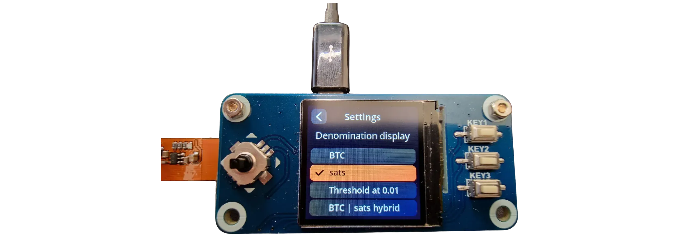


### 4.4 Ajustes avanzados


Ahora ve al menú `Avanzado`. Aquí encontrarás varias opciones útiles:


- gW-17 network`: a modificar sólo si se desea utilizar el SeedSigner en Testnet.
- qR code density`: ajusta la cantidad de información contenida en cada código QR. Puedes dejar el valor predeterminado, a menos que te resulte difícil de leer al escanear.
- `Xpub export`: activa o desactiva la exportación de tu clave pública extendida (`xpub`, `ypub`, `zpub`) al software de gestión de carteras mediante código QR (una función que utilizaremos más adelante, así que déjala activada por ahora).
- `Tipos de script`: define los tipos de script permitidos para bloquear tus bitcoins. No necesitas modificar este parámetro, ya que el tipo de script se establecerá directamente en Sparrow. Aquí, sólo se trata de scripts que el SeedSigner está autorizado a manipular.


### 4.5 Selección de idioma


Por último, en el menú `Idioma`, puedes cambiar el idioma de la interfaz para adaptarlo a tus preferencias.


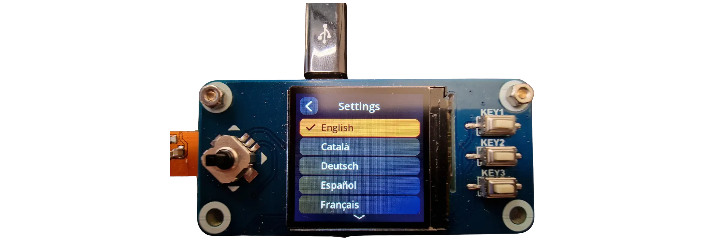


## 5. Crear y guardar seed


La seed (o frase mnemotécnica) constituye la base de su cartera Bitcoin. Se utiliza para derivar sus claves privadas y direcciones, y proporciona acceso a sus fondos. SeedSigner ofrece varios métodos para generarla, que veremos en esta sección.


Antes de empezar, algunos recordatorios esenciales:


- Esta frase da acceso completo y sin restricciones a todos tus bitcoins.** Cualquiera en posesión de esta frase puede robar tus fondos, incluso sin acceso físico a tu SeedSigner ;
- Normalmente, se utiliza una frase de 12 palabras para restaurar una wallet en caso de pérdida o robo del hardware de la wallet. Pero como el SeedSigner es un dispositivo *sin estado*, nunca registra tu seed. Así que tus copias de seguridad físicas no son simples copias de seguridad, sino **la única forma de usar tu wallet**. Si pierdes estas copias de seguridad, tus bitcoins se perderán permanentemente. Así que haz copias de seguridad con cuidado, en varios soportes y en lugares seguros;
- Si estás empezando, te recomiendo encarecidamente que leas este tutorial para conocer en detalle los riesgos que conlleva la gestión de una frase mnemotécnica :


https://planb.academy/tutorials/wallet/backup/backup-mnemonic-22c0ddfa-fb9f-4e3a-96f9-46e2a7954270

### 5.1 Acceso a la herramienta de creación de seed


Desde la pantalla de inicio de SeedSigner, vaya al menú `Herramientas`.


Ahora generate su seed. Un seed es simplemente un gran número aleatorio. Cuanto más aleatoriamente se genere, más seguro será. SeedSigner ofrece dos formas de hacerlo:


- cámara": seed se genera a partir del ruido visual de una fotografía. Se toma una imagen de un entorno aleatorio (objeto, paisaje, cara, etc.) cuyas variaciones de píxeles se utilizan para generate entropía. Es un método rápido, pero no reproducible.
- tiradas de dados": se tiran dados para crear la entropía necesaria. Lleva más tiempo, pero es reproducible y, por tanto, verificable. Si optas por este método, sigue los consejos de este tutorial (aquí no es necesario calcular la suma de comprobación, el SeedSigner se encarga de ello):


https://planb.academy/tutorials/wallet/backup/generate-mnemonic-phrase-47507d90-e6af-4cac-b01b-01a14d7a8228

### 5.2 Crear el seed con la foto


Si elige el método de la foto, haga clic en `Nuevo seed` (con el icono de la cámara), tome una foto y valídela. A continuación, seleccione la longitud de su frase (12 o 24 palabras), que aparecerá en la pantalla para guardarla. Los pasos siguientes son idénticos a los de la parte 5.3.


### 5.3 Crear seed con dados


En este tutorial, usamos el método de **Lanzamiento de Dados**. Haga clic en `Nuevo seed` (con el icono del dado).


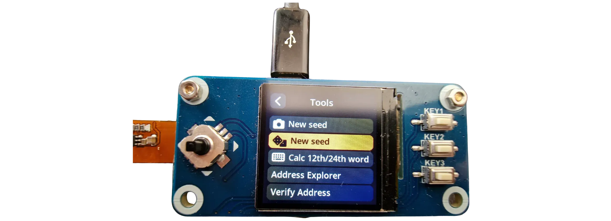


A continuación, elija la longitud de su frase mnemotécnica. 12 palabras ya ofrecen un nivel de seguridad suficiente, así que es la opción que recomiendo.


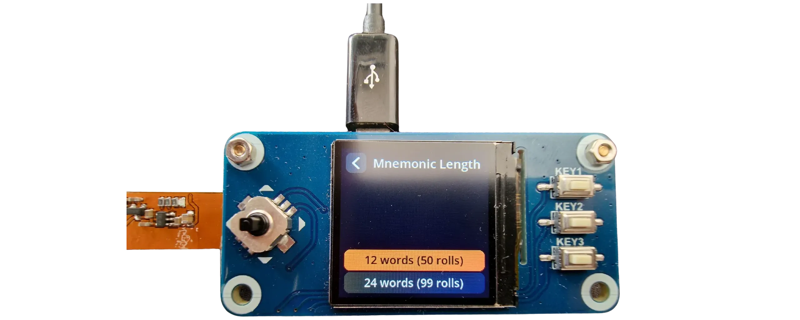


Tira los dados e introduce los números resultantes utilizando el cursor. Pulsa el botón central para validar cada entrada. Si cometes un error, puedes volver atrás. Utiliza varios dados diferentes para reducir la influencia de cualquier dado desequilibrado. Asegúrate de que no te están observando durante esta operación.


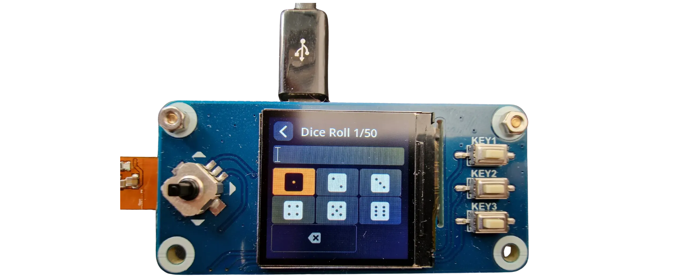


Una vez que hayas introducido tus 50 lanzamientos, el SeedSigner genera tu sentencia. **Sigue atentamente las instrucciones de este tutorial si estás empezando:**


https://planb.academy/tutorials/wallet/backup/backup-mnemonic-22c0ddfa-fb9f-4e3a-96f9-46e2a7954270

### 5.4 Visualizar y guardar la seed


Escribe cuidadosamente las palabras de tu frase mnemotécnica en un soporte físico adecuado (papel o metal).


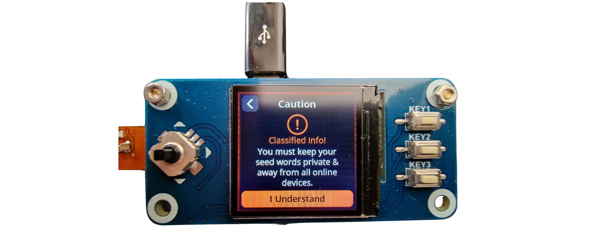


### 5.5 Comprobación de la copia de seguridad


Para evitar errores en la copia de seguridad, SeedSigner le pide que la verifique. Haz clic en `Verificar`.


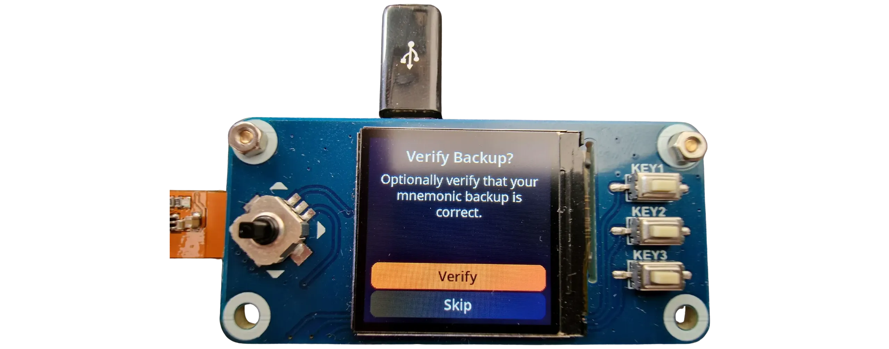


A continuación, introduzca la palabra solicitada según su orden en la frase. Por ejemplo, aquí tengo que elegir la tercera palabra de la frase.


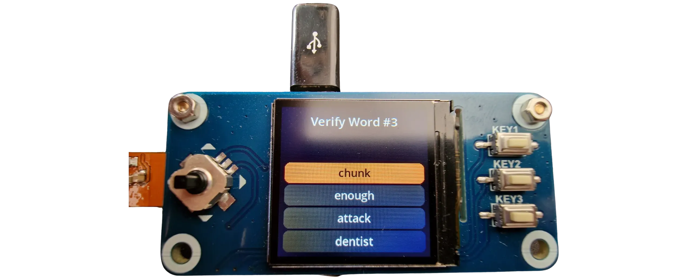


Si cometes un error, el SeedSigner te informará y tendrás que empezar de nuevo, asegurándote de anotar tu frase mnemotécnica cuando te la dé. Este paso de verificación garantiza que tu copia de seguridad es correcta y completa. Una vez validada, la pantalla mostrará `Backup Verified`.


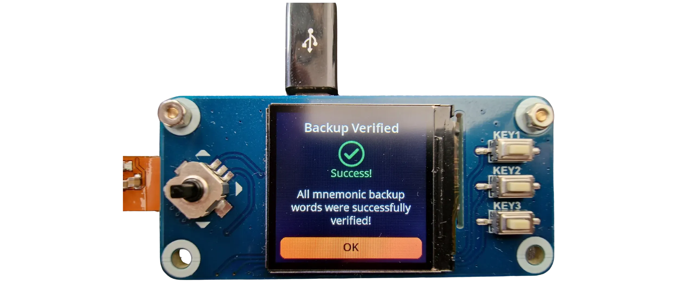


Para una prueba de restauración más completa, siga este tutorial :


https://planb.academy/tutorials/wallet/backup/recovery-test-5a75db51-a6a1-4338-a02a-164a8d91b895

### 5.6 Comprender el concepto de "dispositivo sin estado


El SeedSigner es un dispositivo sin memoria permanente. Esto significa que su seed nunca se almacena dentro del dispositivo (a diferencia de una Ledger, Trezor o Coldcard, por ejemplo). En cuanto lo apagas, la seed desaparece por completo de su memoria RAM. Al reiniciarlo, el SeedSigner vuelve a estar en blanco: entonces tendrás que entregarle de nuevo tu seed para que pueda firmar tus transacciones.


Esto proporciona una protección esencial. A diferencia de otros monederos de hardware, SeedSigner se basa en una Raspberry Pi Zero, que no tiene protección física, incluyendo *Secure Element*. Pero como no se almacenan datos sensibles, ni siquiera un dispositivo comprometido físicamente permitiría a un atacante extraer tus claves privadas o gastar tus bitcoins.


Por otro lado, esta arquitectura implica una responsabilidad adicional: sin una copia de seguridad, tus fondos están definitivamente perdidos. Por eso recomiendo una **doble copia de seguridad**. Ya tienes tu frase de recuperación: es tu copia de seguridad principal a largo plazo, que debes guardar en un lugar seguro. Ahora vamos a crear una copia de esta frase en forma de **código QR**.


Cada vez que utilizas el SeedSigner, escaneas este código QR con la cámara del dispositivo para que cargue temporalmente tu seed en su memoria mientras firmas tus transacciones. Esta segunda copia de seguridad, destinada al uso cotidiano, también debe guardarse con sumo cuidado: cualquiera que esté en posesión de este código QR tiene pleno acceso a tus bitcoins.


También le aconsejo que guarde su código QR y su frase mnemotécnica en dos lugares distintos, para evitar perderlo todo en caso de siniestro.


Por último, una alternativa más avanzada y segura es utilizar el SeedSigner con un **SeedKeeper**, que almacena el seed en un secure element. Para saber más, echa un vistazo a este tutorial:


https://planb.academy/tutorials/wallet/hardware/seedkeeper-seedsigner-45cca4c4-1f22-46bb-87ae-9cddb68aa579

### 5.7 Escribir huella de llave maestra


Una vez completada la verificación, SeedSigner muestra la huella digital de la llave maestra de su wallet. Esta huella identifica tu wallet y garantiza que utilices la frase de recuperación correcta en el futuro. No revela ninguna información sobre tus claves privadas, por lo que puedes almacenarla de forma segura en un soporte digital. Sólo asegúrate de conservar una copia accesible y de no perderla nunca.


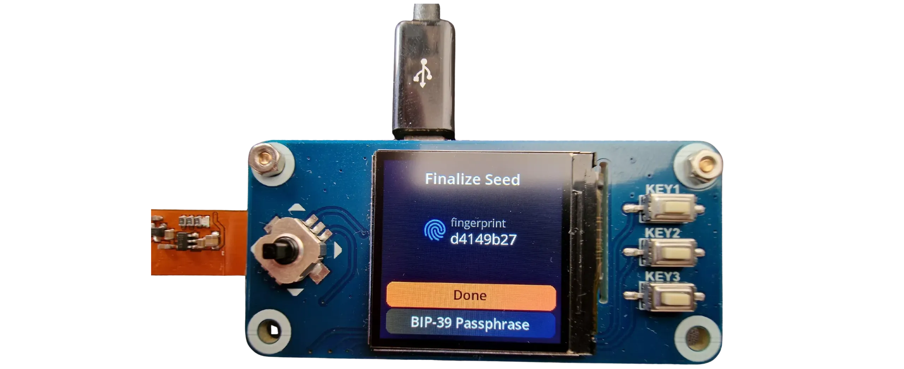


Es también en esta fase cuando puedes añadir un **passphrase BIP39** para reforzar la seguridad de tu wallet. Dependiendo de tu estrategia de copias de seguridad, esta opción puede merecer la pena, pero también entraña riesgos: si pierdes la passphrase, el acceso a tus bitcoins se perderá definitivamente.


https://planb.academy/tutorials/wallet/backup/seedsigner-passphrase-7a61f64d-aa03-4bcf-8308-00c89a74cffe

Si aún no está familiarizado con el concepto passphrase, le invito a leer este completo tutorial sobre el tema:


https://planb.academy/tutorials/wallet/backup/passphrase-a26a0220-806c-44b4-af14-bafdeb1adce7

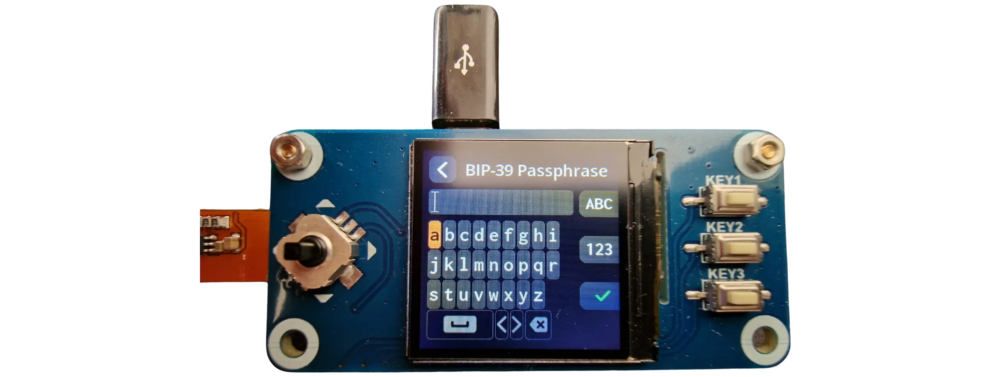


### 5.8 Guardar el seed en formato QR (*SeedQR*)


SeedSigner le permite convertir su seed en un código QR de papel, llamado *SeedQR*. Este método simplifica la recarga de su wallet, ya que evita tener que volver a escribir cada palabra manualmente.


Para ello, necesitará un papel en blanco o un código QR metálico que se corresponda con la longitud de su frase mnemotécnica. Si has adquirido un paquete completo para tu SeedSigner, las plantillas suelen estar incluidas. Si no, puedes descargarlas e imprimirlas (o reproducirlas a mano) aquí :


- [formato de 12 palabras](https://github.com/SeedSigner/seedsigner/blob/dev/docs/seed_qr/printable_templates/grid_25x25.pdf)
- [formato de 24 palabras](https://github.com/SeedSigner/seedsigner/blob/dev/docs/seed_qr/printable_templates/grid_29x29.pdf)
- [Formato compacto 12 palabras](https://github.com/SeedSigner/seedsigner/blob/dev/docs/seed_qr/printable_templates/grid_21x21.pdf)
- [Formato compacto 24 palabras](https://github.com/SeedSigner/seedsigner/blob/dev/docs/seed_qr/printable_templates/grid_25x25.pdf)


En su pantalla seed, seleccione `Backup Seed`.


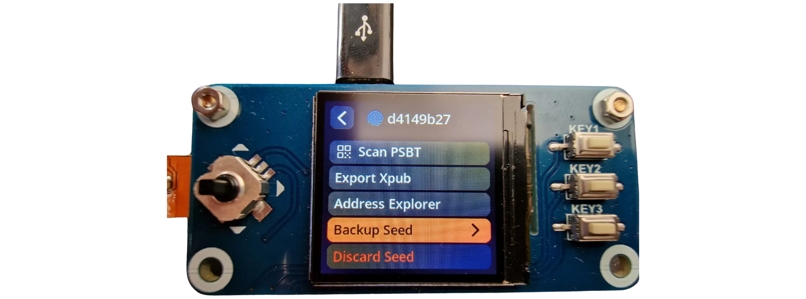


A continuación, seleccione `Exportar como SeedQR`.


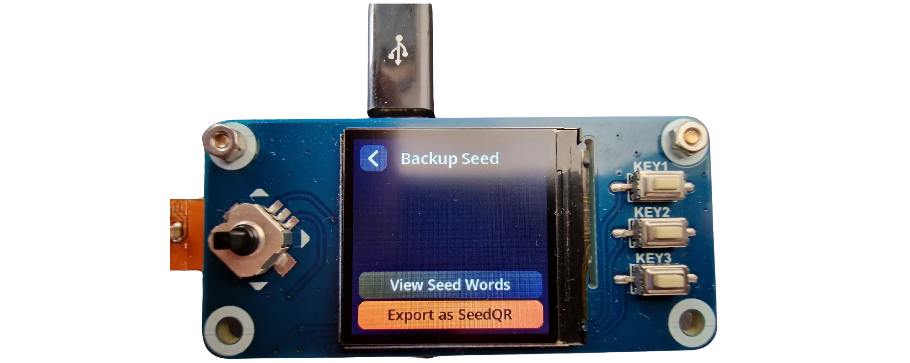


A continuación, seleccione el formato deseado (normal o compacto) según la plantilla de papel disponible.


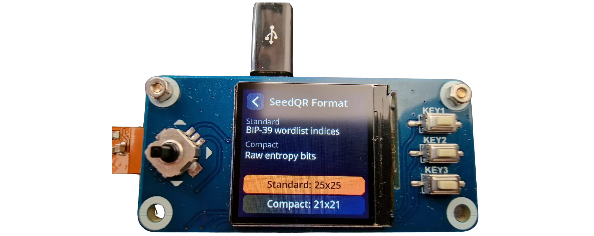


Haga clic en "Comenzar" para empezar a crear el *SeedQR*. El SeedSigner mostrará entonces una serie de cuadrículas (A1, A2, B1, etc.), cada una correspondiente a una parte del código.


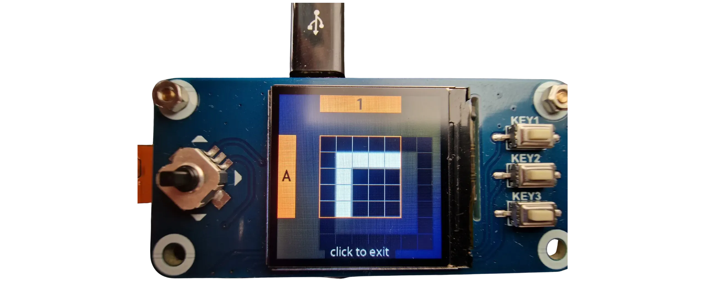


Reproduce cuidadosamente cada punto negro en tu hoja de guardado y, a continuación, utiliza el joystick para pasar al siguiente bloque. Tómate tu tiempo: un simple desajuste puede inutilizar el código QR.


Algunos consejos:


- Empieza con un lápiz para poder corregir los errores y vuelve a utilizar un bolígrafo negro fino una vez que hayas terminado;
- Un punto bien centrado en el centro del cuadrado es todo lo que necesitas, no hace falta llenarlo por completo.


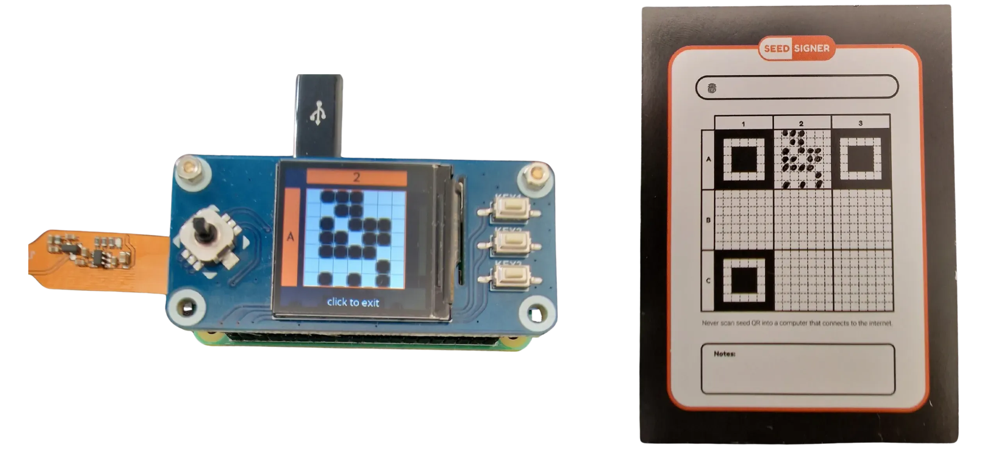


A continuación, haz clic en `Confirmar SeedQR`, y escanea tu código QR para comprobar que funciona correctamente.


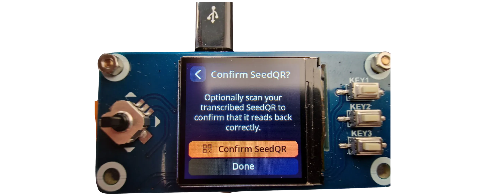


Si aparece el mensaje `Success`, su *SeedQR* es válido: puede continuar con el siguiente paso.


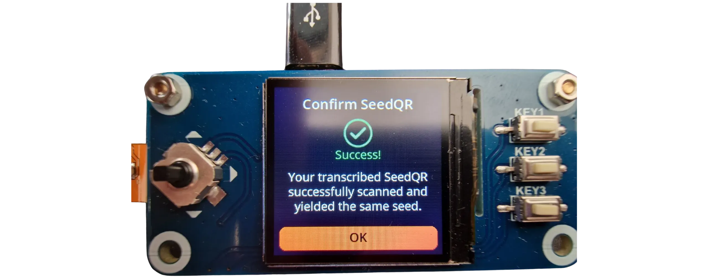


**Conserva esta hoja tan estrictamente como tu frase de recuperación. Cualquiera en posesión de este código QR puede reconstruir tus claves privadas y robar tus bitcoins.**


Enhorabuena, ¡tu cartera Bitcoin ya está en funcionamiento! Ahora importaremos sus componentes públicos a **Sparrow Wallet** para gestionarla fácilmente.


## 6. Importar wallet en Sparrow


Una vez configurado su SeedSigner y generada y guardada correctamente su seed, el siguiente paso es vincular esta cartera a un software de gestión como Sparrow Wallet. Su seed permanecerá siempre desconectada, ya que sólo se transmitirá a Sparrow la parte pública de su cartera. Esto permitirá al software mostrar tus direcciones, transacciones y crear nuevas transacciones, sin poder gastar nunca tus bitcoins. Para gastar tus bitcoins, tu SeedSigner siempre tendrá que firmar la transacción preparada por Sparrow.


### 6.1 Preparación del SeedSigner


Inserta la microSD que contiene el sistema operativo, enciende tu SeedSigner y carga el seed que acabas de crear a partir de tu código QR de copia de seguridad. En la pantalla de inicio, selecciona "Escanear" y escanea tu SeedQR con SeedSigner.


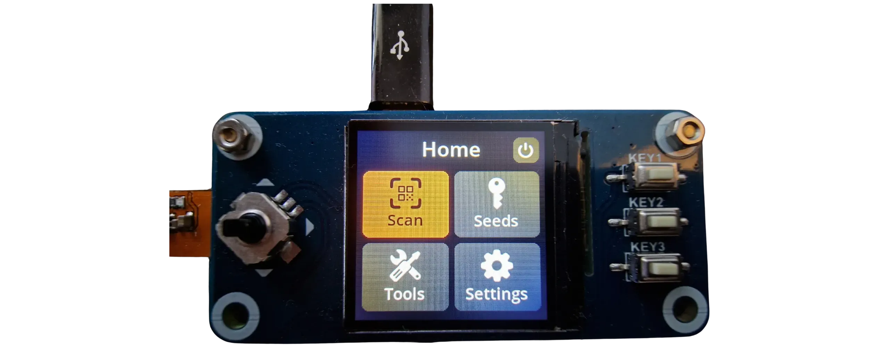


Comprueba que la huella dactilar de tu llave maestra coincide con la de tu wallet. Si utilizas una passphrase, introdúcela en esta fase.


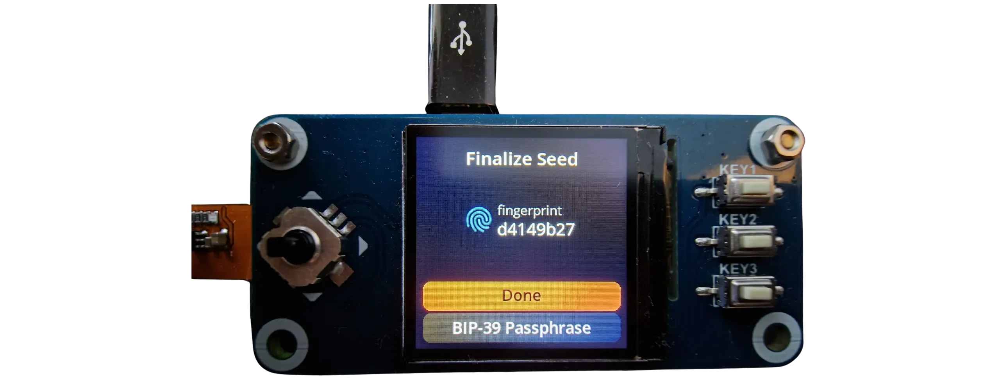


Esto te lleva al menú de tu portafolio, en mi caso llamado `d4149b27`. Si vuelves a la pantalla de inicio, selecciona `Seeds`, luego elige la impresión correspondiente a tu portafolio. A continuación, haga clic en `Export Xpub`.


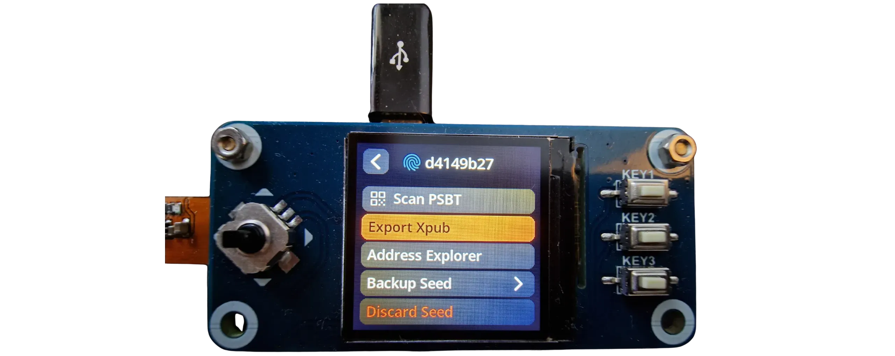


Seleccione el tipo de cartera. En nuestro caso, se trata de una cartera única: seleccione `Single Sig`.


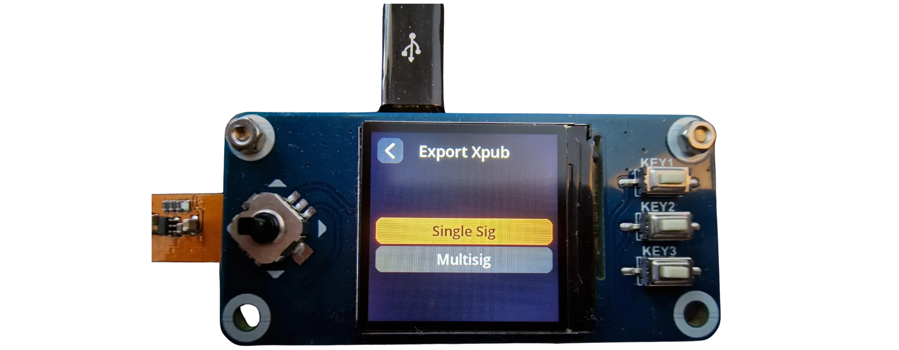


A continuación viene la elección del estándar de scripting. La más reciente y económica en términos de costes de transacción es `Taproot`. Por lo tanto, le aconsejo que elija este estándar.


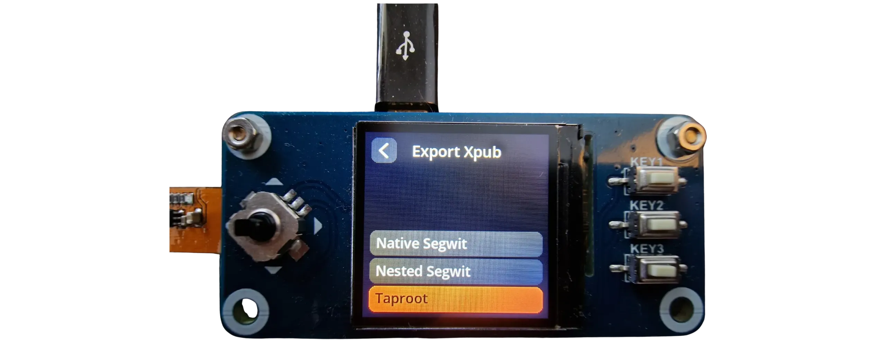


Aparecerá un mensaje de advertencia. Es normal: esta clave pública ampliada (`xpub`) le permite ver todas las direcciones derivadas de su seed (en la primera cuenta). No te permite gastar tus fondos, pero revela la estructura de tu cartera. Si alguna vez se filtra, es un problema para tu privacidad, pero no para la seguridad de tus bitcoins: te permite verlos, pero no gastarlos.


Haga clic en "Comprendo" y, a continuación, en "Exportar Xpub" si está satisfecho con la información mostrada.


El SeedSigner genera entonces su xpub en forma de código QR dinámico que contiene todos los datos que necesita para gestionar su cartera en Sparrow Wallet.


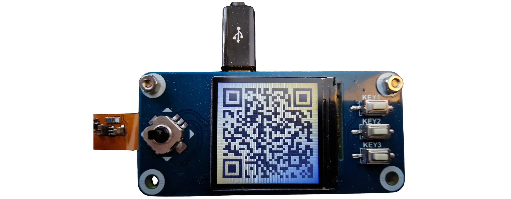


Puedes utilizar el joystick para ajustar el brillo de la pantalla y facilitar el escaneo de códigos QR.


### 6.2 Importar una nueva cartera a Sparrow Wallet


Asegúrese de que tiene instalado el software Sparrow Wallet en su ordenador. Si no sabes cómo descargarlo, comprobarlo e instalarlo correctamente, consulta nuestro tutorial completo sobre el tema:


https://planb.academy/tutorials/wallet/desktop/sparrow-c674e2ac-d46f-4c82-92a7-7d1b0e262f5d

En el ordenador, abra Sparrow Wallet y, en la barra de menús, haga clic en `Archivo → Importar Wallet`.


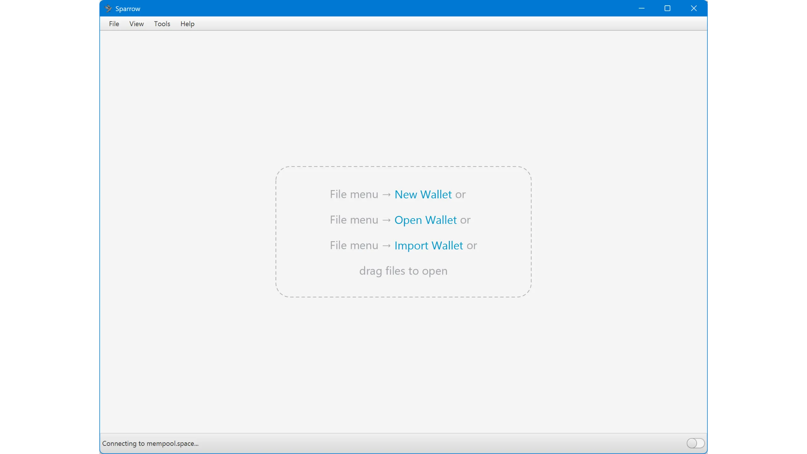


Desplácese hasta `SeedSigner` y seleccione `Escanear...`. Se abrirá la cámara web: escanea el código QR dinámico que aparece en la pantalla de SeedSigner.


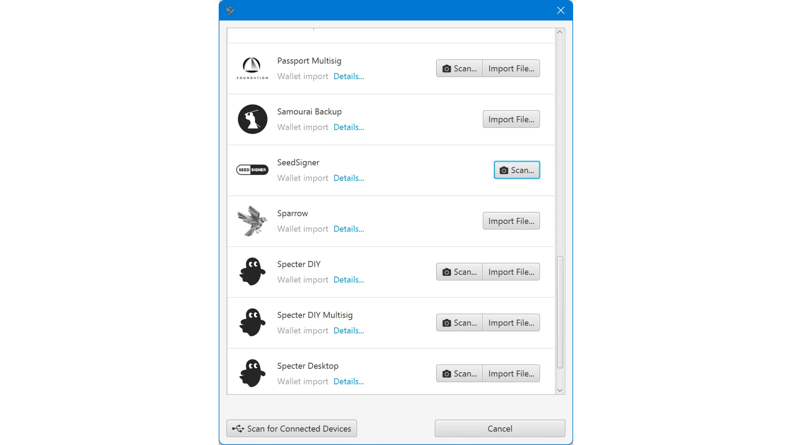


Asigne un nombre a su cartera y haga clic en `Crear Wallet`. A continuación, Sparrow le pedirá que establezca una contraseña para bloquear el acceso local a esta wallet. Elija una contraseña fuerte: protege el acceso a los datos de su cartera en Sparrow (claves públicas, direcciones, etiquetas e historial de transacciones). Esta contraseña no es necesaria para restaurar la cartera más adelante: para ello sólo se necesita su frase mnemotécnica (y posiblemente su passphrase).


Te recomiendo que guardes esta contraseña en un gestor de contraseñas para evitar perderla.


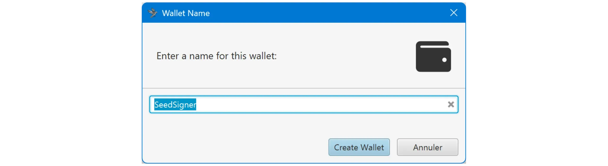


Su almacén de claves se ha importado correctamente.


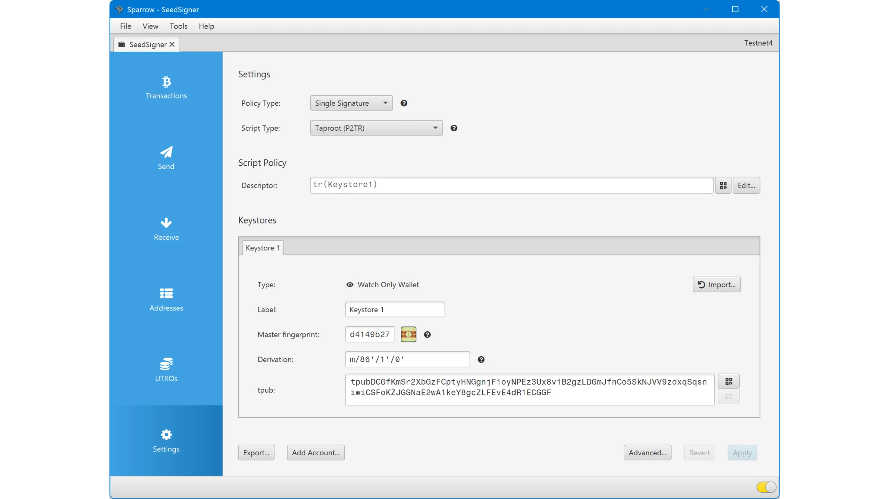


A continuación, compruebe que la "huella maestra" mostrada en Sparrow coincide con la anotada previamente en su SeedSigner.


Su SeedSigner y Sparrow Wallet están ahora conectados de forma segura. Sparrow actúa como una interfaz de gestión completa, mientras que el SeedSigner sigue siendo el único dispositivo capaz de firmar sus transacciones. Ya está listo para recibir y enviar bitcoins en una configuración totalmente protegida.


## 7. Recibir y enviar bitcoins


Tu SeedSigner y Sparrow Wallet están ahora configurados para trabajar juntos. En esta sección final, veremos cómo recibir y enviar bitcoins utilizando esta configuración.


### 7.1 Recibir bitcoins


#### 7.1.1 Generar una dirección de recepción


En su ordenador, abra Sparrow Wallet y desbloquee su SeedSigner wallet utilizando su contraseña. Asegúrese de que el software está conectado a un servidor (muesca en la parte inferior derecha). En la barra lateral, haga clic en `Recibir`.


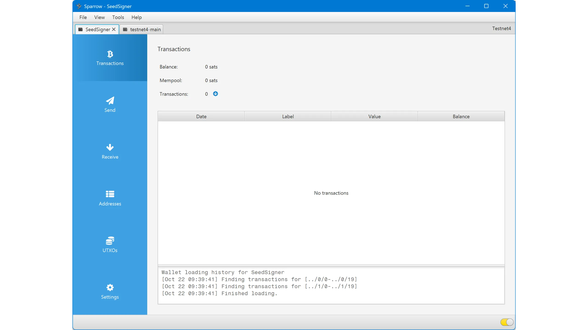


Aparecerá una nueva dirección Bitcoin. Verá :


- La dirección de texto (que empieza por `bc1p...` si usas P2TR como yo),
- El código QR correspondiente,
- Un campo `Label` para el seguimiento de sus transacciones.


Te recomiendo encarecidamente que añadas una etiqueta a cada recibo de bitcoin de tu wallet. Esto te permitirá identificar fácilmente la procedencia de cada UTXO y mejorar tu gestión de la privacidad. Para profundizar en este importante tema, puedes consultar la formación dedicada en Plan ₿ Academy :


https://planb.academy/courses/65c138b0-4161-4958-bbe3-c12916bc959c

Para añadir una etiqueta, basta con introducir un nombre en el campo `Etiqueta` y confirmar.


Por ejemplo:


```txt
Label : Sale of the Raspberry Pi Zero
```


Su dirección está ahora asociada a esta etiqueta en todas las secciones Sparrow.


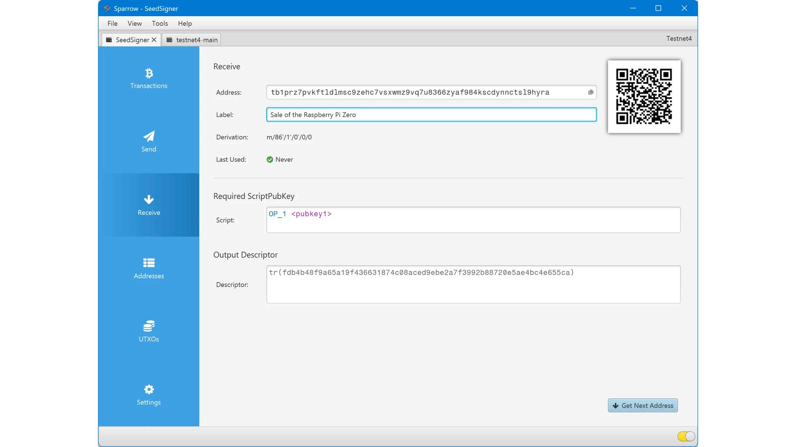


#### 7.1.2 Verificación Address en el SeedSigner


Antes de compartir su dirección de recepción, es muy importante que compruebe que pertenece a su seed. Este paso garantiza que su SeedSigner podrá firmar transacciones asociadas a esta dirección. También protege contra posibles ataques en los que Sparrow muestre una dirección fraudulenta. Recuerde que Sparrow se ejecuta en un entorno inseguro (su ordenador), que tiene una superficie de ataque mucho mayor que su SeedSigner, que está totalmente aislado. Por eso nunca debes creer ciegamente las direcciones de recepción presentadas en Sparrow hasta que las hayas verificado con tu hardware wallet.


En Sparrow, haga clic en el código QR de la dirección para ampliarlo: entonces se mostrará a pantalla completa.


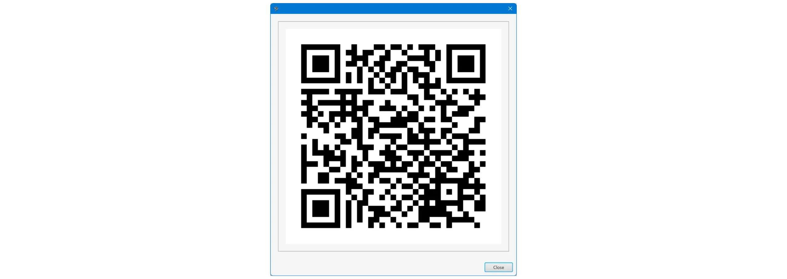


En tu SeedSigner, desde el menú principal, selecciona `Escanear`. Escanea el código QR que aparece en la pantalla de tu ordenador y elige la seed correspondiente a tu wallet (en mi caso, la huella `d4149b27`).


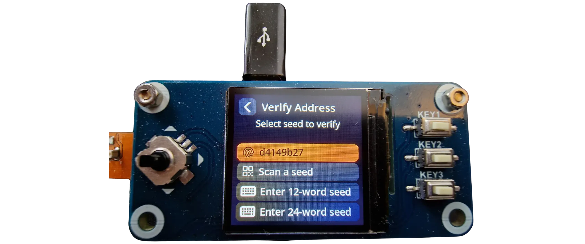


Si la dirección escaneada coincide con la derivada de su seed, la pantalla de SeedSigner mostrará el mensaje: `Address Verificado`.


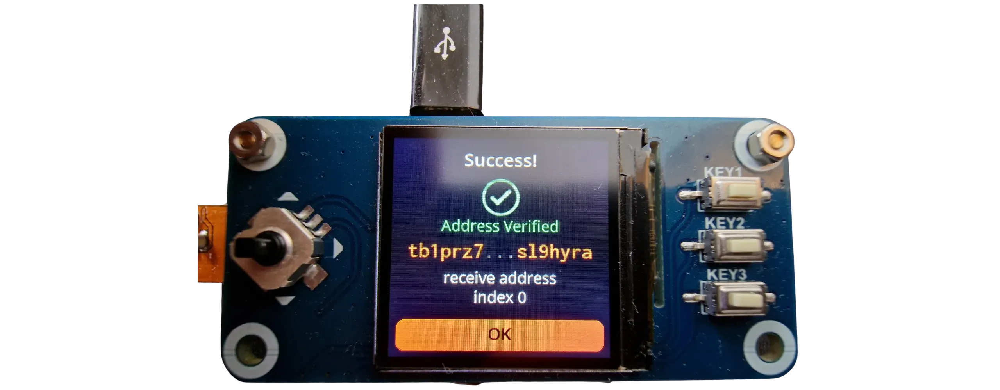


Esto confirma que la dirección pertenece a tu wallet y que puedes recibir bitcoins de ella con toda confianza.


#### 7.1.3 Recepción de fondos


Ahora puede comunicar esta dirección (en forma de texto o código QR) a la persona o departamento que necesite enviarle satss. Una vez que la transacción se haya difundido en la red, aparecerá en la pestaña `Transacciones` de Sparrow Wallet.


### 7.2 Enviar bitcoins


El envío de bitcoins con un SeedSigner es un proceso de 3 pasos:


- Creación de transacciones en Sparrow ;
- Firma de la transacción en el SeedSigner ;
- Distribución final de la transacción a través de Sparrow.


Todos los intercambios entre los dos dispositivos se realizan exclusivamente mediante códigos QR.


#### 7.2.1 Creación de la transacción en Sparrow


En Sparrow Wallet, puedes hacer clic en la pestaña `Enviar` de la barra lateral izquierda. Sin embargo, yo prefiero utilizar la pestaña `UTXOs`, que te permite practicar "*Coin Control*". Este método te da un control preciso sobre los UTXOs utilizados, para que puedas controlar la información que revelas durante la transacción.


En la pestaña `UTXOs`, seleccione las monedas que desea gastar y haga clic en `Send Selected`.


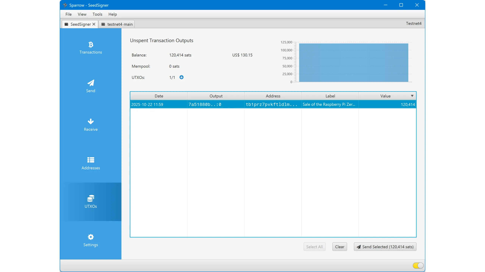


A continuación, rellene los campos de la transacción:


- En "Pagar a", pegue la dirección del destinatario o haga clic en el icono de la cámara para escanear el código QR;
- En `Etiqueta`, añada una etiqueta para realizar el seguimiento de este gasto;
- En "Importe", introduzca el importe que desea enviar;
- Por último, seleccione el tipo de tasa en función de las condiciones actuales del mercado (las estimaciones están disponibles en [mempool.space](https://mempool.space/)).


Una vez rellenados los campos, compruebe cuidadosamente la información y haga clic en `Crear transacción >>`.


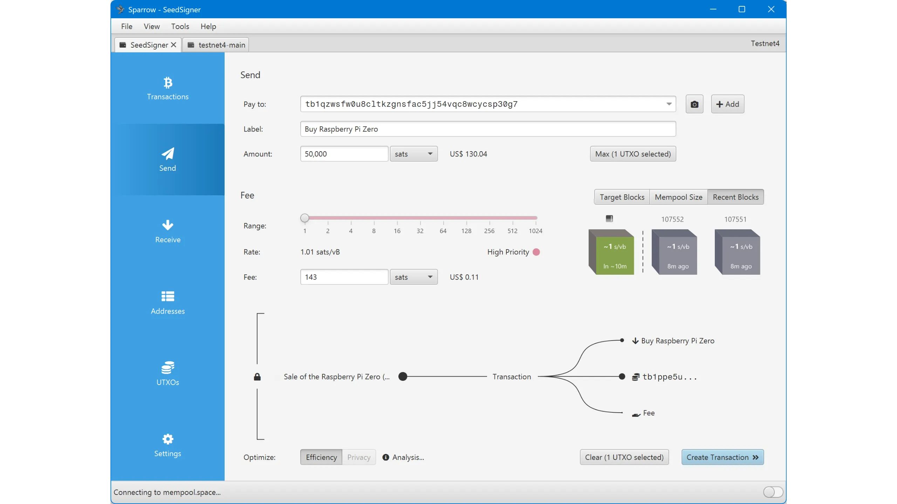


Compruebe los detalles de la transacción para asegurarse de que todo es correcto y, a continuación, haga clic en `Finalizar transacción para firmar`.


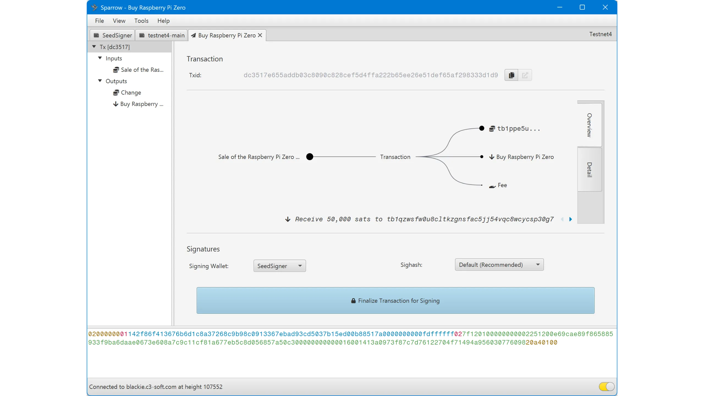


La transacción ya está lista, pero aún no está firmada. Para mostrar el [PSBT (*Partially Signed Bitcoin Transaction*)](https://planb.academy/en/resources/glossary/psbt) como código QR, haga clic en `Show QR`.


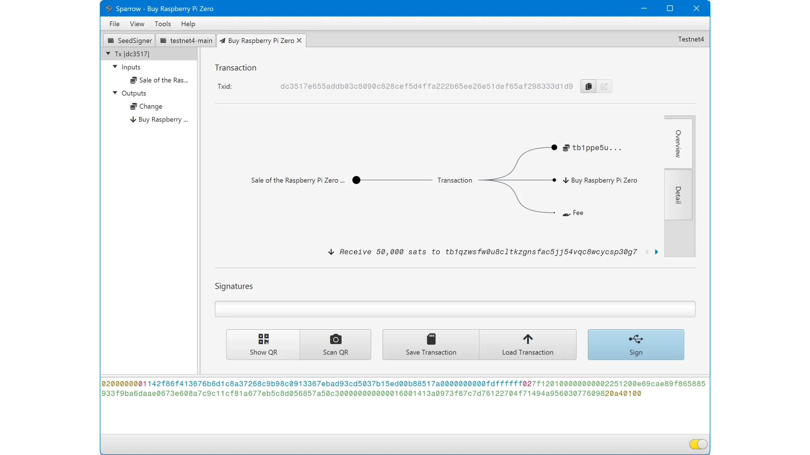


#### 7.2.2 Firma de la transacción con el SeedSigner


Encienda su SeedSigner y escanee su SeedQR para acceder a su cartera, como de costumbre. En la pantalla de inicio, seleccione `Escanear` y, a continuación, escanee el código QR que aparece en la Sparrow.


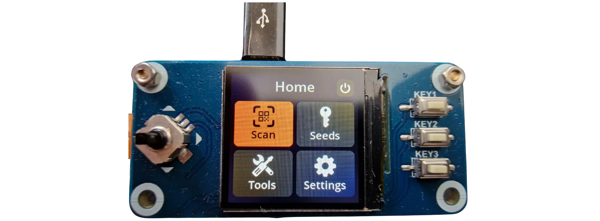


A continuación, elija la seed que mejor se adapte a su cartera.


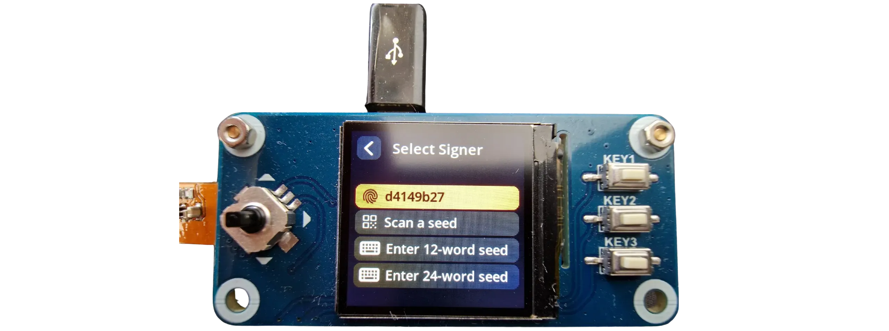


El SeedSigner detecta automáticamente que se trata de una PSBT y muestra un resumen de la transacción:


   - El importe enviado,
   - Direcciones de salida,
   - Costes de transacción asociados.


Haga clic en "Revisar detalles" y compruebe cuidadosamente toda la información directamente en la pantalla de SeedSigner. Los elementos más importantes a comprobar son el importe enviado, la dirección del destinatario y el importe de los gastos aplicados.


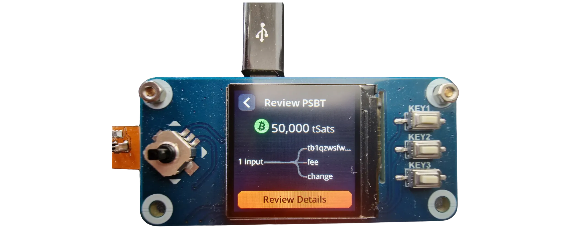


Si todo es correcto, seleccione `Aprobar PSBT` para firmar la transacción utilizando la(s) clave(s) privada(s) correspondiente(s).


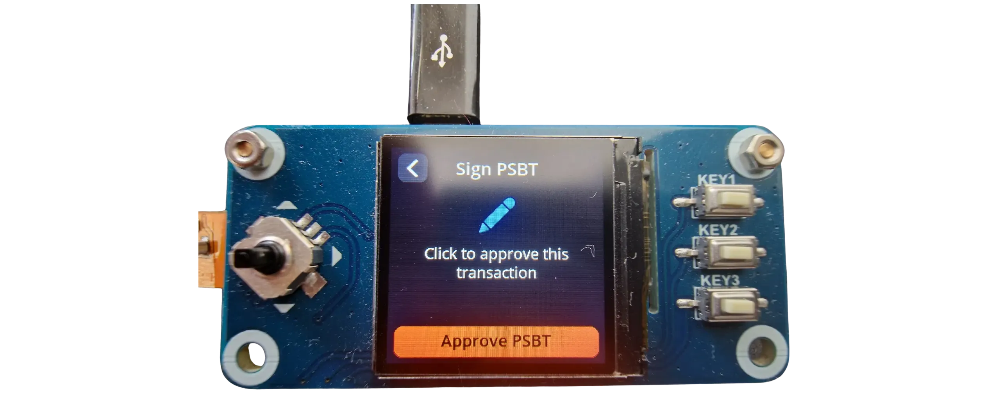


Una vez firmado, el SeedSigner genera un nuevo código QR que contiene la transacción firmada, lista para ser escaneada por Sparrow.


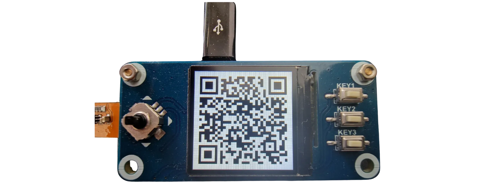


#### 7.2.3 Transmisión de la transacción desde Sparrow


Ahora que la transacción es válida, es necesario difundirla en la red Bitcoin, para que llegue a un minero que la añadirá a un bloque.


En Sparrow, haga clic en `QR Scan`.


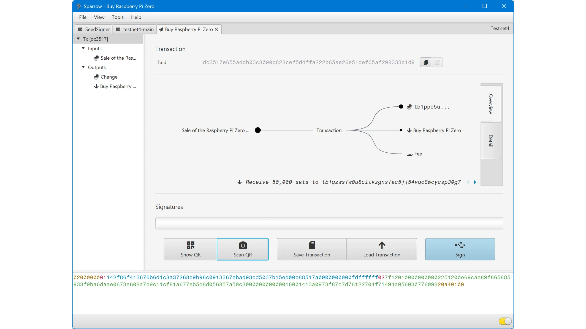


Presenta el código QR mostrado por tu SeedSigner (el de la transacción firmada) a la webcam. Sparrow descodificará la firma y mostrará todos los detalles de la transacción. Realice una última comprobación de que toda la información es correcta y, a continuación, haga clic en Transmitir transacción para difundirla en la red Bitcoin.


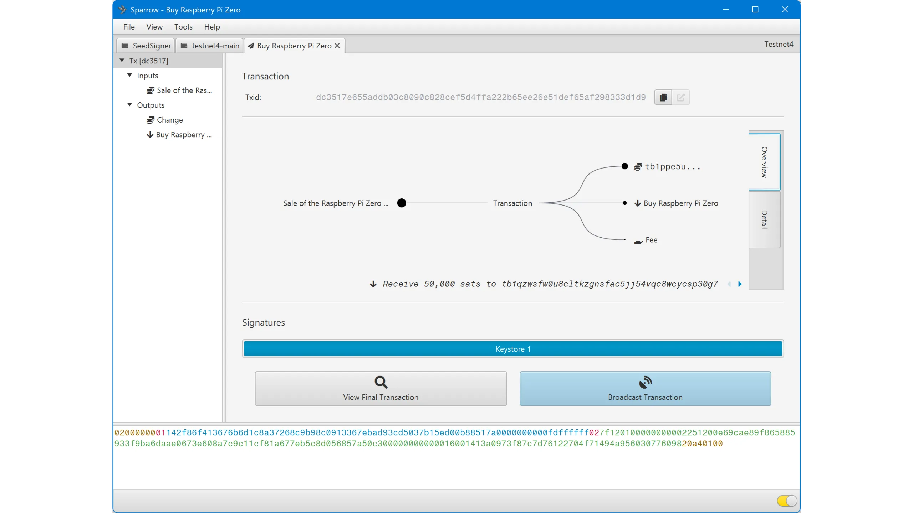


Su transacción ha sido enviada a la red Bitcoin. Puede seguir su progreso en la pestaña `Transacciones` de Sparrow Wallet.


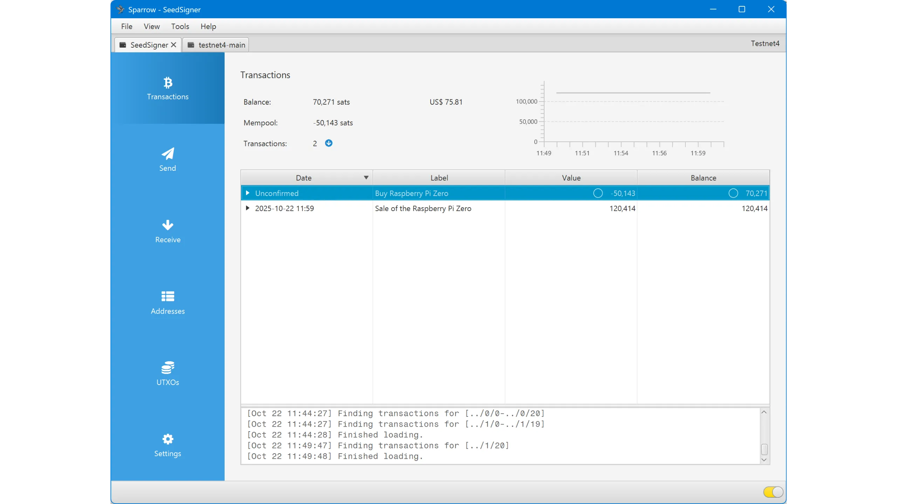


Ahora ya dominas los aspectos básicos del uso de SeedSigner. Para profundizar tus conocimientos y explorar usos más avanzados, te invito a consultar el siguiente tutorial:


https://planb.academy/tutorials/wallet/hardware/seedkeeper-seedsigner-45cca4c4-1f22-46bb-87ae-9cddb68aa579

**[¡También puedes apoyar el desarrollo del proyecto de código abierto SeedSigner haciendo una donación en bitcoins!](https://seedsigner.com/donate/)**


*Créditos: algunas de las imágenes de este tutorial proceden del [sitio web oficial del proyecto SeedSigner](https://seedsigner.com/) y del [repositorio de GitHub](https://github.com/SeedSigner/seedsigner).*