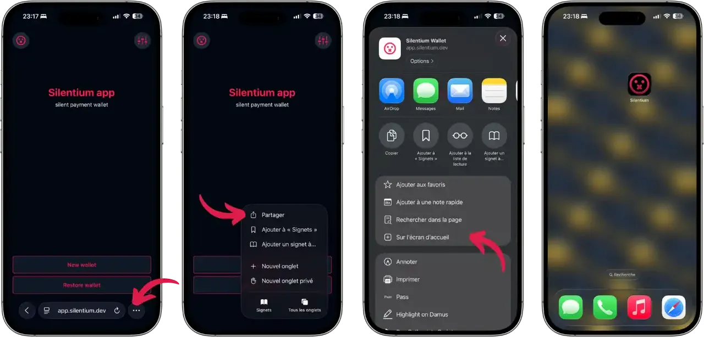
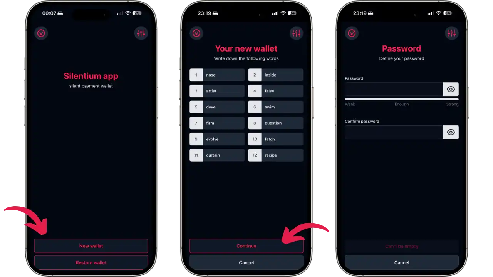
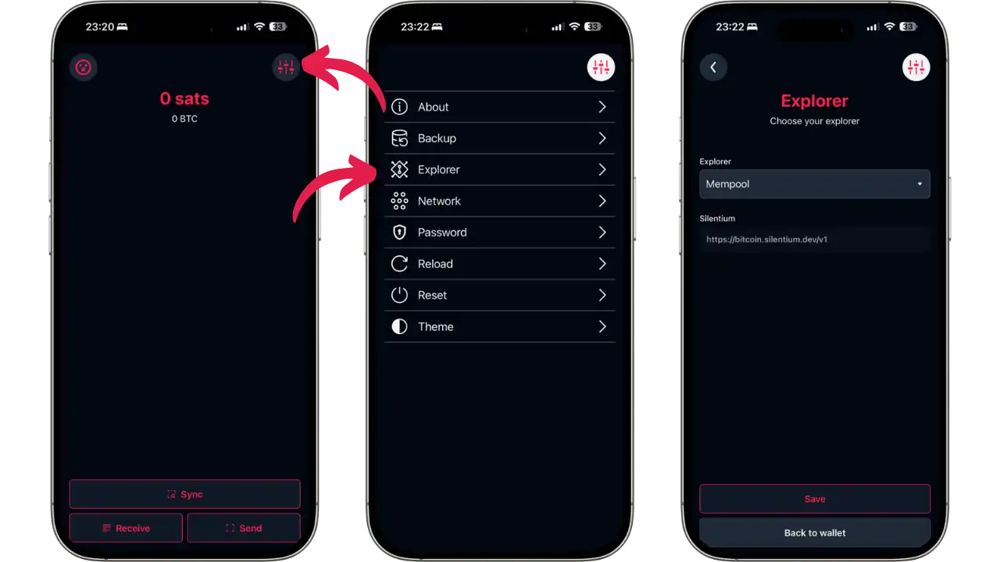
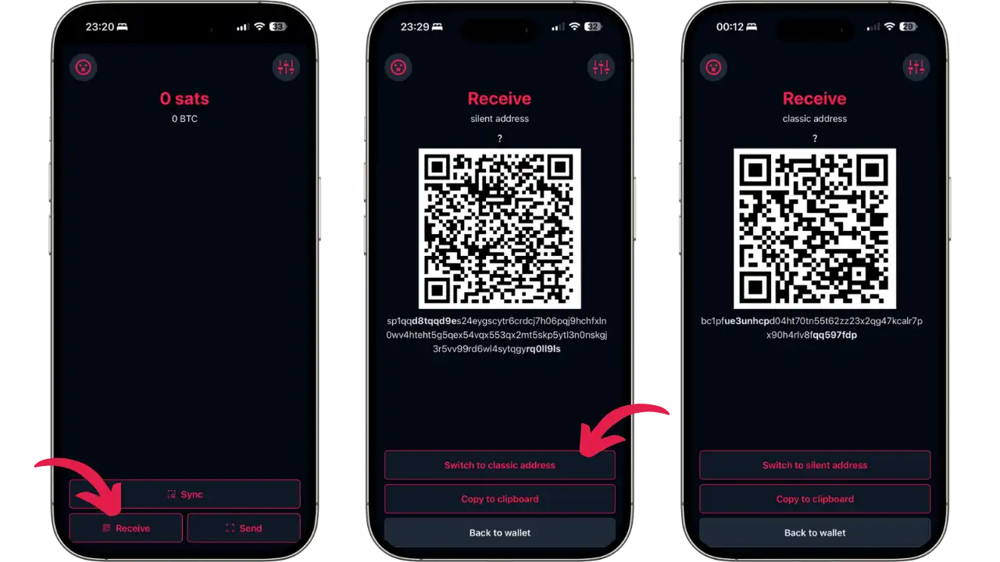
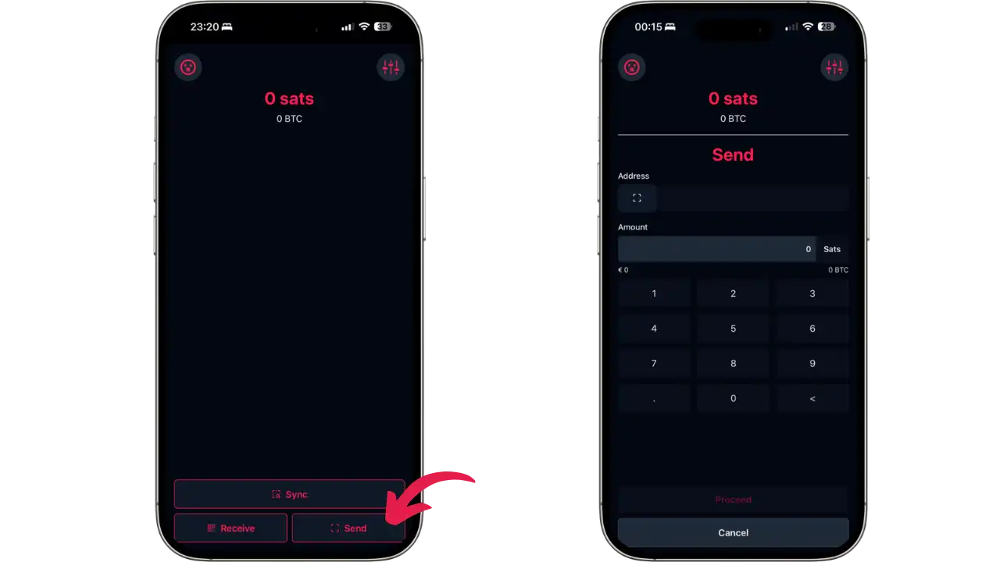

重複使用 Bitcoin 位址是對使用者機密性最直接的威脅之一。當收款人共用單一地址接收多筆付款時，任何觀察者都可以追蹤所有相關交易，並重建其財務歷史。這個問題尤其會影響到希望公開顯示捐款地址而又不損害隱私的內容創造者、慈善團體或積極份子。


Silentium 以優雅的解決方案回應這個問題，可直接從瀏覽器存取。這個由 Louis Singer 於 2024 年 5 月推出的開放原始碼漸進式網頁應用程式 (PWA)，實現了 Silent Payments (BIP-352)：一個可重複使用的靜態位址，每筆付款最後都會出現在一個獨立的區塊鏈位址上，交易之間沒有事先的互動或可觀察的連結。


**重要警告**：Silentium 是 Silent Payments 輕量級錢包的*概念驗證*實驗專案。它不應作為日常 wallet 或儲存大量資金使用。開發者明確指出：


> 使用風險自負。

請注意，此 wallet 可作為 testnet 或 regtest 使用。


## 什麼是 Silentium？


### 理念與目標


Silentium 是在輕量級 wallet 瀏覽器中實作 Silent Payments 的技術示範。雖然它也支援傳統的 Bitcoin 位址，但重點在於 Silent Payments，讓使用者可以直接嘗試這項隱私權技術。


### 無聲付款如何運作？


無聲付款 (BIP-352) 使用橢圓曲線 Diffie-Hellman 金鑰 Exchange (ECDH)。收款人產生一個靜態位址 (在 mainnet 上為「sp1...」，在 testnet 上為「tsp1...」)，由兩個公開金鑰組成：一個掃描金鑰用於偵測付款，另一個花費金鑰用於使用付款。


寄件者將其私人輸入金鑰與收件者的掃描金鑰結合，計算出一個共用的秘密，產生一個加密「調整」。此調整加入消費金鑰後，會為每筆交易建立獨一無二的 Taproot 位址。收款人使用他的私人掃描金鑰複製這項計算，以便在沒有任何事先互動的情況下偵測並花費資金。


優點：增強了發送方和接收方的保密性，不需要第三方伺服器，交易與傳統的 Taproot 支付無異。主要缺點：密集掃描區塊鏈以偵測付款。


若要瞭解更多關於靜默支付的理論運作，請參閱 BTC,204 課程的最後一部分 Plan ₿ Academy ：


https://planb.academy/courses/65c138b0-4161-4958-bbe3-c12916bc959c

## 支援的平台


Silentium 是可從任何現代瀏覽器 (行動或桌上型電腦) 存取的進階網路應用程式 (PWA)。您可以直接在`app.silentium.dev`上使用、透過瀏覽器安裝為原生應用程式，或在本機部署。安裝可直接從瀏覽器完成，無須透過官方商店。


## 使用 Web App


### 存取與安裝


[從瀏覽器前往 `https://app.silentium.dev/`](https://app.silentium.dev/)。應用程式會立即載入並顯示主畫面。


若要在 iOS 上將其安裝為原生應用程式，請按下分享按鈕 (帶向上箭頭的正方形)，然後選擇「在主螢幕上」。在 Android 上，瀏覽器通常會直接提供「新增至主螢幕」通知。安裝之後，Silentium 會以其專屬圖示出現，並作為原生應用程式運作，但需要網際網路連線才能同步交易。





### 建立投資組合


首次啟動時，選擇「建立 Wallet」以 generate 新的組合，或選擇「還原 Wallet」從現有的復原短語還原。


選擇「建立 Wallet」。應用程式會產生一個 12 個字的短語，您必須仔細寫下。這個短語是恢復資金的唯一方法。即使在測試網路上，也要採取良好的備份措施。保存短語後按 "Continue"（繼續）。


應用程式會要求您設定密碼，以確保 wallet 的存取安全。選擇一個強大的密碼並確認。





確認短語和設定密碼後，您就會進入主介面。


### Interface 主要和參數


主介面以 Satoshis 為單位顯示您的餘額（最初為 0 sats），底部有三個按鈕：


- 同步**：同步 wallet 與區塊鏈
- 接收**：接收資金
- 發送**：發送比特幣


透過右上方的圖示 (三個橫條) 存取「設定」。設定」功能表提供多個選項：


- 關於**：申請資訊
- 備份**：復原短語的備份
- 探索器**：選擇區塊鏈探索器（預設為 Mempool）和 Silentiumd 伺服器
- 網路**：網路選擇 (mainnet/testnet)
- 密碼**：變更密碼
- 重新載入**：重新載入 wallet
- 重設**：完全重設
- 主題**：變更主題





**Explorer**部分尤其重要：它讓您選擇所使用的區塊鏈探索器（預設為Mempool），還會顯示Silentiumd伺服器的URL（mainnet為`https://bitcoin.silentium.dev/v1`）。如果您託管自己的 Silentiumd 伺服器或希望使用 testnet，這就是您設定這些參數的地方。


### 接收資金


從主介面，按下「接收」按鈕。預設情況下，Silentium 會顯示 Silent Payment 位址及其 QR 碼。該地址在 mainnet 上以`sp1...`開頭，在 testnet 上以`tsp1...`開頭。


您可以使用螢幕下方的「切換到經典地址」/「切換到靜音地址」按鈕，在靜音付款和經典 Bitcoin 地址之間切換。





一旦交易被廣播，請等待幾分鐘。對於 Silent Payments，Silentium 會自動掃描區塊鏈，尋找為您準備的交易。在逐步確認之前，交易會以 「未確認 」的狀態出現。


### 發送付款


從主介面按下「傳送」按鈕。發送畫面會問您 ：


1. **Address**：貼上 Silent Payment 位址 (`sp1...`或`tsp1...`) 或經典 Bitcoin 位址。您可以使用 QR 掃描圖示掃描地址。


2. **金額**：輸入要傳送的金額（以梭子為單位）。會顯示數字鍵盤，方便輸入。您的可用餘額會顯示在頂端以供參考。





輸入地址和金額後，按「繼續」繼續。在確認交易之前，應用程式會要求您選擇所需的費用等級。


## wallet 自託管


### 為什麼要自行託管？


Silentium 的本地主機提供了完全的主權、程式碼驗證、開發環境以及面對官方網站故障時的彈性。


### 先決條件


Node.js（版本 14 以上）、npm 或 yarn、Git，以及約 500 MB 的磁碟空間。


### 本地安裝


克隆儲存庫並安裝 .NET Framework：


```bash
git clone https://github.com/louisinger/silentium.git
cd silentium
yarn install
```


### 啟動與使用


以開發模式啟動應用程式：


```bash
yarn start
```


前往瀏覽器中的 `http://localhost:3000`。如需最佳化的生產版本 ：


```bash
yarn build
```


在 `build/` 中產生的檔案可以使用 nginx、Apache 或任何 web 伺服器。默认情况下，Silentium 连接到公共的 `bitcoin.silentium.dev` 服务器。在參數中修改此設定以使用 testnet 或您自己的伺服器。


## Silentiumd 伺服器


### 角色與運作


Silentium 使用 **Silentiumd** 索引伺服器來最佳化付款偵測。掃描所有 Taproot 交易對瀏覽器或手機而言太麻煩了。


Silentiumd 為每筆 Taproot 交易預先計算中間資料（調整）。您的 wallet 會下載這些調整資料 (每筆交易幾個位元組)，並在本機執行最後的計算，驗證付款的所有權。與傳統的 Electrum 伺服器不同，伺服器永遠不會知道您的金鑰，也無法辨識您的交易。


緊湊型 BIP158 過濾器可讓您的 wallet 決定要掃描哪些區塊，而不會透露您的位址，從而保護您的機密性。


### 公共伺服器


由 Vulpem Ventures 贊助的公共伺服器`bitcoin.silentium.dev`(mainnet)提供了簡單直接的體驗。雖然保密性得以保留，但這種方式意味著對第三方基礎設施的相對信任。


### 託管您自己的 Silentiumd 伺服器


若要擁有完全的主權，請架設您自己的 Silentiumd 伺服器。先決條件：具有 `txindex=1` 和 `blockfilterindex=1` 的 Bitcoin Core 非標籤節點、Go 1.21 以上、10-20 GB 磁碟空間、系統管理技能。


**安裝：**


```bash
git clone https://github.com/louisinger/silentiumd.git
cd silentiumd
make build
./build/silentium-[OS]-[ARCH]
```


透過環境變數進行設定 (詳情請參閱儲存庫的 `config.md`)。伺服器會索引區塊鏈，並揭露一個 API，可由您的 wallet 查詢。


目前沒有 Umbrel 或 Start9 的套裝解決方案，限制了非技術使用者的使用。


## 優點與限制


### 重點介紹


- 最大的可及性**：可從任何瀏覽器使用，無需安裝大量軟體
- 多平台**：採用 PWA 技術，可在行動裝置 (Android/iOS) 和桌上型電腦上運作
- 簡單的自我託管**：只需幾個指令即可在本機安裝
- 開放原始碼**：GitHub 上完全可稽核的程式碼
- 注重隱私**：無追蹤、無分析、本地加密計算
- 分離式架構**：wallet (用戶端) 與索引伺服器之間清楚分離
- 無帳戶**：無需註冊或個人資料


### 需要考慮的限制條件


- 實驗性專案**：僅為概念驗證，不擬用於日常使用或生產
- 無保證**：錯誤、漏洞、可能的資金損失風險
- 有限支援**：使用者文件少、社群小、無官方支援
- 伺服器相依性**：需要運作中的 Silentiumd 伺服器 (公共或自行託管)
- 密集掃描**：無聲付款偵測會消耗頻寬
- 功能縮減**：無硬幣控制、無 Lightning、無多重簽名


## 最佳實踐


### seed 安全性


即使是在 testnet 上，也要認真對待您的復原短語。將它寫下來並儲存在安全的地方。將測試網和 mainnet 的錢包分開：切勿將測試 seed 用於真實資金的 wallet。


### 原始碼驗證


自託管的優勢之一是能夠在運行之前檢查源代碼。如果您打算用實際資金使用 Silentium，請花時間審核程式碼，或找可信賴的開發人員進行審核。還要比較部署在`app.silentium.dev`上的代碼的哈希值與 GitHub 倉庫的哈希值，以確保真實性。


### 備份與還原


Silent Payments 資金回收需要與 BIP-352 協定相容的 wallet。標準的 wallet 無法掃描區塊鏈來擷取您的 UTXO Silent Payments。保持 Silentium 已安裝，或確保您能使用另一個相容的 wallet（如 Cake Wallet 或其他未來的實作），以便在必要時恢復您的資金。


## 總結


Silentium 為了解 Silent Payments 提供了一個無技術障礙的測試場地。作為概念驗證，它展示了如何將此隱私技術整合到 wallet 瀏覽器中，同時保留自我監護。在 testnet 上進行實驗，探索 on-chain 隱私權的這項重大突破。


## 資源


### 官方文件


- Silentium GitHub 資源庫 (wallet): https://github.com/louisinger/silentium
- Silentiumd GitHub 資源庫 (伺服器)：https://github.com/louisinger/silentiumd
- 網路應用程式: https://app.silentium.dev/
- Silent Payments 社區網站：https://silentpayments.xyz
- 規格 BIP-352: https://bips.dev/352


### 文章與資源


- 官方公告 (Twitter)：https://x.com/TheSingerLouis/status/1790824126472667227
- NoBS Bitcoin: https://www.nobsbitcoin.com/silentium-silent-payments/
- Bitcoin Optech - 靜音付款：https://bitcoinops.org/en/topics/silent-payments/


### Testnet 工具


- Testnet 龍頭：https://testnet-faucet.com/
- Mempool testnet explorer: https://mempool.space/testnet