多重簽章 Wallet（通常稱為「*Multisig*」）是一種 Bitcoin Wallet 結構，需要不同金鑰的數個密碼簽章，才能授權支出。傳統的 Wallet（"*singlesig*"）只需一個私人金鑰即可解鎖 UTXO，而 Multisig 則不同，它是以**m-of-n**模式為基礎：在與 Wallet 相關的_n_個金鑰中，_m_個必須共同簽署每筆交易。

此機制可讓多個實體或裝置分享組合的控制權。例如，在 2 對 3 組態中，會產生三組獨立的金鑰，但釋放資金時只需要兩組金鑰。此架構可大幅降低鑰匙洩露或遺失所造成的風險：小偷只要取得一組鑰匙，就無法清空 Wallet，而遺失一組鑰匙的使用者仍可使用其餘兩組鑰匙存取資金。

然而，這種更高的安全性也帶來了更高的複雜性。設定 Multisig Wallet 需要保護數個 Mnemonic 詞組 (每個簽章因子一個) 和擴充公開金鑰 ("*xpub*")。事實上，如果您使用 Multisig 2-of-3 Wallet，要擷取 Wallet，您必須擁有全部三個 Mnemonic 詞組，或至少三個詞組中的兩個。但如果您只有三個詞組中的兩個，您也需要存取三個 *xpubs*，沒有這些詞組就不可能擷取存取它們所保護的比特幣所需的公開金鑰。

總而言之，要恢復 Multisig 組合，您必須 ：

- 或存取與每個簽章因素相關的所有 Mnemonic 詞組；
- 要麼擁有門檻所要求的最低 Mnemonic 詞組數量，以便能夠簽章，而且還能存取所有因數的 xpub，以便擷取必要的公開金鑰。

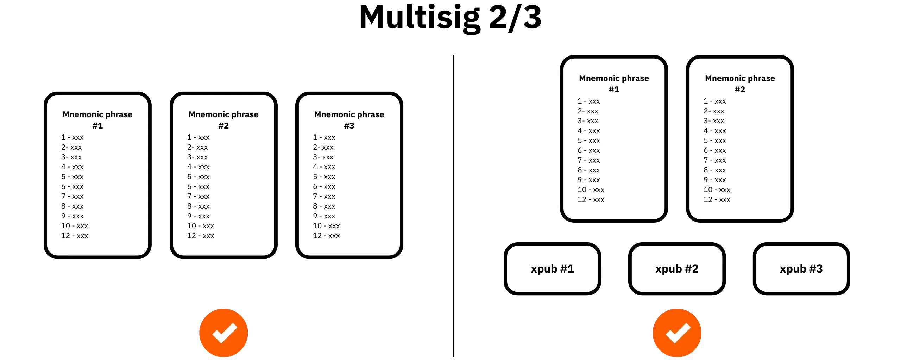

*Output Script Descriptors* 將存取資金所需的所有公開資料組合起來，有助於 Multisig 投資組合備份的管理。然而，所有投資組合管理軟體尚未實現此功能。

Multisig 特別適合希望加強安全性或集體管理資金的比特幣使用者：持有大量比特幣的公司、協會、家庭或個人使用者。它可以用來建立分散式治理方案，例如，在幾位管理者或團隊成員之間分配簽署權限。

在本教程中，我們將學習如何使用 **Sparrow Wallet** 創建和使用經典的多重簽名 Wallet。如果您想使用時間鎖來建立自訂的多重簽章組合，我建議您改用 Liana：

https://planb.network/tutorials/wallet/desktop/liana-306ef457-700c-4fdd-b07a-8fb7a8a29f04

## 先決條件

本教學，我將教您如何使用 [Sparrow Wallet 組合管理軟體](https://sparrowwallet.com/download/) 製作 Multisig。如果您尚未安裝此軟體，請立即安裝。如果您需要幫助，我們也有詳細的 Sparrow Wallet 設定教學：

https://planb.network/tutorials/wallet/desktop/sparrow-c674e2ac-d46f-4c82-92a7-7d1b0e262f5d)

若要設定多重簽章 Wallet，您需要不同的硬體錢包。以 Multisig 2-de-3 為例，您可以使用 ：

- Trezor Model One；
- Ledger Flex；
- Coldcard MK3。

在 Multisig 配置中使用不同廠牌的 Hardware Wallet 是個好主意。這樣可以確保在特定型號遇到嚴重問題時，不會影響 Multisig 的整體安全性。更重要的是，它可以讓您受益於每種裝置的特殊優點。例如，在我的配置中 ：

- Trezor Model One 完全開放原始碼，因此可以驗證 seed 世代。然而，由於它沒有配備安全元件，因此仍然容易受到物理攻擊；

- 另一方面，Ledger Flex 受惠於無法驗證的專屬韌體，但整合了安全元件，提供絕佳的實體保護；

- Coldcard 配備安全元件，其代碼是可搜尋的。對於我們的配置而言，這是一個有趣的選擇，因為它提供了其他機型所沒有的驗證功能。

在設定您的 Multisig Wallet 之前，請確認每台 Hardware Wallet 皆已正確設定 (Mnemonic 的產生與儲存、PIN 定義)。如需詳細說明，您可以參考我們針對每台 Hardware Wallet 的教學，例如 ：

https://planb.network/tutorials/wallet/hardware/trezor-model-one-5c250c49-ce3b-4c63-bd05-4600d7c11a02

https://planb.network/tutorials/wallet/hardware/ledger-flex-3728773e-74d4-4177-b39f-bd923700c76a

https://planb.network/tutorials/wallet/hardware/coldcard-q-73e86d1a-6fe6-4d8b-bb15-8690298020e3

正如我們稍後將在本教程中看到的，也可以在 Multisig 設定中整合一個與 Hardware Wallet 無關的因子，但其私密金鑰會儲存在您的電腦中。這種方法的安全性顯然不如只使用硬體錢包，但在某些情況下也許適用。例如，對於 Multisig 2-de-3，您可以選擇兩個硬體錢包和一個 Software Wallet。

## 建立 Multisig 產品組合

開啟 Sparrow Wallet，按一下「*檔案*」標籤，然後選擇「*新增 Wallet*」。

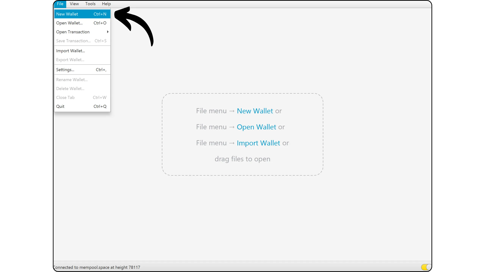

為您的多重簽名組合指定一個名稱，然後按一下「*建立 Wallet*」以確認。

在「*政策類型*」下拉式功能表中，選擇「*多重簽章*」選項。

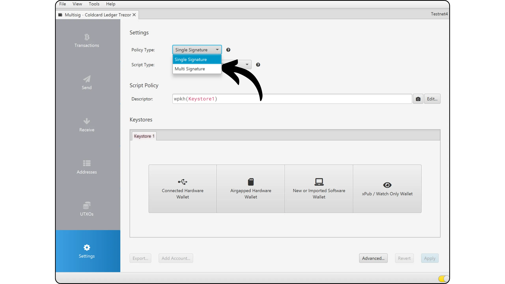

在右上角，您現在可以定義 Multisig 中的鑰匙總數，以及授權開支所需的共同簽署人數目。在我的範例中，這是一個 2 對 3 的方案。

在視窗底部，Sparrow Wallet 會顯示三個「*Keystore*」。每個都代表一組鑰匙。在這裡，我使用三個硬體組合，所以每個「*Keystore*」對應其中一個。現在我們來設定它們。

我從 Coldcard 開始。在「*Keystore 1*」標籤中，我選擇「*Airgapped Hardware Wallet*」選項。

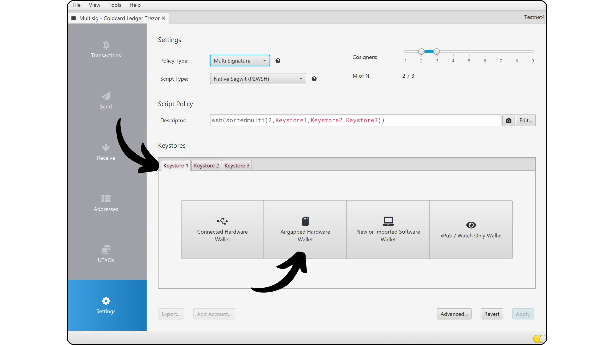

在 Coldcard 上，裝置解鎖後，我進入「*設定*」功能表，然後到「*Multisig Wallets*」。

此功能表可讓您管理 Coldcard 參與的 Multisig 組合。我想要建立一個新的組合，因此我選擇「*匯出 XPUB*」。

對於 「*帳號*」欄位，如果您只管理一個帳號，可以不填，直接按確認按鈕進行驗證。

然後，Coldcard 會 generate 一個包含您的 xpub 的檔案，並儲存在 Micro SD 卡上。

將此 Micro SD 插入電腦。在 Sparrow Wallet 中，點選「*Coldcard Multisig*」旁邊的「*Import File...*」按鈕，然後選擇卡上 Coldcard 所建立的檔案。

您的 xpub 已成功匯入。現在我們重複其他兩個硬體錢包的程序。

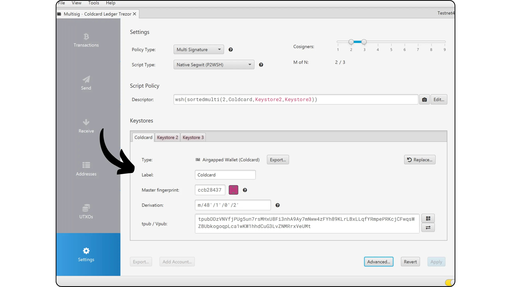

對於 Ledger Flex，我選擇「*Keystore 2*」，然後點選「*已連接的 Hardware Wallet*」。確定 Ledger 已連接至電腦、已解鎖，且 Bitcoin 應用程式已開啟。

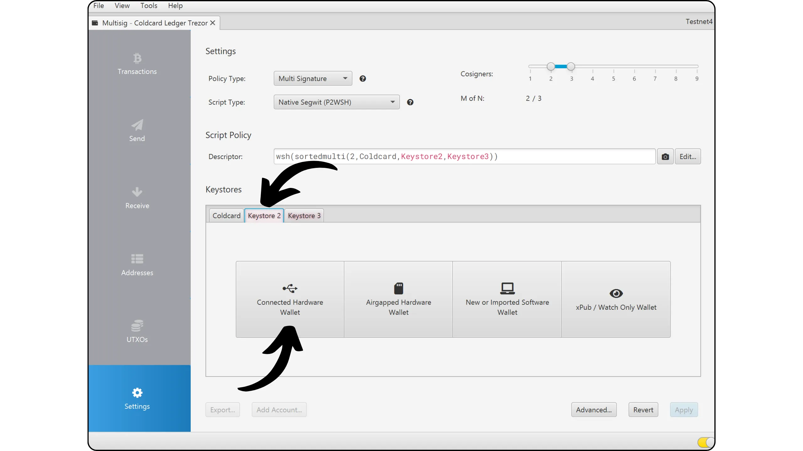

然後按一下「*掃描...*」按鈕。

在硬體組合的名稱旁邊，按一下「*匯入金鑰儲存庫*」。

第二位簽名者現在已正確地在 Sparrow Wallet 中註冊。

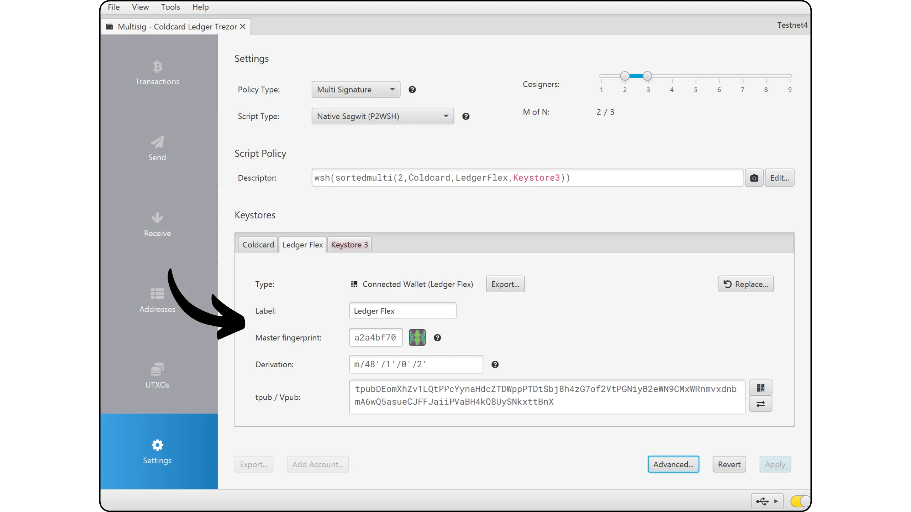

我在 Trezor One 上重複完全相同的步驟，以完成 Multisig 的設定。

在我的設定中，我們沒有涵蓋這種情況，但如果您想在 Multisig 中透過 Sparrow 中的 Software Wallet (Hot Wallet)加入簽名，只要點選「*新增或匯入 Software Wallet*」按鈕即可。

現在您所有的簽章裝置都已匯入 Sparrow Wallet，您可以點選「*Apply*」來完成 Multisig 的建立。

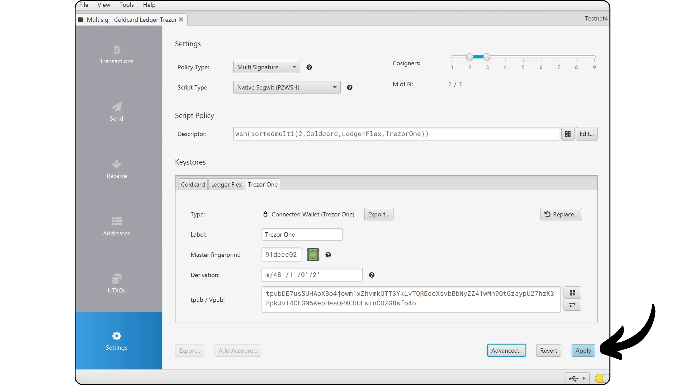

選擇一個強大的密碼，以確保您 Sparrow Wallet Wallet 的存取安全。此密碼可保護您的公用金鑰、地址、標籤和交易記錄，防止未經授權的存取。

請記住將此密碼保存在安全的地方，例如密碼管理器，以免遺失。

## 備份 Multisig 投資組合

我們現在要將 *Output Script Descriptor* 儲存在 Coldcard 上 (這只適用於 Multisig 中有 Coldcard 的使用者)，最重要的是，我們要將它備份在獨立的媒體上。

*Descriptor* 包含 Multisig 組合中的所有 xpub，以及用於 generate 鑰匙的衍生路徑。請記住我們在第一部分所看到的：若要還原 Multisig 組合，您必須擁有**所有的 Mnemonic 詞組，或是只擁有達到簽章臨界值所需的最低數量**。然而，在後者的情況下，還必須擁有**缺失簽名者的 xpubs**。*Descriptor* 包含所有 Multisig 的 xpub。

如果還不清楚，請記住：要擷取 Multisig，您需要根據臨界值（在我的案例中：2 個短語），為每個使用的 Hardware Wallet 擷取最少的 Mnemonic 短語數，以及 *Descriptor* 。

此*描述符*不包含私人密碼匙，只包含公開密碼匙。這表示它無法存取資金。因此，它不像 Mnemonic 短語那麼重要，因為 Mnemonic 短語可以完全存取您的比特幣。*Descriptor* 的風險僅與機密性有關：如果受到洩露，第三方可以觀察到您的所有交易，但無法使用您的資金。

我強烈建議您製作多份 *Descriptor* 副本，並將它們保存在 Multisig 上的每個簽章裝置中。例如，在我的情況下，我將 *Descriptor* 列印在紙上，並將一份副本保存在 Coldcard 中，另一份保存在 Trezor 中，還有一份保存在 Ledger 中。我還將這份 *Descriptor* 以 PDF 檔案的形式保存在三個 USB 隨身碟中，每個隨身碟都與其中一個硬體組合存放在一起。如此一來，我就有最大的機會不會遺失這份 *Descriptor* ，而且我也可以確定每台裝置都有兩份副本 (一份實體副本，一份數位副本)。

當您的 Multisig 產品組合建立後，Sparrow 會自動為您提供此 *Descriptor* 。按一下「*儲存 PDF...*」按鈕，即可將其儲存為文字和 QR 代碼。

然後，您可以列印此 PDF 並複製到您的 USB 隨身碟上。

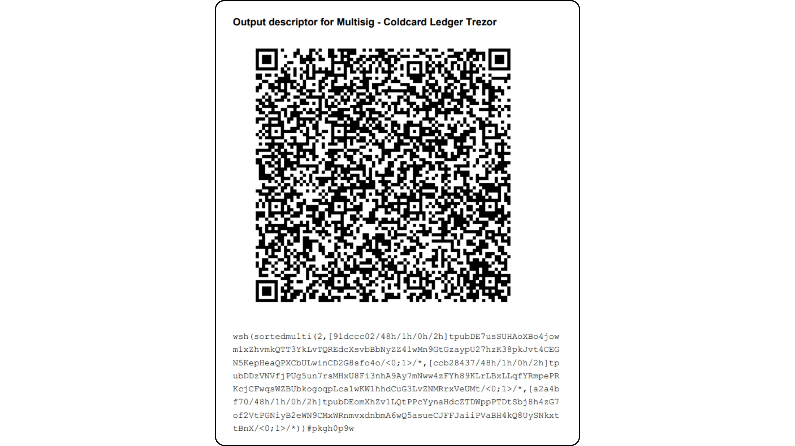

我們也會在 Coldcard 中註冊這個 *Descriptor* (如果您在設定中使用的話)。這將允許 Coldcard 驗證後續簽署的每筆交易都對應原始的 Wallet：正確的 xpubs、正確的 Address 格式、正確的衍生路徑...如果沒有這個匯入的 *Descriptor* ，Coldcard 就無法確認 Exchange 位址沒有被劫持或 PSBT 沒有被竄改。

這就是 Coldcard 在 Multisig 中如此有趣的原因：它針對某些複雜的攻擊提供額外的檢查，而其他硬體錢包卻不允許這樣做（當然，前提是您使用它來簽署）。

在 Sparrow 中，進入「*設定*」功能表，然後按一下「*匯出...*」。

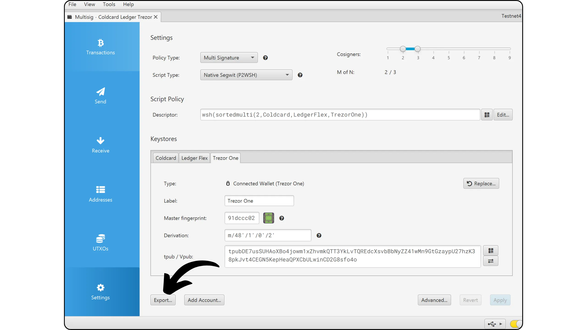

在 "*Coldcard Multisig*「選項旁，按一下 」*Export File...*"，然後將文字檔儲存到 Micro SD 卡中。

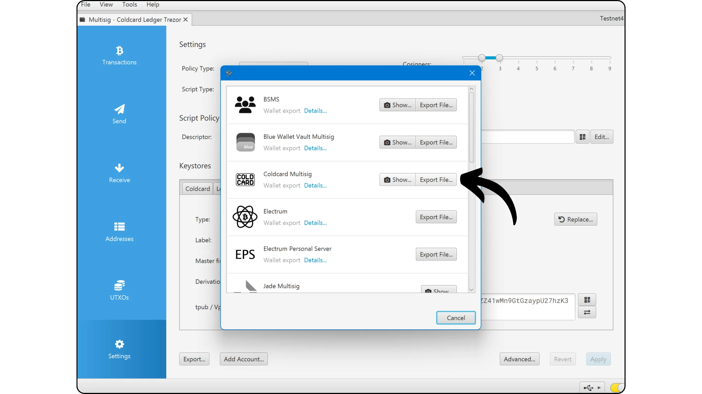

然後將卡插入 Coldcard。進入「*Settings*」功能表，然後選取「*Multisig Wallets*」，然後選取「*Import from SD*」。

選擇適當的檔案，並確認匯入。

按一下新匯入 Multisig 的名稱。

檢查 Multisig 配置參數，然後確認註冊。

您的 Multisig 現在已正確儲存於 Coldcard 中。如果您在同一台 Multisig 中有多張冷卻卡，請針對每一張冷卻卡重複此程序。

除了儲存 *Descriptor* 之外，別忘了特別注意儲存每個簽章裝置的 Mnemonic 詞組。如果您剛開始使用，我強烈建議您參考這份其他教學，學習如何正確儲存和管理它們：

https://planb.network/tutorials/wallet/backup/backup-mnemonic-22c0ddfa-fb9f-4e3a-96f9-46e2a7954270

在 Multisig 上接收第一個 bitcoins 之前，***我強烈建議您先執行一次空的恢復測試***。記下一些參考資訊，例如第一次接收 Address，然後在 Wallet 仍為空時重設您的硬體錢包。接下來，嘗試在硬體錢包上使用您的 Mnemonic 短語紙備份還原您的 Multisig Wallet，然後在 Sparrow 上使用 *Descriptor* 還原。檢查還原後生成的第一個 Address 是否與您最初寫下的相符。如果是的話，您就可以放心，您的紙本備份是可靠的。

若要進一步瞭解如何執行復原測試，我建議您參閱此其他教學：

https://planb.network/tutorials/wallet/backup/recovery-test-5a75db51-a6a1-4338-a02a-164a8d91b895

## 在您的 Multisig 上接收比特幣

您的 Wallet 現在可以接收比特幣了。在 Sparrow 中，點選「*接收*」標籤。

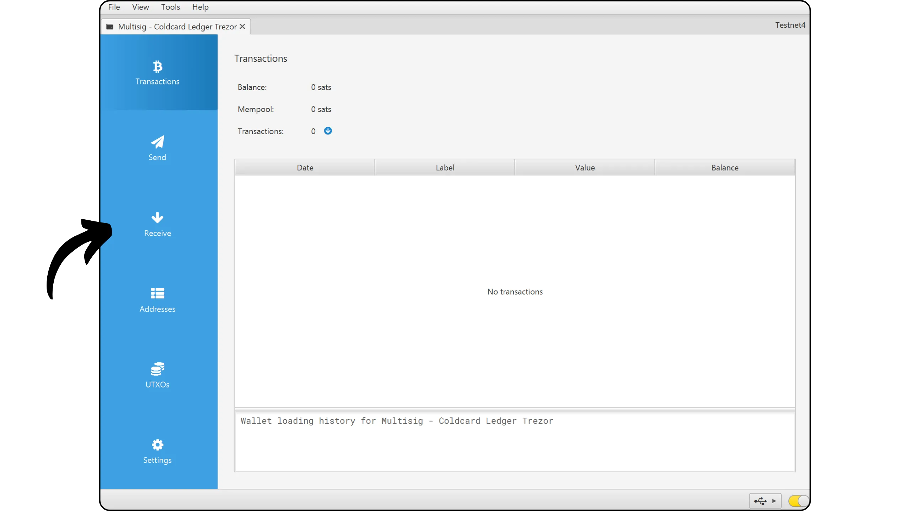

在使用 Sparrow Wallet 產生的 Address 之前，請花時間直接在硬體錢包的螢幕上檢查。這將確保 Address 未被篡改，而且您的裝置持有花費相關資金所需的私密金鑰。這有助於保護您免受多種攻擊媒介的攻擊。

若要執行此動作，請點選「*顯示 Address*」，透過纜線連接時，即可在 Trezor 或 Ledger 上顯示 Address。

有了 Coldcard，無需與 Sparrow 進行任何互動即可進行此驗證。只要開啟「*Address Explorer*」功能表，然後在最下方選擇您的 Multisig。

接著您就會看到 Multisig 所產生的接收位址。

檢查每個 Hardware Wallet 上顯示的 Address 是否與 Sparrow Wallet 中的完全一致。建議您在與付款人共用 Address 之前進行這項檢查，以確保其完整性。

然後，您可以為這個 Address 指定一個「*標籤*」，以表示所收到的比特幣的來源。這是組織管理您的 UTXOs 的好方法。

一旦經過驗證，您就可以使用 Address 來接收比特幣。

## 使用 Multisig 傳送 bitcoins

現在您已經在 Multisig Wallet 上收到第一筆 Satss，您也可以花掉它們了！在 Sparrow 中，前往「*送出*」標籤建立新的交易。

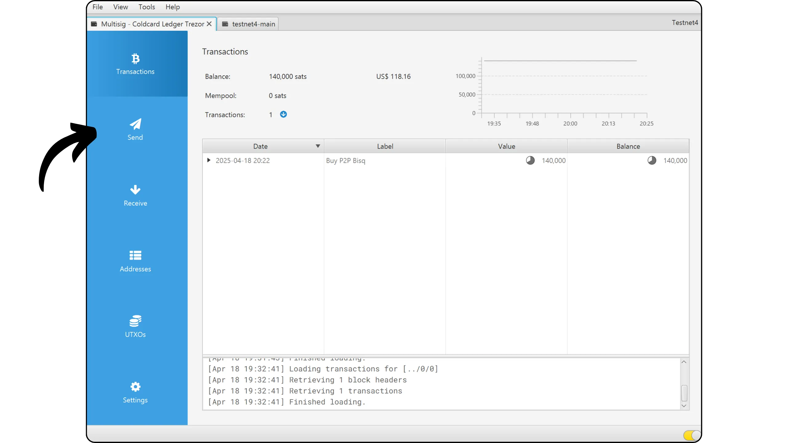

如果您希望使用 *Coin Control*，即手動選擇您要花費的 UTXOs，請前往「*UTXOs*」標籤。選擇您要花費的 UTXOs，然後點擊 「*發送所選*」。您將被自動重新導向到 「*發送*」標籤，UTXOs 已經預先填寫好了。

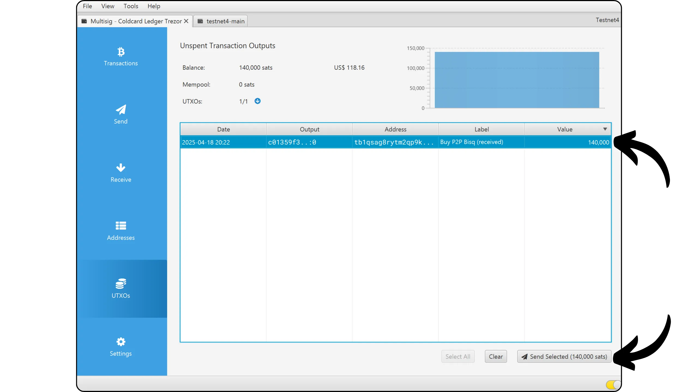

輸入目的地 Address。按一下「*+ 新增*」即可新增多個位址。

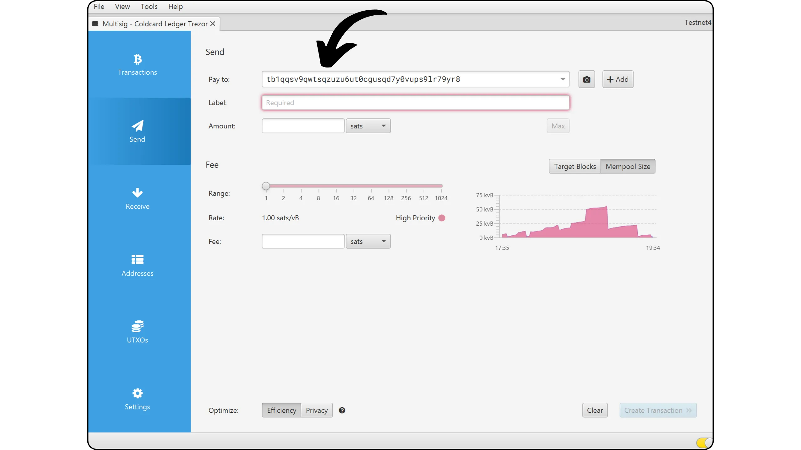

新增「*標籤*」以說明此支出的目的，讓您更容易追蹤交易。

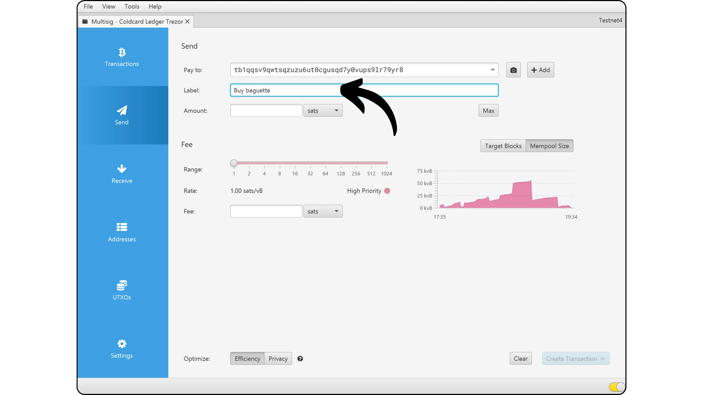

輸入要傳送到所選 Address 的金額。

根據目前的網路狀況調整充電率。例如，請參考 [Mempool.space](https://Mempool.space/)，選擇合適的充電等級。

檢查所有交易參數後，按一下「*建立交易*」。

如果您對一切都滿意，請按一下「*完成簽署交易*」。

在螢幕底部，您會看到 Sparrow 正在等待 2 個簽名。這是正常現象：這裡使用的 Wallet 是 Multisig 2-de-3。

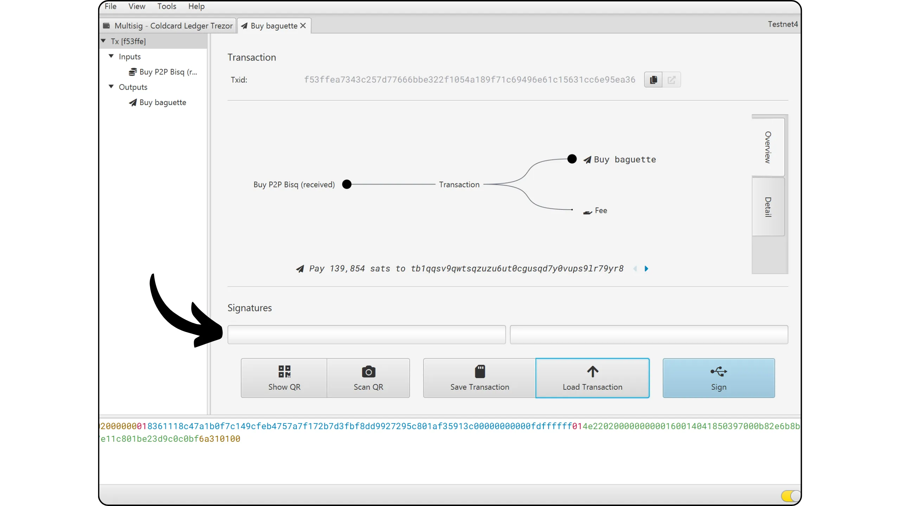

我開始用我的 Coldcard 簽署。為此，我將 Micro SD 卡插入電腦，然後按一下「*儲存交易*」。

有三種方式可以將要簽章的交易傳輸到您的 Hardware Wallet，然後再從 Sparrow 擷取。第一種是使用 Micro SD 卡，就像我們在此為 Coldcard 所做的一樣。第二種是透過纜線連接，我們將用於第二個簽章（Ledger 和 Trezor）。最後，可以使用 QR 碼通訊，用於裝有相機的裝置，例如 Coldcard Q、Jade Plus 或 Passport V2。

將 PSBT (*Partially Signed Bitcoin Transaction*) 儲存到 Micro SD 後，我將它插入 Coldcard MK3，然後選擇「*Ready to Sign*」功能表。

在您的 Hardware Wallet 畫面上，仔細檢查交易參數：收件人的 Address、發送金額和收費。交易確認後，驗證以進行簽名。

然後將 Micro SD 放回電腦，並在 Sparrow 中點選「*載入交易*」。從檔案中選擇經由 Coldcard 簽署的 PSBT。

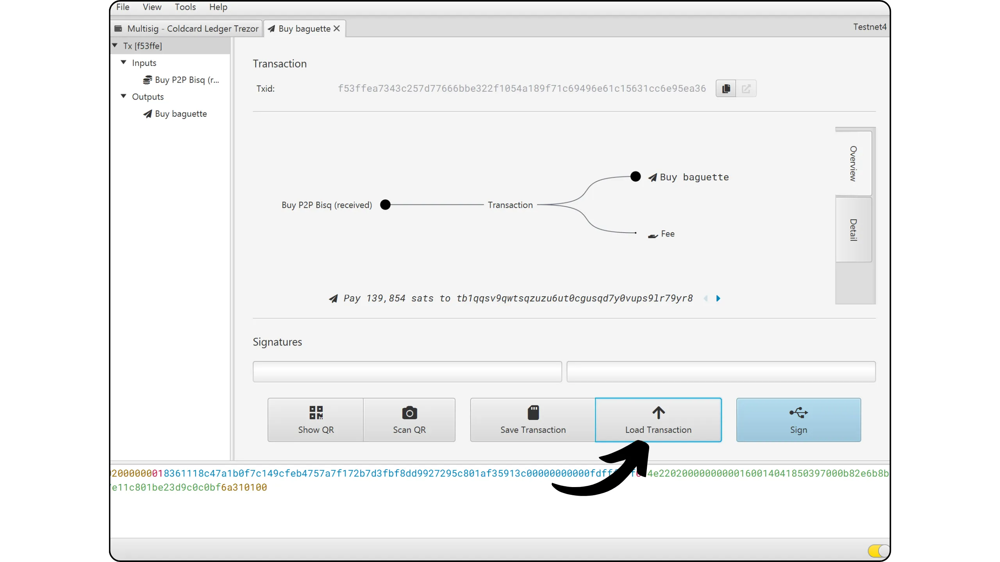

您可以看到 Coldcard 簽章已經加入。我現在要使用第二台裝置，這裡是 Ledger，來執行所需的第二個簽章。我連接它，解除鎖定，然後點選 Sparrow 上的「*Sign*」。

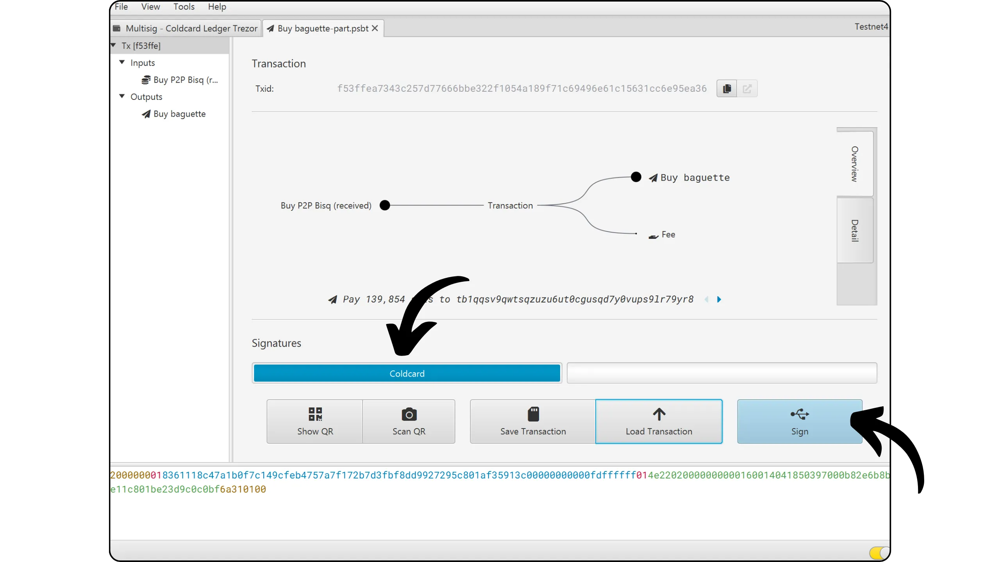

按一下您的 Hardware Wallet 名稱旁的「*簽署*」。

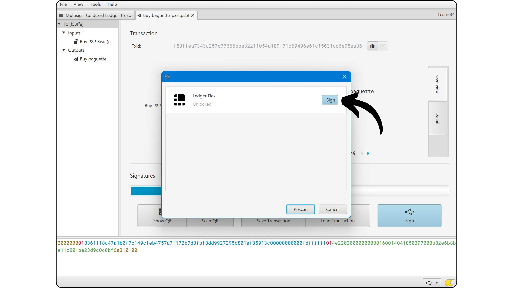

第一次使用 Ledger 與此 Multisig 時，Sparrow 會要求您驗證共同簽署人的擴充公開金鑰 (xpubs)。和 Coldcard 一樣，這個步驟可以防止您日後盲目簽署。要驗證此資訊，請比較 Ledger 螢幕上顯示的 xpub 與其他硬體錢包直接提供的 xpub。

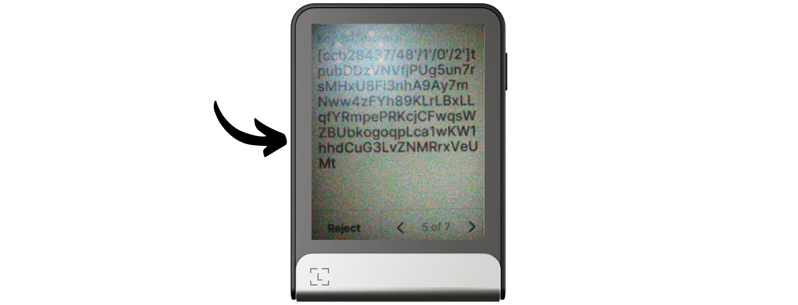

核對收款人的 Address、轉帳金額和交易費用，然後簽名交易。

按螢幕簽署。

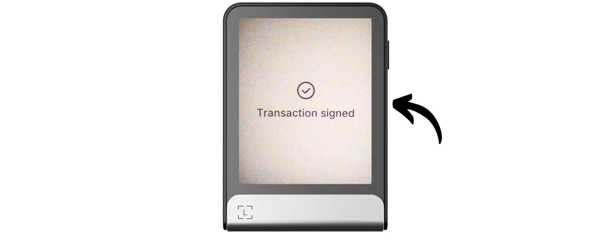

現在 Sparrow 已經有了從 Multisig 組合中釋放資金所需的兩個簽名。最後一次檢查交易，如果一切順利，請按一下「*廣播交易*」，將交易在網路上廣播。

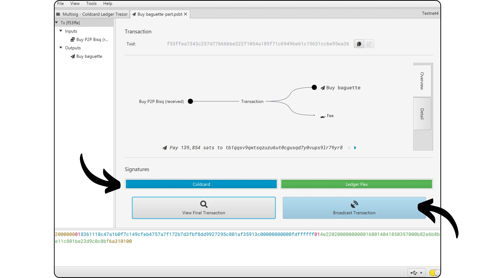

您可以在 Sparrow Wallet 的「*交易*」標籤中找到這項交易。

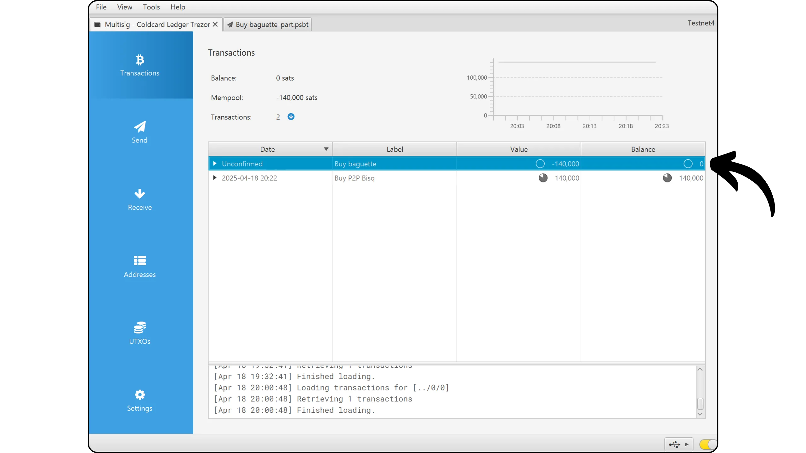

恭喜您，現在您知道如何在 Sparrow 上設定和使用多重簽章 Wallet。如果您覺得這篇教學有用，請在下方留下 Green 的拇指。請隨時在您的社交網絡上分享這篇文章。感謝您的分享！

若要更進一步，我建議您參閱本教學，了解另一種增加 Bitcoin Wallet 安全性的方法，即 passphrase BIP39：

https://planb.network/tutorials/wallet/backup/passphrase-a26a0220-806c-44b4-af14-bafdeb1adce7