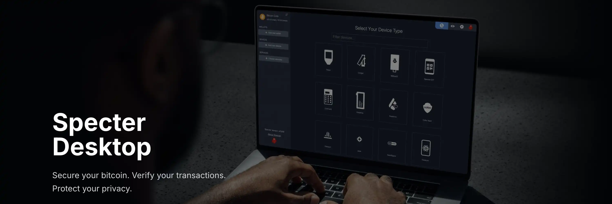

Specter Desktop to aplikacja typu open source (licencja MIT) rozwijana przez Cryptoadvance od 2019 r., która ułatwia zarządzanie portfelami Bitcoin za pomocą portfeli sprzętowych (Ledger, Trezor, Coldcard, BitBox02, Passport itp.) oraz własnej infrastruktury Bitcoin (węzeł Bitcoin Core lub serwer Electrum). Aplikacja wyróżnia się szczególnie w konfiguracjach z wieloma podpisami, umożliwiając zabezpieczenie dużych kwot poprzez rozdzielenie mocy podpisywania między kilka niezależnych portfeli sprzętowych.

**W tym samouczku dowiesz się, jak:**

- Zainstaluj i skonfiguruj Specter Desktop na swoim komputerze (Windows, macOS lub Linux)
- Podłącz Specter do serwera Electrum (w tym przykładzie użyjemy Umbrel)
- Tworzenie prostego wallet z wykorzystaniem sprzętu wallet (Coldcard)
- Odbieraj i wysyłaj bitcoiny z pełną suwerennością
- Konfiguracja wielopodpisowego wallet 2 na 3 z kilkoma portfelami sprzętowymi
- Instalacja Spectera na serwerze Umbrel (premia zaawansowana)

Wszystkie transakcje będą weryfikowane lokalnie za pośrednictwem własnej infrastruktury, bez przesyłania jakichkolwiek informacji do zewnętrznych serwerów, co gwarantuje poufność i suwerenność finansową. Przed podpisaniem zawsze sprawdzaj transakcje na ekranie swojego sprzętu wallet.

## Pobieranie i instalacja

Odwiedź oficjalną stronę Specter Desktop, aby pobrać aplikację.

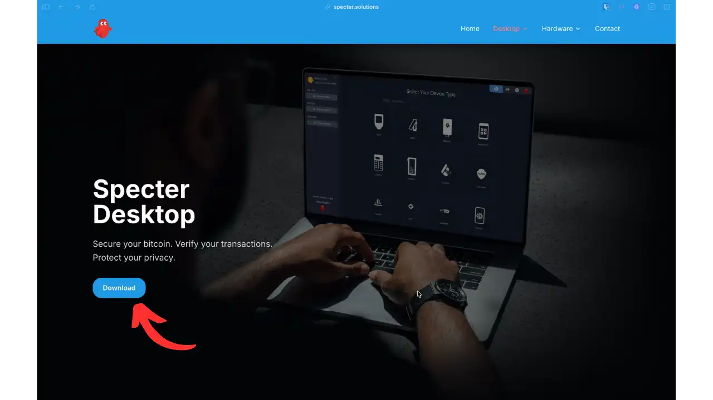

Na stronie pobierania wybierz wersję odpowiadającą Twojemu systemowi operacyjnemu: macOS, Windows lub Linux.

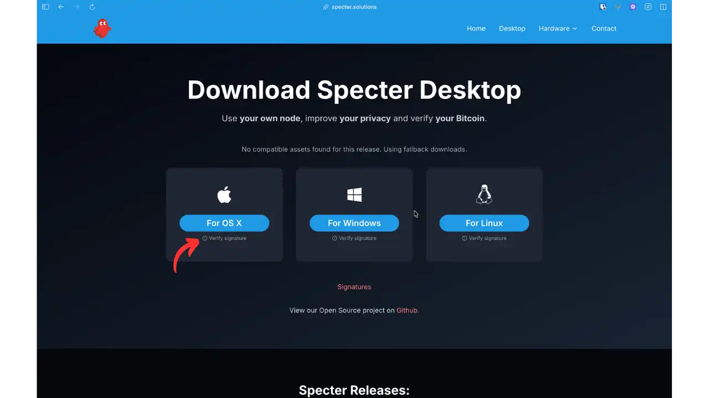

Po pobraniu zainstaluj aplikację zgodnie z instrukcjami systemu operacyjnego. W przypadku systemu macOS przeciągnij ikonę do aplikacji. W przypadku systemu Windows uruchom instalator. W przypadku systemu Linux postępuj zgodnie z instrukcjami pakietu.

## Konfiguracja początkowa

Przy pierwszym uruchomieniu Specter Desktop prosi o wybranie typu połączenia. Możesz połączyć się z serwerem Electrum lub z własnym węzłem Bitcoin Core.

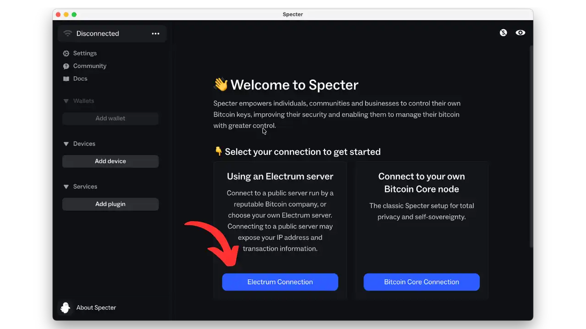

W tym przykładzie użyjemy połączenia z serwerem Electrum działającym na Umbrel.

Więcej informacji można znaleźć w naszym samouczku Umbrel:

https://planb.academy/tutorials/node/bitcoin/umbrel-8b0e3b5b-d3cf-4a1e-8bb8-1ad2db4dd848

Ta opcja oferuje szybszą synchronizację niż Bitcoin Core. Jeśli wolisz, możesz wybrać "Bitcoin Core" i skonfigurować połączenie z węzłem lokalnym. Poniższe kroki pozostają takie same niezależnie od dokonanego wyboru.

Wybierz "Electrum Connection", a następnie "Enter my own", aby skonfigurować własny serwer Electrum.

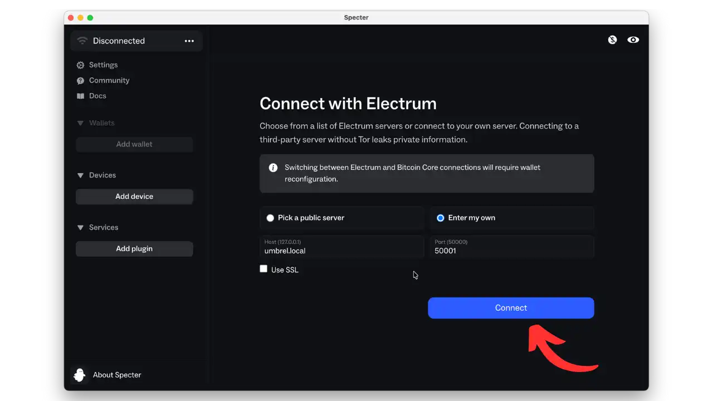

Wprowadź adres swojego serwera Electrum. W naszym przypadku z Umbrel, adresem będzie `umbrel.local` z portem `50001`. Kliknij "Połącz", aby nawiązać połączenie.

Po podłączeniu pojawi się ekran powitalny z listą kontrolną ułatwiającą rozpoczęcie. Teraz należy dodać portfele sprzętowe.

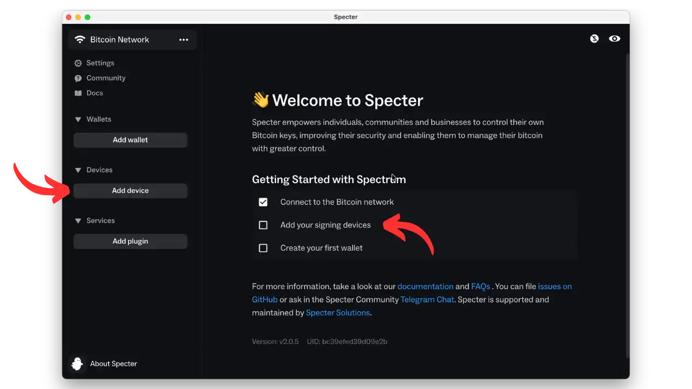

## Dodawanie sprzętu wallet

W menu po lewej stronie kliknij "Dodaj urządzenie", aby dodać sprzęt wallet.

Specter Desktop obsługuje wiele portfeli sprzętowych: Trezor, Ledger, BitBox02, Coldcard, KeepKey, Keystone, Cobo Vault i wiele innych.

Jeśli chcesz dowiedzieć się więcej, zapoznaj się z naszymi samouczkami dotyczącymi sprzętu wallet.

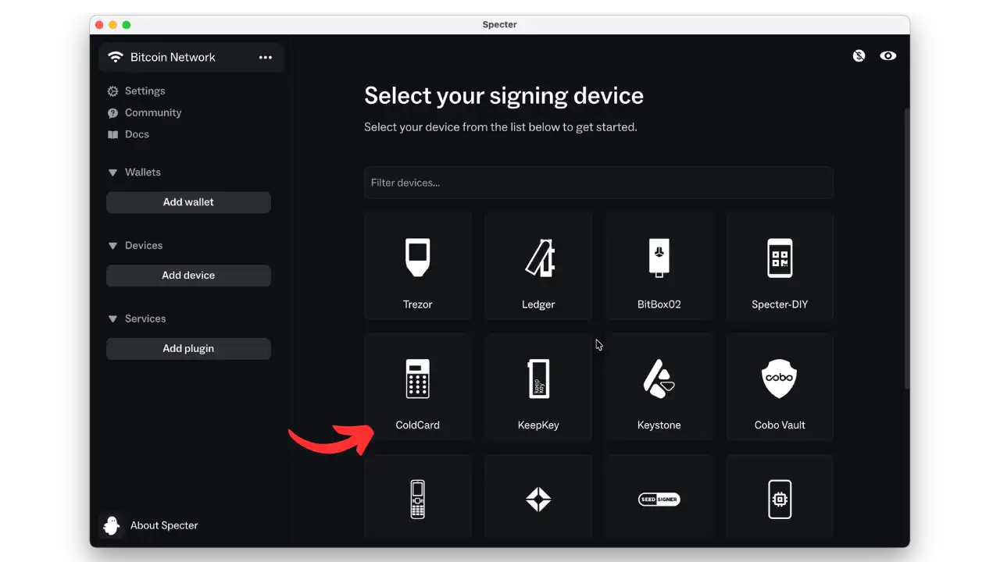

Wybierz sprzęt wallet. W tym przykładzie używamy karty Coldcard MK4.

Poniżej znajduje się nasz samouczek dotyczący tego sprzętu wallet:

https://planb.academy/tutorials/wallet/hardware/coldcard-mk4-5d44dd94-423d-4e37-9a8c-3fc38b45ce59

W przypadku karty Coldcard należy wyeksportować klucze publiczne ze sprzętu wallet za pośrednictwem połączenia USB lub karty microSD.

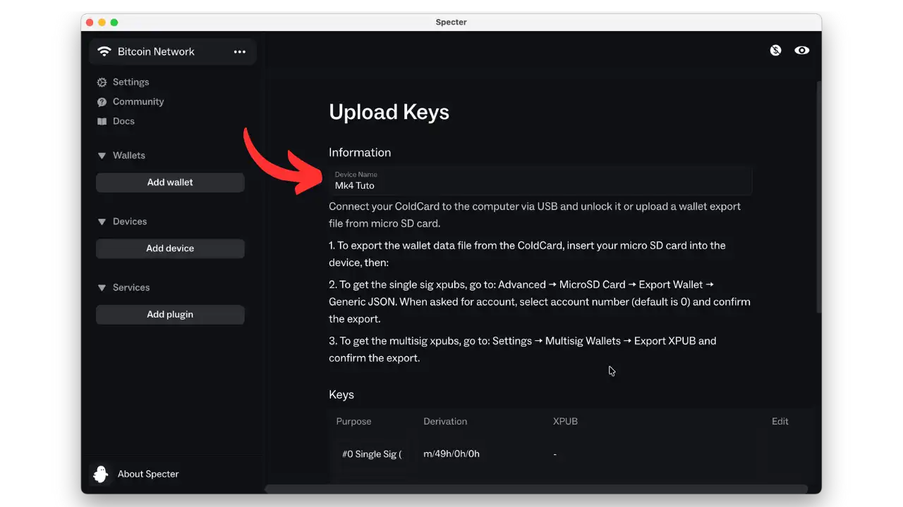

Postępuj zgodnie z wyświetlanymi instrukcjami, aby wyeksportować klucze z karty Coldcard. Nadaj swojemu sprzętowi wallet nazwę (tutaj "MK4 Tuto"). Po zaimportowaniu kluczy można utworzyć wallet z jednym kluczem lub dodać inne portfele sprzętowe dla wallet z wieloma podpisami.

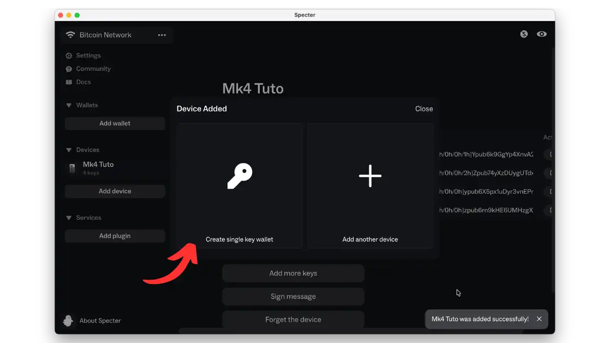

## Tworzenie portfolio

Po dodaniu sprzętu wallet kliknij "Utwórz pojedynczy klucz wallet", aby utworzyć wallet z pojedynczym podpisem.

Nadaj swojemu portfelowi nazwę (np. "Wallet for tuto") i wybierz typ adresu. Wybierz "Segwit", aby używać natywnych adresów bech32, które optymalizują koszty transakcji.

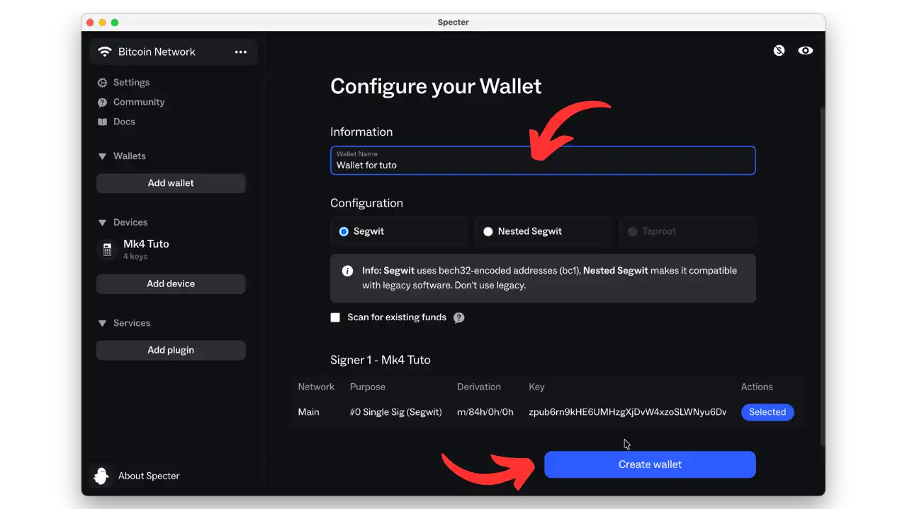

Po utworzeniu portfela Specter oferuje zapisanie kopii zapasowej pliku PDF zawierającego wszystkie informacje publiczne potrzebne do przywrócenia portfela (deskryptory, rozszerzone klucze publiczne). Plik ten nie zawiera kluczy prywatnych.

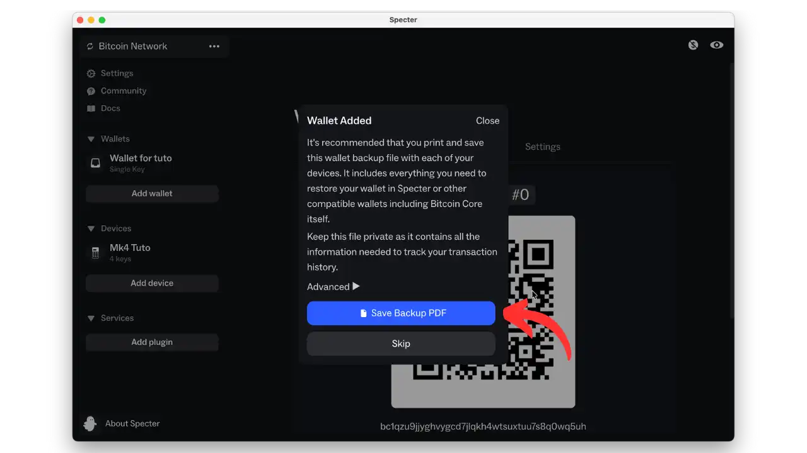

## Odbieranie bitcoinów

Aby otrzymać bitcoiny, wybierz wallet w menu po lewej stronie, a następnie kliknij zakładkę "Odbierz".

Specter automatycznie generuje nowy adres odbiorczy z kodem QR.

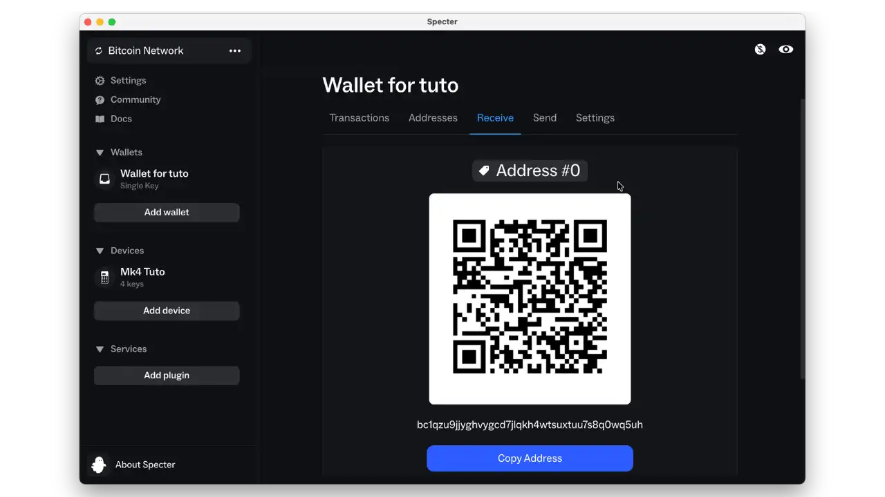

Adres można skopiować lub zeskanować kod QR. Zawsze sprawdzaj adres na ekranie sprzętu wallet przed przekazaniem go komukolwiek.

## Wyświetlanie historii i adresów

Po otrzymaniu bitcoinów możesz przeglądać swoje transakcje w zakładce "Transakcje".

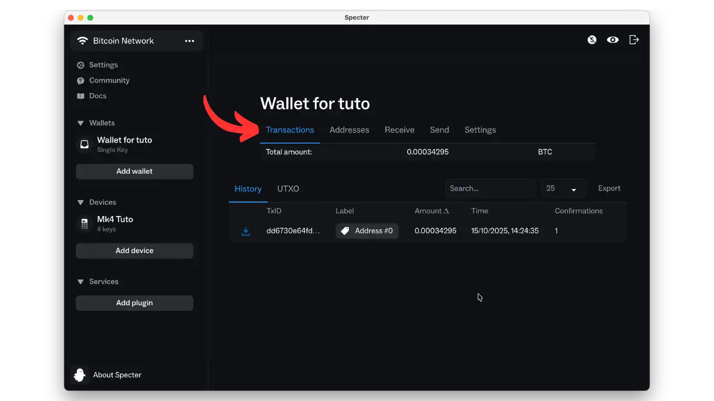

Zakładka "Adresy" umożliwia wyświetlenie wszystkich adresów wygenerowanych przez portfel, wraz z ich statusem użycia i powiązanymi kwotami.

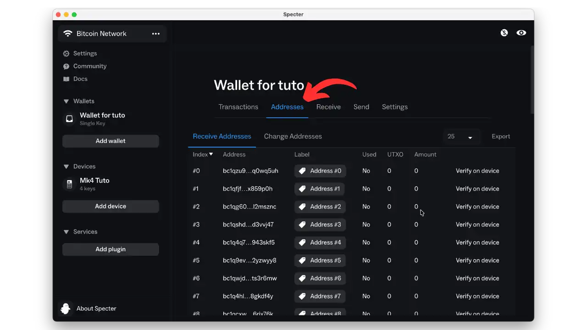

## Wysyłanie bitcoinów

Aby wysłać bitcoiny, kliknij zakładkę "Wyślij". Wprowadź adres odbiorcy, kwotę do wysłania i zaznacz opcje zaawansowane, jeśli chcesz ręcznie wybrać UTXO (kontrola monet).

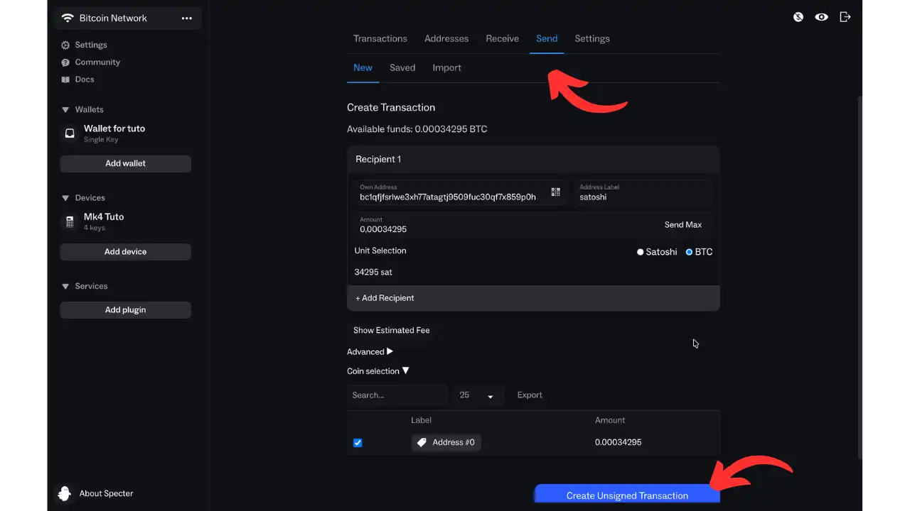

Kliknij "Utwórz niepodpisaną transakcję", aby utworzyć transakcję. Następnie Specter poprosi o podpisanie transakcji za pomocą sprzętu wallet.

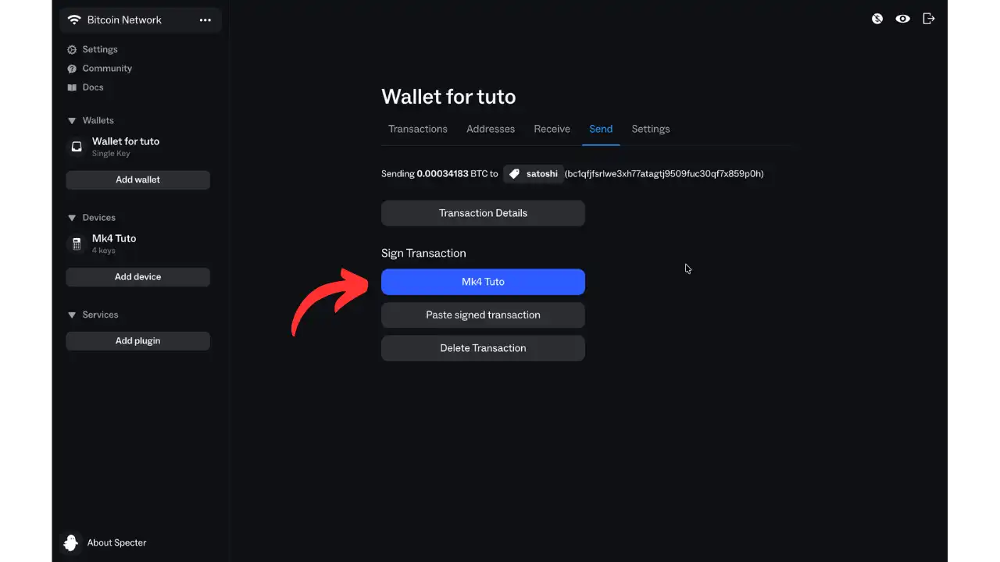

Jeśli używasz karty Coldcard, będziesz mieć do wyboru podpisanie przez USB lub przy użyciu karty microSD (air-gapped). Potwierdź transakcję na ekranie sprzętu wallet, dokładnie sprawdzając adres docelowy i kwotę.

Po podpisaniu transakcji można ją rozgłosić w sieci Bitcoin.

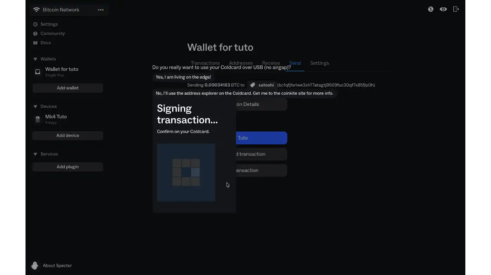

Kliknij "Wyślij transakcję", aby wysłać transakcję. Specter potwierdzi, że transakcja została wysłana i możesz śledzić jej status w zakładce Transakcje.

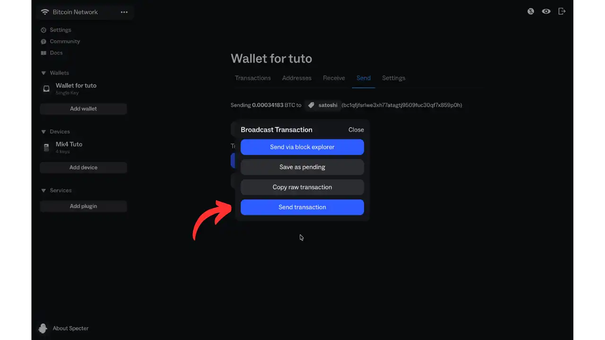

## Tworzenie i korzystanie z portfela z wieloma podpisami

Jedną z głównych zalet Specter Desktop jest możliwość uproszczenia zarządzania portfelami z wieloma podpisami. Multisig wallet wymaga kilku podpisów do autoryzacji transakcji, eliminując w ten sposób pojedynczy punkt awarii. Na przykład konfiguracja 2 na 3 wymaga dwóch podpisów z trzech oddzielnych portfeli sprzętowych w celu zatwierdzenia dowolnego wydatku.

Aby utworzyć multisig wallet, zacznij od dodania wszystkich podpisujących portfeli sprzętowych za pomocą opcji "Dodaj urządzenie". W tym przykładzie będziemy używać trzech różnych portfeli sprzętowych: Coldcard MK4 (już dodany wcześniej), Passport i Ledger. Ta dywersyfikacja producentów wzmacnia bezpieczeństwo, unikając zależności od jednego łańcucha dostaw lub oprogramowania układowego.

Oto linki do samouczków Ledger i Passport:

https://planb.academy/tutorials/wallet/hardware/ledger-nano-s-plus-75043cb3-2e8e-43e8-862d-ca243b8215a4

https://planb.academy/tutorials/wallet/hardware/passport-74e53858-3fa2-43f9-b866-573297546236

Dodaj urządzenie Passport, nadając mu nazwę (np. "Passport multi") i importując klucze za pomocą karty microSD lub kodu QR. Następnie kliknij "Kontynuuj", aby kontynuować.

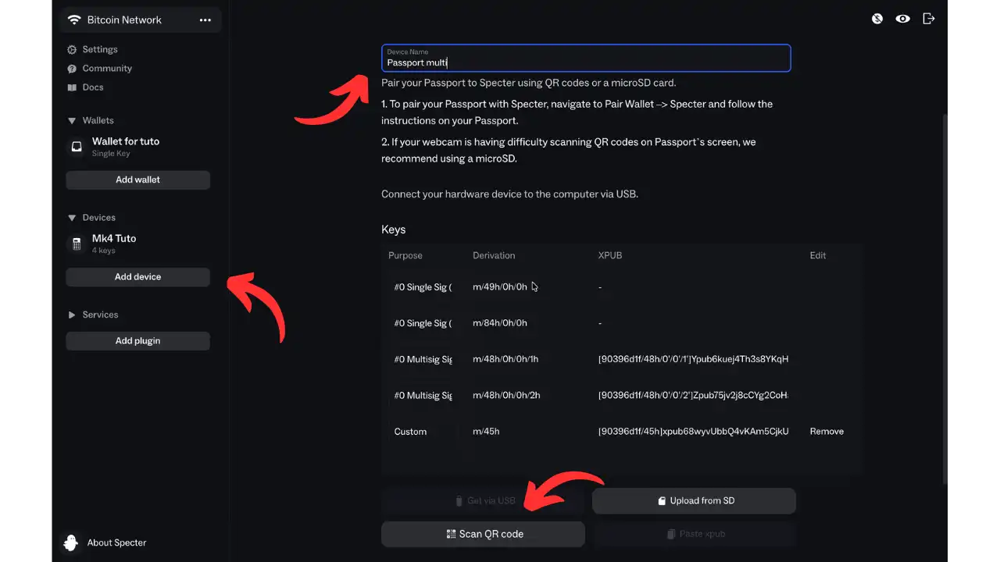

Następnie dodaj Ledger, podłączając go przez USB i otwierając aplikację Bitcoin na sprzęcie wallet. Nadaj mu nazwę (np. "ledger multi") i kliknij "Get via USB", a następnie "Continue", aby zaimportować jego klucze publiczne.

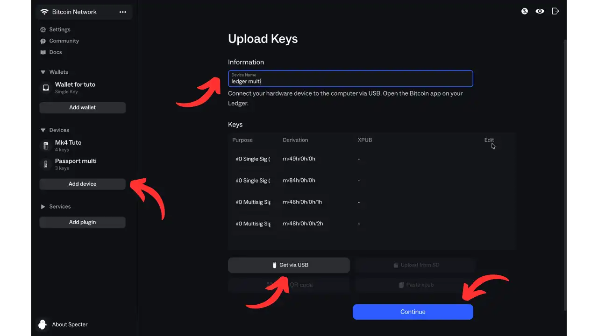

Po zarejestrowaniu trzech portfeli sprzętowych w Specter, kliknij "Add wallet" i wybierz opcję "Multiple Signature", aby utworzyć wallet z wieloma podpisami.

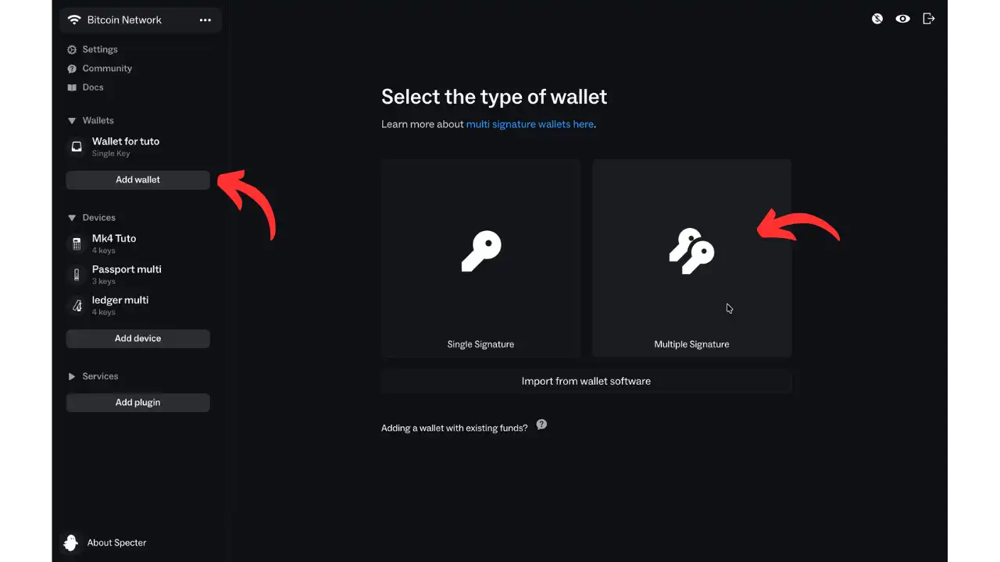

Wybierz trzy portfele sprzętowe, które chcesz włączyć do kworum wielopodpisowego: MK4 Tuto, Passport multi i ledger multi. Kliknij "Kontynuuj", aby przejść do następnego kroku.

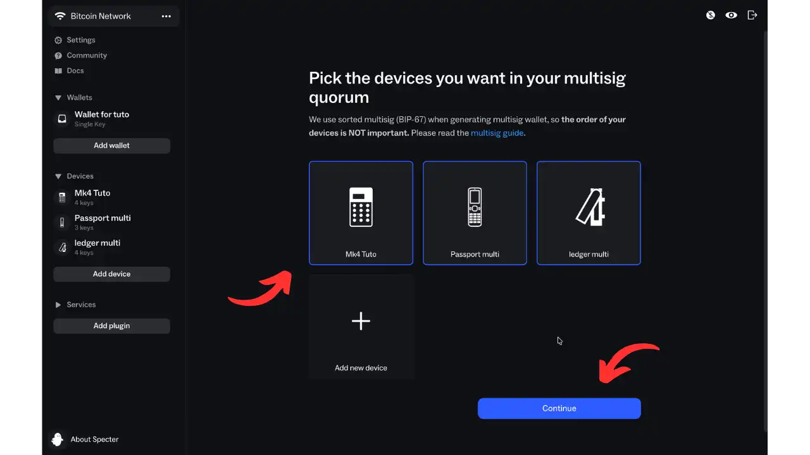

Wybierz konfigurację wielopodpisową. Wybierz "Segwit" jako typ adresu, aby skorzystać ze zoptymalizowanych opłat. Parametr "Wymagane podpisy do autoryzacji transakcji (m z 3)" pozwala zdefiniować próg: dla konfiguracji 2 na 3 wymagane są 2 podpisy. Każdy sprzęt wallet wyświetla odpowiadający mu klucz multisig. Kliknij "Utwórz wallet", aby sfinalizować tworzenie.

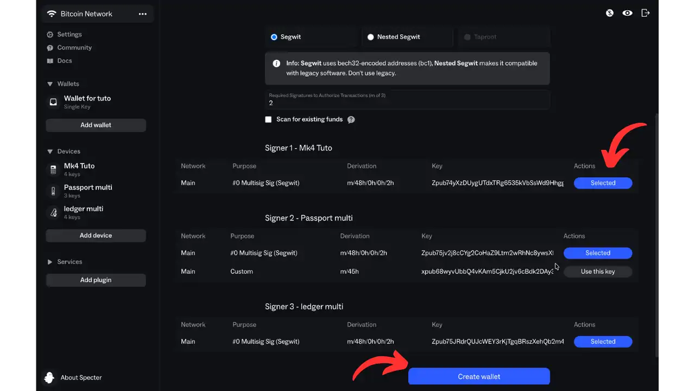

Twoje portfolio z wieloma podpisami "Multi tuto" zostało utworzone. Specter natychmiast zaleca zapisanie zapasowego pliku PDF zawierającego deskryptor portfolio. Kliknij "Zapisz zapasowy plik PDF", aby pobrać ten krytyczny plik.

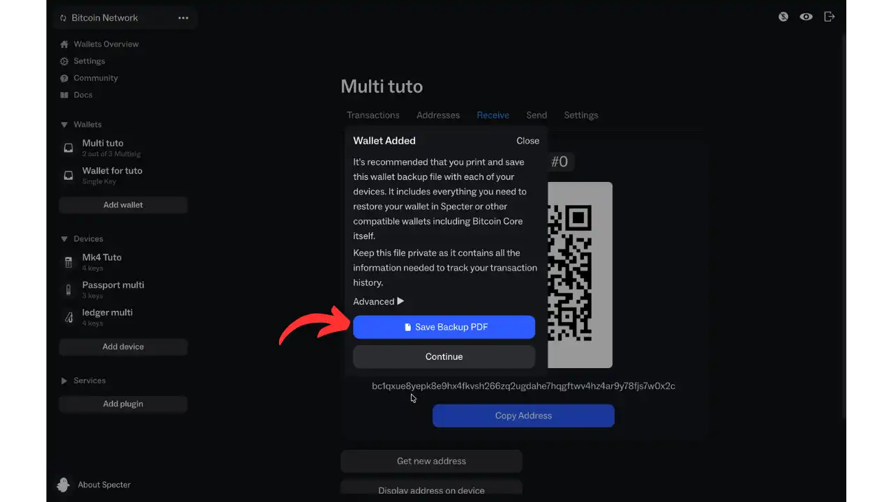

Specter pozwala również eksportować informacje wallet do każdego portfela sprzętowego za pomocą kodu QR lub pliku. Umożliwia to niektórym portfelom sprzętowym (takim jak Coldcard lub Passport) przechowywanie konfiguracji multisig bezpośrednio w ich pamięci.

W przypadku Passport odblokuj urządzenie, a następnie przejdź do "Zarządzaj kontem" > "Połącz Wallet" > "Specter" > "Multisig" > "Kod QR", a następnie zeskanuj kod QR wygenerowany przez Specter. Następnie Passport poprosi o zeskanowanie adresu odbiorczego z wallet w celu zatwierdzenia konfiguracji multisig.

W przypadku MK4 podłącz go do komputera i odblokuj. Następnie kliknij "Save MK4 Tuto file" i zapisz plik w MK4. Następnym razem, gdy podpiszesz swój sprzęt wallet, MK4 użyje tego pliku, aby zakończyć konfigurację multisig.

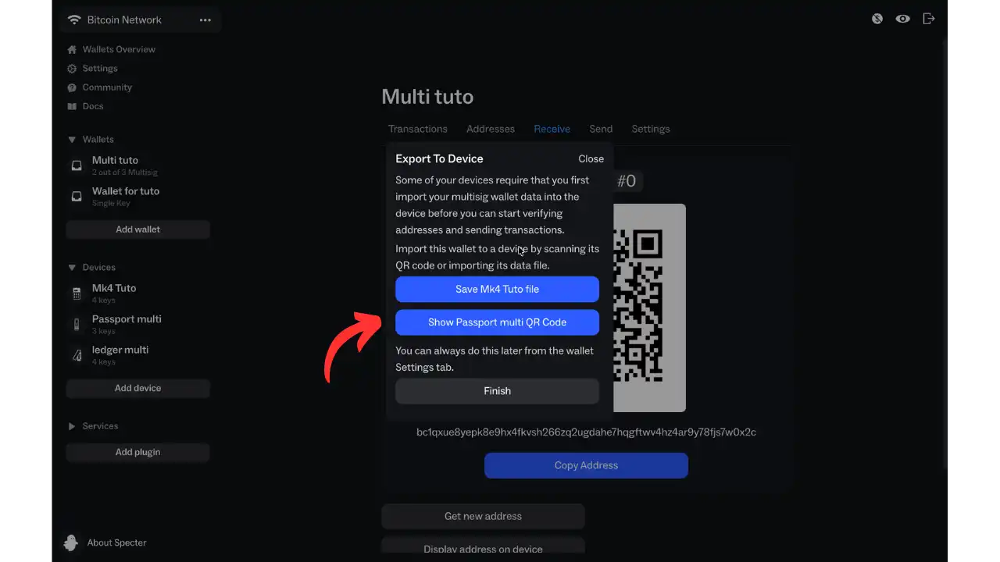

Dla Twojej informacji, możesz uzyskać dostęp do kopii zapasowych w dowolnym momencie z zakładki "Ustawienia" swojego portfolio, a następnie "Eksportuj":

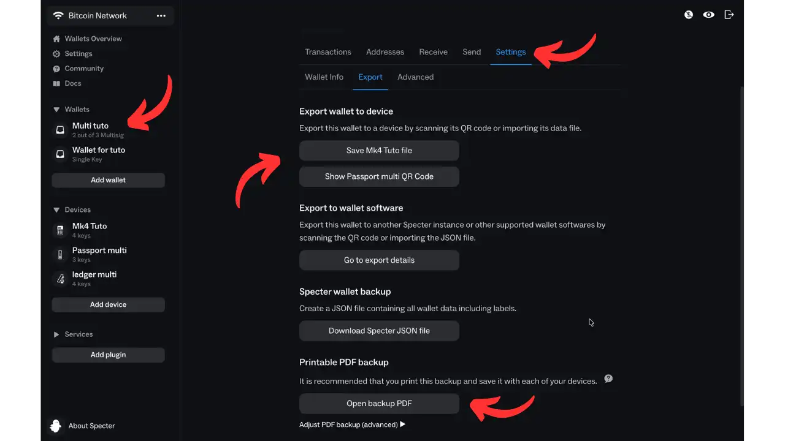

Codzienne użytkowanie pozostaje podobne do zwykłego wallet: generate odbiera adresy w normalny sposób. Aby wysłać bitcoiny, przejdź do zakładki "Wyślij", wprowadź adres odbiorcy i kwotę, a następnie kliknij "Utwórz niepodpisaną transakcję".

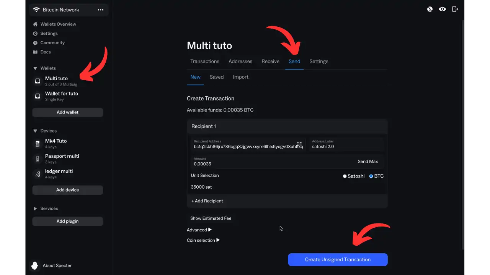

Specter tworzy PSBT (Partially Signed Bitcoin Transaction) i wyświetla "Uzyskano 0 z 2 podpisów". Musisz teraz podpisać co najmniej dwa z trzech portfeli sprzętowych. Kliknij pierwszy portfel sprzętowy wallet (np. "MK4 Tuto"), aby podpisać się kartą Coldcard, a następnie drugi (np. "Passport multi"), aby uzyskać drugi wymagany podpis.

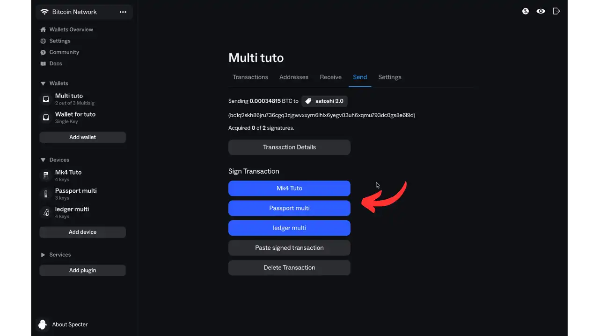

Po uzyskaniu 2 wymaganych podpisów (interfejs wyświetli "Uzyskano 2 z 2 podpisów" i "Transakcja jest gotowa do wysłania"), kliknij "Wyślij transakcję", aby rozgłosić transakcję w sieci Bitcoin.

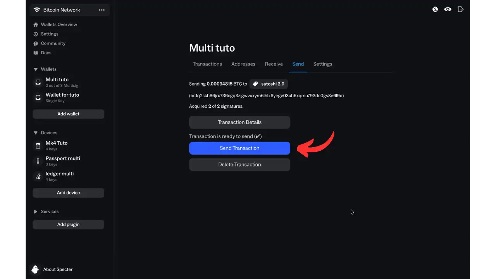

To wielopodpisowe podejście jest szczególnie odpowiednie dla firm (kilku menedżerów musi zatwierdzić wydatki), rodzin (ochrona wielopokoleniowego spadku) lub osób zarządzających dużymi kwotami (geograficzna dystrybucja portfeli sprzętowych, aby wytrzymać lokalne katastrofy).

### Kluczowe znaczenie wielopodpisowych kopii zapasowych

**Uwaga**: tworzenie kopii zapasowej portfela multisig różni się zasadniczo od tworzenia kopii zapasowej pojedynczego portfela. Same frazy odzyskiwania (frazy seed) nie wystarczą do przywrócenia portfela multisig. Należy również utworzyć kopię zapasową **output descriptor** (output descriptor), która zawiera informacje konfiguracyjne dla portfela multisig.

output descriptor zawiera istotne dane: rozszerzone klucze publiczne (xpubs) każdego współsygnatariusza, próg podpisu (2 na 3 w naszym przykładzie), rodzaj używanego skryptu (natywny, zagnieżdżony lub starszy Segwit) oraz ścieżki obejścia dla każdego sprzętu wallet. Bez tego deskryptora, nawet jeśli masz dwa z trzech zwrotów odzyskiwania, nie będziesz w stanie odbudować wallet ani uzyskać dostępu do swoich bitcoinów. Deskryptor pozwala oprogramowaniu wiedzieć, jak połączyć klucze publiczne do generate z adresami Bitcoin odpowiadającymi twoim funduszom.

Specter Desktop automatycznie generuje zapasowy plik PDF podczas tworzenia portfela multisig. Ten plik PDF zawiera kompletny deskryptor, odciski palców każdego sprzętu wallet i wszystkie informacje publiczne wymagane do przywrócenia. **Plik ten nie zawiera kluczy prywatnych** i dlatego sam w sobie nie pozwala na wydawanie bitcoinów, ale pozwala każdemu, kto ma do niego dostęp, zobaczyć pełną historię transakcji i saldo.

Aby poprawnie utworzyć kopię zapasową konfiguracji wielopodpisowej, wykonaj następującą procedurę: po utworzeniu portfolio kliknij zakładkę "Ustawienia", następnie "Eksportuj" i wybierz "Zapisz kopię zapasową PDF". Utwórz kilka kopii tego pliku PDF: wydrukuj co najmniej dwie kopie na papierze, a także zachowaj zaszyfrowaną kopię cyfrową. Przechowuj jedną kopię pliku PDF z każdą z fraz odzyskiwania, w geograficznie oddzielnych lokalizacjach.

Wygraweruj swoje frazy odzyskiwania na ognioodpornych i wodoodpornych metalowych płytkach, aby zagwarantować ich długowieczność. Nigdy nie lekceważ znaczenia tych kopii zapasowych: jeśli stracisz folder `~/.specter` na komputerze ORAZ stracisz jeden z portfeli sprzętowych bez kopii zapasowej deskryptora, wszystkie twoje fundusze zostaną bezpowrotnie utracone, nawet w konfiguracji 2 na 3. Redundancja z wieloma podpisami chroni przed utratą sprzętu wallet, ale tylko wtedy, gdy prawidłowo wykonano kopię zapasową deskryptora wallet.

## Zalety i ograniczenia Specter Desktop

**Korzyści**: Optymalna poufność dzięki pełnej lokalnej walidacji bez serwerów stron trzecich. Elastyczność wielu podpisów dla zaawansowanych konfiguracji (korporacyjnych, rodzinnych, indywidualnych). Szerokie wsparcie sprzętowe wallet z pełną interoperacyjnością (USB i air-gapped).

**Ograniczenia**: Znaczna krzywa uczenia się na zaawansowanych koncepcjach Bitcoin (UTXO, deskryptory, ścieżki pochodne).

## Najlepsze praktyki

Zawsze sprawdzaj adresy i kwoty na ekranie sprzętowym wallet przed zatwierdzeniem, aby chronić się przed złośliwym oprogramowaniem.

Przechowuj kopie zapasowe plików PDF oddzielnie od nasion. Te publiczne deskryptory mogą być przechowywane w skarbcu bankowym lub zaszyfrowanej chmurze, ułatwiając odzyskiwanie bez ujawniania kluczy prywatnych.

Przetestuj odzyskiwanie na kwotach token przed użyciem portfeli z dużymi funduszami. Utwórz, przetestuj, usuń i przywróć, aby zweryfikować swoje procedury.

Aktualizuj oprogramowanie Specter i firmware. Rozmieść współsygnatariuszy z wieloma podpisami geograficznie (dom/biuro/blisko), aby wytrzymać lokalne katastrofy. Używaj etykiet opisowych, aby ułatwić księgowanie i rozliczenia podatkowe.

## Bonus: Instalacja na serwerze Bitcoin (Umbrel, RaspiBlitz, Start9)

Jeśli posiadasz już serwer Bitcoin, taki jak Umbrel, RaspiBlitz, MyNode lub Start9, możesz zainstalować Specter Desktop bezpośrednio z ich sklepu z aplikacjami. Takie podejście oferuje kilka znaczących korzyści: aplikacja automatycznie konfiguruje się z lokalnym węzłem Bitcoin Core, pozostaje dostępna 24/7 za pośrednictwem interfejsu internetowego z dowolnego urządzenia w sieci, a nawet można uzyskać do niej bezpieczny zdalny dostęp za pośrednictwem sieci Tor. Cała infrastruktura Bitcoin jest scentralizowana na jednym dedykowanym serwerze, co upraszcza zarządzanie i wzmacnia suwerenność.

### Instalacja ze sklepu Umbrel App Store

Z poziomu interfejsu Umbrel przejdź do sklepu App Store i wyszukaj Specter Desktop. Kliknij "Zainstaluj", aby rozpocząć instalację.

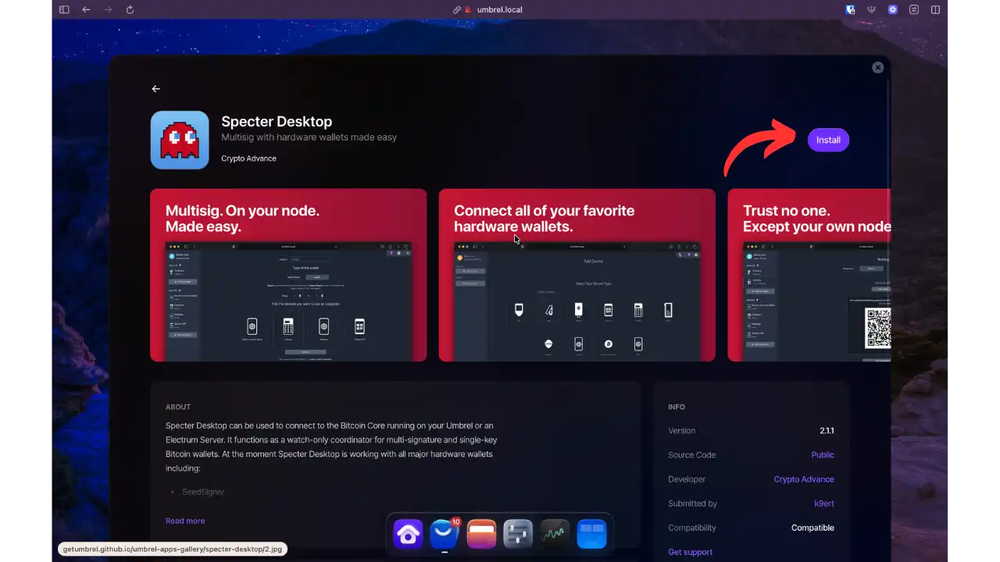

Po zakończeniu instalacji otwórz Specter Desktop na swoim Umbrel. Na ekranie powitalnym zostaniesz poproszony o wybranie typu połączenia. Jeśli używasz Specter na swoim Umbrel, kliknij "Aktualizuj ustawienia", aby skonfigurować połączenie.

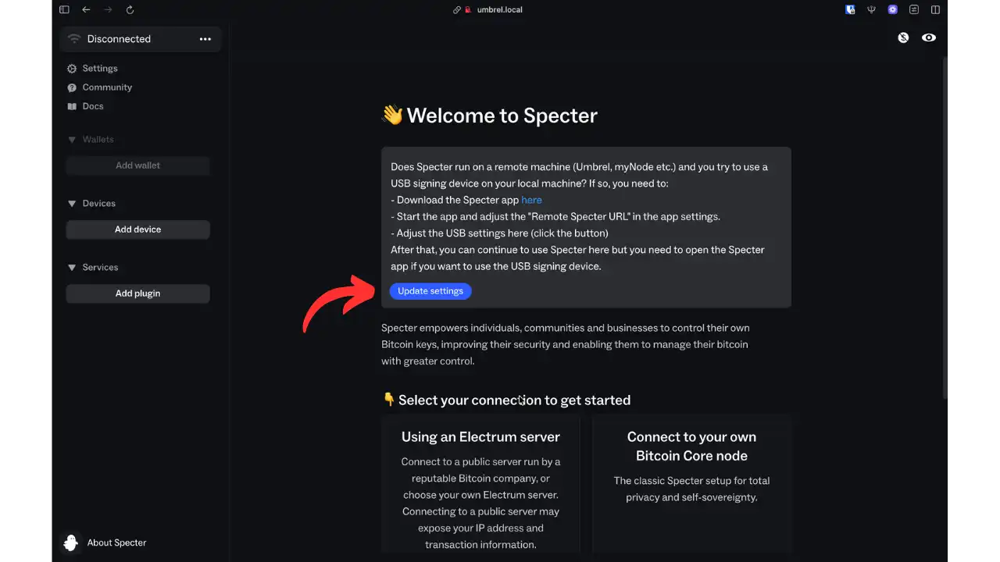

Wybierz "Zdalne połączenie USB Specter", aby umożliwić korzystanie z portfeli sprzętowych USB podłączonych do lokalnego komputera podczas korzystania ze Specter na zdalnym serwerze Umbrel.

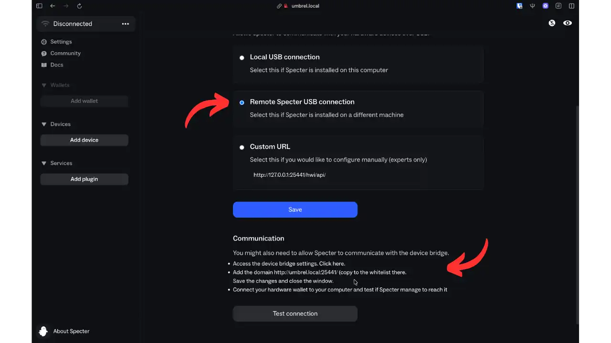

Postępuj zgodnie z wyświetlanymi instrukcjami, aby skonfigurować HWI Bridge. Musisz uzyskać dostęp do ustawień mostu urządzenia i dodać domenę `http://umbrel.local:25441` do białej listy. Kliknij "Aktualizuj", aby zapisać konfigurację.

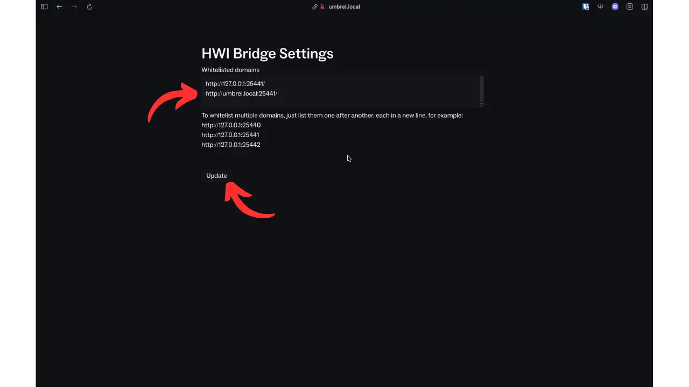

Jeśli chcesz również korzystać z portfeli sprzętowych USB z komputera lokalnego, pobierz aplikację Specter Desktop na swój komputer i ustaw ją na "Tak, uruchamiam Specter zdalnie". Kliknij "Zapisz", aby sfinalizować konfigurację.

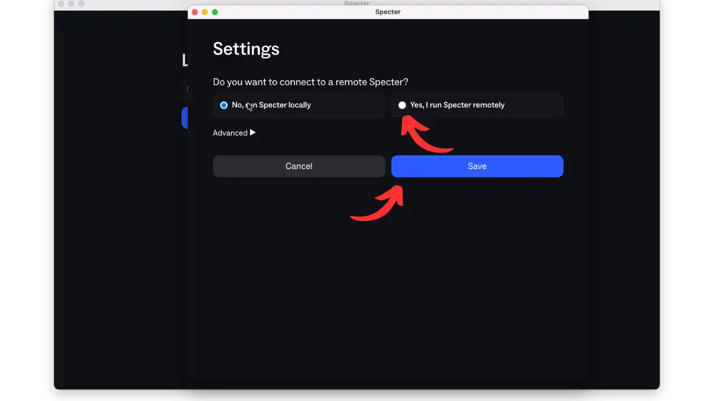

## Wnioski

Specter Desktop demokratyzuje zaawansowane konfiguracje Bitcoin, udostępniając wielopodpisowość bez poświęcania suwerenności lub poufności. W przypadku użytkowników zarządzających znacznymi kwotami pieniędzy przekształca praktyki instytucjonalne w rozwiązania, które mogą być wdrażane przez osoby prywatne.

Chociaż aplikacja wymaga początkowej inwestycji w infrastrukturę i naukę, oferuje pełną suwerenność: kontrolę nad infrastrukturą walidacji, fizyczną własność kluczy i transakcje wolne od nadzoru osób trzecich. Niezależnie od tego, czy jesteś osobą zabezpieczającą swoje oszczędności, rodziną tworzącą wielopokoleniową skrytkę depozytową, czy firmą zarządzającą przepływem gotówki, Specter Desktop jest narzędziem referencyjnym do pogodzenia maksymalnego bezpieczeństwa i absolutnej suwerenności.

## Zasoby

### Oficjalna dokumentacja

- [Oficjalna strona Specter Desktop](https://specter.solutions/desktop/)
- [kod źródłowy GitHub](https://github.com/cryptoadvance/specter-desktop)
- [Pełna dokumentacja](https://docs.specter.solutions/)

### Społeczność i wsparcie

- [Telegram Specter Community Group](https://t.me/spectersupport)
- [Forum dyskusyjne Reddit](https://reddit.com/r/specterdesktop/)
- [Zgłoszenia błędów GitHub](https://github.com/cryptoadvance/specter-desktop/issues)