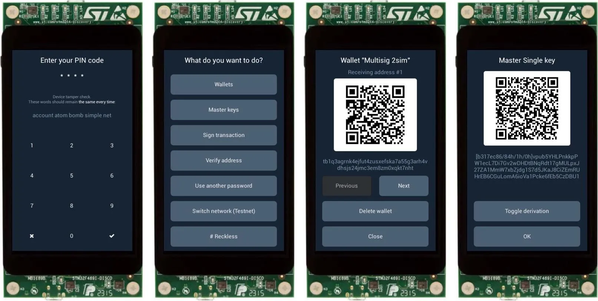
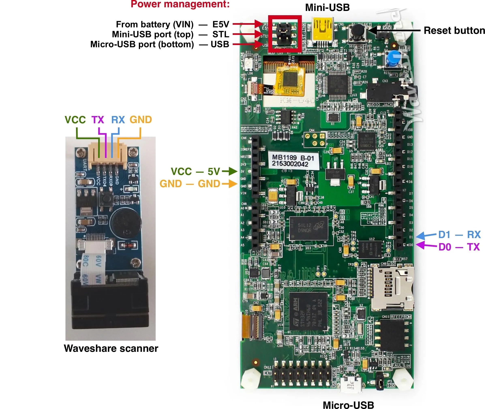

## Specter-DIY


> Cypherpunks schrijven code. We weten dat iemand software moet schrijven om privacy te verdedigen en omdat we geen privacy kunnen krijgen als we het niet allemaal doen, gaan we het schrijven.

*Het manifest van Cypherpunk - Eric Hughes - 9 maart 1993*


Het idee van het project is om een hardware wallet te bouwen van kant-en-klare componenten.

Hoewel we een uitbreidingskaart hebben die alles in een mooie vormfactor plaatst en je helpt om solderen te vermijden, zullen we compatibiliteit met standaardcomponenten blijven ondersteunen en behouden.





We willen het project ook zo flexibel houden dat het met minimale wijzigingen op elke andere set componenten kan werken. Misschien wil je een hardware wallet maken op een andere architectuur (RISC-V?), met een audiomodem als communicatiekanaal - dat moet kunnen. Het moet eenvoudig zijn om functionaliteit van Specter toe te voegen of te veranderen en we proberen logische modules zoveel mogelijk te abstraheren.


QR codes zijn een standaard manier voor Specter om te communiceren met de host. QR-codes zijn erg handig en geven de gebruiker controle over de gegevensoverdracht - elke QR-code heeft een zeer beperkte capaciteit en de communicatie verloopt in één richting. En het is airgapped - je hoeft de wallet op geen enkel moment aan te sluiten op de computer.


Voor het opslaan van geheimen ondersteunen we agnostische modus (wallet vergeet alle geheimen wanneer het uitgeschakeld wordt), roekeloze modus (slaat geheimen op in flash van de applicatiemicrocontroller) en secure element integratie komt er binnenkort aan.


We richten ons vooral op het opzetten van multisignaturen met andere hardware wallets, maar wallet kan ook werken als een enkele ondertekenaar. We proberen het waar mogelijk compatibel te maken met Bitcoin Core - PSBT voor niet-ondertekende transacties, wallet descriptors voor het importeren/exporteren van multisig wallets. Om gemakkelijker met Bitcoin Core te communiceren, werken we ook aan [Specter Desktop app] (https://github.com/cryptoadvance/specter-desktop) - een kleine python flask server die met uw Bitcoin Core node praat.


Het grootste deel van de firmware is geschreven in MicroPython waardoor de code eenvoudig te controleren en te wijzigen is. We gebruiken de [secp256k1](https://github.com/bitcoin-core/secp256k1) bibliotheek van Bitcoin Core voor elliptische curveberekeningen en de [LittlevGL](https://lvgl.io/) bibliotheek voor de GUI.


## Disclaimer


Het project is aanzienlijk volwassener geworden, in die mate dat het beveiligingsniveau van Specter-DIY nu vergelijkbaar is met commerciële hardware wallets op de markt. We hebben een veilige bootloader geïmplementeerd die firmware-upgrades verifieert, zodat je er zeker van kunt zijn dat alleen ondertekende firmware kan worden geüpload naar het apparaat na de eerste installatie. In tegenstelling tot commerciële ondertekeningsapparaten moet de bootloader echter handmatig worden geïnstalleerd door de gebruiker en wordt deze niet ingesteld in de fabriek van de apparaatleverancier. Besteed dus extra aandacht tijdens de initiële installatie van de firmware en zorg ervoor dat je PGP-handtekeningen hebt geverifieerd en flash de firmware vanaf een veilige computer.


Als iets niet werkt, open dan hier een probleem of stel een vraag in onze [Telegram-groep] (https://t.me/+VEinVSYkW5TUl5Ai).


## Boodschappenlijst voor Specter-DIY


Hier beschrijven we wat je moet kopen, en in het volgende deel van de assemblage leggen we uit hoe je het in elkaar zet en geven we een paar opmerkingen over het bord - jumpers, USB-poorten, enz.


### Ontdekkingsraad


Het belangrijkste onderdeel van het apparaat is het ontwikkelbord:


- STM32F469I-DISCO-ontwikkelbord (bijvoorbeeld van [Mouser](https://eu.mouser.com/ProductDetail/STMicroelectronics/STM32F469I-DISCO?qs=kWQV1gtkNndotCjy2DKZ4w==) of [Digikey](https://www.digikey.com/product-detail/en/stmicroelectronics/STM32F469I-DISCO/497-15990-ND/5428811))
- Mini-USB-kabel
- Standaard MicroUSB-kabel voor communicatie via USB


Optioneel maar aanbevolen:


- [Waveshare QR code scanner](https://www.waveshare.com/barcode-scanner-module.htm) met lange pin headers zoals [deze](https://eu.mouser.com/ProductDetail/Samtec/DW-02-10-T-S-571?qs=sGAEpiMZZMvlX3nhDDO4AE5PKXAQeC6NPk%2FcLBS9yKI%3D) of [deze](https://www.amazon.com/gp/product/B015KA0RRU/) om de scanner aan te sluiten op het bord (4 pin headers nodig).


We werken momenteel aan een uitbreidingskaart met een smartcard-sleuf, QR-codescanner, batterij en een 3D-geprinte behuizing, maar het bevat niet het hoofdonderdeel - het ontdekkingsbord dat je apart moet bestellen. Op deze manier is een aanval op de toeleveringsketen nog steeds geen probleem, omdat de beveiligingskritieke onderdelen in een willekeurige elektronicawinkel worden gekocht.


Je kunt Specter ook zonder extra componenten gebruiken, maar je kunt ermee communiceren via USB of het ingebouwde SD-kaartslot. Specter gebruiken via USB betekent dat het niet airgapped is, dus je verliest een belangrijke beveiligingseigenschap.


### QR-scanner


Voor QR-codescanner heb je verschillende opties.


**Optie 1. Aanbevolen.** Onweerstaanbaar goede scanner van Waveshare (40$)


[Waveshare scanner](https://www.waveshare.com/barcode-scanner-module.htm) - je moet een manier vinden om het mooi te monteren, misschien met een soort Arduino Prototype-schild en wat ducktape.


Solderen is niet nodig, maar als je soldeervaardigheden hebt, kun je de wallet veel mooier maken ;)


**Optie 2.** Zeer mooie scanner van Mikroe maar vrij duur (150$):


[Barcode Klik](https://www.mikroe.com/barcode-click) + [Adapter](https://www.mikroe.com/arduino-uno-click-shield)


**Optie 3.** Elke andere QR scanner


Je kunt goedkope scanners vinden in China. Hun kwaliteit is vaak niet zo geweldig, maar je kunt het erop wagen. Misschien is zelfs een ESPcamera voldoende. Je hoeft alleen de voeding, UART (pinnen D0 en D1) en trigger op D5 aan te sluiten.


**Optie 4.** Geen scanner.


Dan kun je Specter alleen gebruiken met USB / SD-kaart.


Tenzij je je eigen communicatiemodule bouwt die iets anders gebruikt in plaats van QR-codes - audiomodem, bluetooth of wat dan ook. Zodra het getriggerd kan worden en de gegevens via seriële weg kan verzenden, kun je doen wat je wilt.


### Optionele onderdelen


Als je een kleine powerbank of een batterij- & stroomlader/booster toevoegt, wordt je wallet volledig autonoom ;)


## Montage van Specter-DIY


### Waveshare barcodescanner aansluiten


De wallet firmware configureert de scanner voor je bij de eerste run, dus er is geen handmatige voorconfiguratie nodig.


Hier zie je hoe je de scanner aansluit op het bord:





Voor het gemak kun je een Arduino Protype-schild kopen en alles daarop solderen en monteren (bijv. [deze](https://www.digikey.com/catalog/en/partgroup/proto-shield-rev3-uno-size/79347))


### Energiebeheer


Aan de bovenkant van de printplaat zit een jumper die bepaalt waar de voeding wordt afgenomen. Je kunt de positie van de jumper veranderen en de voedingsbron kiezen uit een van de USB-poorten of de VIN-pin en daar een externe batterij aansluiten (moet 5V zijn).


### Behuizing voor doe-het-zelvers


Bekijk de map [bijlagen](https://github.com/cryptoadvance/specter-diy/tree/master/docs/enclosures).


### Wees creatief!


Zet je eigen Specter-DIY in elkaar en stuur ons de foto's (doe een pull-verzoek of neem contact met ons op).


Bekijk de [Gallery](https://github.com/cryptoadvance/specter-diy/blob/master/docs/pictures/gallery/README.md) met Specters samengesteld door de community!


## De gecompileerde code installeren


Met de veilige bootloader is de eerste installatie van de firmware iets anders. Upgrades zijn eenvoudiger en vereisen geen aansluiting van hardware wallet op de computer.


### Oorspronkelijke firmware flashen


**Note** Als u geen binaries van de releases wilt gebruiken, bekijk dan de [bootloader documentatie](https://github.com/cryptoadvance/specter-bootloader/blob/master/doc/selfsigned.md) die uitlegt hoe u het kunt compileren en configureren om uw publieke sleutels te gebruiken in plaats van de onze.


- Als u een upgrade uitvoert van versies lager dan `1.4.0` of de firmware voor de eerste keer uploadt, gebruik dan de `initial_firmware_<version>.bin` van de [releases](https://github.com/cryptoadvance/specter-diy/releases) pagina.
 - Controleer de handtekening van het bestand `sha256.signed.txt` met [Stepan's PGP-sleutel] (https://stepansnigirev.com/ss-specter-release.asc)
 - Controleer de hash van de `initial_firmware_<version>.bin` met de hash die is opgeslagen in de `sha256.signed.txt`
- Als u een upgrade uitvoert vanaf een lege bootloader of als u de foutmelding in de bootloader ziet dat de firmware niet geldig is, bekijk dan de volgende sectie - Ondertekende Specter-firmware flashen.
- Zorg ervoor dat de voedingsjumper van het ontdekkingsbord op STLK staat
- Sluit het ontdekkingsbord aan op je computer via de **miniUSB** kabel aan de bovenkant van het bord.
    - Het bord zou moeten verschijnen als een verwijderbare schijf met de naam `DIS_F469NI`.
- Kopieer het `initial_firmware_<version>.bin` bestand naar de root van het `DIS_F469NI` bestandssysteem.
- Wanneer het bord klaar is met het flashen van de firmware zal het bord zichzelf resetten en opnieuw opstarten naar de bootloader. De bootloader controleert de firmware en start op naar de hoofdfirmware. Als je een foutmelding ziet dat er geen firmware is gevonden, volg dan de update-instructies en upload de firmware via de SD-kaart.
- Nu kun je de voedingsjumper naar wens schakelen en het bord voeden via de powerbank of batterij.


Het flashen van initiële firmware via copy-paste van het `.bin` bestand mislukt soms - vaak vanwege de kabel, of als je het apparaat via een USB-hub aansluit. In dit geval kun je het nog een paar keer proberen (normaal werkt het in 2-3 pogingen).


Als het steeds mislukt, kun je het open-source hulpprogramma [stlink](https://github.com/stlink-org/stlink/releases/latest) gebruiken. Installeer het en typ in je terminal: `st-flash write <path/to/initial_firmare.bin> 0x8000000`. Het werkt meestal veel betrouwbaarder.


### Firmware upgraden


- Download de `specter_upgrade_<version>.bin` van de [releases](https://github.com/cryptoadvance/specter-diy/releases).
- Kopieer deze binary naar de root van de SD-kaart (FAT-geformatteerd, max. 32 GB)
 - Zorg ervoor dat er maar één `specter_upgrade***.bin` bestand in de hoofdmap staat
- Plaats de SD-kaart in de SD-sleuf van het ontdekkingsbord en zet het bord aan
- Bootloader flasht de firmware en laat het je weten als het klaar is.
- Start het bord opnieuw op - u ziet nu de Specter-DIY-interface, die u voorstelt uw PIN-code te kiezen


Wanneer er een nieuwe release uitkomt, download dan gewoon de `specter_upgrade_<version>.bin` van de releases, plaats deze op de SD-kaart en upgrade het apparaat net als in de vorige stap. Bootloader zorgt ervoor dat alleen ondertekende firmware op het bord geladen kan worden.


### Hoe kom ik achter de firmwareversie?


Ga naar het menu `Apparaatinstellingen` - het versienummer wordt onder de titel van het scherm weergegeven.


## Gebruik Specter-DIY wallet


## Veiligheid van Specter-DIY


### Hardware


Het scherm wordt bestuurd door de MCU van de toepassing.


Beveiligde elementintegratie is er nog niet - op dit moment worden geheimen ook opgeslagen op de hoofd-MCU. Maar je kunt de wallet gebruiken zonder het geheim op te slaan - je moet elke keer je herstelzin invoeren. Waarom zou je een lange passphrase onthouden als je het hele geheugen kunt onthouden?


Apparaat gebruikt externe flash om sommige bestanden op te slaan (QSPI), maar alle gebruikersbestanden worden ondertekend door de wallet en gecontroleerd bij het laden.


QR scanfunctionaliteit zit op een aparte microcontroller, dus alle beeldverwerking gebeurt buiten de beveiligingskritische MCU. Op dit moment worden USB en SD-kaart nog steeds beheerd door de hoofd-MCU, dus gebruik geen SD-kaart en USB als je het aanvalsoppervlak wilt verkleinen.


### PIN-bescherming (gebruikersauthenticatie)


Tijdens de eerste keer opstarten wordt een unieke code gegenereerd op de hoofd-MCU. Met dit geheim kun je controleren of het apparaat niet is vervangen door een kwaadaardig exemplaar - wanneer je de PIN-code invoert, zie je een lijst met woorden die hetzelfde blijven zolang het geheim aanwezig is.


Je PIN-code wordt samen met dit unieke geheim gebruikt om generate een ontcijferingssleutel te maken voor je Bitcoin sleutels (als je die opslaat). Dus als de aanvaller het PIN-scherm zou kunnen omzeilen, zal de ontcijfering nog steeds mislukken.


Als je de firmware hebt geblokkeerd (TODO: voeg hier een link naar de instructies toe), wordt het geheim ook geblokkeerd, dus als de aanvaller een andere firmware naar het bord flasht, wordt het geheim gewist en kun je het herkennen als je de PIN-code begint in te voeren - de volgorde van de woorden zal anders zijn.


### De herstelzin genereren


Dit is een van de belangrijkste onderdelen van de wallet - om generate de sleutel veilig te maken. Om dit goed te doen gebruiken we meerdere bronnen van entropie:


- TRNG van de microcontroller. Eigendomsrechtelijk, gecertificeerd en waarschijnlijk goed, maar we vertrouwen het niet
- Aanraakscherm. Elke keer dat je het scherm aanraakt, meten we de positie en het moment waarop deze aanraking plaatsvond (in microcontroller tikken op 180MHz).
- Ingebouwde microfoons - nog niet. Het bord heeft twee microfoons, zodat hardware wallet naar je kan luisteren en deze gegevens kan toevoegen aan de entropie pool.


Al deze entropie wordt samen gehashed en geconverteerd naar je herstelzin. De resulterende entropie is altijd beter dan elk van de individuele bronnen.


### Logica op hoog niveau - portemonnees


Specter werkt als een sleutelopslag. Het bevat HD-privésleutels die betrokken kunnen worden in wallets. Portefeuilles worden gedefinieerd door hun descriptors. We ondersteunen ook miniscripts.


Elke wallet behoort tot een bepaald netwerk. Dit betekent dat als je een wallet op `testnet` hebt geïmporteerd, deze niet beschikbaar zal zijn op `mainnet` of `regtest` - je moet overschakelen naar dit netwerk en de wallet apart importeren.


### Verificatie van transacties


De volgende regels gelden voor transacties die wallet zal ondertekenen:


- als gemengde invoer van verschillende portemonnees wordt gevonden, wordt de gebruiker gewaarschuwd ([attack](https://blog.trezor.io/details-of-the-multisig-change-address-issue-and-its-mitigation-6370ad73ed2a))
- wijzigingsuitgangen tonen de naam van de wallet waar ze naartoe worden gestuurd
- om een multisig of miniscript te gebruiken moet je eerst de wallet importeren door wallet descriptor toe te voegen (via QR, USB of SD-kaart)


## Beschrijvingen ondersteunen


Alle normale Bitcoin descriptors werken. Daarnaast hebben we een paar uitbreidingen:


### Meerdere takken in descriptoren


Om ruimte te besparen in de QR codes kunnen descriptors met meerdere takken in één keer worden toegevoegd. Als je `wpkh(xpub/0/*)` wilt gebruiken voor ontvangstadressen en `wpkh(xpub/1/*)` voor wijzigingsadressen kun je ze combineren in een enkele descriptor: `wpkh(xpub/{0,1}/*)` - de wallet zal de eerste index van het `{}` set gedeelte behandelen als de tak voor ontvangstadressen en de tweede als wijzigingsadressen.


Je kunt ook meer dan twee takken specificeren en takindexen kunnen verschillend zijn voor verschillende medeondertekenaars, dus deze descriptor is erg vreemd maar volledig geldig:


```
wsh(sortedmulti(2,xpubA/{22,33,44}/*,xpubB/34/*/{1,8,6},pubkey3))
```


Hier zal wallet voor het ontvangen van adresnummer 17 het script van `wsh(sortedmulti(2,xpubA/22/17,xpubB/34/17/1,pubkey3))` gebruiken.


De enige vereiste is dat het aantal indexen in alle sets gelijk is (3 in het bovenstaande geval).


### Standaard afleidingen


Als de descriptor master public keys bevat maar geen wildcard afleidingen, dan wordt de standaard afleiding `/{0,1}/*` toegevoegd aan alle extended keys in de descriptor. Als ten minste één van de xpubs een jokertekenafleiding heeft, wordt de descriptor niet gewijzigd.


De descriptor `wpkh(xpub)` wordt omgezet in `wpkh(xpub/{0,1}/*)`.


### Miniscript


Specter ondersteunt miniscript, maar ondersteunt geen compilatie van beleid naar miniscript (omdat het veel te duur is). We voeren enkele controles uit op het miniscript, zodat alleen `B` scripts zijn toegestaan op het hoogste niveau en alle argumenten in sub-miniscripts eigenschappen moeten hebben volgens de [spec](http://bitcoin.sipa.be/miniscript/).


Je kunt [bitcoin.sipa.be](http://bitcoin.sipa.be/miniscript/) gebruiken om generate een descriptor van een beleid te maken en het dan te importeren in de wallet.


Een beleid "Ik kan nu uitgeven, of over 100 dagen kan mijn vrouw uitgeven" kan bijvoorbeeld als volgt worden omgezet in wallet:


Beleid: `of(9@pk(xpubA),and(older(14400),pk(B)))` (mijn sleutel is 9 keer waarschijnlijker)


Miniscript: `of_d(pk(xpubA),and_v(v:pkh(xpubB),older(14400)))`


Descriptor: `wsh(or_d(pk(xpubA),and_v(v:pkh(xpubB),older(14400))))`


Omdat we hier geen wildcard afleidingen hebben, worden de standaard afleidingen van `/{0,1}/*` toegevoegd aan de xpubs.


---

MIT-licentie


Copyright (c) 2019 cryptoadvance


---