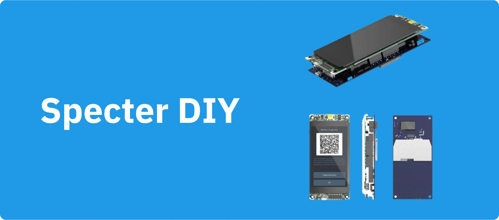

Spec:

- Styrelsen för utvecklare
- STM Discovery-kort (STM32F469I)
- QR-kodläsare
- Waveshare Streckkodsläsare
- 3D-utskrivbart fodral
- Barebones-väska designad av Seedsigner

## Guide

https://specter.solutions/hardware/

https://docs.specter.solutions/diy/

Monteringsvideo: https://youtu.be/1H7FqG_FmCw

guide: Fork the ?md https://github.com/cryptoadvance/specter-diy