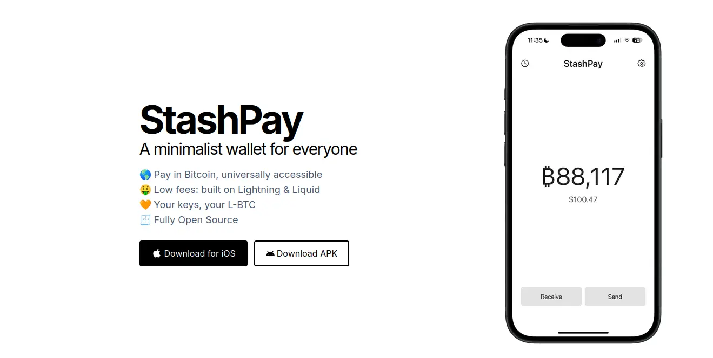

Pengalaman pengguna adalah faktor kunci dalam adopsi solusi Bitcoin di seluruh dunia. Memberikan pengalaman yang lancar, sederhana, dan tidak terbebani secara teknis adalah prioritas bagi banyak dompet dan platform Exchange. Dalam hal ini, StashPay menonjol karena pendekatannya yang minimalis, sementara pada saat yang sama menunjukkan kekuatan Lightning Network.

Dalam tutorial ini, kita akan melihat portofolio ini untuk mengetahui cara kerjanya dan bagaimana portofolio ini ideal untuk bisnis kecil atau solopreneur.

## Memulai dengan StashPay

StashPay adalah Wallet kustodian mandiri Lightning yang dikenal terutama karena pengalaman pengguna yang minimalis dan berpusat pada pengguna.  Dengan Wallet ini, Anda tidak memerlukan pengetahuan teknis apa pun untuk menerima dan mengirim satoshi pertama Anda.

StashPay adalah sebuah proyek sumber terbuka yang dikembangkan di React Native dan bertujuan untuk memecahkan masalah biaya transaksi yang tinggi bahkan dengan transaksi pada rantai utama protokol Bitcoin. Ini tersedia sebagai aplikasi seluler di platform Android dan iOS melalui tautan unduhan yang ada di [situs web] (https://stashpay.me/).

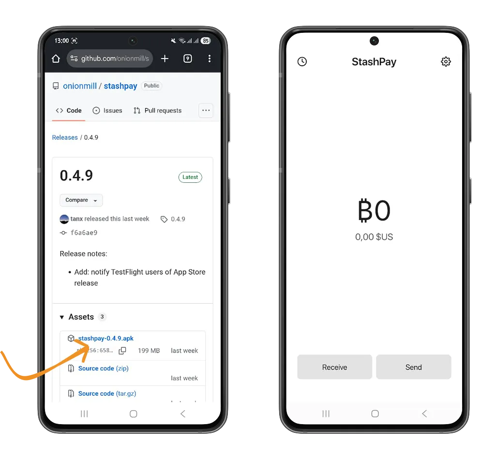

Penting untuk mengunduh aplikasi Android dari situs web, karena aplikasi ini tidak tersedia di Google Play Store.

Setelah pengunduhan selesai, berikan izin yang diperlukan agar Anda dapat menginstal aplikasi pada ponsel Android Anda.

Setelah aplikasi terinstal, StashPay akan membuat Bitcoin Wallet awal untuk Anda saat pertama kali Anda membukanya. Sebelum melakukan transaksi apa pun, kami sarankan Anda untuk membuat cadangan Wallet ini. Di bawah ini, Anda akan menemukan semua panduan kami untuk memastikan bahwa frasa pemulihan Anda dicadangkan dengan benar.

https://planb.network/tutorials/wallet/backup/backup-mnemonic-22c0ddfa-fb9f-4e3a-96f9-46e2a7954270

Akses pengaturan StashPay dengan mengklik ikon "Pengaturan", lalu klik opsi "Buat cadangan". Kemudian otorisasi tampilan frasa pemulihan. Jangan menyalin frasa pemulihan ke papan klip ponsel Anda, karena dapat diakses oleh aplikasi penipuan lain yang diinstal pada ponsel Anda.

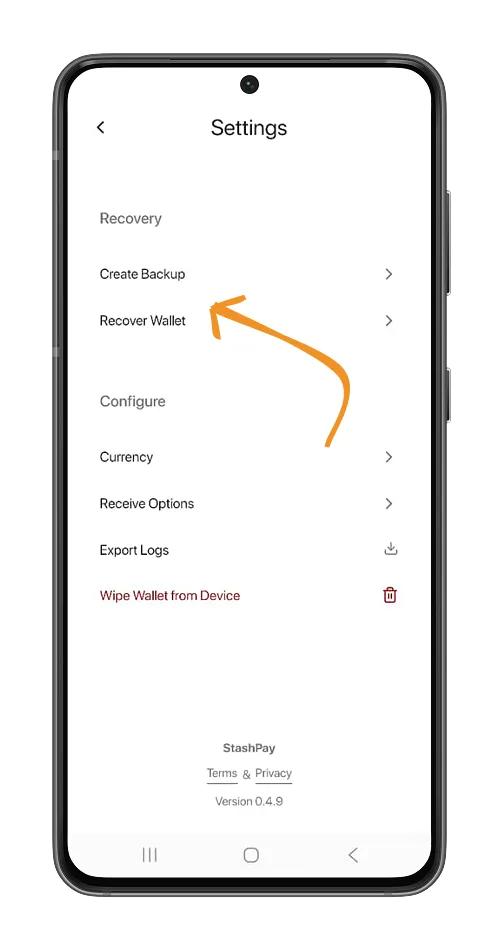

Anda juga dapat mengambil Bitcoin Wallet yang sudah Anda gunakan dengan mengeklik opsi **Pulihkan Wallet** dan memasukkan 12 atau 24 kata pemulihan Anda.

### Dapatkan satoshi pertama Anda di StashPay

Pada layar beranda, klik tombol **Terima** dan tentukan jumlah yang lebih besar dari jumlah yang ditentukan dalam warna merah. Dalam kasus kami, kami tidak dapat menerima kurang dari 0,11 USD dengan StashPay Wallet.

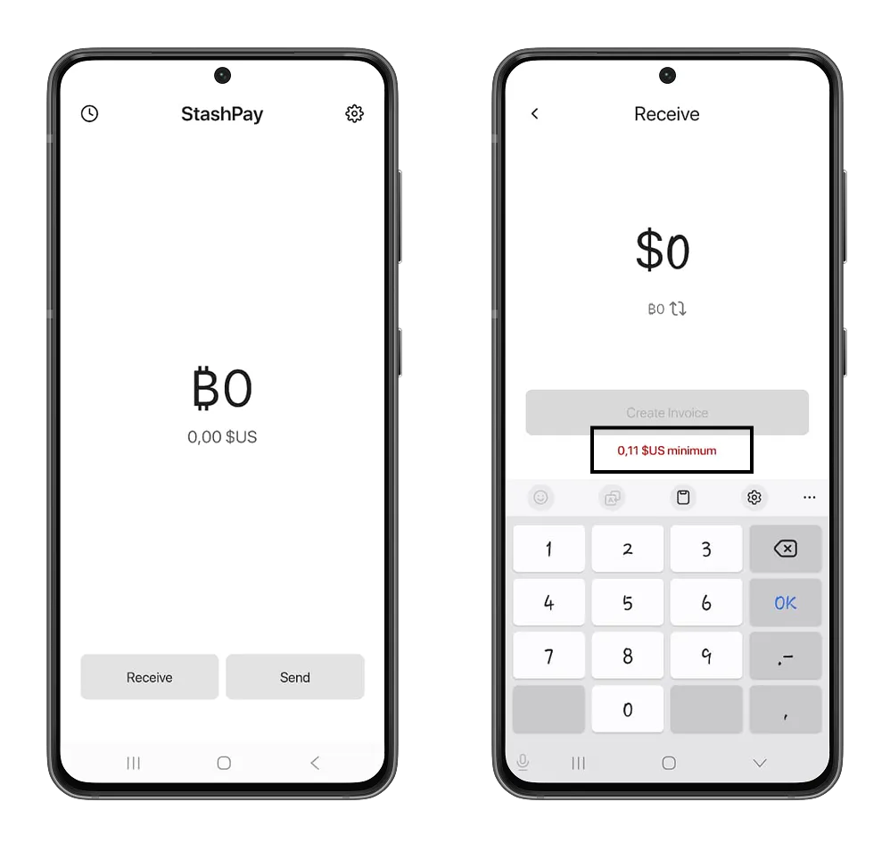

Setelah Anda menentukan jumlahnya, Anda bisa mengklik tombol **Buat Invoice**, kemudian memindai atau menyalin Invoice untuk mengirimkannya ke pengirim satoshi Anda.

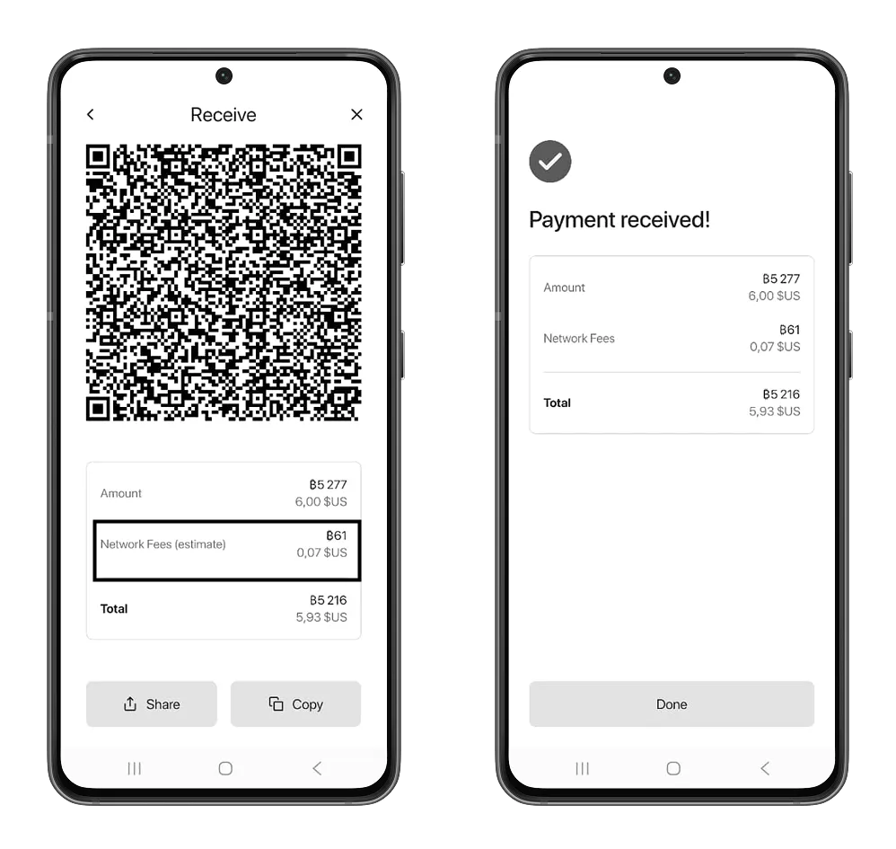

Anda dapat melihat riwayat transaksi Anda dengan mengeklik ikon "jam" di halaman beranda.

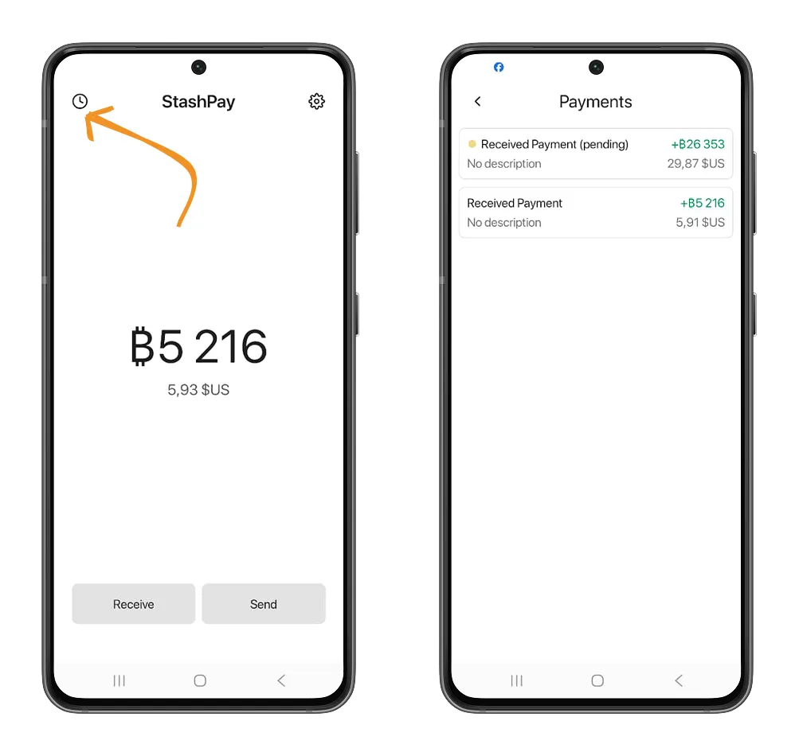

Anda pasti sudah tahu bahwa untuk menerima satoshi, Anda harus membayar biaya jaringan. Biaya ini akan dipotong dari satoshi yang akan Anda terima. Ini karena StashPay adalah Wallet yang berbasis Breez Development Kit. Untuk menerima satoshi dengan implementasi Kit bebas node Lightning, Breez akan membebankan biaya kepada pelanggan (StashPay dalam kasus kami) sebesar `0,25% + 40 satoshi`. Cari tahu lebih lanjut di tutorial Misty Breez kami.

https://planb.network/tutorials/wallet/mobile/misty-breez-738ced2a-0764-4d7f-a150-ec0ce84a9d25

### Kirim bitcoin dengan StashPay

Mengirim bitcoin dengan StashPay cukup intuitif berkat Interface yang minimalis. Di layar beranda, klik tombol **Kirim**. Pindai kode QR atau tempelkan Address yang ingin Anda kirimi satoshi. StashPay akan secara otomatis mendeteksi rantai protokol Bitcoin yang ingin Anda kirimi bitcoin.

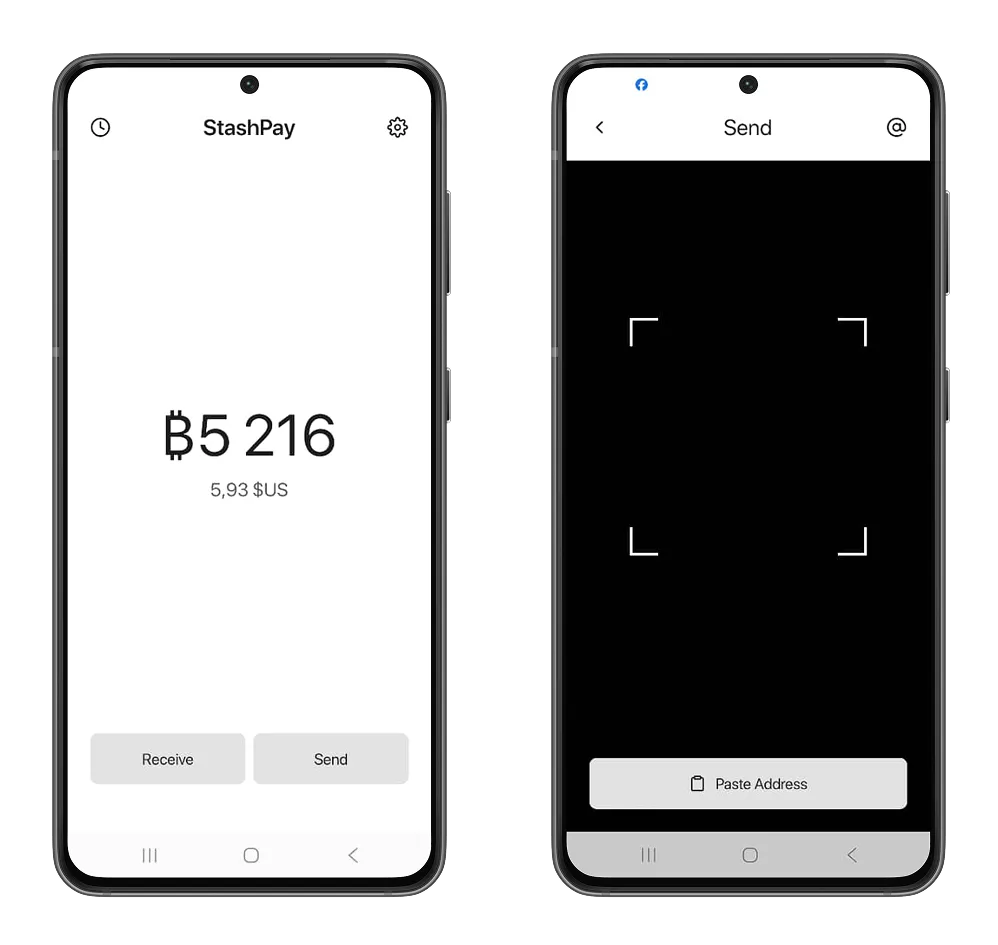

Karena StashPay merupakan Wallet yang berbasis pada Breez Development Kit, StashPay mendapatkan keuntungan yang menarik: mengirim bitcoin pada rantai utama dengan biaya rendah. Breez menggunakan layanan Boltz untuk melakukan transaksi antara rantai yang berbeda dari protokol Bitcoin, memungkinkan pelanggan yang mengimplementasikan Development Kit untuk mendapatkan keuntungan dari layanan ini secara langsung dalam aplikasi mereka.

https://planb.network/tutorials/exchange/centralized/boltz-34ad778e-6dc7-41c2-8219-e11e3361a43d

Akan tetapi, Breez SDK memberlakukan jumlah minimum di mana Anda dapat mengirim bitcoin ke Address di rantai utama.

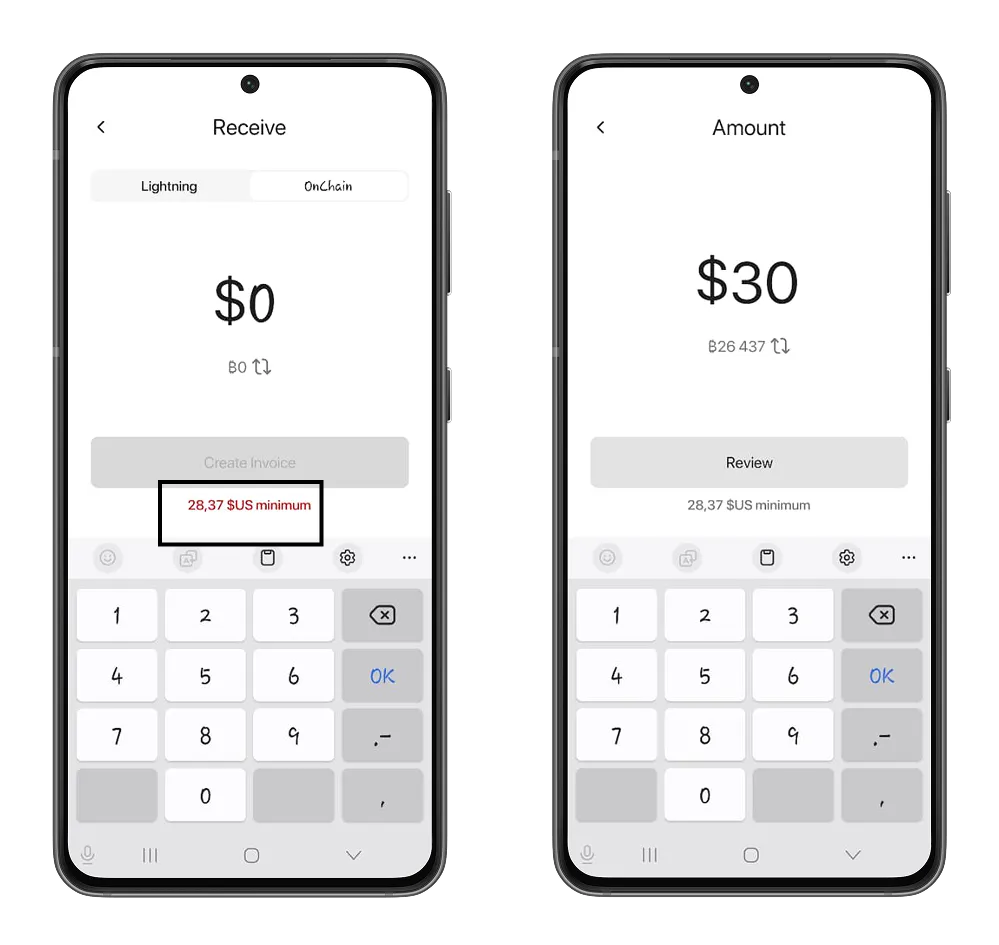

Anda juga bisa mengirim bitcoin menggunakan Lightning Address milik penerima. Tinjau detail transaksi Anda, lalu konfirmasikan dengan mengeklik tombol **Kirim**.

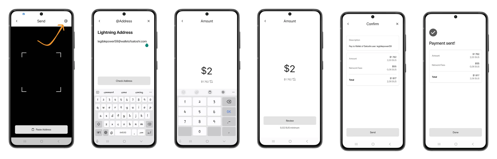

## Konfigurasi lainnya

Dalam pengaturan StashPay, Anda dapat menyesuaikan konfigurasi untuk mempersonalisasi penggunaan Wallet.

StashPay memungkinkan Anda membeli satoshi Exchange berdasarkan mata uang lokal pilihan Anda. Klik opsi **Mata Uang**, lalu cari mata uang Anda dalam daftar +113 mata uang yang ditawarkan oleh StashPay.

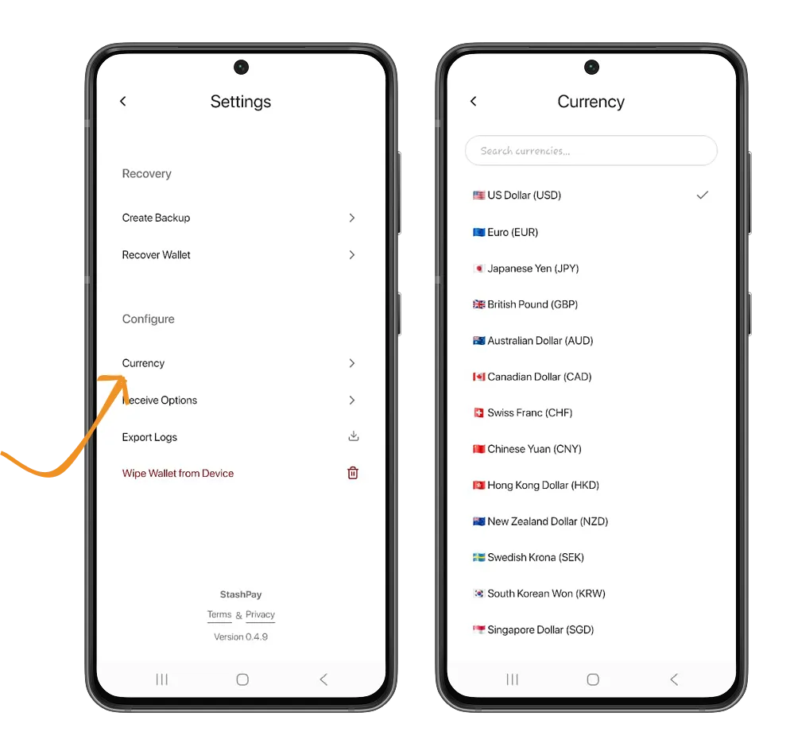

Pada menu **Receive options**, Anda akan menemukan semua pengaturan untuk menerima bitcoin dengan StashPay. Misalnya, dengan memilih **Pilih Lightning atau Onchain**, aktifkan Wallet Anda untuk menerima bitcoin dari rantai utama.

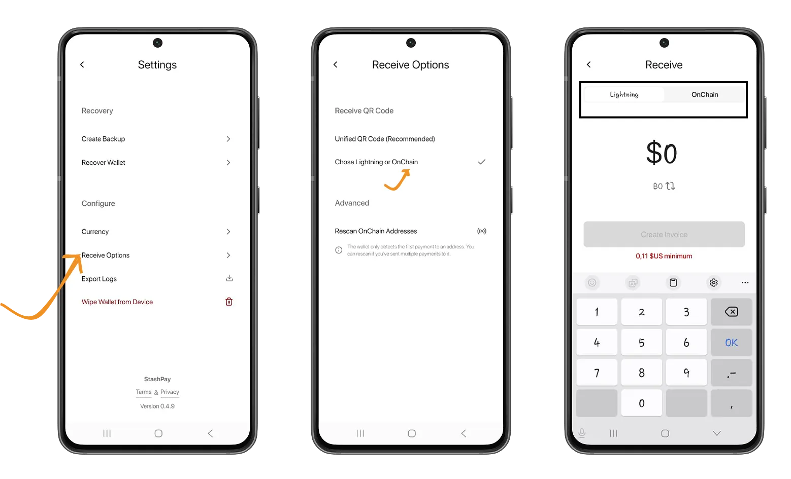

Opsi **Pindai alamat OnChain** memungkinkan Anda menyegarkan saldo Wallet Anda dengan memeriksa semua UTXO (bitcoin yang belum Anda belanjakan) yang ditautkan ke berbagai alamat Anda.

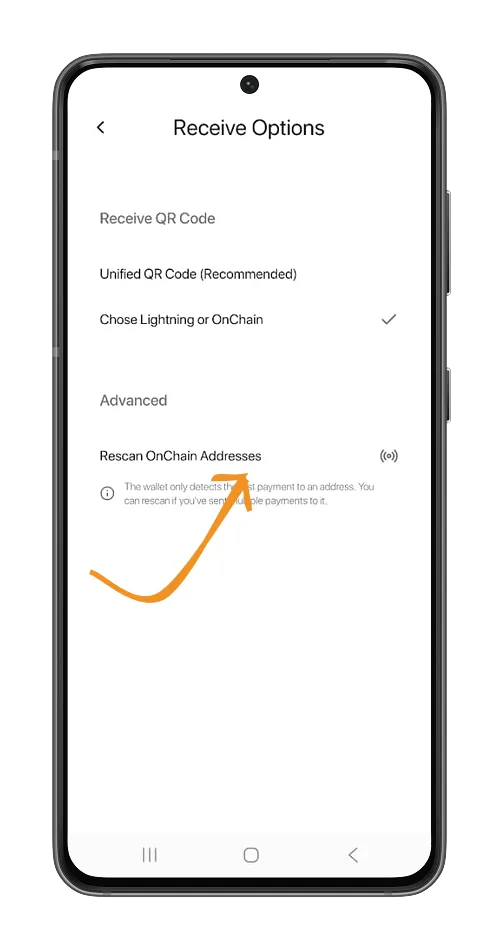

Menu **Export log** mencantumkan semua tindakan infrastruktur Breez dan Boltz yang berkaitan dengan transaksi Anda dan pertukaran atom di antara berbagai rantai protokol Bitcoin.

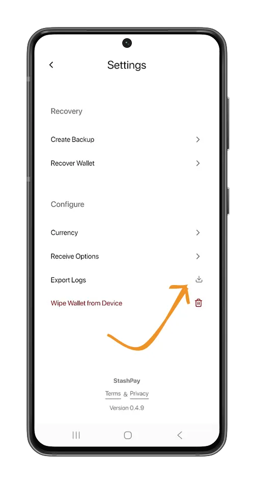

Anda baru saja memahami Bitcoin Wallet minimalis dari StashPay. Jika Anda merasa tutorial ini bermanfaat, kami merekomendasikan tutorial kami tentang cara memulai dengan Bitcoin dan mendapatkan bitcoin pertama Anda.

https://planb.network/courses/obtenir-ses-premiers-bitcoins-f3e3843d-1a1d-450c-96d6-d7232158b81f