*图片来源：[Trezor.io](https://trezor.io/)*

Trezor Model One 是由 SatoshiLabs 于 2014 年推出的首款 Hardware Wallet。经过十多年的发展，它仍然是一个有趣的选择，特别是对于那些正在寻找一款在技术上和预算上都可以接受的 Hardware Wallet 的用户来说。事实上，它在 Trezor 官方网站上的售价为 49 欧元。在这个价格范围内，它是仅有的几款硬件钱包之一。它介于 20 欧元左右的入门级设备和 80 欧元左右的中端设备之间，前者如 Tapsigner（通常没有屏幕），后者如 Ledger Nano S Plus 或 Trezor Safe 3。

Model One 采用 0.96 英寸单色 OLED 显示屏和两个物理按键。它无需电池，仅使用微型 USB 连接供电和数据 Exchange。

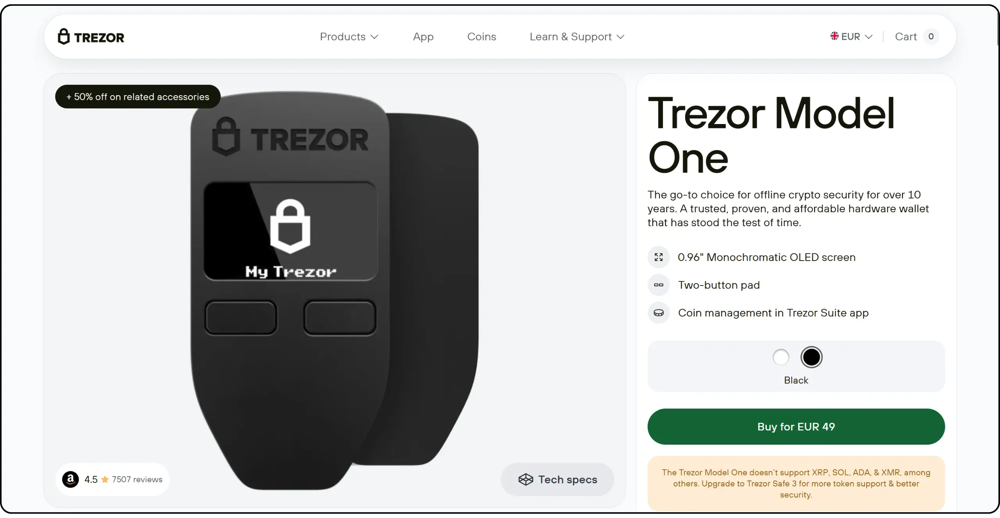

Model One 的主要缺点是缺乏安全元件，因此容易受到各种物理攻击，其中一些攻击的实施相对简单。这些攻击包括分析辅助信道以确定设备 PIN 码，或采用更先进的技术提取加密的 seed，以便日后对其进行暴力破解。请注意，这些攻击需要对设备进行物理访问。不过，通过使用坚固的 passphrase BIP39 可以大大减少这种漏洞。如果您选择 Hardware Wallet，我强烈建议您配置 passphrase。

一号模型有两个重要优势：

- 它基于完全开源的架构。与采用安全元素的最新机型不同，Model One 的所有硬件和软件组件都是可审计的；
- 它配备了屏幕。据我所知，在这个价位的市场上，这是唯一一款配备显示屏的 Hardware Wallet。这是一项非常重要的功能，因为它可以验证签名信息和接收地址，从而防止许多数字攻击。

因此，对于预算有限的初级和中级用户来说，Trezor Model One 可能是一个明智的选择。不过，由于没有安全元素，它在物理保护方面的局限性还是很重要的。如果您的预算有限，这是一个不错的选择，但如果您有能力选择更高级的机型，如售价 79 欧元的 Trezor Safe 3，那就更好了，因为它包含安全元素。

## Trezor Model One 开箱

当您收到 Model One 时，请确保包装盒和 Seal 完好无损，以确认包装未被打开。稍后设置设备时，还将对设备的真实性和完整性进行软件验证。

盒内物品包括 ：

- Trezor Model One
- 用于记录 Mnemonic 短语、贴纸和说明的卡片纸；
- USB-A 转 micro-USB 电缆。

设备导航非常简单：

- 右键单击确认并进入下一步；
- 使用左键返回。

## 先决条件

在本教程中，我将向您演示如何将 Trezor Model One 与 [Sparrow Wallet 投资组合管理软件](https://sparrowwallet.com/download/) 结合使用。如果您尚未安装该软件，请立即安装。如果您需要帮助，我们也有关于配置 Sparrow Wallet 的详细教程：

https://planb.network/tutorials/wallet/desktop/sparrow-c674e2ac-d46f-4c82-92a7-7d1b0e262f5d

您还需要 Trezor Suite 软件来配置 Model One、检查其真伪和安装固件。我们将只使用该软件进行配置，之后只需进行固件更新。对于 Wallet 的日常管理，我们将只使用 Sparrow Wallet，因为它针对 Bitcoin 进行了优化，即使是初学者也很容易使用（Sparrow 只支持 Bitcoin，不支持其他币）。

[从官方网站下载 Trezor Suite](https://trezor.io/trezor-suite)

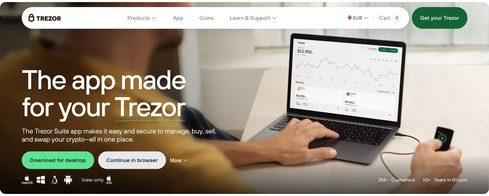

对于这两个程序，我强烈建议您在将其安装到机器上之前，先检查它们的真实性（使用 GnuPG）和完整性（通过 Hash）。如果你不知道怎么做，可以参考下面的教程：

https://planb.network/tutorials/computer-security/data/integrity-authenticity-21d0420a-be02-4663-94a3-8d487f23becc

## 启动 Trezor Model One

将 Model One 与已安装 Trezor Suite 和 Sparrow Wallet 的电脑连接。

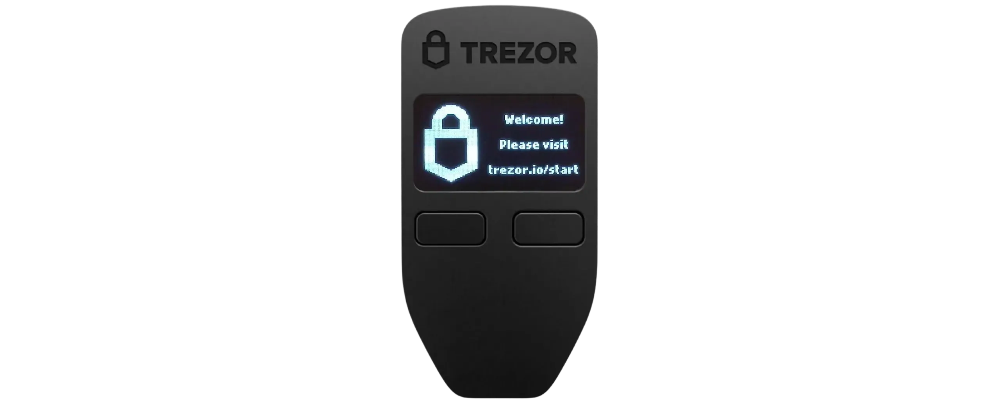

打开 Trezor Suite，然后点击 "*设置我的 Trezor*"。

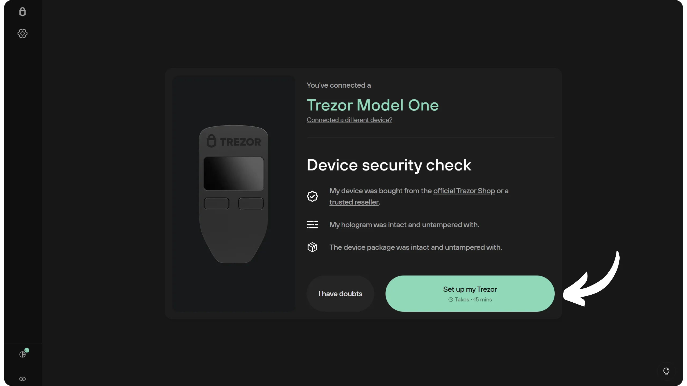

选择 "*仅 Bitcoin 固件*"，然后点击 "*安装仅 Bitcoin*"。

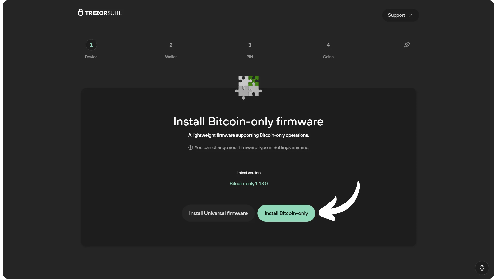

Trezor Suite 将为您的 Model One 安装固件。安装过程中请稍候。

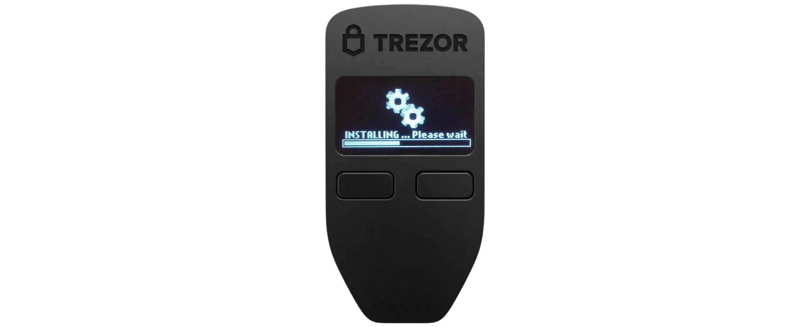

点击 "*继续*"。

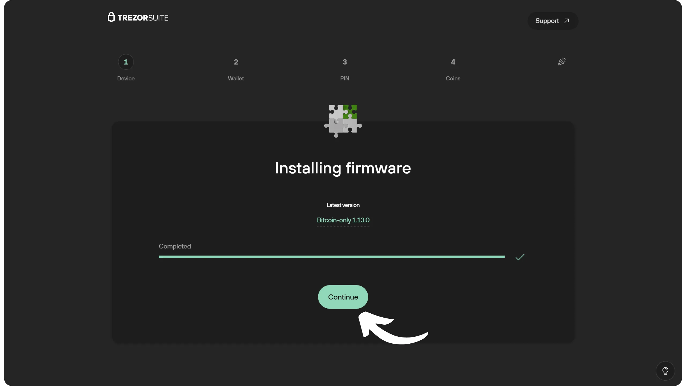

## 创建 Bitcoin 投资组合

在 Trezor Suite 上点击 "*创建新的 Wallet*"按钮。

接受 Hardware Wallet 上的使用条款。

在 Trezor Suite 中，点击 "*继续备份*"。

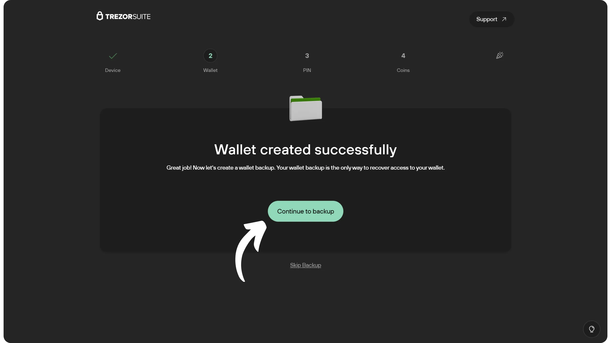

该软件提供了如何管理 Mnemonic 短语的说明。

这个 Mnemonic 可以让你完全不受限制地访问你所有的比特币。任何持有此短语的人都可以盗取你的资金，即使无法实际接触到你的 Trezor Model One。

如果您的 Hardware Wallet 丢失、被盗或破损，该 24 个字的短语可恢复您对比特币的访问。因此，仔细保存并将其存放在安全的地方非常重要。

您可以在包装盒内提供的纸板上书写，或者为了提高安全性，我建议您将其刻在不锈钢底座上，以防火灾、水灾或倒塌。

确认说明，然后点击 "*创建 Wallet 备份*"按钮。

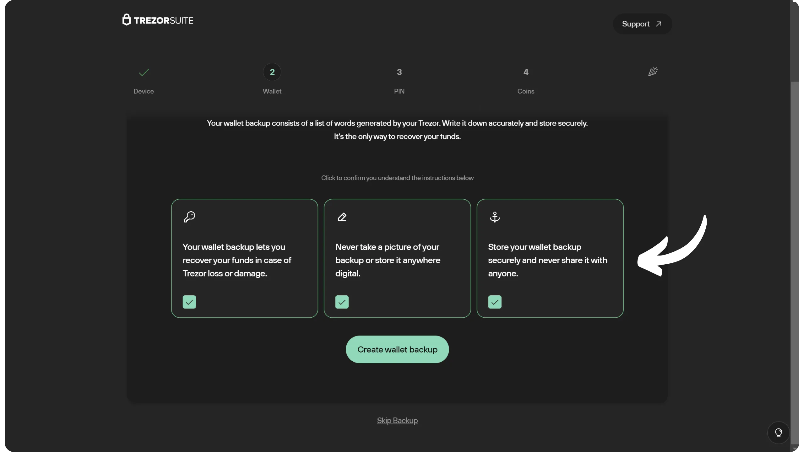

Model One 将使用随机数生成器创建您的 Mnemonic 短语。请确保在操作过程中没有人监视您。将屏幕上提供的短语写在您选择的物理介质上。根据您的安全策略，您可以考虑制作几份完整的短语实体副本（但最重要的是，不要将其分割）。重要的是，要对单词进行编号并按顺序排列。

**显然，您绝不能像我在本教程中所做的那样，在互联网上分享这些文字。本例 Wallet 将仅用于 Testnet，并将在教程结束时删除。**

有关保存和管理 Mnemonic 短语的正确方法的更多信息，我强烈推荐您阅读本教程，尤其是初学者：

https://planb.network/tutorials/wallet/backup/backup-mnemonic-22c0ddfa-fb9f-4e3a-96f9-46e2a7954270

要进入下一个单词，请点击右键。写下所有单词后，再次单击右键进入下一步。

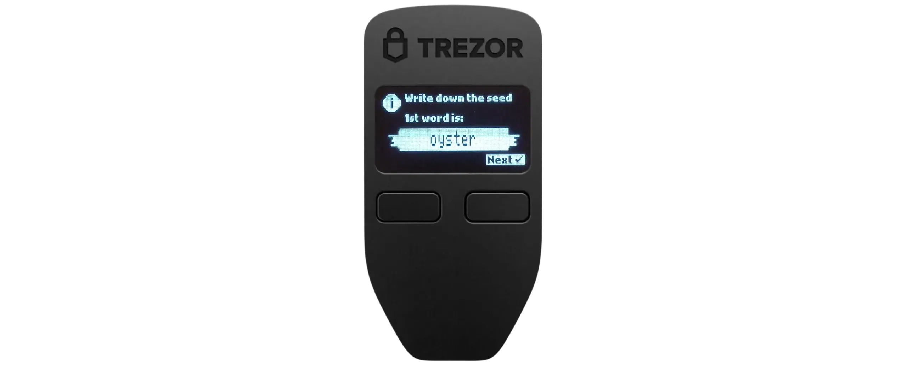

您的 Hardware Wallet 再次显示您的所有单词。请检查您是否已将它们全部写下。

## 设置 PIN 码

接下来是输入 PIN 码。PIN 码可以为 Trezor 解锁。因此，它可以防止未经授权的物理访问。该 PIN 码不参与 Wallet 密钥的生成。因此，即使无法获得 PIN 码，只要拥有 12 个字的 Mnemonic 短语，就能重新获得比特币。

在 Trezor Suite 上点击 "*继续密码*"，然后点击 "*设置密码*"按钮。

在一号模型上确认。

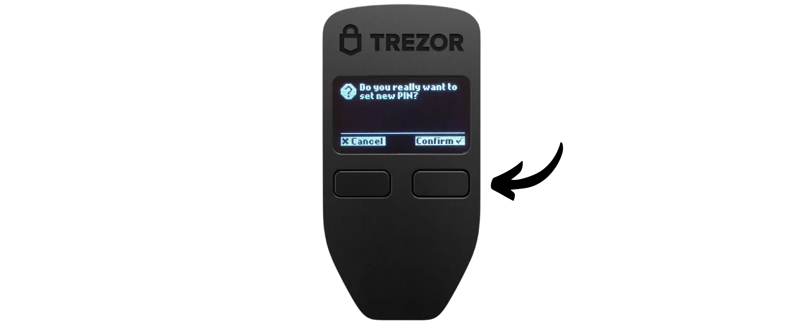

建议选择一个尽可能随机的 PIN 码。请务必将该密码保存在与 Trezor 存储位置不同的地方（如密码管理器）。您可以定义 8 至 50 位数字的 PIN 码。我建议你选择一个尽可能长的 PIN 码，以提高安全性。

必须根据 Trezor Model One 上显示的键盘配置，在电脑上的 Trezor Suite 中点击与数字相对应的点来输入 PIN 码。

无论是通过 Trezor Suite 还是 Sparrow Wallet 解锁，每次解锁 Trezor Model One 时都需要输入这个特定的 PIN 码。

完成后，点击 "*输入密码*"按钮。

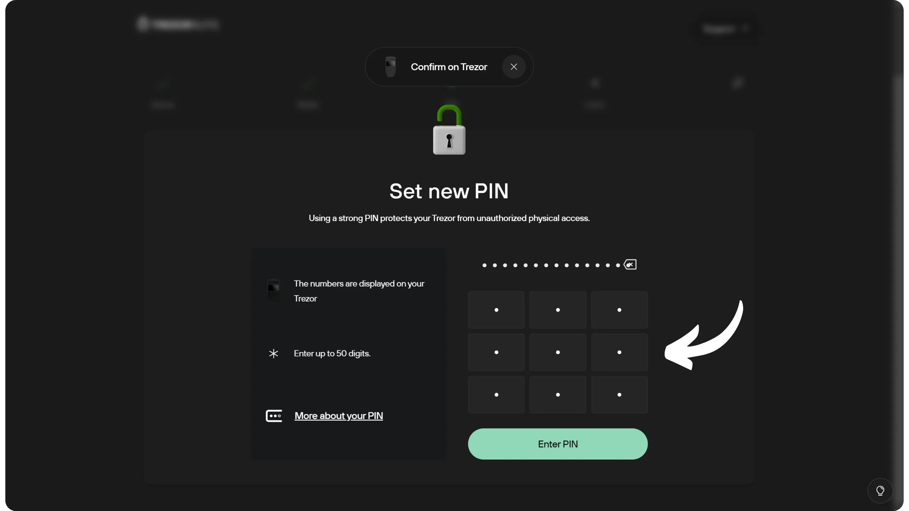

再次输入密码确认。

在 Trezor Suite 上点击 "*完成设置*"按钮。

Model One 的配置工作现已完成。如果您愿意，可以更改 Hardware Wallet 的名称和主页。

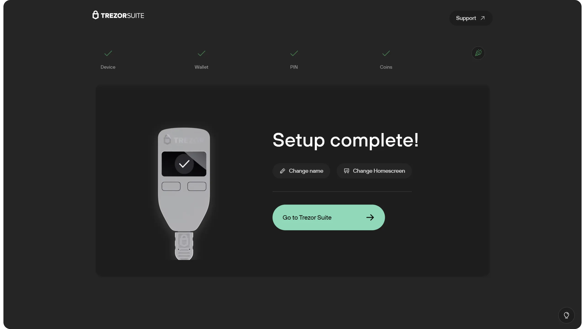

除了对 Hardware Wallet 进行定期固件更新，或进行恢复测试外，我们不再需要 Trezor Suite 软件。我们现在将使用 Sparrow 来管理产品组合，因为该软件非常适合 Bitcoin 使用。

## 在麻雀 Wallet 上设置投资组合

如果还没有下载 Sparrow Wallet [从官方网站](https://sparrowwallet.com/)，请先下载并安装到电脑上。

打开 Sparrow Wallet 后，请确保软件已连接到 Bitcoin 节点，Interface 右下角的"√"表示该节点。如果您在连接 Sparrow 时遇到困难，我建议您参考本教程的开头部分：

https://planb.network/tutorials/wallet/desktop/sparrow-c674e2ac-d46f-4c82-92a7-7d1b0e262f5d

点击 "*文件*"选项卡，然后点击 "*新 Wallet*"。

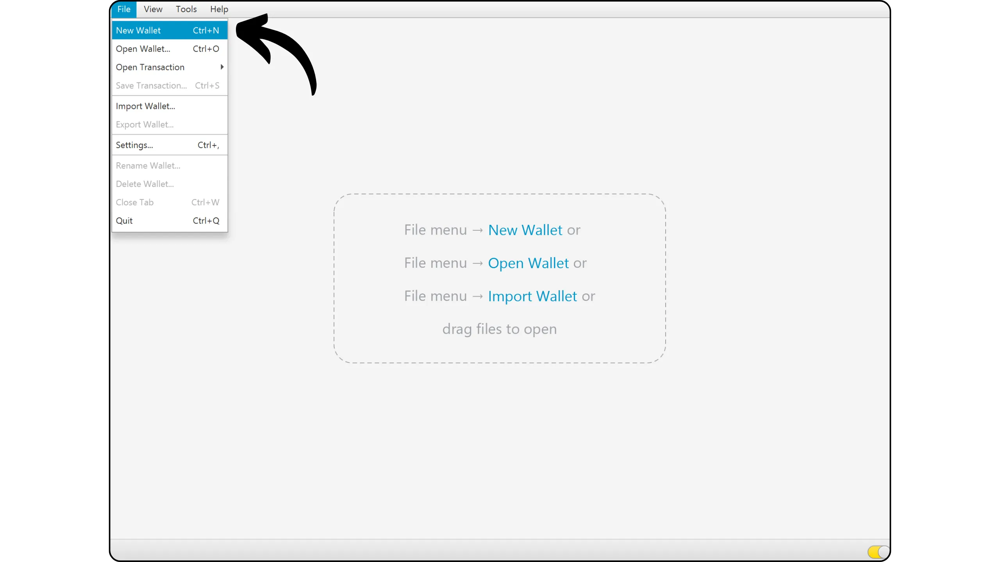

为您的投资组合命名，然后点击 "*创建 Wallet*"。

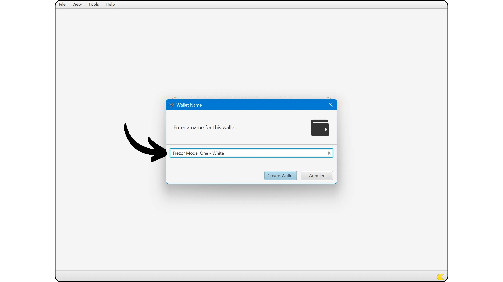

在 "*脚本类型*"下拉菜单中，选择用于保护比特币的脚本类型。我推荐使用 "*Taproot*"，如果不行，也可以使用 "*Native SegWit*"。

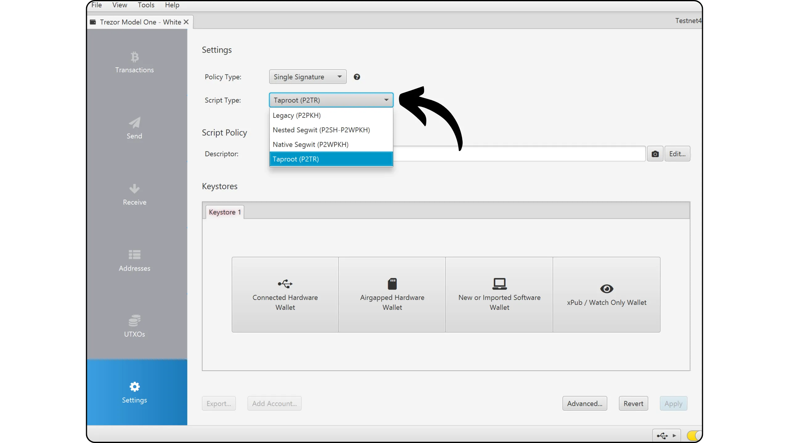

点击 "*已连接 Hardware Wallet*"按钮。当然，您的 Model One 必须与电脑连接。

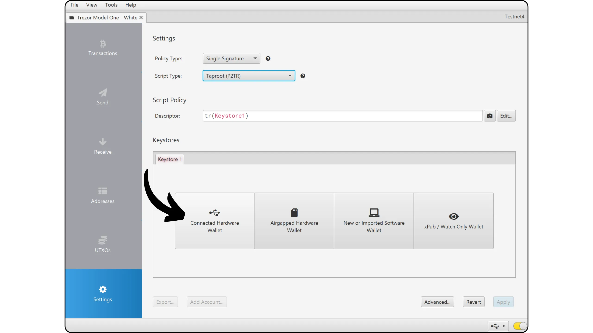

点击 "*扫描*"按钮。您的一号模型就会出现。

当您将 Model One 连接到电脑并打开 Sparrow Wallet 时，系统会提示您在 Sparrow 上输入 passphrase BIP39。这一高级选项将在今后的教程中介绍。目前，您只需选择 "*切换 passphrase 关闭*"，即可防止 Trezor 在每次启动时提示您输入 passphrase。

https://planb.network/tutorials/wallet/backup/trezor-passphrase-0474b5bf-496f-4f97-aefe-445368fdca42

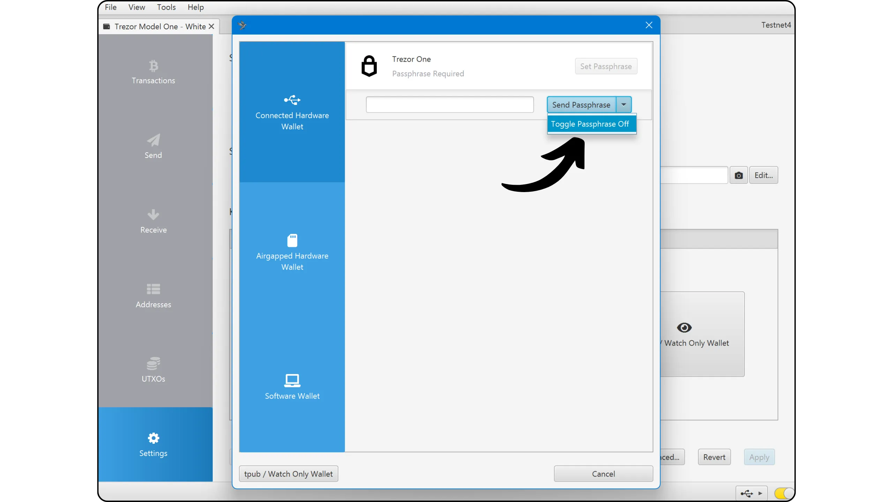

点击 "*导入密钥存储*"。

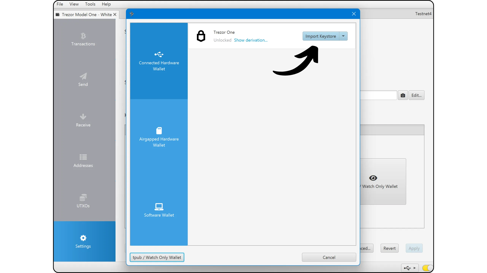

现在您可以看到 Wallet 的详细信息，包括第一个账户的扩展公钥。点击 "*应用*"按钮，完成 Wallet 创建。

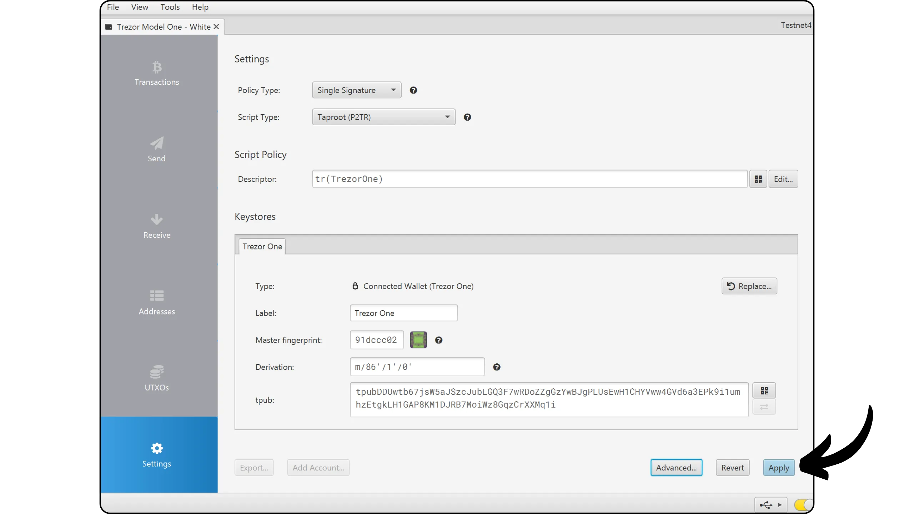

选择一个强大的密码以确保对 Sparrow Wallet 的访问安全。该密码将确保安全访问您的 Sparrow Wallet 数据，保护您的公钥、地址、标签和交易历史记录免遭未经授权的访问。

我建议您将此密码保存在密码管理器中，以免忘记。

现在，您的投资组合已被导入 Sparrow Wallet！

在您的 Wallet 收到第一枚比特币之前，**我强烈建议您进行空机恢复测试**。写下一些参考信息，例如你的 xpub，然后在 Wallet 仍然为空的情况下重置你的 Trezor Model One。然后尝试使用纸质备份在 Trezor 上恢复 Wallet。检查还原后生成的 xpub 是否与你最初写下的一致。如果吻合，就说明纸质备份是可靠的。

要了解有关如何执行恢复测试的更多信息，我建议您参考其他教程：

https://planb.network/tutorials/wallet/backup/recovery-test-5a75db51-a6a1-4338-a02a-164a8d91b895

## 如何使用 Trezor Model One 接收比特币？

在 Sparrow 上，点击 "*接收*"选项卡。

在使用 Sparrow Wallet 提议的 Address 之前，请在 Trezor 的屏幕上进行检查。这种做法可以让您确认 Sparrow 上显示的 Address 不是假的，而且 Hardware Wallet 确实持有随后使用该 Address 所担保的比特币所需的私钥。这可以帮助您避免几种类型的攻击。

要执行此检查，请单击 "*显示 Address*"按钮。

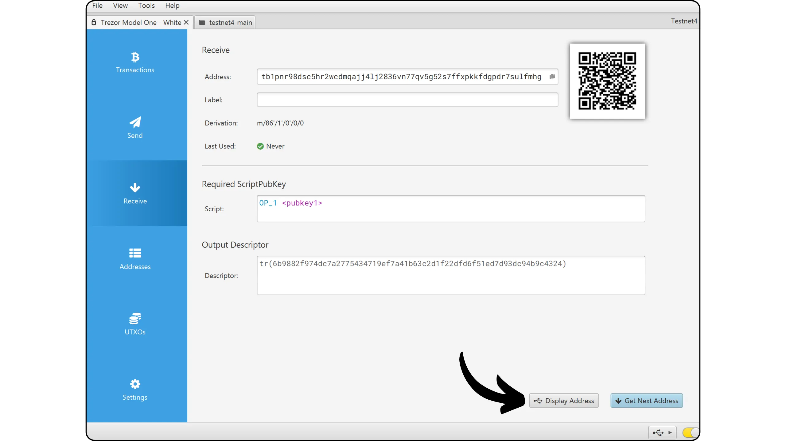

检查 Trezor 上显示的 Address 是否与 Sparrow Wallet 上的一致。建议您在将 Address 发送给发信人之前进行此项检查，以确保其有效性。您可以按右键确认。

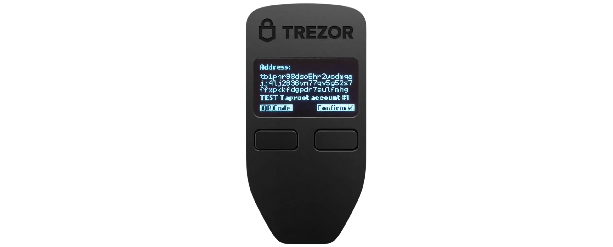

您还可以添加一个 "*标签*"，以描述将用此 Address 保护的比特币来源。这是一个很好的做法，可以让您更好地管理您的 UTXO。

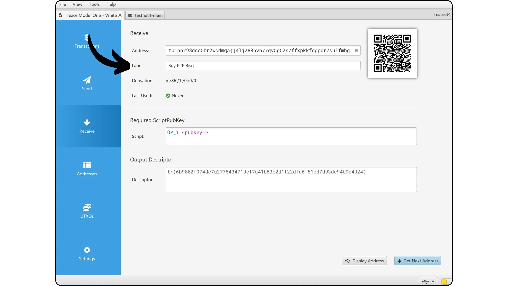

然后，您就可以用这个 Address 接收比特币。

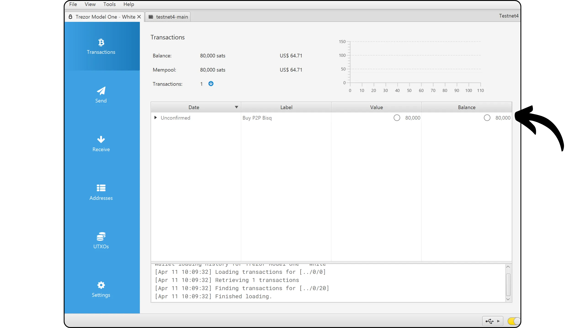

## 如何使用 Trezor Model One 发送比特币？

现在，您已经在您的第一款加密 Wallet 中收到了第一笔 Satss，您也可以花掉它们了！将 Trezor 与电脑连接，启动 Sparrow Wallet，然后进入 "*发送*"选项卡建立新交易。

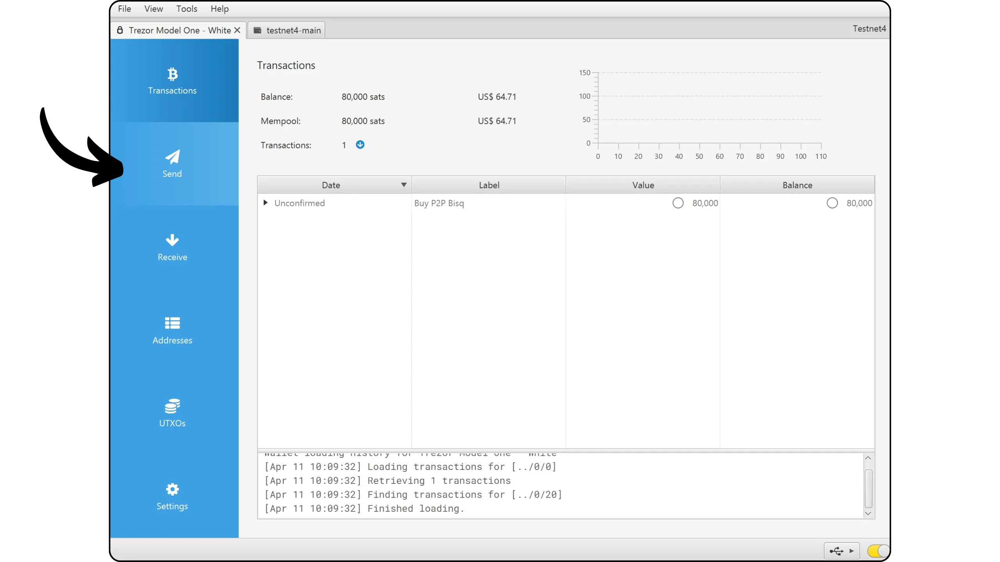

如果您希望*币控*，即在交易中具体选择消耗哪些UTXOs，请转到 "*UTXOs*"选项卡。选择要消耗的UTXOs，然后点击 "*发送所选*"。您将跳转到 "*发送*"选项卡中的同一界面，但已为交易选择了UTXO。

输入目的地 Address。您也可以点击 "*+ 添加*"按钮输入多个地址。

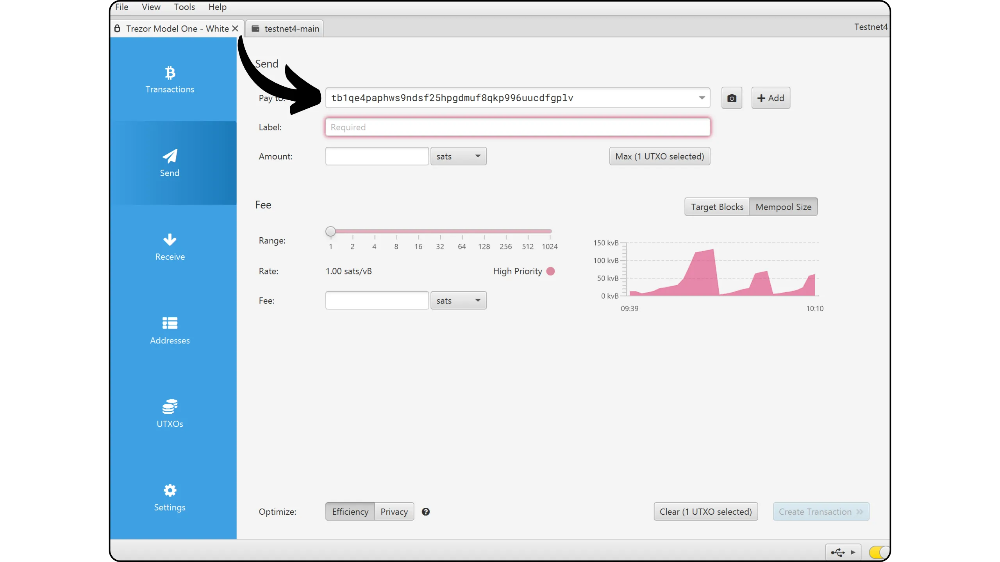

写下 "*标签*"，以记住这笔费用的用途。

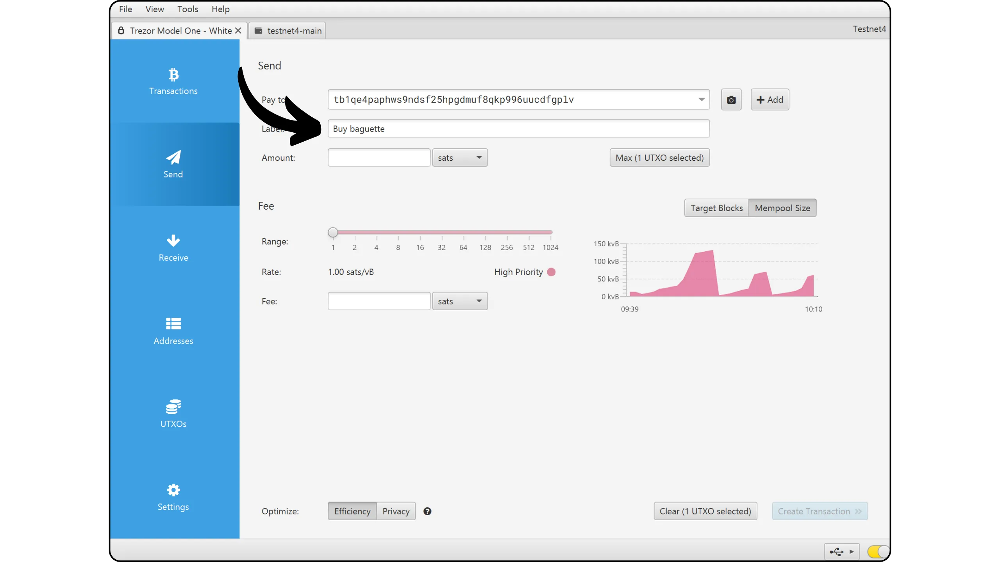

选择要发送到此 Address 的金额。

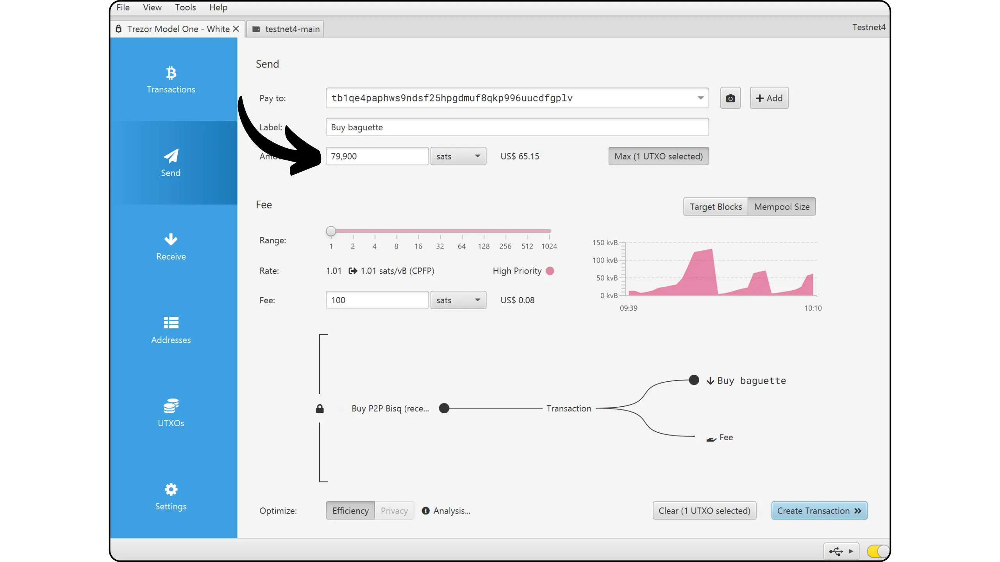

根据当前市场调整交易费率。例如，您可以使用 [Mempool.space](https://Mempool.space/)，选择合适的费率。

确保所有交易参数正确无误，然后点击 "*创建交易*"。

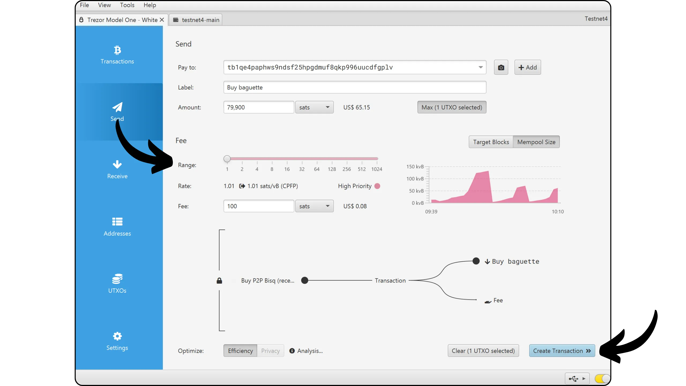

如果一切都令您满意，请点击 "*最终完成交易以供签署*"。

点击 "*签署*"。

点击 Trezor Model One 旁边的 "*Sign*"。

检查 Hardware Wallet 屏幕上的交易参数，包括收件人的接收 Address、发送金额和费用。在 Trezor 上验证交易后，点击右键进行签名。

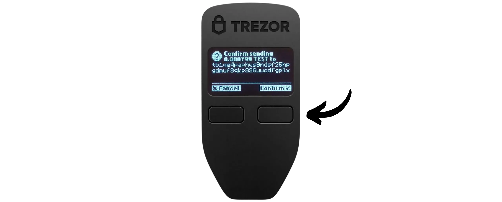

您的交易现在已经签署。最后检查一次是否一切正常，然后点击 "*广播交易*"在 Bitcoin 网络上广播。

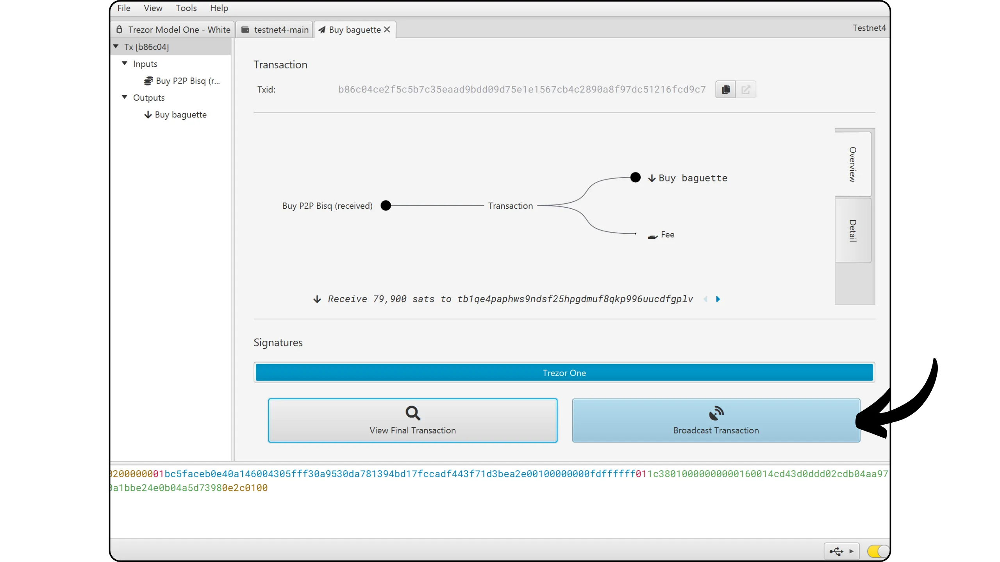

您可以在麻雀 Wallet 的 "*交易*"选项卡中找到它。

恭喜您，现在您已经掌握了 Trezor Model One 与 Sparrow Wallet 的基本使用方法！为了更进一步，我向您推荐这本关于使用 Hardware Wallet Trezor 和 passphrase BIP39 的综合教程，以加强您的安全：

https://planb.network/tutorials/wallet/backup/trezor-passphrase-0474b5bf-496f-4f97-aefe-445368fdca42

如果您觉得本教程有用，请在下面留下 Green 的大拇指。欢迎在您的社交网络上分享本文。非常感谢