*Resim kredisi: [Trezor.io](https://trezor.io/)*

Trezor Safe 5, SatoshiLabs tarafından tasarlanan ve 2024 yılında piyasaya sürülen son nesil bir Hardware Wallet'dir. Ergonomi ve dayanıklılığa odaklanarak Safe 3'ün üst düzey bir versiyonu olarak konumlandırılmıştır. Model One ve Model T ile karşılaştırıldığında selefi Safe 3 ile aynı güvenlik ilerlemelerinden faydalanmaktadır.

169 € fiyatla satışa sunulan Safe 5, Coldcard, Ledger Nano X ve Flex, Jade Plus, Passport ve Bitbox gibi modellerle rekabet eden üst düzey Hardware Wallet kategorisinde yer alıyor.

Safe 5, darbelere ve çizilmelere karşı dayanıklı *Gorilla Glass 3* ile korunan 1,54 inç renkli dokunmatik ekranı ile öne çıkmaktadır. Ayrıca dokunulduğunda küçük titreşimler yayan bir *Trezor Touch* haptik motoru ile donatılmıştır. Safe 3 gibi, bir secure element içerir ve bir Micro SD bağlantı noktası eklenmiş bir USB-C bağlantısı üzerinden çalışır.

Safe 3 ve Safe 5 arasındaki temel fark, güvenlik unsurlarının yanı sıra cihazın kalitesinde yatmaktadır. Daha akıcı çalışma ve daha rahat bir ekran ile kullanıcı deneyimini önemli ölçüde geliştiriyor. Güvenlik açısından eşdeğerdir.

Safe 5, passphrase BIP39'un mükemmel entegrasyonu da dahil olmak üzere iyi bir Hardware Wallet'ten bekleyeceğiniz tüm temel özelliklere sahiptir. Ancak, henüz Miniscript'i desteklemiyor.

Bu model özellikle yeni başlayanlar ve orta düzey kullanıcılar için uygundur. Öte yandan, Coldcard gibi cihazlarda bulunan daha spesifik özellikleri arayan ileri düzey kullanıcıların tüm beklentilerini karşılamayabilir. Yine de, bu gelişmiş seçeneklere ihtiyacınız yoksa, Trezor Safe 5 mükemmel bir seçim olabilir.

## Trezor Safe 5 güvenlik modeli

Safe 3 gibi Trezor Safe 5 de Model One ve Model T gibi önceki modellere göre önemli bir gelişme olan EAL6+ sertifikalı **secure element** ile donatılmıştır. Bu, seed'i doğrudan saklamayan, ancak ona erişimi güvence altına almak için kriptografik bir bileşen görevi gören OPTIGA Trust M V3 çipidir. secure element, yalnızca kullanıcı PIN kodunu doğru girdiğinde erişilebilen bir sırrı saklar. Bu sır daha sonra cihazın ana belleğinde şifreli olarak saklanan seed'in şifresini çözmek için kullanılır.

Bu hibrit güvenlik sistemi, özellikle Model One'ın özellikle PIN yönetiminde eğilimli olduğu ekstraksiyon saldırılarına veya istilacı analizlere karşı gelişmiş fiziksel koruma sunar. secure element kullanımı sayesinde bu güvenlik açıkları artık ortadan kaldırılmıştır. Bu model aynı zamanda açık kaynaklı bir yazılım mimarisine sahiptir: özel anahtarların üretimini ve kullanımını yöneten kod tamamen erişilebilir ve doğrulanabilir olmaya devam etmektedir. OPTIGA çipi yalnızca Bitcoin Wallet anahtar yönetimine harici bir unsur olan PIN kodunu yönetir. seed'nin şifresini çözmek için kullanılabilecek bir sırrı yayınlamakla sınırlıdır. Ayrıca OPTIGA Trust M V3 çipi, SatoshiLabs'a potansiyel güvenlik açıklarını serbestçe yayınlama yetkisi veren (NDA-Free) nispeten özgür bir lisanstan faydalanmaktadır.

Bu güvenlik modeli, bence bugün piyasada bulunan en iyi uzlaşmalardan birini temsil ediyor. secure element'ün avantajlarını açık kaynaklı yazılım yönetimiyle birleştiriyor. Daha önce kullanıcılar bir çip ile gelişmiş fiziksel güvenlik ve açık kaynak ile şeffaflık arasında seçim yapmak zorundaydı; Trezor Safe ile her ikisinden de faydalanmak mümkün.

Bu eğitimde, Trezor Safe 5'inizi nasıl güvenli bir şekilde yapılandıracağınızı ve kullanacağınızı öğreneceksiniz.

## Trezor Safe 5'in kutu açılışı

Safe 5 cihazınızı teslim aldığınızda, paketin açılmadığını doğrulamak için kutunun ve Seal'ün sağlam olduğundan emin olun. Cihazın orijinalliği ve bütünlüğüne ilişkin bir yazılım kontrolü de daha sonra kurulduğunda gerçekleştirilecektir.

Kutu içeriği şunları içerir :

- Trezor Safe 5;
- Mnemonic ifadenizi kaydetmek için kart stoğu, çıkartmalar ve talimatlar içeren bir kese;
- USB-C - USB-C kablosu.

Trezor Safe 5 cihazınız açıldığında koruyucu bir plastikle korunmalı ve USB-C bağlantı noktası holografik bir Seal ile sabitlenmelidir. Orada olduğundan emin olun.

Cihaz üzerinde gezinme oldukça sezgiseldir:

- İlerlemek için ekranın alt yarısına dokunun;
- Geri dönmek için aşağı kaydırın ;
- Bir işlemi onaylamak için ekrana basın ve basılı tutun.

## Ön Koşullar

Bu eğitimde, Trezor Safe 5'i [Sparrow wallet Wallet yönetim yazılımı] (https://sparrowwallet.com/download/) ile nasıl kullanacağınızı göstereceğim. Bu yazılımı henüz yüklemediyseniz, lütfen şimdi yükleyin. Yardıma ihtiyacınız olursa, Sparrow wallet'nin yapılandırılması hakkında ayrıntılı bir eğitimimiz de var:

https://planb.network/tutorials/wallet/desktop/sparrow-c674e2ac-d46f-4c82-92a7-7d1b0e262f5d

Safe 5'i yapılandırmak, orijinalliğini kontrol etmek ve aygıt yazılımını yüklemek için Trezor Suite yazılımına da ihtiyacınız olacak. Bu yazılımı yalnızca bunun için kullanacağız ve daha sonra yalnızca aygıt yazılımı güncellemeleri için gerekli olacak. Wallet'nin günlük yönetimi için, Bitcoin için optimize edildiği ve yeni başlayanlar için bile kullanımı kolay olduğu için yalnızca Sparrow wallet'u kullanacağız (Sparrow yalnızca Bitcoin'yi destekler, altcoinleri desteklemez).

[Trezor Suite'i resmi web sitesinden indirin](https://trezor.io/trezor-suite)

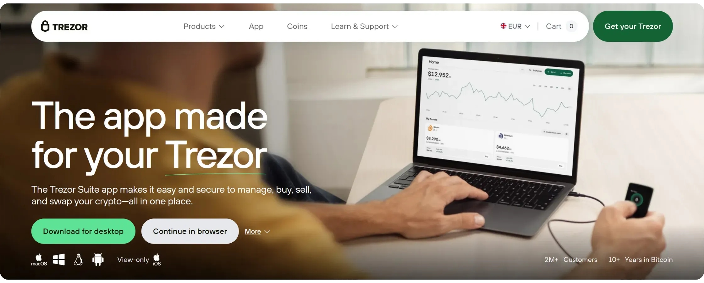

Bu iki program için de, makinenize yüklemeden önce hem orijinalliklerini (GnuPG ile) hem de bütünlüklerini (Hash ile) kontrol etmenizi şiddetle tavsiye ederim. Bunu nasıl yapacağınızı bilmiyorsanız, bu diğer öğreticiyi takip edebilirsiniz:

https://planb.network/tutorials/computer-security/data/integrity-authenticity-21d0420a-be02-4663-94a3-8d487f23becc

## Trezor Safe 5'i başlatma

Safe 5 cihazınızı Trezor Suite ve Sparrow wallet'ün zaten yüklü olduğu bilgisayarınıza bağlayın.

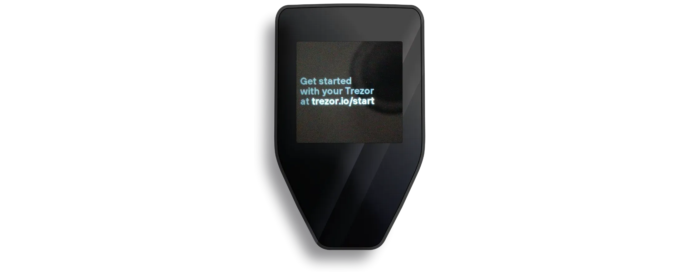

Trezor Suite'i açın, ardından "*Trezor'umu kur*" seçeneğine tıklayın.

"*Bitcoin-only firmware*" öğesini seçin, ardından "*Install Bitcoin-only*" öğesine tıklayın.

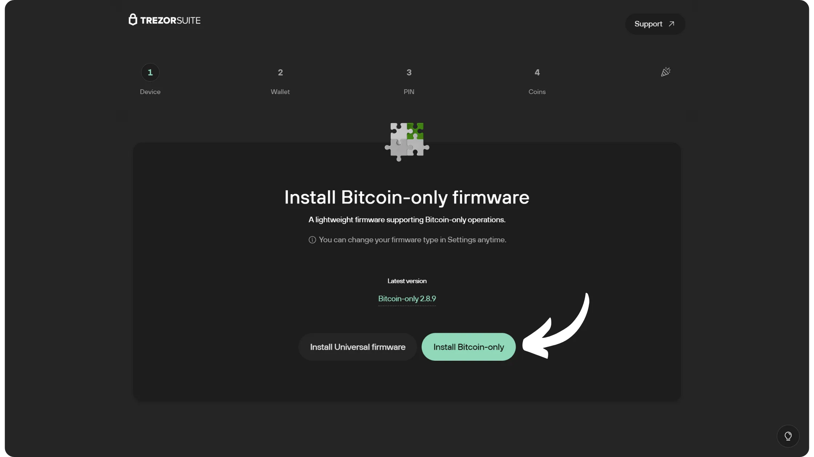

Trezor Suite daha sonra aygıt yazılımını Safe 5'inize yükleyecektir. Lütfen kurulum sırasında bekleyin.

"*Devam*" üzerine tıklayın.

Ardından Hardware Wallet'nızın sahte veya ele geçirilmiş olmadığından emin olmak için orijinallik testine geçin.

Safe 5 cihazınızda, onaylamak için ekrana basın.

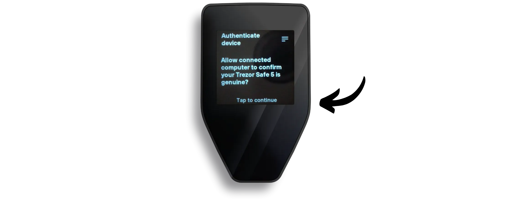

Trezor'unuz orijinalse, Trezor Suite'te bir onay mesajı görünecektir.

Daha sonra temel kullanım talimatlarını içeren pencereleri atlayabilirsiniz.

## Bitcoin Wallet Oluşturma

Trezor Suite'te "*Yeni Wallet* oluştur" düğmesine tıklayın.

Standart bir BIP39 Wallet oluşturmak için açılır menüden "*Legacy Wallet yedekleme türleri*" seçeneğini seçerek başlayın, ardından 12 veya 24 kelimelik bir Mnemonic cümlesi arasından seçim yapın (şu anda 12 kelime önerilmektedir). Bu, klasik bir tek-sig Wallet oluşturmanızı sağlayacaktır. Alımı kolaylaştırmak ve belirli bir ortamla sınırlandırılmamak için burada BIP39 uyumlu parametreleri tercih etmenizi tavsiye ederim. Sonlandırmak için "*Wallet Oluştur*" seçeneğine tıklayın.

Eğer *Çoklu Paylaşım Yedekleme* de dahil olmak üzere Trezor'da bulunan diğer yedekleme seçenekleri hakkında daha fazla bilgi edinmek isterseniz, bu eğitime de başvurmanızı tavsiye ederim:

https://planb.network/tutorials/wallet/backup/trezor-shamir-backup-7f98b593-face-48fb-a643-0e811b87c94e

Hardware Wallet'deki kullanım koşullarını kabul edin.

Yeni bir Wallet oluşturmak için ekranı basılı tutun.

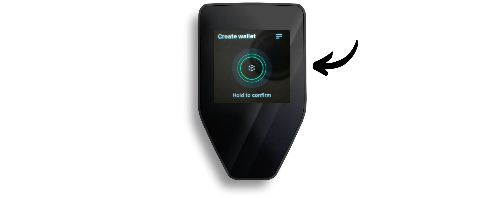

Trezor Suite'te "*Yedeklemeye devam et*" seçeneğine tıklayın.

Yazılım, Mnemonic ifadenizi nasıl yöneteceğinize ilişkin talimatlar sağlar.

Bu Mnemonic size tüm bitcoinlerinize tam ve sınırsız erişim sağlar. Bu ifadeye sahip olan herhangi biri, Trezor Safe 5'inize fiziksel erişimi olmasa bile paranızı çalabilir.

12 kelimelik ifade, Hardware Wallet'nızın kaybolması, çalınması veya kırılması durumunda bitcoinlerinize erişimi geri kazandırır. Bu nedenle dikkatlice kaydetmeniz ve güvenli bir yerde saklamanız çok önemlidir.

Kutuyla birlikte verilen kartona yazabilir veya daha fazla güvenlik için, yangından, selden veya çökmeden korumak için paslanmaz çelik bir tabana kazımanızı öneririm.

Talimatları onaylayın, ardından "*Wallet yedeği oluştur*" düğmesine tıklayın.

Safe 5, rastgele sayı üretecini kullanarak Mnemonic cümlenizi oluşturacaktır. Bu işlem sırasında izlenmediğinizden emin olun. Ekranda verilen kelimeleri seçtiğiniz fiziksel ortama yazın. Güvenlik stratejinize bağlı olarak, ifadenin birkaç tam fiziksel kopyasını çıkarmayı düşünebilirsiniz (ancak her şeyden önce, bölmeyin). Kelimelerin numaralandırılmış ve sıralı olması önemlidir.

***Açıkçası, bu eğitimde yaptığım gibi, bu kelimeleri asla internette paylaşmamalısınız. Bu örnek Wallet sadece Testnet üzerinde kullanılacak ve eğitimin sonunda silinecektir

Mnemonic ifadenizi kaydetmenin ve yönetmenin doğru yolu hakkında daha fazla bilgi için, özellikle yeni başlayan biriyseniz, bu diğer öğreticiyi izlemenizi şiddetle tavsiye ederim:

https://planb.network/tutorials/wallet/backup/backup-mnemonic-22c0ddfa-fb9f-4e3a-96f9-46e2a7954270

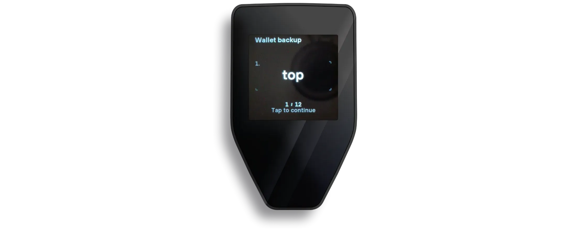

Bir sonraki kelimeye geçmek için ekranın alt kısmına tıklayın. Aşağı kaydırarak geriye doğru gidebilirsiniz. Tüm kelimeleri yazdıktan sonra, bir sonraki adıma geçmek için parmağınızı ekranda tutun.

Doğru yazdığınızı teyit etmek için Mnemonic cümlenizdeki kelimeleri sıralarına göre seçin.

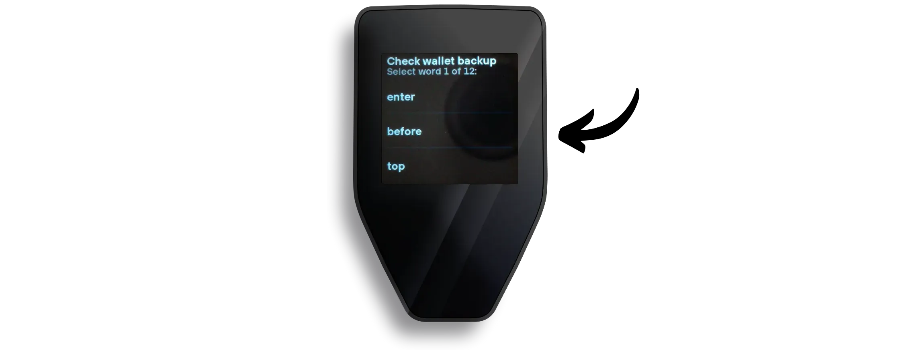

Bu doğrulama prosedürü tamamlandığında, devam etmek için ekrana tıklayın.

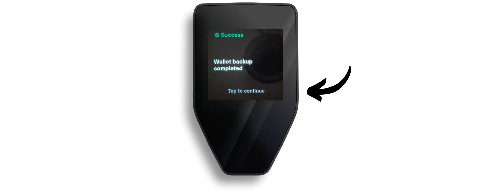

## PIN kodunun ayarlanması

Ardından PIN kodu adımı gelir. PIN kodu Trezor'unuzun kilidini açar. Bu nedenle yetkisiz fiziksel erişime karşı koruma sağlar. Bu PIN kodu, Wallet'ünüzün kriptografik anahtarlarının türetilmesinde yer almaz. Dolayısıyla, PIN koduna erişiminiz olmasa bile, 12 kelimelik Mnemonic cümlenize sahip olmanız bitcoinlerinize yeniden erişmenizi sağlayacaktır.

Trezor Suite'te "*PIN'e Devam Et*" ve ardından "*PIN Ayarla*" düğmesine tıklayın.

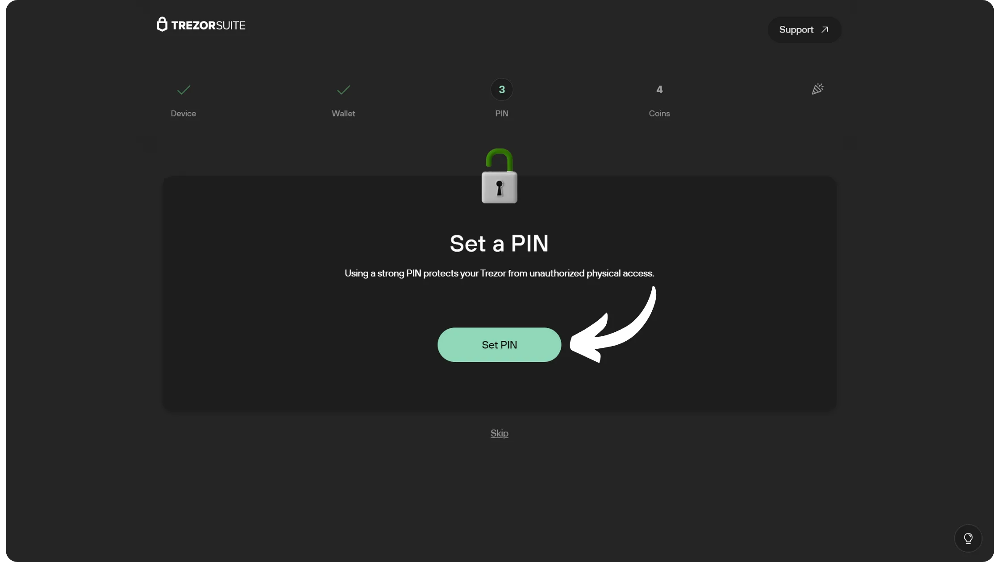

Safe 5 ile onaylayın.

Mümkün olduğunca rastgele bir PIN kodu seçmenizi öneririz. Bu kodu Trezor'unuzun kayıtlı olduğu yerden ayrı bir yere kaydettiğinizden emin olun (örneğin bir parola yöneticisine). PIN kodunu 8 ila 50 basamak arasında tanımlayabilirsiniz. Güvenliği artırmak için mümkün olduğunca uzun bir PIN kodu seçmenizi öneririm.

PIN kodunuzu girmek için dokunmatik yüzeyi kullanın.

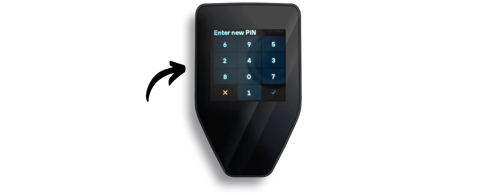

Bitirdiğinizde, sağ alttaki Green işaretine tıklayın, ardından PIN kodunuzu ikinci kez onaylayın.

PIN kodunuz kaydedildi.

Trezor Suite'te "*Kurulumu tamamla*" düğmesine tıklayın.

Safe 5'inizin yapılandırması artık tamamlanmıştır. Dilerseniz Hardware Wallet'nızın adını ve ana sayfasını değiştirebilirsiniz.

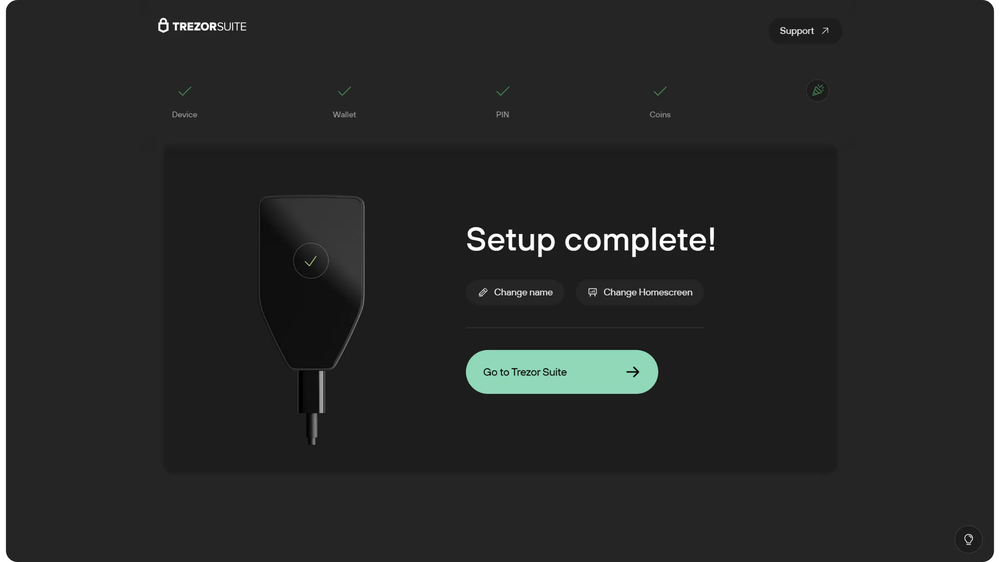

Hardware Wallet'nizde düzenli ürün yazılımı güncellemeleri yapmak ya da bir kurtarma testi gerçekleştirmek dışında Trezor Suite yazılımına artık ihtiyacımız olmayacak. Artık Wallet'yi yönetmek için Sparrow'u kullanacağız, çünkü bu yazılım yalnızca Bitcoin kullanımı için mükemmel bir şekilde uygundur.

## Wallet'nin Sparrow wallet üzerinde kurulması

Henüz yapmadıysanız, Sparrow wallet'ü [resmi web sitesinden] (https://sparrowwallet.com/) bilgisayarınıza indirip yükleyerek başlayın.

Sparrow wallet'ü açtıktan sonra, yazılımın Interface'in sağ alt köşesindeki tik işaretiyle gösterilen bir Bitcoin düğümüne bağlı olduğundan emin olun. Sparrow'yi bağlamakta sorun yaşıyorsanız, bu eğitimin başına bakmanızı tavsiye ederim:

https://planb.network/tutorials/wallet/desktop/sparrow-c674e2ac-d46f-4c82-92a7-7d1b0e262f5d

"*Dosya*" sekmesine ve ardından "*Yeni Wallet*" seçeneğine tıklayın.

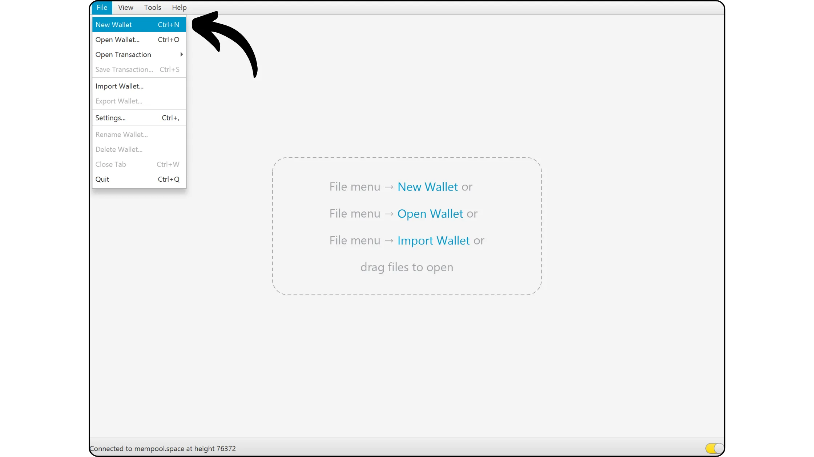

Wallet'unuza bir isim verin ve ardından "*Wallet* Oluştur "a tıklayın.

"*Script Type*" açılır menüsünde, bitcoinlerinizi güvence altına almak için kullanılacak script türünü seçin. Ben "*Taproot*" ya da bu mümkün değilse "*Native SegWit*" seçeneğini öneririm.

"*Bağlı Hardware Wallet*" düğmesine tıklayın. Safe 5'iniz elbette bilgisayara bağlı ve kilidi açık olmalıdır.

Safe 5 cihazınızı Sparrow wallet açıkken bir bilgisayara bağladığınızda, Hardware Wallet ekranında bir passphrase BIP39 girmeniz istenecektir. Bu gelişmiş seçenek gelecekteki bir eğitimde ele alınacaktır. Şimdilik, boş bir passphrase (yani passphrase olmadan) kullanmak istediğinizi onaylamak için sağ üst köşedeki Green işaretine tıklayabilirsiniz. Trezor'unuzun her açılışta sizden bir passphrase girmenizi istemesini önlemek için Trezor Suite'e gidin, ayarlara erişin ve "*Cihaz*" seçeneğini değiştirin > "*passphrase*" yerine "*Wallet varsayılan*" öğesini "*Standart*" olarak değiştirin.

"*Tarama*" düğmesine tıklayın. Güvenli 5'iniz görünmelidir. "*Anahtar Deposunu Aktar*" üzerine tıklayın.

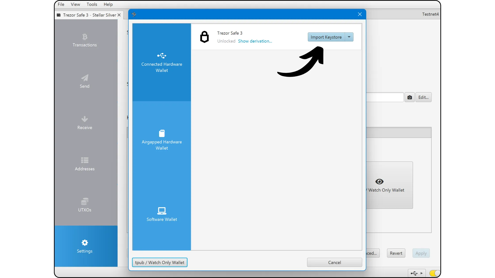

Artık ilk hesabınızın genişletilmiş genel anahtarı da dahil olmak üzere Wallet'inizin ayrıntılarını görebilirsiniz. Wallet oluşturma işlemini tamamlamak için "*Uygula*" düğmesine tıklayın.

Sparrow wallet'a erişimi güvence altına almak için güçlü bir parola seçin. Bu parola, Sparrow wallet verilerinize güvenli erişim sağlayarak genel anahtarlarınızı, adreslerinizi, etiketlerinizi ve işlem geçmişinizi yetkisiz erişime karşı koruyacaktır.

Unutmamak için bu şifreyi bir şifre yöneticisine kaydetmenizi tavsiye ederim.

Ve şimdi Wallet'iniz Sparrow wallet'e aktarıldı!

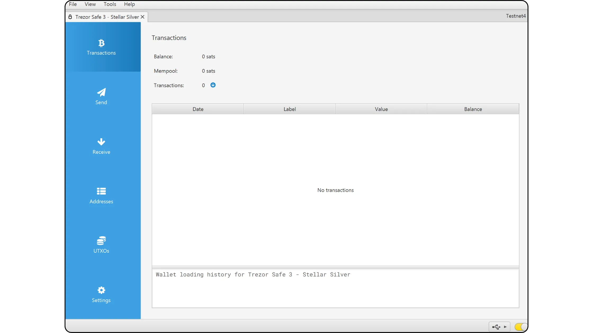

Wallet'nizdeki ilk bitcoinlerinizi almadan önce, **Boş bir kurtarma testi** yapmanızı şiddetle tavsiye ederim. Xpub'ınız gibi bazı referans bilgilerini yazın, ardından Wallet hala boşken Trezor Safe 5'inizi sıfırlayın. Ardından kağıt yedeklerinizi kullanarak Wallet'nizi Trezor'a geri yüklemeyi deneyin. Geri yüklemeden sonra oluşturulan xpub'ın başlangıçta yazdığınızla eşleşip eşleşmediğini kontrol edin. Eğer eşleşiyorsa, kağıt yedeklerinizin güvenilir olduğundan emin olabilirsiniz.

Kurtarma testinin nasıl yapılacağı hakkında daha fazla bilgi edinmek için bu diğer eğitime başvurmanızı öneririm:

https://planb.network/tutorials/wallet/backup/recovery-test-5a75db51-a6a1-4338-a02a-164a8d91b895

## Trezor Safe 5 ile bitcoinleri nasıl alabilirim?

Sparrow'te "*Alma*" sekmesine tıklayın.

Sparrow wallet tarafından önerilen Address'yı kullanmadan önce Trezor'unuzun ekranında kontrol edin. Bu uygulama, Sparrow'de görüntülenen Address'nın sahte olmadığını ve Hardware Wallet'ün daha sonra bu Address ile güvence altına alınan bitcoinleri harcamak için gereken özel anahtara sahip olduğunu doğrulamanızı sağlar. Bu, çeşitli saldırı türlerinden kaçınmanıza yardımcı olur.

Bu kontrolü gerçekleştirmek için "*Address'i Görüntüle*" düğmesine tıklayın.

Trezor'unuzda görüntülenen Address'in Sparrow wallet'daki ile eşleşip eşleşmediğini kontrol edin. Geçerliliğinden emin olmak için Address'inizi göndericiye iletmeden hemen önce bu kontrolü yapmanız da tavsiye edilir. Onaylamak için ekrana basabilirsiniz.

Daha sonra bu Address ile güvence altına alınacak bitcoinlerin kaynağını tanımlamak için bir "*Etiket*" ekleyebilirsiniz. Bu, UTXO'larınızı daha iyi yönetmenizi sağlayan iyi bir uygulamadır.

Daha sonra bu Address'yi bitcoin almak için kullanabilirsiniz.

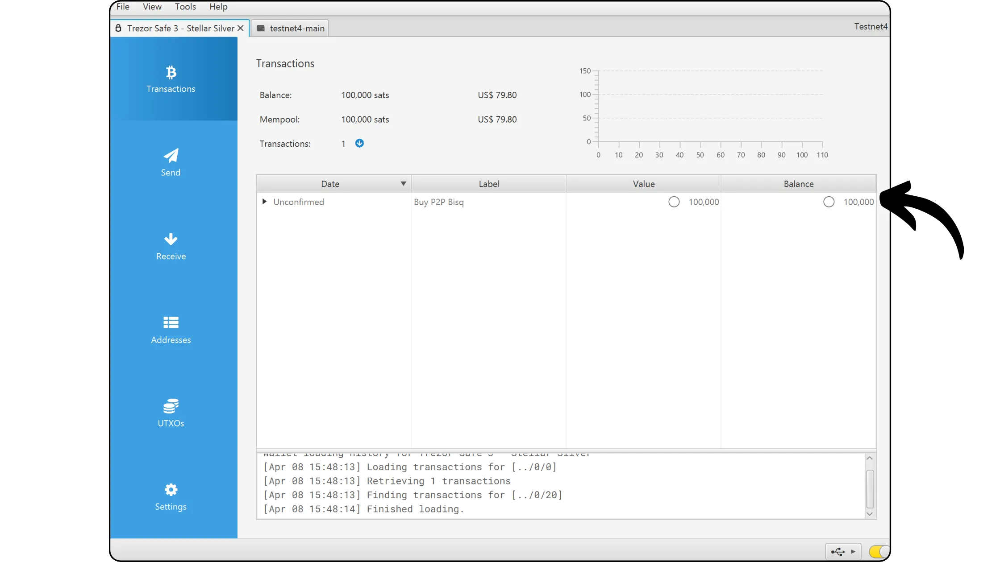

## Trezor Safe 5 ile nasıl bitcoin gönderebilirim?

Safe 5 güvenlikli Wallet'ünüzde ilk Sats'larınızı aldığınıza göre artık onları da harcayabilirsiniz! Trezor'unuzu bilgisayarınıza bağlayın, PIN kodu ile kilidini açın, Sparrow wallet'ü başlatın, ardından yeni bir işlem oluşturmak için "*Gönder*" sekmesine gidin.

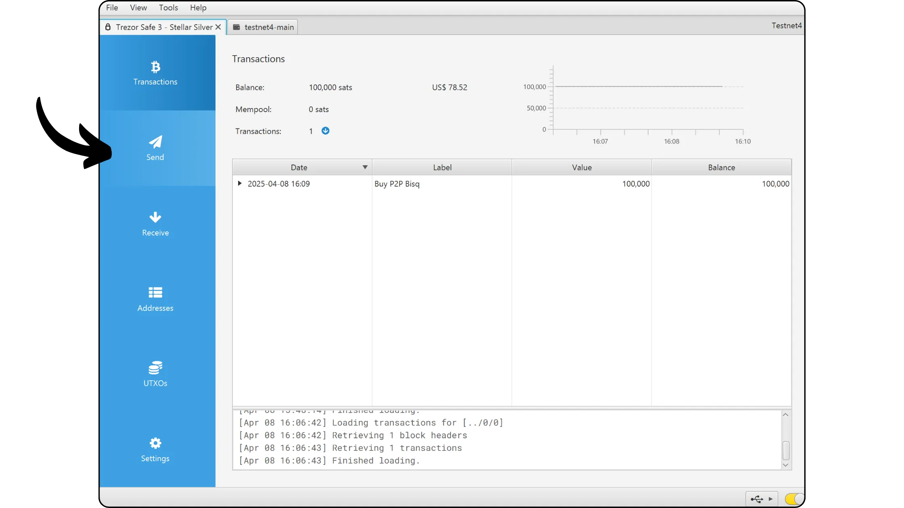

Eğer *Coin Kontrolü* yapmak istiyorsanız, yani işlemde hangi UTXO'ların kullanılacağını özellikle seçmek istiyorsanız, "*UTXOs*" sekmesine gidin. Harcamak istediğiniz UTXO'ları seçin ve ardından "*Seçilenleri Gönder*" seçeneğine tıklayın. "*Gönder*" sekmesindeki aynı ekrana yönlendirileceksiniz, ancak UTXO'larınız işlem için zaten seçilmiş olacak.

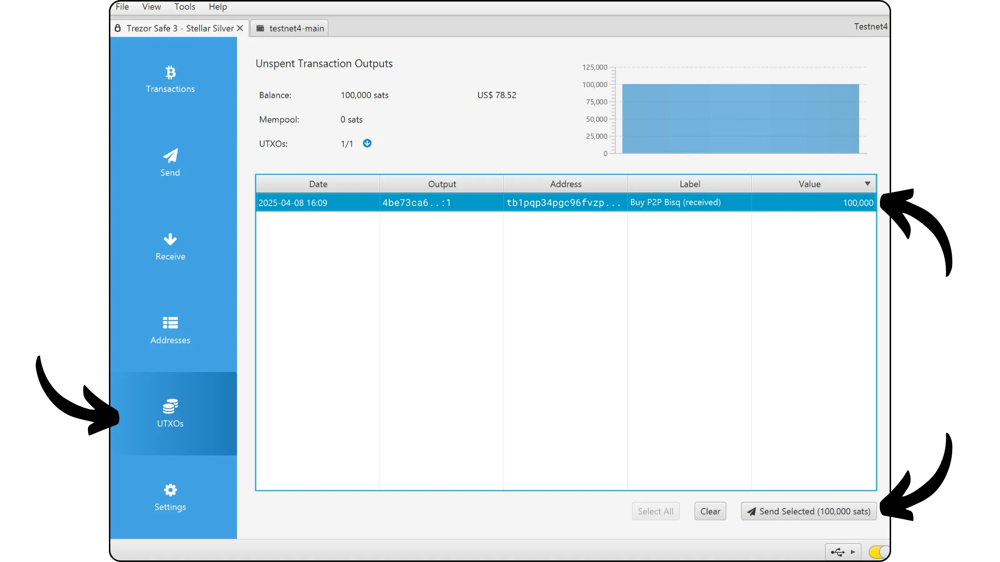

Hedef Address'yı girin. "*+ Ekle*" düğmesine tıklayarak birden fazla adres de girebilirsiniz.

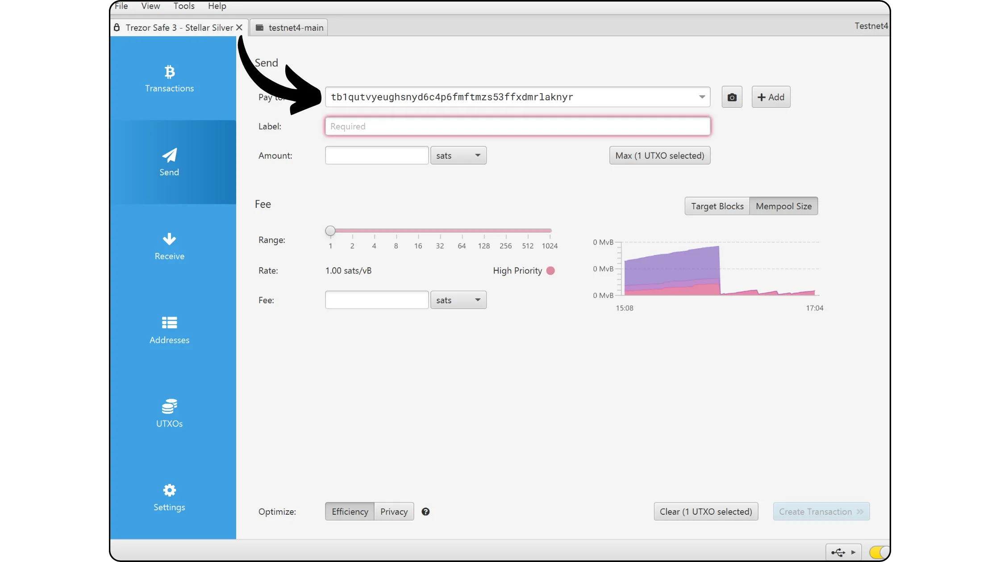

Bu masrafın amacını hatırlamak için bir "*Etiket*" yazın.

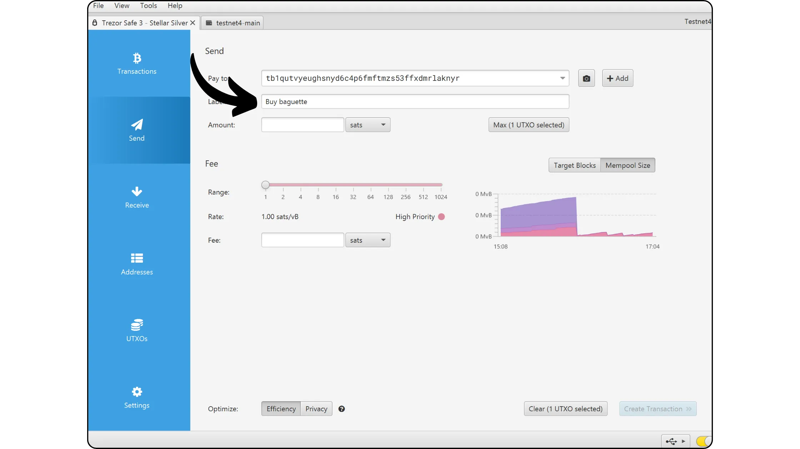

Bu Address'ye gönderilecek tutarı seçin.

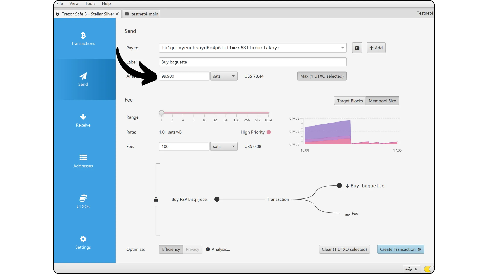

İşleminizin ücret oranını mevcut piyasaya göre ayarlayın. Örneğin, uygun bir ücret oranı seçmek için [Mempool.space](https://Mempool.space/) kullanabilirsiniz.

Tüm işlem parametrelerinizin doğru olduğundan emin olun ve ardından "*İşlem Oluştur*" seçeneğine tıklayın.

Her şey sizi tatmin ediyorsa, "*İmzalama için İşlemi Sonlandır*" seçeneğine tıklayın.

"*İmzala*" üzerine tıklayın.

Trezor Safe 5'inizin yanındaki "*İmzala*" düğmesine tıklayın.

Alıcının alıcı Address'ı, gönderilen miktar ve ücret dahil olmak üzere Hardware Wallet ekranınızdaki işlem parametrelerini kontrol edin. İşlem Trezor'da doğrulandıktan sonra imzalamak için ekranı basılı tutun.

İşleminiz artık imzalanmıştır. Her şeyin yolunda olup olmadığını son bir kez kontrol edin, ardından Bitcoin ağında yayınlamak için "*İşlemi Yayınla*" seçeneğine tıklayın.

Bunu Sparrow wallet'nin "*İşlemler*" sekmesinde bulabilirsiniz.

Tebrikler, artık Trezor Safe 5'in Sparrow wallet ile temel kullanımını öğrenmiş bulunuyorsunuz! İşleri bir adım öteye taşımak için, güvenliğinizi artırmak amacıyla Trezor Hardware Wallet'ü passphrase BIP39 ile kullanma hakkındaki bu kapsamlı eğitimi tavsiye ederim:

https://planb.network/tutorials/wallet/backup/trezor-passphrase-0474b5bf-496f-4f97-aefe-445368fdca42

Bu eğitimi faydalı bulduysanız, aşağıya bir Green başparmak bırakırsanız minnettar olurum. Bu makaleyi sosyal ağlarınızda paylaşmaktan çekinmeyin. Çok teşekkür ederim!