## معرفی

Valet یک Bitcoin و Lightning wallet سبک و خود نگهدار است که فرآیند ورود آسان و راحتی را برای مبتدیان ارائه می‌دهد. این محصول به‌طور خاص برای خدمت به جوامع Bitcoin و اقتصادهای دایره‌ای، به‌ویژه در مناطق دورافتاده طراحی شده است.

این یک fork از **Simple Bitcoin Wallet (SBW)** است، با ویژگی پیشرفته کانال میزبانی شده Lightning به نام **Fiat Channels**، طراحی شده برای اینکه هر کسی بتواند پرداخت‌های Lightning را بدون ریسک نوسانات بپذیرد.

در حال حاضر، Valet فقط برای دستگاه‌های اندروید در دسترس است و می‌توان آن را از چندین فروشگاه اپلیکیشن متن‌باز دانلود و نصب کرد. با این حال، Valet به دلیل نگرانی‌های مربوط به حریم خصوصی توسعه‌دهنده و KYC در **فروشگاه Google Play** میزبانی نمی‌شود.

## دانلود و نصب Valet

می‌توان Valet را به‌صورت یک فایل APK از صفحه GitHub شرکت Standard Sats' دانلود کرد. [Standard Sats](https://standardsats.github.io/) شرکتی است که Valet را توسعه داده است.

👉 برای دانلود Valet، به [صفحه GitHub](https://github.com/standardsats/valet/releases) استاندارد Sats مراجعه کنید و آخرین نسخه **جدیدترین** را پیدا کنید (این معمولاً بالاترین نسخه است).

👉 به **Assets** بروید و روی فایلی که فقط دارای پسوند **.apk** است کلیک کنید. دانلود شما به صورت خودکار آغاز خواهد شد.

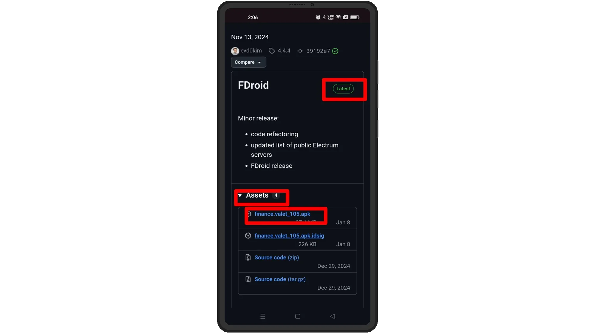

👉 پس از اتمام دانلود، به **مدیر فایل** > **دانلودها** در دستگاه خود بروید و فایل apk Valet را انتخاب کنید.

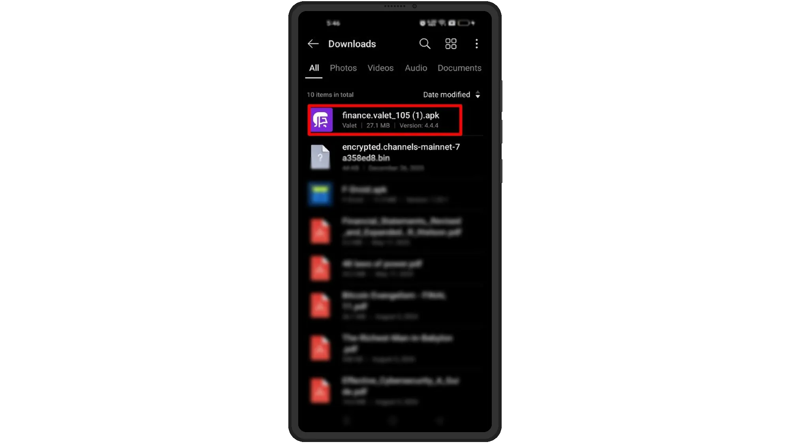

👉 آن را نصب کنید، و در عرض چند ثانیه، برنامه شما آماده خواهد شد و در صفحه اصلی شما ظاهر می‌شود.

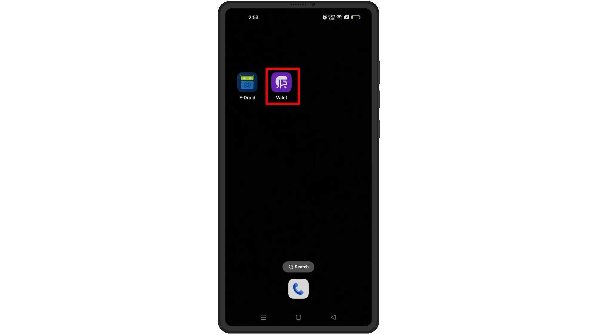

به‌طور جایگزین، می‌توانید Valet را از فروشگاه برنامه **F-Droid** دانلود کنید. اگر برنامه F-Droid را روی دستگاه خود ندارید، می‌توانید آن را [اینجا](https://f-droid.org/en/) دانلود و نصب کنید.

👉 در صفحه اصلی خود، F-Droid را باز کرده و به دنبال **Valet** بگردید. اولین گزینه با **آیکون بنفش و سفید** را از دو گزینه‌ای که ظاهر می‌شود انتخاب کرده و روی **دانلود** کلیک کنید.

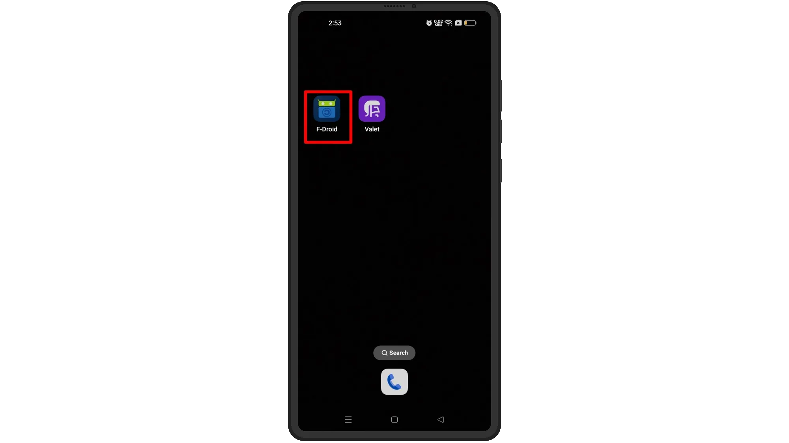

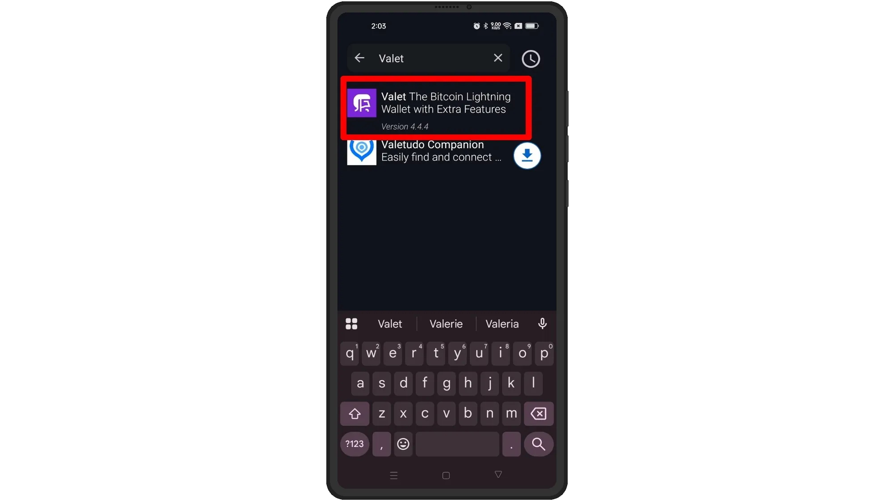

👉 پس از دانلود، روی **نصب** کلیک کنید و دستورالعمل‌های روی صفحه را دنبال کنید. وقتی نصب به پایان رسید، می‌توانید با کلیک روی **باز کردن** از F-Droid، Valet را اجرا کنید، یا آن را از صفحه اصلی دستگاه خود اجرا کنید.

## ایجاد یک Bitcoin Wallet

می‌توانید Bitcoin wallet را در Valet در دو مرحله ساده تنظیم کنید.

👉 برنامه Valet را از صفحه اصلی دستگاه خود یا از برنامه F-Droid راه‌اندازی کنید. صفحه تنظیمات wallet ظاهر خواهد شد، با دو گزینه: **ایجاد Wallet جدید** و **بازیابی Wallet موجود**.

👉 **ایجاد Wallet جدید** را انتخاب کنید، و بلافاصله یک wallet جدید ایجاد خواهد شد و به صفحه اصلی هدایت خواهید شد.

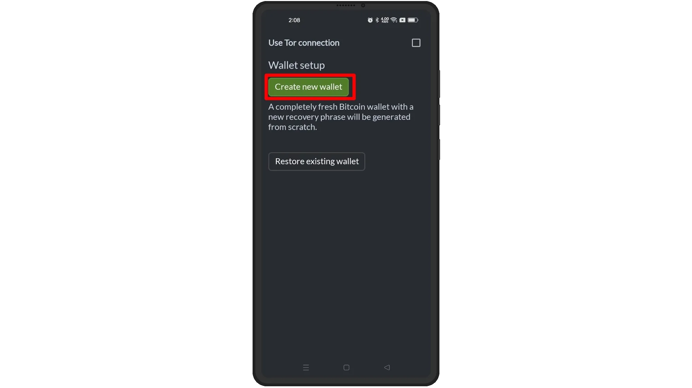

## عبارت بازیابی خود را پشتیبان‌گیری کنید

👉 در صفحه اصلی wallet، بر روی **کارت Green** که دارای نوشته **"برای ذخیره عبارت بازیابی wallet در صورت گم شدن یا تعویض دستگاه خود ضربه بزنید".** کلیک کنید.

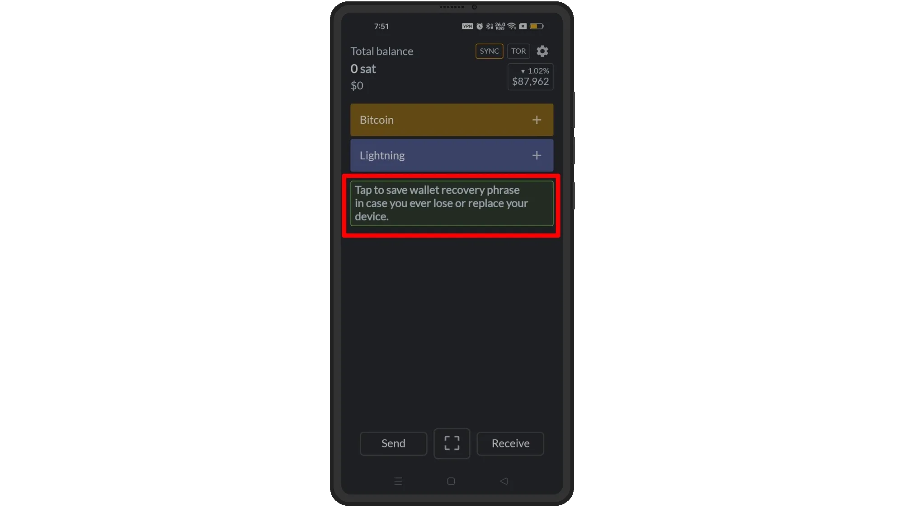

👉 مجموعه‌ای از ۱۲ کلمه انگلیسی نمایش داده خواهد شد. آن‌ها را به ترتیب از ۱ تا ۱۲ روی کاغذ بنویسید و در جای امنی نگه دارید.

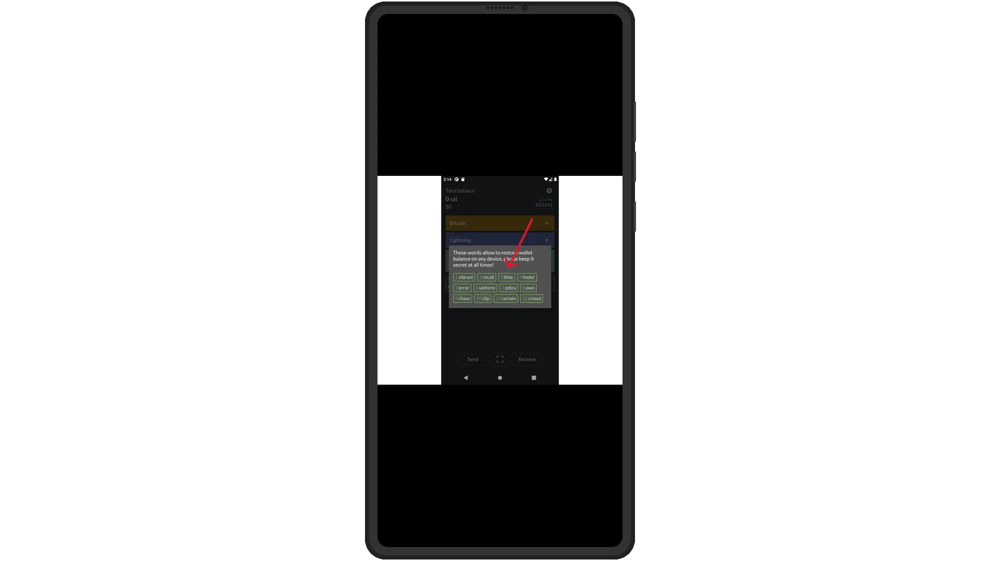

### توجه کنید ⚠️:

به عناصر زیر توجه کنید:

- همانطور که می‌دانید، Valet یک wallet خود نگهدار است، بنابراین عبارت seed شما تنها راه دسترسی برای بازیابی Wallet شما است.
- اگر عبارت seed خود را گم کنید، **هرگز** به wallet خود دسترسی نخواهید داشت.
- اگر کسی عبارت seed شما را به دست آورد، می‌تواند به‌طور غیرقابل‌بازگشتی تمام Bitcoinهای شما را بدزدد.

بنابراین، شما باید عبارت 12 کلمه‌ای seed خود را یادداشت کرده و در مکانی امن نگهداری کنید. هرگز نباید از آن اسکرین‌شات بگیرید، به عنوان پیش‌نویس در ایمیل خود ذخیره کنید، یا آن را در هیچ دستگاه الکترونیکی که تا به حال به اینترنت متصل شده است، ذخیره کنید.

https://planb.academy/tutorials/wallet/backup/backup-mnemonic-22c0ddfa-fb9f-4e3a-96f9-46e2a7954270

## دریافت و ارسال Bitcoins بر روی Valet

والت یک wallet خود نگهدار است که دارای قابلیت‌های on-chain و Lightning Bitcoin می‌باشد. این بدان معناست که شما می‌توانید Bitcoin را از والت به صورت **در زنجیره** یا از طریق **Lightning Network** دریافت و ارسال کنید.

با این حال، برای اینکه بتوانید Bitcoin را از طریق Lightning دریافت یا ارسال کنید، باید یک کانال Lightning با استفاده از on-chain Bitcoinهای خود به عنوان Liquidیت ایجاد کنید. یا می‌توانید مقداری نقدینگی کانال Lightning از فروشندگان خریداری کنید.

## تولید یک زنجیره‌ای Bitcoin Address

برای دریافت Bitcoin از طریق on-chain، باید یک آدرس Bitcoin ایجاد کنید.

👉 در صفحه اصلی wallet، شما یک **کارت نارنجی** و یک **کارت بنفش** خواهید دید که به ترتیب با برچسب‌های **Bitcoin** و **Lightning** مشخص شده‌اند.

👉 روی کارت نارنجی با برچسب **Bitcoin** کلیک کنید. به صفحه‌ای هدایت خواهید شد که آدرس Bitcoin را نمایش می‌دهد.

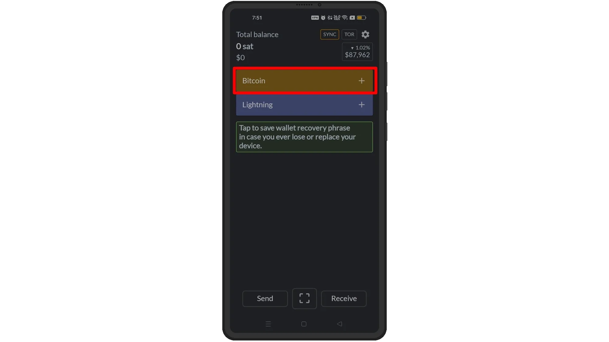

👉 شما می‌توانید آدرس را **کپی** کرده و به شخصی که Bitcoins را برای شما ارسال می‌کند بفرستید، یا با کلیک بر روی دکمه **اشتراک‌گذاری**، کد QR را از طریق شبکه‌های اجتماعی یا دیگر کانال‌های ارتباطی برای شخص ارسال کنید.

👉 شما همچنین می‌توانید روی دکمه **ویرایش** کلیک کنید تا مقدار Bitcoinهایی که باید به آن آدرس ارسال شوند را تنظیم کنید.

**توجه:** مانند یک فاکتور، ویژگی ویرایش در سناریوهایی که ممکن است بخواهید مقدار مشخصی از Bitcoins را به یک آدرس در یک نقطه دریافت کنید، مفید است؛ با این حال، این به معنای آن نیست که آدرس نمی‌تواند مقادیر بیشتر یا کمتری دریافت کند.

👉روی **آدرس‌های تازه بیشتر** کلیک کنید تا آدرس‌های تصادفی جدید ایجاد شود.

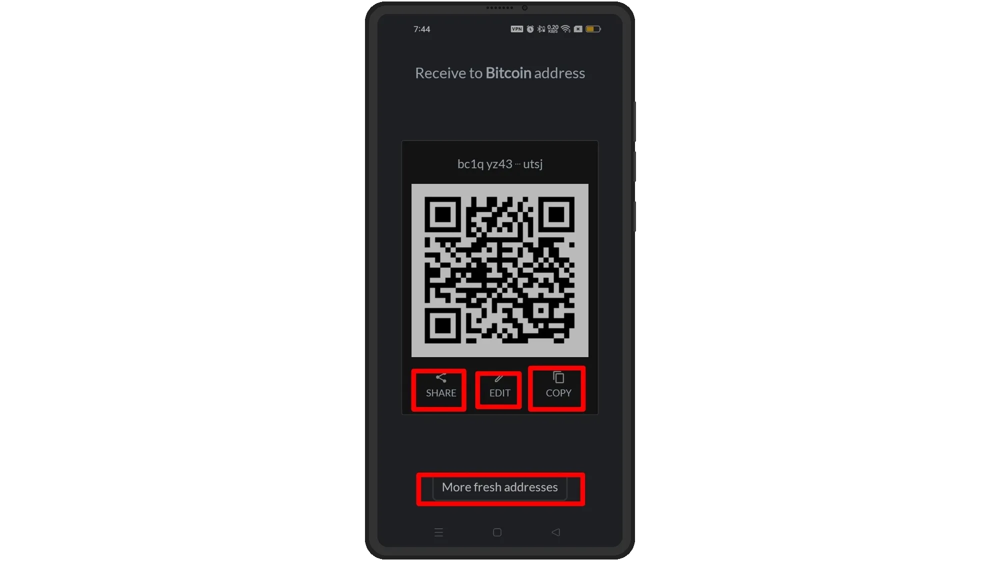

👉 شما همچنین می‌توانید با کلیک بر روی دکمه **دریافت** در پایین صفحه اصلی wallet خود، یک آدرس on-chain Bitcoin تولید کنید. سپس **دریافت به آدرس بیت‌کوین** را انتخاب کرده و با همان فرآیند بالا ادامه دهید.

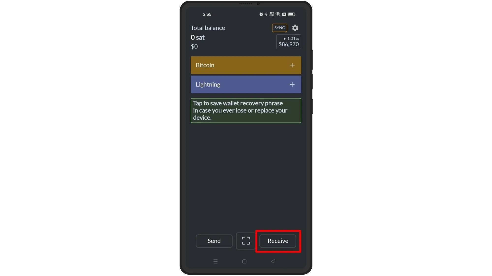

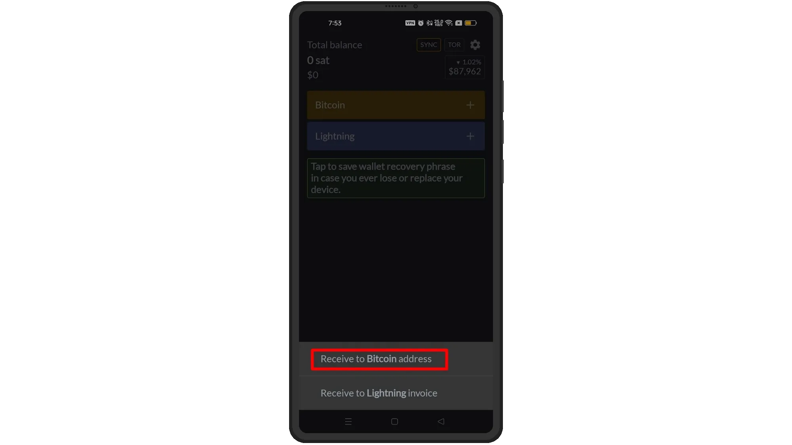

## ارسال Bitcoin از طریق On-chain

ارسال Bitcoin از Valet wallet از طریق on-chain یک کار ساده است.

👉 در پایین صفحه اصلی wallet خود، روی دکمه **ارسال** کلیک کنید، آدرس Bitcoin را وارد کنید، یا روی **اسکن** کلیک کنید تا کد QR آدرس را اسکن کنید، سپس روی **تأیید** کلیک کنید.

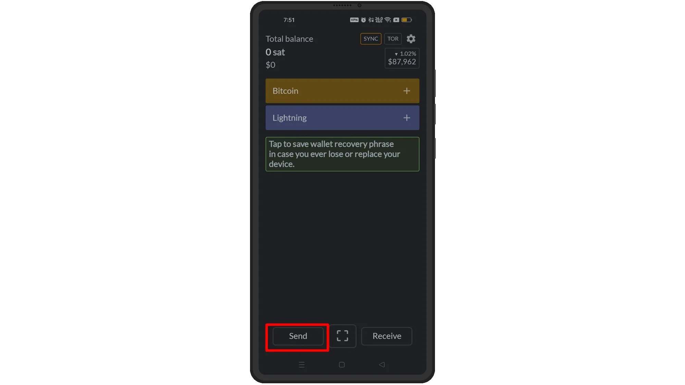

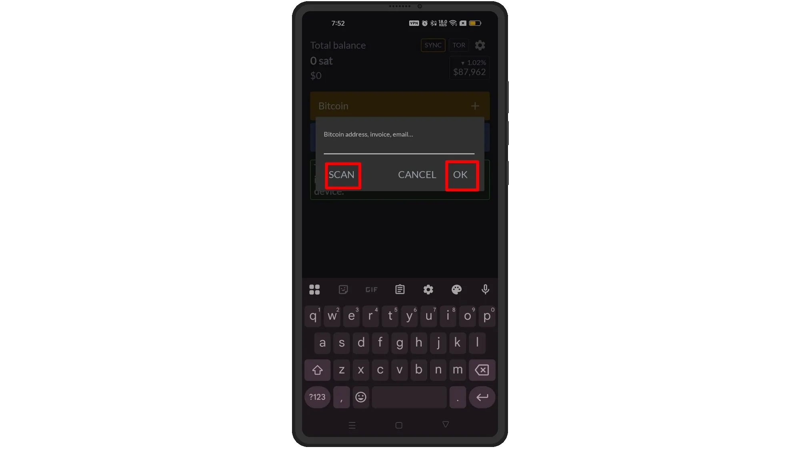

👉 مقدار Bitcoin که می‌خواهید ارسال کنید را وارد کنید. می‌توانید به صورت دستی مقداری را به واحد Sats یا به واحد ارز فیات وارد کنید، یا می‌توانید روی **حداکثر** کلیک کنید تا از تمام موجودی on-chain خود استفاده کنید.

👉 شما همچنین می‌توانید هزینه‌هایی که می‌خواهید برای تراکنش پرداخت کنید را با کلیک روی جعبه سبز کوچک با برچسب **هزینه** تنظیم کنید و سپس نقطه سفید را به راست یا چپ بکشید تا هزینه‌ها را به ترتیب افزایش یا کاهش دهید. برای ارسال تراکنش روی **تأیید** کلیک کنید.

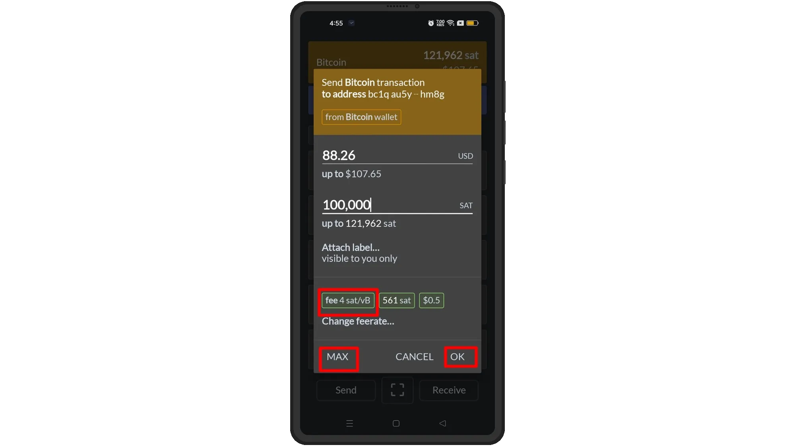

## راه‌اندازی یک کانال Lightning Network

همان‌طور که در بالا ذکر شد، Valet یک Bitcoin خود نگهدار و Lightning wallet است؛ بنابراین، برای اینکه بتوانید Bitcoin را از طریق شبکه Lightning ارسال و دریافت کنید، ابتدا باید یک کانال Lightning راه‌اندازی کنید، با دنبال کردن این مراحل:

👉 در صفحه اصلی، روی **کارت بنفش** با برچسب **Lightning** کلیک کنید. شما به صفحه‌ای با گزینه‌های زیر هدایت خواهید شد:

- کد QR گره را اسکن کنید
- خرید از LNBIG.COM
- خرید از BITREFILL.COM
- درخواست همگام‌سازی مجدد نمودار LN.

وقتی **خرید از lnbig.com** یا **خرید از bitrefill.com** را انتخاب می‌کنید، به وب‌سایت‌های این شرکت‌ها هدایت می‌شوید، جایی که می‌توانید نقدینگی ورودی با ظرفیت‌های مختلف را خریداری کنید. فعلاً گزینه آخر **درخواست همگام‌سازی مجدد نمودار LN** را نادیده بگیرید.

بنابراین انتخاب اصلی ما در اینجا **اسکن یک QR نود** است. در این مرحله، شما باید تصمیم گرفته و **کد QR** نودی که می‌خواهید به آن کانال باز کنید را به دست آورده باشید. شما می‌توانید به هر نود عمومی که انتخاب می‌کنید کانال باز کنید. به [1ML](https://1ml.com/) یا [Amboss](https://amboss.space/) مراجعه کنید، هر نود عمومی که می‌خواهید را انتخاب کنید و کد QR مربوط به نود انتخابی خود را اسکن کنید.

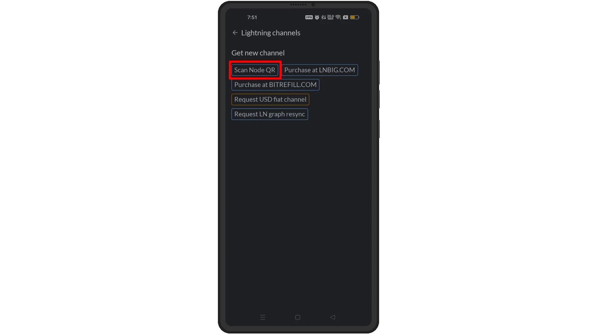

👉 شما به طور خودکار به صفحه بعدی هدایت خواهید شد، جایی که باید کانال خود را تأمین مالی کنید. دوباره، استفاده از شبکه لایتنینگ خود-نگهدارنده نیاز دارد که از Bitcoins خود برای تأمین مالی یک کانال استفاده کنید. این به این معنی است که شما باید Bitcoins در on-chain wallet خود داشته باشید تا کانال لایتنینگ را تأمین مالی کنید. لطفاً به این مقاله توسط [Hacken](https://hacken.io/discover/lightning-network/) مراجعه کنید و بیشتر درباره شبکه لایتنینگ بخوانید.

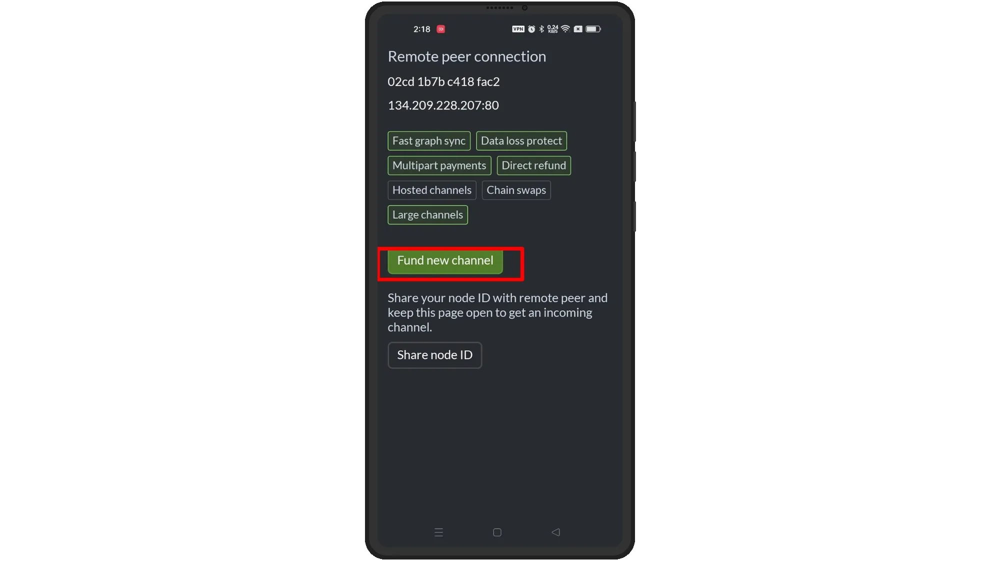

👉 مقدار **Bitcoin** هایی که می‌خواهید کانال را با آن تأمین مالی کنید وارد کنید، یا روی **Max** کلیک کنید تا از تمام موجودی on-chain Bitcoin خود استفاده کنید. می‌توانید **کارمزد** را تنظیم کنید، یا تنظیمات پیش‌فرض کارمزد را بگذارید و روی **Ok** کلیک کنید.

**توجه:** مبلغی که به کانال واریز می‌کنید ظرفیت کانال جدید شما خواهد بود (یعنی حجم کل Sats که می‌تواند به و از آن کانال منتقل شود)

همچنین مهم است که هنگام باز کردن یک کانال از بیش از **100,000 Sats** به عنوان مبلغ تأمین مالی استفاده کنید. این به این دلیل است که بسیاری از نودهای لایتنینگ نیاز به حداقل ظرفیت 100,000 Sats برای باز کردن یک کانال به آنها دارند. بنابراین، برای جلوگیری از آزمون و خطا، به سادگی از مقادیر بالاتر از این محدوده استفاده کنید.

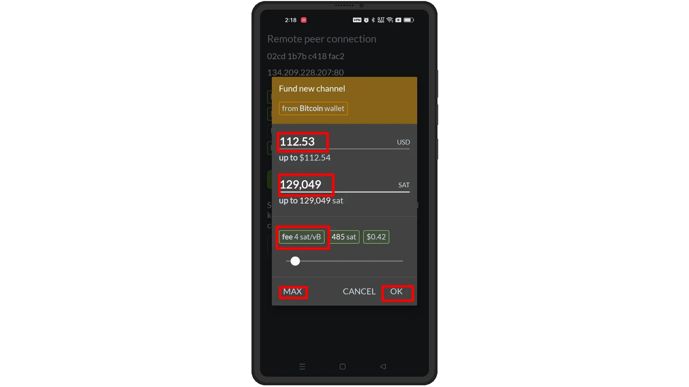

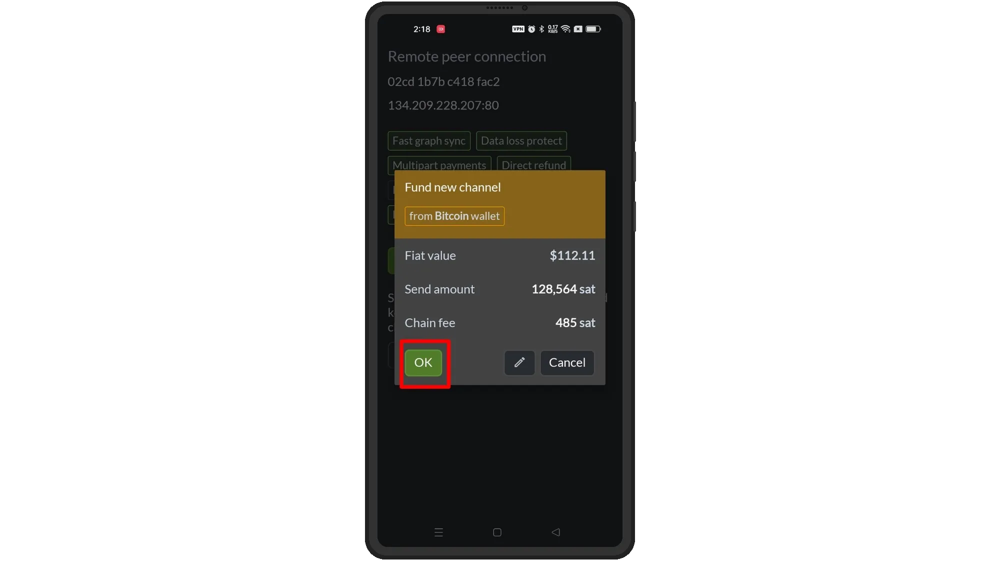

👉 در این مرحله، وقتی صفحه اصلی wallet خود را بررسی می‌کنید، خواهید دید که مبلغ تأمین مالی شما اکنون از **کارت Bitcoin** به **کارت Lightning** منتقل شده است. در تاریخچه تراکنش‌های خود، خواهید دید که تراکنش تأمین مالی در حال پردازش است.

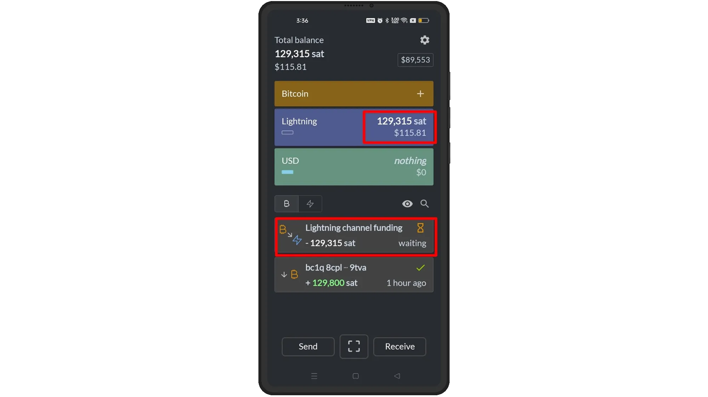

👉 اگر روی کارت Lightning کلیک کنید، اطلاعاتی را مشاهده خواهید کرد که نشان می‌دهد کانال Lightning شما در حال باز شدن است. همچنین **تراکنش تأمین مالی کانال** را در لیست تراکنش‌های خود خواهید دید. منتظر بمانید تا تراکنش تأمین مالی شما در blockchain تأیید شود و کانال Lightning شما آماده خواهد شد.

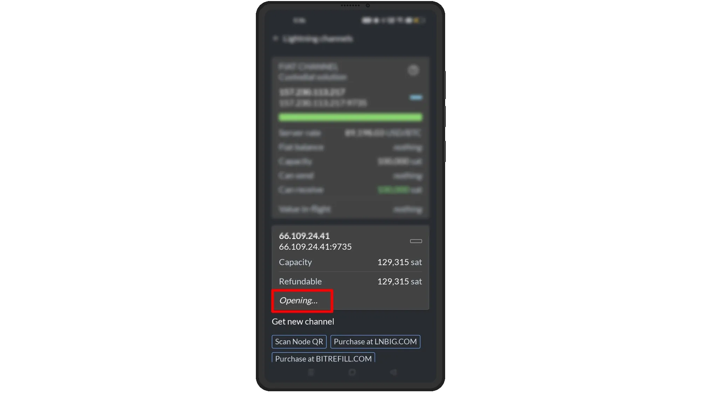

👉 به محض تأیید تراکنش تأمین مالی، روی **کارت Lightning** در صفحه اصلی خود کلیک کنید و اطلاعات مربوط به کانال Lightning خود را به صورت زیر مشاهده خواهید کرد:

- مجموعه‌ای تصادفی از اعداد که با نقطه‌ها جدا شده‌اند:** این‌ها آدرس‌های IP نودها هستند. (به ترتیب IPV4 و IPV6)
- ظرفیت:** این حجم کل Sats است که می‌تواند از طریق این کانال ارسال و دریافت شود.
- می‌توانید ارسال کنید:** این مقدار Sats است که در این لحظه می‌توانید ارسال کنید. متوجه خواهید شد که تقریباً همان رقم **ظرفیت** است. این به این دلیل است که شما هیچ پرداختی از طریق کانال ارسال نکرده‌اید.
- می‌توانید دریافت کنید:** این تعداد Sats است که در حال حاضر می‌توانید به این کانال دریافت کنید. (در این لحظه این تعداد بسیار کم یا هیچ خواهد بود زیرا برای اینکه بتوانید دریافت کنید، ابتدا باید مقداری Sats ارسال کنید تا یک Liquidity ورودی ایجاد کنید)
- قابل بازپرداخت:** این مقدار پولی است که هنگام بستن کانال به آدرس on-chain شما بازگردانده می‌شود. به این مقدار همچنین به عنوان **موجودی محلی کانال شما** اشاره می‌شود. توجه داشته باشید که این مقدار کمی کمتر از ظرفیت کانال است و این به این دلیل است که هنگام بستن یک کانال، باید هزینه‌ای برای انتشار تراکنش بستن در blockchain بپردازید، درست مانند زمانی که کانال را تأمین مالی کردید. بنابراین سیستم کمترین مقدار تقریبی که پرداخت خواهید کرد را کسر کرده است.)
- ارزش در پرواز:** هنگامی که کسی مقداری sats به کانال شما ارسال می‌کند، یا زمانی که شما سعی می‌کنید مقداری sats به کسی ارسال کنید و به هر دلیلی تراکنش به تأخیر می‌افتد، اغلب در این فیلد نمایش داده می‌شود.

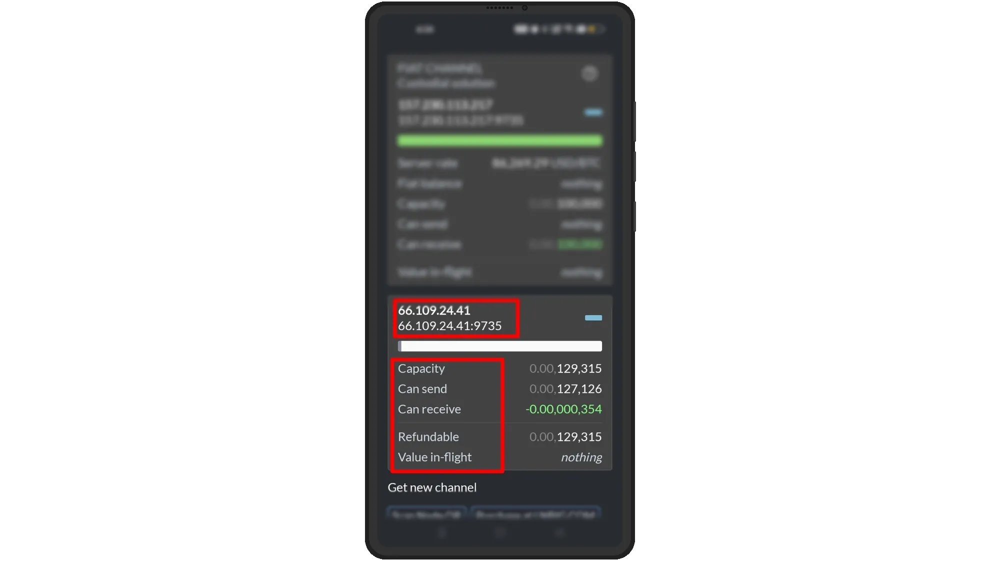

## ارسال Sats از طریق کانال شما

ارسال Sats از طریق Lightning Network یک کار ساده است.

👉 در پایین صفحه اصلی، روی **ارسال** کلیک کنید و فاکتور Lightning را (که باید آن را کپی کرده باشید) در فیلد ارائه شده **پیست** کنید، یا روی **اسکن** کلیک کنید تا کد QR فاکتور Lightning را اسکن کنید.

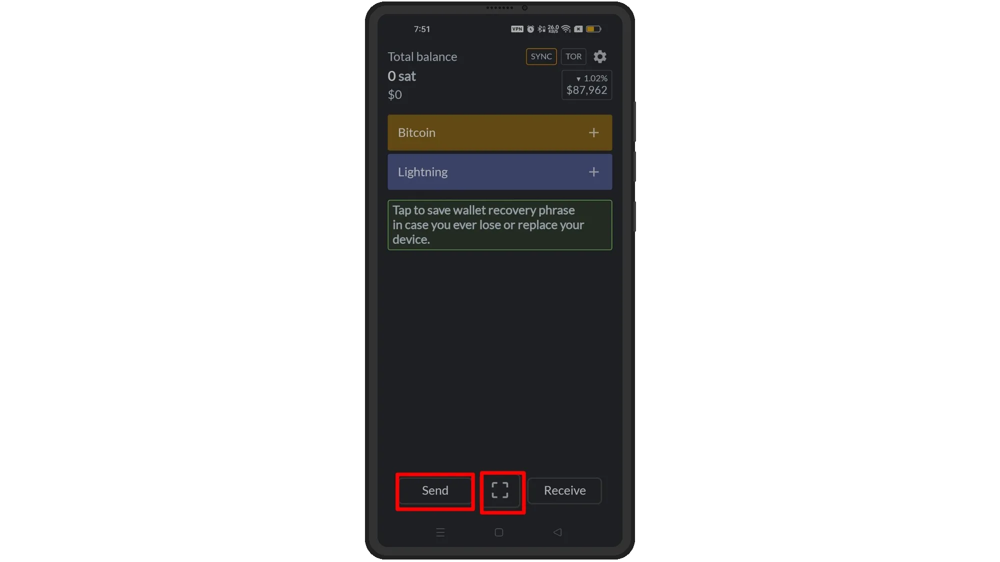

بیشتر فاکتورهای Lightning با مبلغ از پیش وارد شده برای پرداخت ارائه می‌شوند. اما در برخی موارد، ممکن است یک فاکتور باز باشد که در آن باید مبلغ را وارد کنید.

👉 مبلغ را به **دلار** یا **Sats** وارد کنید، یا روی **حداکثر** کلیک کنید تا از کل موجودی کانال لایتنینگ خود استفاده کنید، سپس روی **تأیید** کلیک کنید. به محض پیدا شدن مسیر مناسب، پرداخت شما ارسال و ظرف چند ثانیه تکمیل می‌شود. صفحه اصلی را بررسی کنید تا ببینید آیا پرداخت تکمیل شده است یا خیر. وقتی پرداخت تکمیل شود، یک علامت تیک سبز دریافت خواهد کرد.

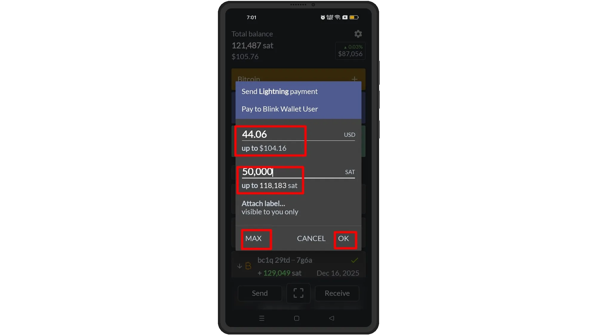

## دریافت Sats از طریق کانال شما

دریافت پرداخت‌ها در کانال لایتنینگ شما به شدت وابسته به این است که آیا یک Liquidity ورودی دارید یا خیر. پس از باز کردن یک کانال، تا زمانی که حداقل مقداری Sats ارسال نکرده باشید تا **نقدینگی ورودی ایجاد کنید** در انتهای دیگر اتصال کانال، قادر به دریافت پرداخت نخواهید بود. برای تأیید اینکه آیا می‌توانید Sats دریافت کنید و مقدار Sats که می‌توانید دریافت کنید، به قسمت **Can Receive** در اطلاعات کانال خود مراجعه کنید. این قسمت به شما نشان می‌دهد که در هر لحظه چه مقدار Sats دریافت می‌کنید.

اکنون، بیایید فرض کنیم که شما مقداری Sats از کانال خود ارسال کرده‌اید، اکنون نقدینگی ورودی دارید و می‌توانید Sats دریافت کنید.

برای دریافت در کانال Lightning، باید یک فاکتور تولید کنید. برخلاف Bitcoin on-chain، که از آدرس‌ها استفاده می‌کند، شبکه Lightning از فاکتورها استفاده می‌کند. دو روش برای تولید فاکتور در Valet وجود دارد.

#### گزینه ۱

👉 در پایین صفحه اصلی، روی **دریافت** کلیک کنید، **دریافت به فاکتور لایتنینگ** را انتخاب کنید. مبلغی که باید در فاکتور دریافت شود را وارد کرده و روی **تأیید** کلیک کنید. فاکتور را کپی کنید یا کد QR را با پرداخت‌کننده به اشتراک بگذارید.

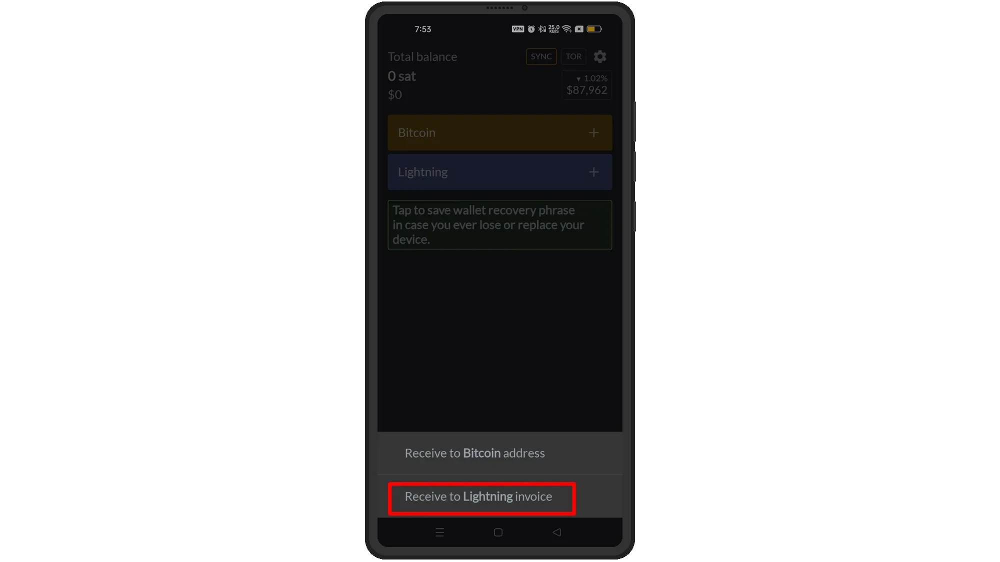

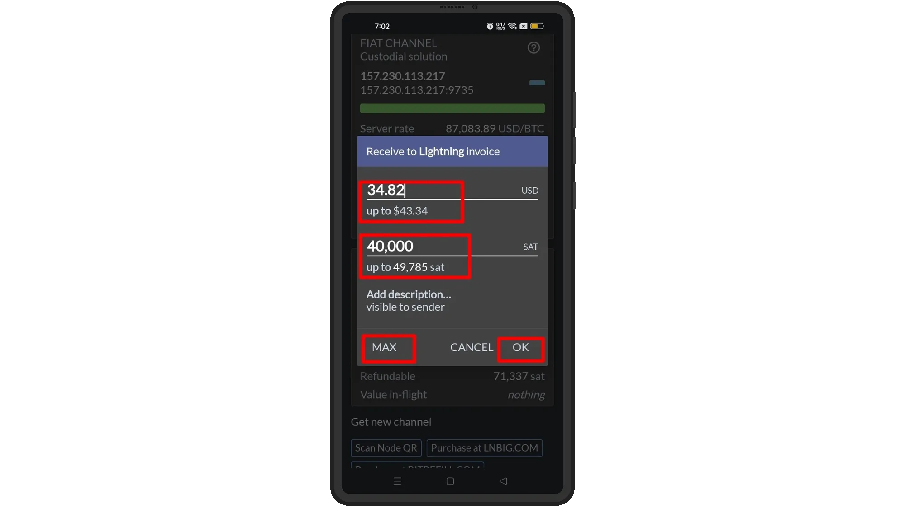

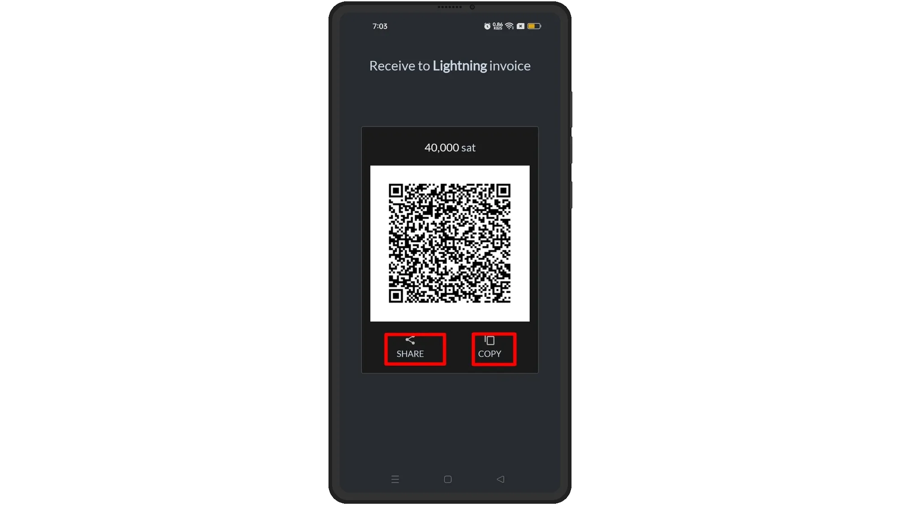

#### گزینه ۲

👉 بر روی کارت بنفش Lightning در صفحه اصلی wallet خود کلیک کنید. در هر جایی از کانال خود ضربه بزنید و لیستی از گزینه‌ها ظاهر خواهد شد. **Receive to channel** را انتخاب کنید و مبلغی که دریافت می‌کنید (چه در Sats و چه در دلار) را وارد کنید. همچنین هنگام پر کردن فاکتور، خواهید دید که چه تعداد Sats می‌توانید دریافت کنید (ظرفیت ورودی). بر روی **Ok** کلیک کنید و فاکتور را کپی کنید یا کد QR را با پرداخت‌کننده به اشتراک بگذارید.

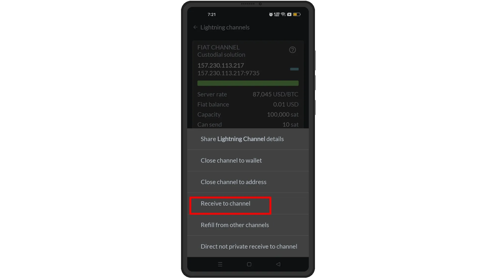

**توجه:** گزینه اول یک گزینه جهانی است، به این معنی که اگر بیش از یک کانال فعال داشته باشید و از گزینه اول استفاده کنید، سیستم به طور خودکار یکی از کانال‌های شما را برای دریافت Sats انتخاب خواهد کرد.

بنابراین، در این سناریو، گزینه دوم بهترین انتخاب است اگر می‌خواهید Sats را به یک کانال خاص دریافت کنید.

### گزینه‌های پاپ‌آپ کانال شما توضیح داده شد

وقتی روی کانال خود ضربه می‌زنید، فیلدهای گزینه‌های زیر نمایش داده می‌شوند:

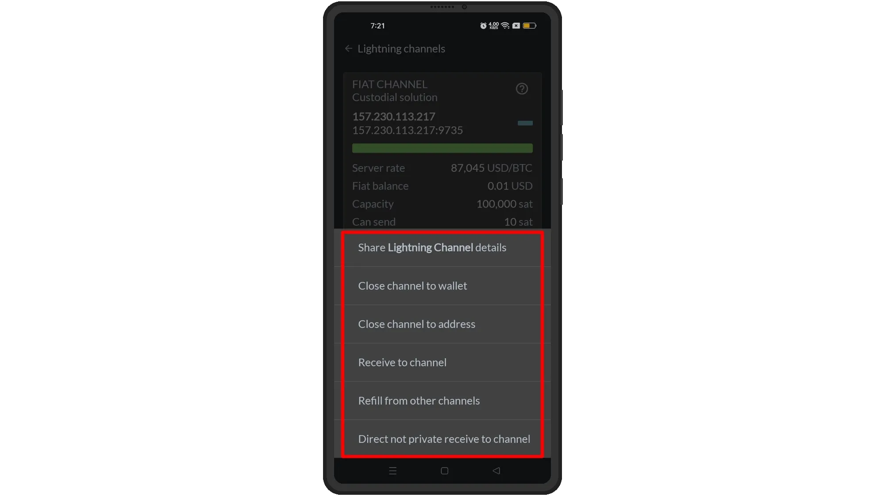

**جزئیات کانال لایتنینگ را به اشتراک بگذارید:** این به شما امکان می‌دهد جزئیات کانال خود را مانند شناسه همتای راه دور، شناسه کانال محلی، تراکنش تأمین مالی، تاریخ ایجاد و غیره به اشتراک بگذارید.

**بستن کانال به کیف پول:** شما می‌توانید کانال لایتنینگ خود را هر زمان که بخواهید ببندید. برای بستن کانال، سیستم موجودی Bitcoin را که در سمت خودتان از کانال دارید بررسی می‌کند (به یاد داشته باشید که فیلد **"قابل ارسال"** که به عنوان موجودی محلی شما نیز شناخته می‌شود)، و آن را به شما بازمی‌گرداند. در Valet، شما می‌توانید انتخاب کنید که وقتی کانال بسته می‌شود، Bitcoin به کجا ارسال شود. بنابراین، **بستن کانال به wallet** یکی از دو گزینه شماست.

👉 این گزینه را کلیک کنید و **Bitcoin** را انتخاب کنید. بسته شدن کانال آغاز خواهد شد و موجودی کانال Bitcoin شما به آدرس on-chain کانال wallet شما بازگردانده خواهد شد.

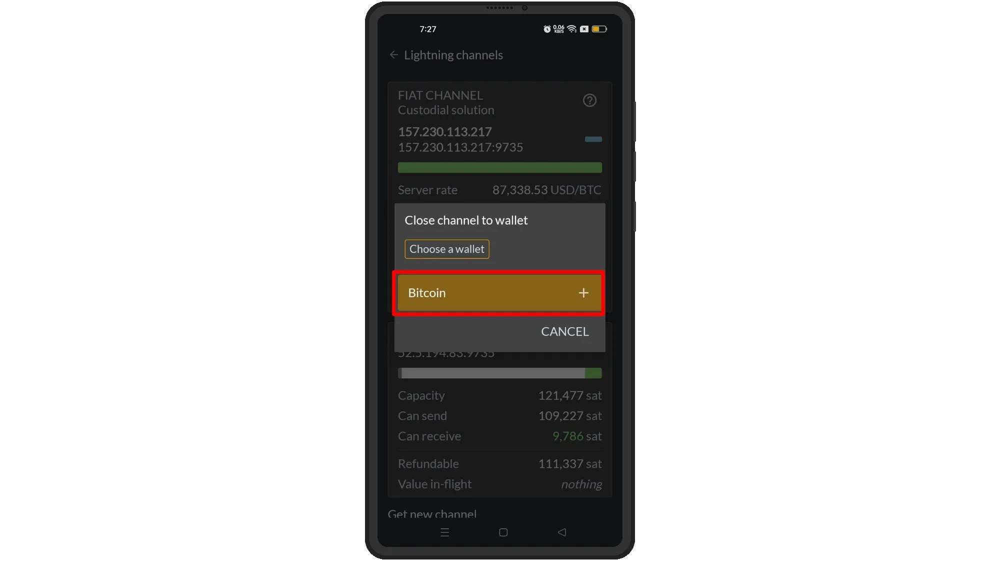

**بستن کانال به ADDRESS:** این گزینه دوم برای بستن یک کانال است. هنگامی که این گزینه را انتخاب می‌کنید، از شما خواسته می‌شود که یک آدرس wallet وارد کنید که موجودی Bitcoin کانال شما به آن ارسال خواهد شد. لطفاً توجه داشته باشید که در این گزینه، شما فقط می‌توانید کد QR آدرس Bitcoin را که می‌خواهید کانال را به آن ببندید، اسکن کنید. در حال حاضر، گزینه‌ای برای چسباندن دستی آدرس وجود ندارد.

👉 روی این گزینه کلیک کنید، آدرس Bitcoin را اسکن کنید و روی **تأیید** کلیک کنید. بستن کانال آغاز خواهد شد و موجودی Lightning Bitcoin شما به آدرسی که اسکن کرده‌اید ارسال خواهد شد.

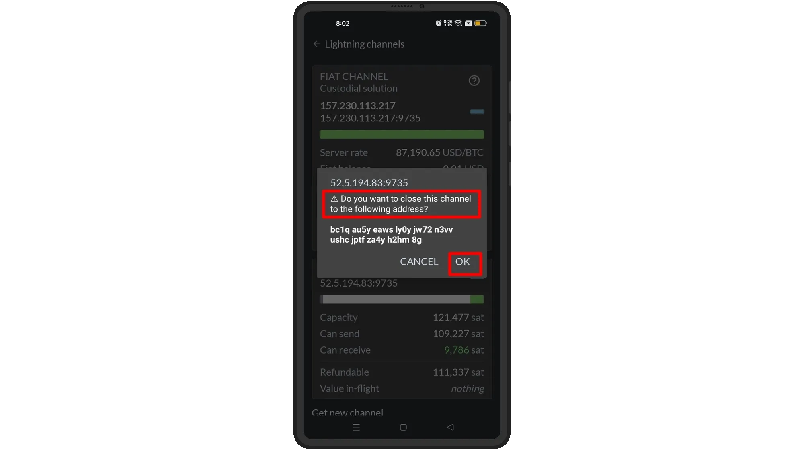

**دریافت به کانال:** این همان ایجاد فاکتور است، اما در برخی موارد، ممکن است بیش از یک کانال داشته باشید، از جمله کانال‌های فیات (نوع خاصی از کانال لایتنینگ که در Valet wallet قابل دسترسی است). بنابراین، اگر چندین کانال باز دارید، این گزینه تضمین می‌کند که می‌توانید پرداخت را به یک کانال خاص دریافت کنید.

**پر کردن مجدد از کانال‌های دیگر:** این گزینه یک ویژگی است که به شما امکان می‌دهد یک کانال را از کانال‌های موجود دیگر پر کنید. به عنوان مثال، اگر ۲ کانال لایتنینگ مختلف (A و B) دارید و موجودی Bitcoin در کانال A کاهش یافته است، با این گزینه می‌توانید به راحتی و به صورت خودکار موجودی کانال A را از کانال B افزایش دهید.

**دریافت مستقیم نه خصوصی:** این گزینه نیز برای صدور فاکتور جهت دریافت پرداخت وجود دارد، اما وقتی از این گزینه استفاده می‌کنید، فرستنده به‌طور مستقیم به شما پرداخت می‌کند. این بدان معناست که پرداخت قبل از رسیدن به شما از گره‌های مختلف عبور نمی‌کند، همان‌طور که یک پرداخت عادی لایتنینگ انجام می‌دهد. بنابراین، در اصل، فرستنده می‌داند که به شما پرداخت کرده است، شناسه کانال شما را می‌داند و غیره. این گزینه اغلب زمانی استفاده می‌شود که شما از منبعی که به آن اعتماد دارید پرداخت دریافت می‌کنید و نیازی به حفظ حریم خصوصی ندارید.

## کانال‌های میزبانی‌شده و فیات

مانند بسیاری دیگر از Bitcoin walletها، Valet یک Bitcoin و Lightning wallet ساده و سبک است. اما دارای یک ویژگی منحصر به فرد Lightning است که آن را از بیشتر Bitcoin walletهای دیگر متمایز می‌کند. این ویژگی **Hosted and Fiat Channels** نامیده می‌شود.

کانال‌های فیات نوعی پیاده‌سازی لایتنینگ هستند که امکان ورود و استفاده آسان از شبکه لایتنینگ را فراهم می‌کنند. این یک راه‌حل حضانتی است که مانند یک کانال لایتنینگ معمولی، ناشناس کامل را فراهم می‌کند. فناوری کانال‌های فیات همچنین امکان ایجاد مشتقات Bitcoin را در شبکه لایتنینگ فراهم می‌کند. به عنوان مثال، با کانال‌های فیات، بازرگانان می‌توانند پرداخت‌های با ارزش ثابت Bitcoin را بدون نگرانی از نوسانات Bitcoin بپذیرند.

اجرای فعلی کانال‌های فیات در Valet امکان ایجاد ارزهای فیات مصنوعی پایدار با پشتوانه Sats را فراهم می‌کند. این سیستم از یک رابطه میزبان-مشتری استفاده می‌کند که در آن میزبان هر نود لایتنینگی است که این سرویس را ارائه می‌دهد و مشتری کاربر Valet است. این یک راه‌حل حضانتی است زیرا تمام Sats در سمت میزبان قرار دارد؛ با این حال، تولید فاکتور، مسیریابی تور، و تولید پیش‌تصویر همچنان در سمت مشتری مانند یک کانال لایتنینگ معمولی انجام می‌شود.

باز کردن یک کانال فیات همان فرآیند باز کردن یک کانال لایتنینگ را دارد. تنها تفاوت قابل توجه این است که در این مورد، مشتری (کاربر Valet) نیازی به تعهد هیچ نقدینگی on-chain برای ایجاد ظرفیت کانال ندارد. میزبان ظرفیت کانال را تعیین کرده و تمام پرداخت‌ها را برای مشتری مسیریابی می‌کند.

👉 برای باز کردن یک کانال فیات، روی **کارت Lightning** بنفش در صفحه اصلی wallet خود کلیک کنید. **Scan Node QR** را انتخاب کنید (در این مرحله، باید یک میزبان را که می‌خواهید کانالی به آن باز کنید شناسایی کرده و QR نود آن را دریافت کرده باشید. یک مثال از یک نود میزبان که می‌توانید یک کانال فیات به آن باز کنید، نود SATM توسط Standard Sats است.)

**توجه:** مهم است که توجه داشته باشید هر کسی می‌تواند یک میزبان باشد. تنها چیزی که نیاز دارید اجرای یک نود لایتنینگ با **پلاگین کانال فیات** و یک **سرویس هجینگ** است. کانال‌های فیات یک پروژه متن‌باز توسط *Standard Sats* است. درباره آن بیشتر بخوانید [اینجا](https://github.com/standardsats/fiat-channels-rfc) و [اینجا](https://standardsats.github.io/).

گره SATM QR در زیر:

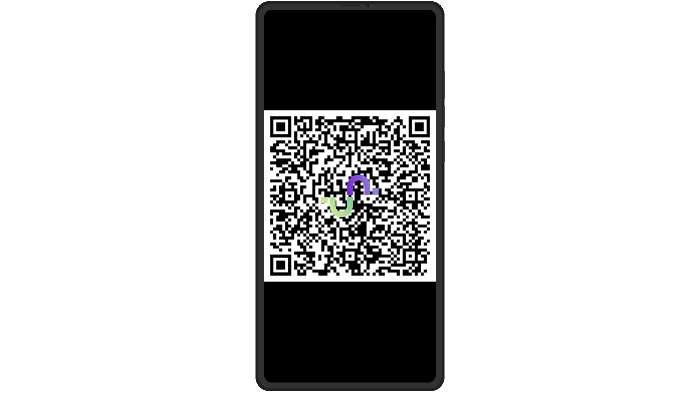

👉 هنگامی که کد QR نود را اسکن کردید، روی **درخواست کانال فیات USD** یا **درخواست کانال‌های فیات EUR** کلیک کنید (این همان واحد پول فیات است که موجودی‌های فیات شما بر اساس آن اعلام خواهد شد). فعلاً USD را انتخاب کنید و روی **OK** کلیک کنید. کانال به‌طور خودکار باز خواهد شد و می‌توانید بلافاصله Sats دریافت کنید. می‌بینید، به همین سادگی!!!

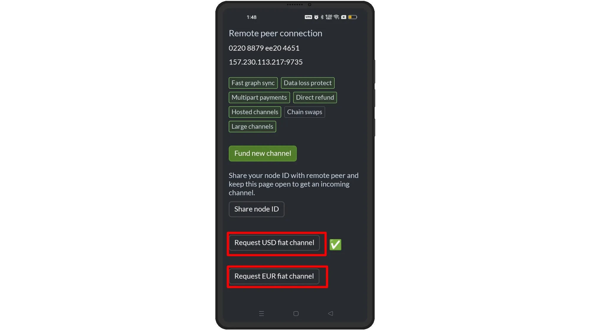

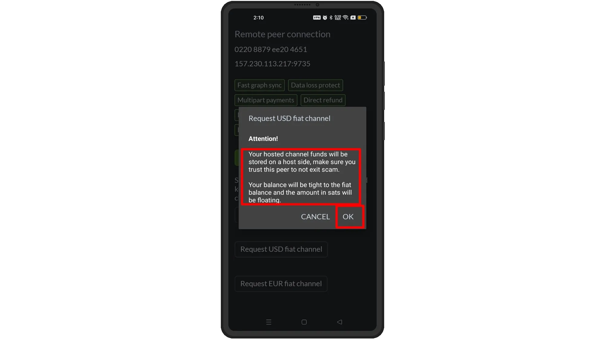

👉 به صفحه اصلی wallet خود بروید، کارت **سبز روشن** با برچسب **USD** را خواهید دید، این کانال **فیات** شماست.

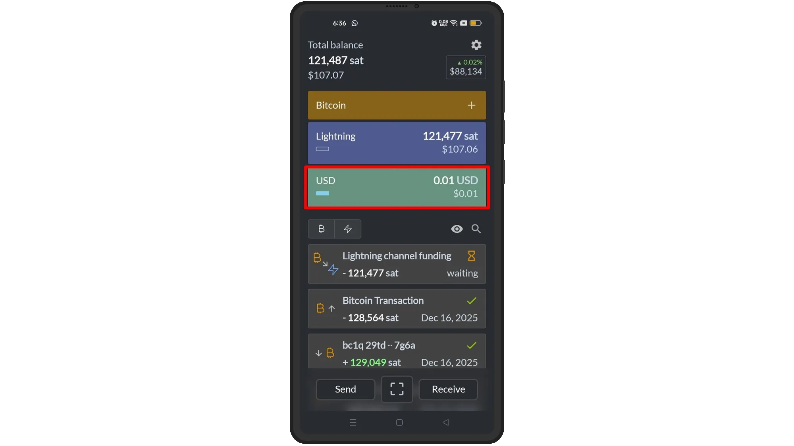

**توجه:** زمانی که Sats را در یک کانال فیات دریافت می‌کنید، ارزش فیات Sats دریافتی به عنوان یک موجودی پایدار قفل می‌شود، در حالی که حجم Sats با قیمت Bitcoin شناور است. این راه‌حل عمدتاً برای بازرگانانی طراحی شده است که می‌خواهند Sats را به عنوان پرداخت بپذیرند اما نمی‌خواهند با چالش‌های نوسانات Bitcoin مواجه شوند. این به آن‌ها کمک می‌کند تا در همه زمان‌ها ارزش پایدار را حفظ کنند، در حالی که همچنان قادر به انجام تراکنش در شبکه Lightning هستند و از دسترسی جهانی و تسویه سریع Bitcoin به عنوان یک واسطه مبادله در Lightning Network بهره‌مند می‌شوند.

هنگامی که کانال فیات شما ایجاد می‌شود، در اینجا فیلدهای ارزش زیر را مشاهده خواهید کرد و معنای هر یک از آنها چیست:

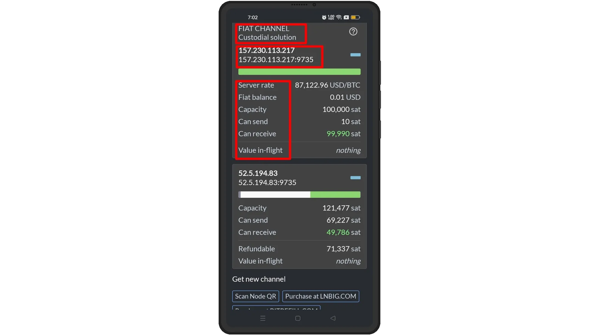

- مجموعه‌ای تصادفی از اعداد جدا شده با نقطه:** این‌ها آدرس‌های IP گره‌ها هستند. (به ترتیب IPV4 و IPV6)
- نرخ سرور:** این قیمت بازار Bitcoin است که میزبان خدمات را به شما ارائه می‌دهد. این قیمت اغلب کمی با قیمت غالب بازار متفاوت است، زیرا ممکن است میزبان یک حق بیمه کوچک اضافه کند. تعیین این نرخ کاملاً به عهده میزبان است؛ بنابراین، این نرخ نیز از میزبان به میزبان متفاوت خواهد بود.
- موجودی فیات:** این مقدار ثابت فیات قفل‌شده برای هر ساتی است که در این کانال دریافت می‌کنید. به یاد داشته باشید، همان‌طور که قبلاً توضیح داده شد، هر زمان که Sats را در کانال فیات خود دریافت می‌کنید، ارزش فیات Sats در زمان دریافت بلافاصله به عنوان یک ارزش فیات ثابت مصنوعی در این فیلد قفل می‌شود. مقدار **موجودی فیات** شما با قیمت بازار Bitcoin نوسان نمی‌کند. هر زمان که بخواهید از این کانال پرداختی انجام دهید، فقط می‌توانید معادل Sats این موجودی فیات را ارسال کنید. بنابراین به این به عنوان یک ارز دیجیتال فیات که توسط Sats پشتیبانی می‌شود، فکر کنید.
- ظرفیت:** این حجم کل Sats است که می‌تواند از طریق این کانال ارسال و دریافت شود. (این نیز توسط میزبان تنظیم می‌شود. و برخلاف یک کانال لایتنینگ معمولی، این ظرفیت می‌تواند توسط میزبان بر اساس مورد تنظیم شود.)
- می‌توانید ارسال کنید:** این حجم Sats است که می‌توانید در هر نقطه بر اساس موجودی فیات خود ارسال کنید. این کاملاً متفاوت از چیزی است که در یک کانال معمولی Lightning دارید، زیرا این مقدار با قیمت Bitcoin شناور است. بنابراین، آنچه در اینجا می‌بینید ارزش Sats موجودی فیات شما در هر زمان بر اساس **نرخ سرور** است.
- می‌تواند دریافت کند:** این تعداد Sats است که در حال حاضر می‌توانید به این کانال دریافت کنید. پس از ایجاد کانال خود، این مقدار باید با ظرفیت کانال برابر باشد.
- ارزش در پرواز:** هنگامی که کسی مقداری sats به کانال شما ارسال می‌کند، یا زمانی که شما سعی می‌کنید مقداری sats به کسی ارسال کنید و به هر دلیلی تراکنش به تأخیر می‌افتد، اغلب در این فیلد نمایش داده می‌شود.

در اینجا نکات مهمی درباره کانال‌های فیات آورده شده است:

- برخلاف یک کانال معمولی لایتنینگ، زمانی که یک کانال فیات باز می‌کنید، می‌توانید بلافاصله شروع به دریافت Sats کنید، اما نمی‌توانید ارسال کنید. شما فقط زمانی می‌توانید Sats ارسال کنید که Sats دریافت کرده باشید.
- در تمام زمان‌ها، دارایی ارسال شده به و از Sats است. *تراز فیات* فقط یک نمایندگی IOU مصنوعی از یک ارزش Bitcoin است که در هر لحظه دریافت می‌شود. بنابراین، این یک ایجاد token یا یک ارز دیجیتال جدید نیست.
- کانال فیات عمدتاً برای بازرگانان/کسب‌وکارهایی مفید است که نسبت به پذیرش پرداخت‌های Bitcoin به دلیل نگرانی‌های نوسان تردید دارند. همچنین ممکن است برای شرکت‌هایی که می‌خواهند حقوق کارکنان خود را به صورت Bitcoin پرداخت کنند، بدون اینکه عواقب نوسان Bitcoin را متحمل شوند، که می‌تواند سرمایه حقوق آن‌ها را ناپایدار کند، مفید باشد. همچنین ممکن است برای افرادی که در منطقه‌ای با استفاده غالب از Bitcoin زندگی می‌کنند، اما هزینه‌های زندگی ثابتی دارند، مفید باشد.
- توجه داشته باشید که هیچ فیلدی با عنوان **قابل بازپرداخت** وجود ندارد. این به این دلیل است که از نظر فنی، نمی‌توانید یک کانال فیات را ببندید. شما فقط می‌توانید با تخلیه موجودی آن به کانال معمولی لایتنینگ خود، استفاده از یک کانال فیات را متوقف کنید.

### گزینه‌های پاپ‌آپ کانال فیات شما توضیح داده شد

وقتی روی کانال Fiat Lightning خود ضربه می‌زنید، فیلدهای زیر نمایش داده می‌شوند:

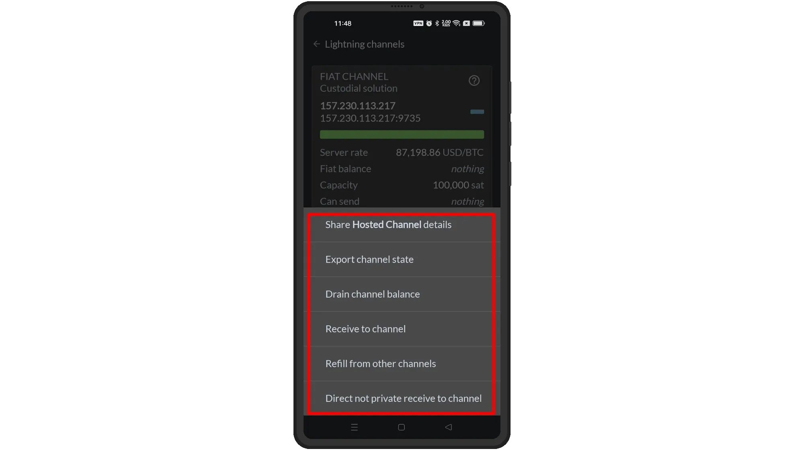

**جزئیات کانال میزبانی شده را به اشتراک بگذارید:** این به شما امکان می‌دهد جزئیات کانال فیات خود را به اشتراک بگذارید، مانند شناسه همتای راه دور، شناسه کانال محلی، تاریخ ایجاد و غیره.

**وضعیت کانال صادراتی:** این امکان را به شما می‌دهد که وضعیت یک کانال را در هر لحظه صادر کنید. این معمولاً در رفع خطاهای کانال مفید است و ممکن است میزبان از شما بخواهد که در صورت نیاز آن را به اشتراک بگذارید.

**تعادل کانال تخلیه:** همان‌طور که قبلاً ذکر شد، شما نمی‌توانید به‌طور فنی یک کانال فیات را ببندید، اما می‌توانید تعادل کانال خود را به کانال لایتنینگ معمولی خود تخلیه کنید. این به‌طور خودکار معادل ساتوشی تعادل فیات شما را به کانال لایتنینگ معمولی شما منتقل می‌کند.

**دریافت به کانال:** این همان ایجاد فاکتور است، اما در برخی موارد، یک کاربر ممکن است بیش از یک کانال فیات با میزبان‌های مختلف داشته باشد، از جمله کانال‌های معمولی لایتنینگ. بنابراین، اگر یک کاربر چندین کانال باز داشته باشد، این گزینه تضمین می‌کند که آن‌ها می‌توانند پرداخت را به یک کانال خاص دریافت کنند.

**پر کردن مجدد از کانال‌های دیگر:** این گزینه یک ویژگی است که به کاربر اجازه می‌دهد یک کانال را از کانال‌های موجود دیگر پر کند. بنابراین، با این گزینه، می‌توانید کانال فیات خود را از یک کانال عادی یا دیگر کانال‌های فیات که دارید پر کنید، درست به همان روشی که می‌توانید تخلیه کنید.

**دریافت مستقیم نه خصوصی:** این گزینه‌ای است برای صدور فاکتور جهت دریافت پرداخت، اما زمانی که از این گزینه استفاده می‌کنید، فرستنده به‌طور مستقیم به شما پرداخت می‌کند. این بدان معناست که پرداخت قبل از رسیدن به شما از طریق گره‌های مختلف عبور نمی‌کند. بنابراین، در اصل، فرستنده می‌داند که به شما پرداخت کرده است، شناسه کانال شما را می‌داند و غیره. این گزینه اغلب زمانی استفاده می‌شود که شما از منبعی که به آن اعتماد دارید پرداخت دریافت می‌کنید و نیازی به حفظ حریم خصوصی خود ندارید.

## تنظیمات Valet:

مانند هر برنامه دیگر، Valet دارای تنظیمات برنامه‌ای است که می‌توانید آن‌ها را به سلیقه خود تنظیم کنید. شما می‌توانید از صفحه اصلی به صفحه تنظیمات دسترسی پیدا کنید.

👉 در صفحه اصلی، روی آیکون **چرخ‌دنده** که در گوشه بالا-راست صفحه قرار دارد کلیک کنید تا به تنظیمات دسترسی پیدا کنید. در زیر، اجزای بخش تنظیمات آمده است.

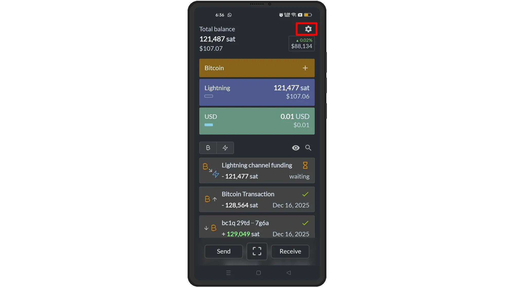

**پشتیبان‌گیری از کانال محلی فعال است:** اگر این گزینه **غیرفعال** است، باید آن را فعال کنید زیرا این تنها راهی است که می‌توانید کانال‌های عادی Lightning خود را در صورت حذف و نصب مجدد Valet بازیابی کنید. ما این را بعداً توضیح خواهیم داد. بنابراین روی این کلیک کنید و به Valet اجازه دسترسی به **ذخیره‌سازی رسانه** خود را بدهید زیرا فایل پشتیبان در آنجا ذخیره می‌شود.

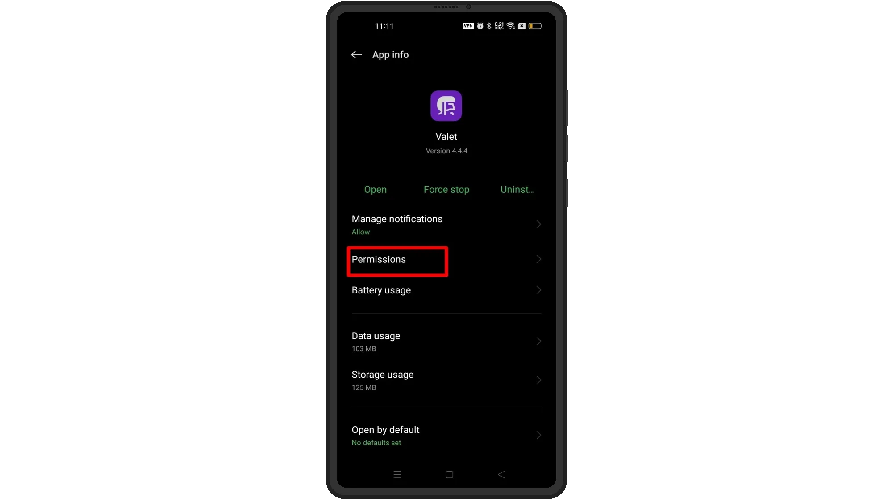

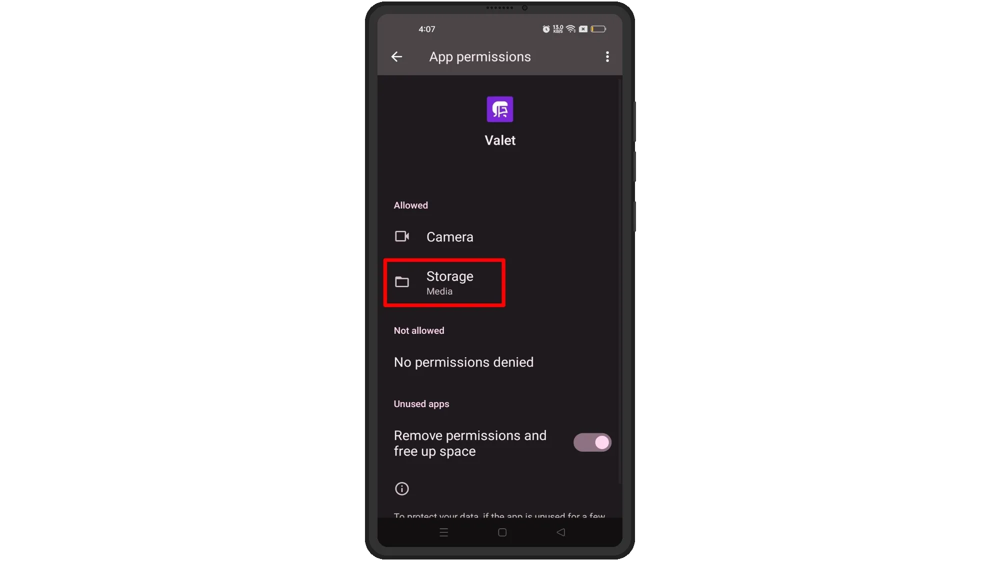

**محل ذخیره‌سازی پشتیبان محلی:** تا زمانی که به Valet اجازه دسترسی به فضای ذخیره‌سازی خود را داده‌اید، این قسمت به‌طور خودکار تنظیم می‌شود تا پشتیبان‌های محلی را در پوشه **Downloads** شما ذخیره کند. اما می‌توانید با کلیک کردن اینجا و انتخاب هر پوشه‌ای که می‌خواهید، آن را تغییر دهید.

**مدیریت کیف پول‌های زنجیره‌ای** این موضوع کمی فنی است و نیازی نیست نگران آن باشید مگر اینکه به اندازه کافی تجربه داشته باشید. تنظیمات پیش‌فرض در اینجا کاملاً مناسب است.

**اضافه کردن کیف پول سخت‌افزاری:** شما نباید نگران این موضوع باشید، مگر اینکه یک سخت‌افزار wallet داشته باشید که می‌خواهید متصل و نظارت کنید. با این تنظیمات، می‌توانید سخت‌افزار wallet خود، مانند Trezor یا کارت Cold را اسکن و متصل کرده و فعالیت‌های آن را نظارت کنید. این یک ویژگی فقط برای مشاهده است، به این معنی که نمی‌توانید از اینجا تراکنش‌هایی روی سخت‌افزار wallet انجام دهید. شما فقط می‌توانید فعالیت‌ها، موجودی‌ها و غیره wallet را مشاهده و نظارت کنید.

**تنظیم گره ELECTRUM سفارشی:** این مورد نیز فنی است و مگر اینکه به اندازه کافی آگاه باشید، نباید به آن توجه کنید. تنظیم پیش‌فرض به اندازه کافی خوب است.

**واحدهای بیت‌کوین:** این نحوه نمایش موجودی Bitcoin شما است. گزینه اول موجودی شما را به صورت Satoshi نمایش می‌دهد، مثلاً 1,000,000 Sats، در حالی که گزینه دوم آن را به صورت اعشار BTC نمایش می‌دهد. مثلاً 0.01BTC

**از احراز هویت با پین استفاده کنید** اگر این کادر را علامت بزنید، باید یک پین یا اثر انگشت تنظیم کنید که با آن باید برای ورود به wallet خود وارد شوید و تراکنش‌ها را تأیید کنید.

**استفاده از اتصال TOR:** اگر این گزینه را انتخاب کنید، تراکنش‌های شما از طریق شبکه Tor هدایت می‌شوند. این کار یک لایه اضافی از حریم خصوصی اضافه می‌کند اما ممکن است منجر به تأخیر در سرعت پرداخت شود، به‌ویژه برای پرداخت‌های Lightning.

**مشاهده عبارت بازیابی BIP39:** اینجا جایی است که می‌توانید به عبارت ۱۲ کلمه‌ای seed خود برای پشتیبان‌گیری دسترسی پیدا کنید. بنابراین اگر قبلاً آن را یادداشت نکرده‌اید، یا نمی‌توانید جایی که آن را نوشته‌اید پیدا کنید، تا زمانی که هنوز به Wallet خود دسترسی دارید، می‌توانید آن را از اینجا کپی کنید.

**آمار استفاده:** این خلاصه‌ای از تمام تراکنش‌ها و فعالیت‌های شما از زمان ایجاد wallet را نشان می‌دهد.

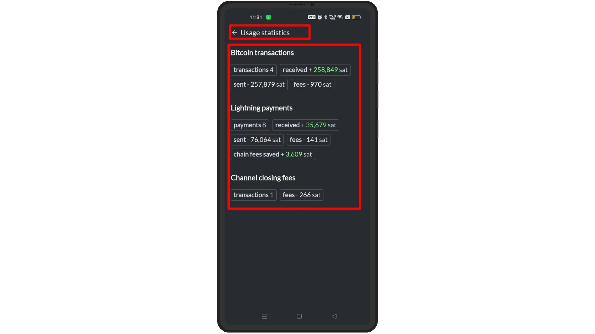

## بازیابی Wallet

والت یک wallet غیر حضانتی است، بنابراین اگر دستگاه خود را گم کنید یا برنامه wallet خود را حذف نصب کنید، نیاز به بازیابی wallet دارید تا بتوانید Bitcoinها و کانال‌های Lightning خود را بازیابی کنید. در ابتدای این آموزش، به اهمیت نوشتن **عبارت ۱۲ کلمه‌ای seed** اشاره کردیم زیرا این کلید بازیابی wallet شماست. هیچ نماینده خدمات مشتری وجود ندارد که بتواند به شما در بازگشت به wallet کمک کند.

دو ابزار مهم برای بازیابی Valet wallet شما وجود دارد، بسته به اینکه آیا کانال Lightning فعال داشتید یا خیر. برای کاربری که کانال Lightning عادی فعال نداشته باشد، تنها چیزی که نیاز دارد **عبارت ۱۲ کلمه‌ای seed** است، با دنبال کردن مراحل ساده زیر:

👉 یک برنامه جدید Valet نصب کنید و برنامه را راه‌اندازی/شروع کنید.

👉 انتخاب کنید **بازیابی Wallet موجود**

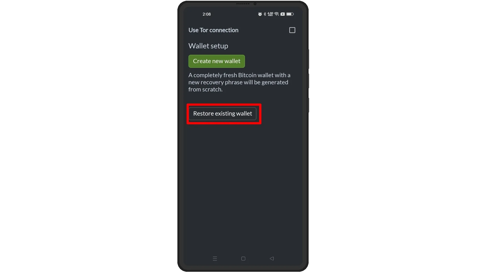

👉 **فقط عبارت بازیابی** را انتخاب کنید.

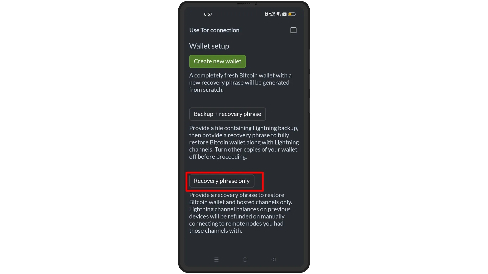

👉 عبارت بازیابی ۱۲ کلمه‌ای خود را وارد کنید و روی **OK** کلیک کنید.

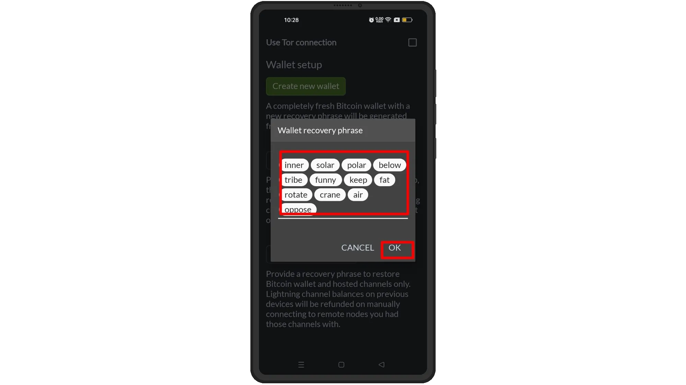

wallet شما بازیابی خواهد شد. در این صورت، تنها موجودی on-chain Bitcoin شما بازگردانده خواهد شد.

با این حال، اگر یک کانال لایتنینگ فعال و عادی داشته باشید و wallet خود را تنها با عبارت بازیابی بازیابی کنید، کانال لایتنینگ شما به‌طور اجباری بسته خواهد شد و هر موجودی Bitcoin که در آن دارید به‌طور خودکار به موجودی on-chain شما ارسال خواهد شد.

راه دیگر برای بازیابی Valet wallet شما، به‌ویژه اگر قبل از حذف نصب Valet یک کانال Lightning معمولی باز کرده بودید، این است که **از فایل پشتیبان محلی ذخیره‌شده در دستگاه خود، به همراه عبارت 12 کلمه‌ای seed خود استفاده کنید**. اگر از این دو استفاده کنید، وضعیت کانال Lightning شما بازیابی خواهد شد و بنابراین کانال Lightning شما به‌طور اجباری بسته نخواهد شد.

در اینجا مراحل آمده است:

👉 یک برنامه جدید Valet نصب کنید و برنامه را راه‌اندازی/شروع کنید.

👉 **Wallet موجود را بازیابی کنید** را انتخاب کنید.

👉 **پشتیبان‌گیری + عبارت بازیابی** را انتخاب کنید.

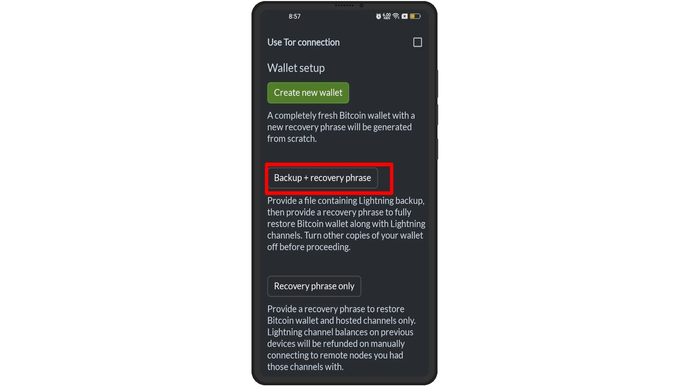

👉 فایل پشتیبان را از مدیر فایل گوشی خود انتخاب کنید. (به طور پیش‌فرض همیشه در پوشه **Downloads** ذخیره می‌شود.)

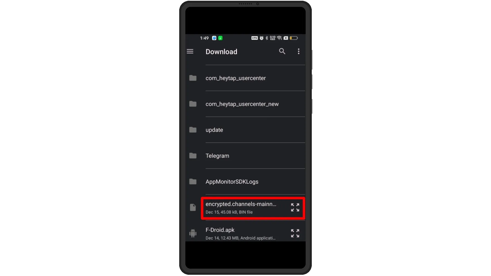

پس از انتخاب فایل پشتیبان صحیح، یک پیام تأیید با عنوان **"فایل پشتیبان موجود است"** نمایش داده می‌شود و سپس از شما خواسته می‌شود که عبارت 12 کلمه‌ای seed خود را وارد کنید.

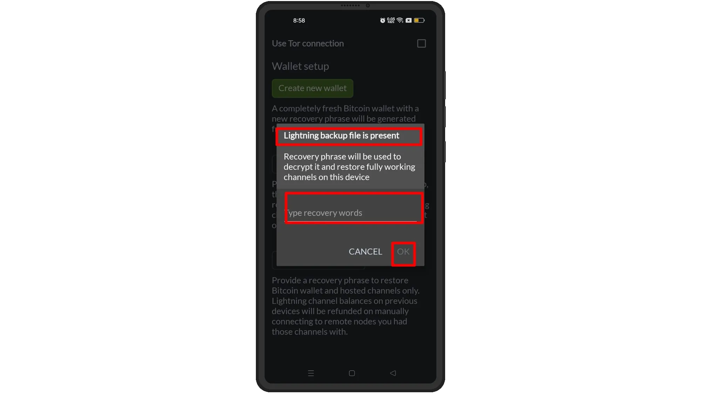

👉 عبارت بازیابی ۱۲ کلمه‌ای خود را وارد کنید و روی **OK** کلیک کنید. شما به صفحه اصلی wallet خود هدایت خواهید شد.

👉 منتظر بمانید تا همگام‌سازی شبکه Bitcoin (**SYNC**) و همگام‌سازی نود لایتنینگ (**LN Sync**) کامل شود، و wallet شما به‌طور کامل بازیابی خواهد شد، شامل کانال‌های لایتنینگ شما.

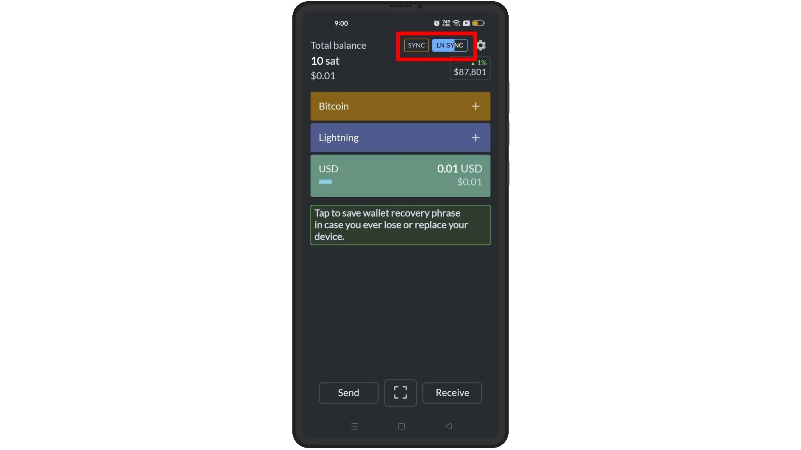

## نتیجه‌گیری

والت یک راه‌حل هیجان‌انگیز wallet است که با ویژگی‌هایی که دارد، برای ورود کاربران جدید مناسب است. همچنین دارای یک کانال فیات است، یک فناوری نه‌چندان جدید که ادغام کسب‌وکارهای مبتنی بر فیات را بر روی استاندارد Bitcoin تضمین می‌کند.

‏‏‎‏‏‎دانلود Valet امروز، و امتحانش کنید!!! 🧡