***Nie twoje klucze, nie twoje monety* to więcej niż powiedzenie, to fundamentalna zasada Bitcoin, która oznacza, że jeśli nie kontrolujesz **prywatnych kluczy**, które odblokowują twoje bitcoiny, tak naprawdę nie jesteś ich właścicielem.

Wielu użytkowników zazwyczaj zaczyna od **custodial wallet**, a następnie migruje do **self-custodial wallet**, gdzie sami kontrolują swoje klucze prywatne.

W tym samouczku nie będziemy przedstawiać nowego wallet z funkcją samokontroli. Zamiast tego przedstawimy nową funkcję ***Wallet of Satoshi*** wallet: **tryb samokontroli**.

Celem tej nowej integracji jest umożliwienie użytkownikom zachowania kontroli nad kluczami prywatnymi przy jednoczesnym korzystaniu z prostoty i płynności obsługi.

Zanim przejdziemy do sedna sprawy, poświęćmy chwilę na zbadanie specjalnego trybu samokontroli oferowanego przez Wallet of Satoshi (WoS).

## Szczególna cecha trybu samokontroli

Prostota i płynność trybu samoobsługowego WoS eliminuje złożoność otwierania kanałów Lightning, administrowania węzłami... Ale jak to możliwe?

Tryb samokontroli Wallet of Satoshi jest zasilany przez **Spark**. Jest to rozwiązanie Layer 2 dla Bitcoin, stworzone przez Lightspark, wykorzystujące technologię **statechains**.

W rezultacie transakcje nie są przeprowadzane bezpośrednio na Lightning Network. Interakcje między siecią **LN** i **Spark** odbywają się za pośrednictwem **atomowych swapów**.

Na przykład Bob chce zapłacić fakturę Lightning za pomocą WoS. Przekazuje swoje satoshi, ale w tle są one kierowane do **Spark Service Provider (SSP)** w Spark, który z kolei wykonuje płatność w sieci Lightning.

I odwrotnie, Alice chce uzyskać środki bezpośrednio ze swojego portfela WoS. W tym przypadku **SSP** otrzymuje sats za pośrednictwem LN i natychmiast zasila portfel Alice.

Należy więc pamiętać, że aby skorzystać z prostoty i płynności WoS, trzeba polegać na serwerach Spark. Jednak pod względem bezpieczeństwa, jeśli SSP stanie się złośliwy lub niedostępny, masz do dyspozycji mechanizm **jednostronnego wyjścia**, środek bezpieczeństwa, który pozwala odzyskać środki na Bitcoin on-chain (nawet jeśli może to być powolne i kosztowne), gwarantując samodzielną opiekę porównywalną z prywatnym węzłem Lightning.

Biorąc pod uwagę wszystkie te parametry, możesz zdecydować, ile sats chcesz przechowywać w swoim WoS self-custody.

Jeśli jesteś nowym użytkownikiem Wallet of Satoshi, musisz oczywiście pobrać aplikację mobilną wallet. Jeśli jednak już z niej korzystasz i chcesz dowiedzieć się, jak korzystać z **trybu samokontroli**, przejdź bezpośrednio do sekcji **Konfiguracja trybu samokontroli** w tym samouczku.

## Rozpoczęcie pracy z Wallet of Satoshi

Przejdź do sklepu z aplikacjami i pobierz WoS.

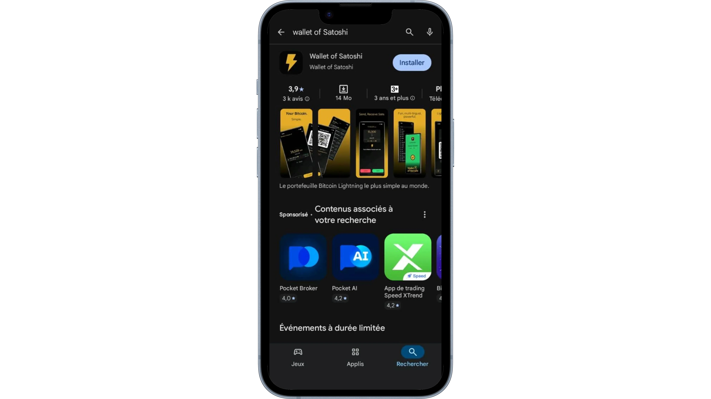

Otwórz aplikację po zakończeniu pobierania i naciśnij **Start**.

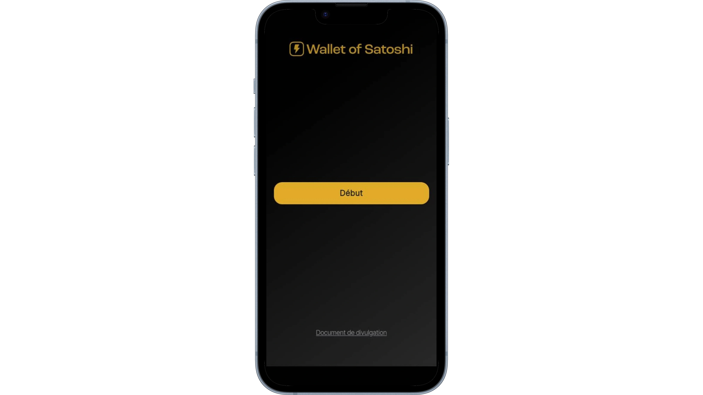

Nastąpi przekierowanie do głównego interfejsu aplikacji. W rzeczywistości, gdy uzyskujesz dostęp do WoS po raz pierwszy, portfel jest już funkcjonalny i domyślnie systematycznie otwiera się w trybie powierniczym.

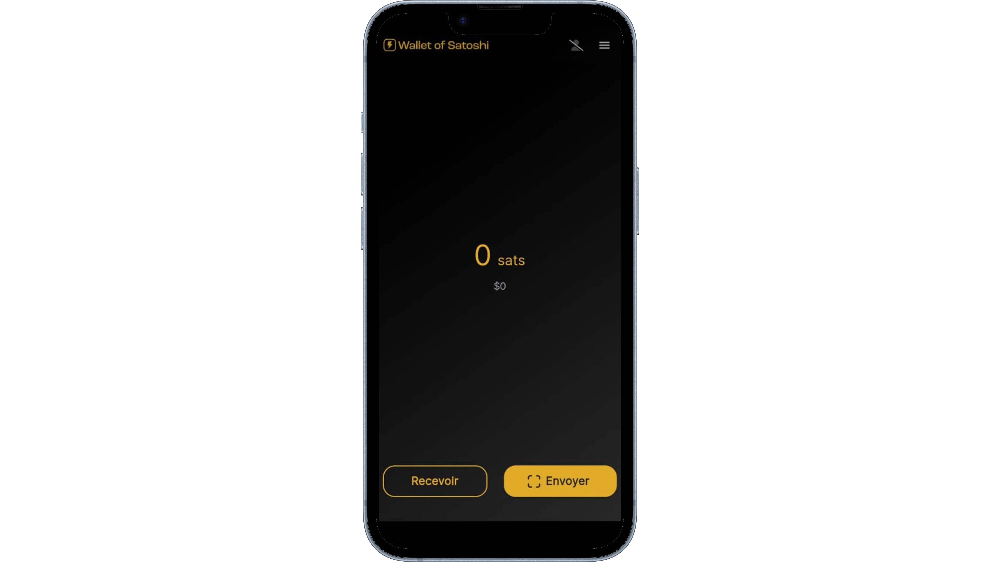

Nawet jeśli nie chcesz korzystać z WoS w trybie powierniczym, zalecamy jego wcześniejszą konfigurację. Aby to zrobić, zapoznaj się z tym samouczkiem.

https://planb.academy/tutorials/wallet/mobile/wallet-of-satoshi-39149d86-e42b-4e8f-ae9f-7e061e7784f7

Przejdźmy teraz do konfiguracji naszego WoS-a w self-custody.

## Konfiguracja trybu samokontroli

Kliknij menu hamburgera (ikona z trzema paskami) w prawym górnym rogu głównego interfejsu.

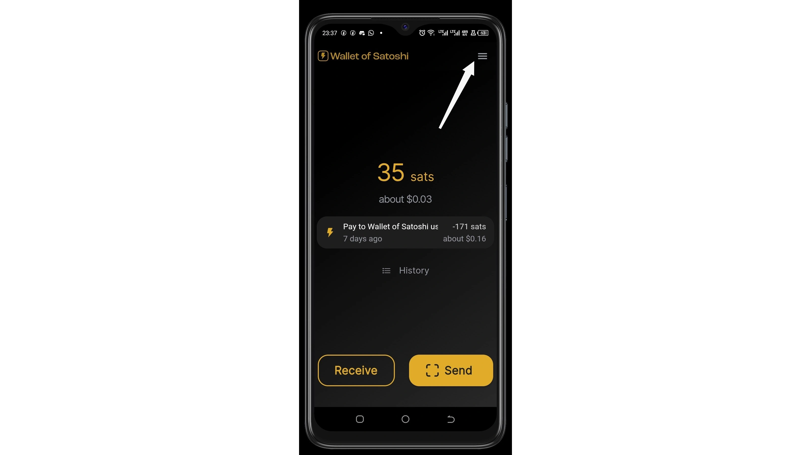

Następnie w wyświetlonym menu kliknij podmenu **Open Self Custody Wallet**.

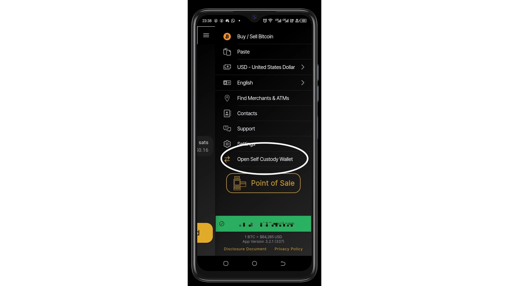

WoS natychmiast informuje, że *tryb samoopieki zawiera frazę odzyskiwania. Ponadto ponosisz wyłączną odpowiedzialność za bezpieczeństwo swoich środków*.

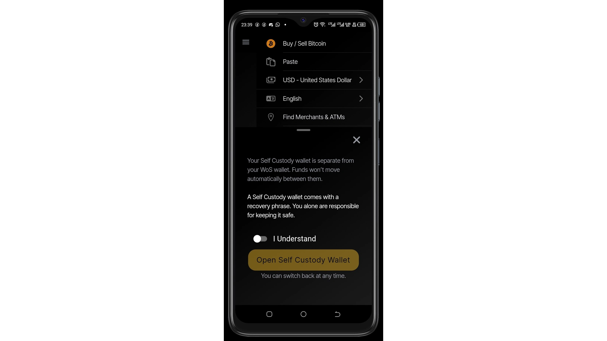

Zaznacz przycisk "**Zrozumiałem**" (1), a następnie naciśnij przycisk **Otwórz Self Custody Wallet** (2), który pojawi się w jasnożółtym kolorze.

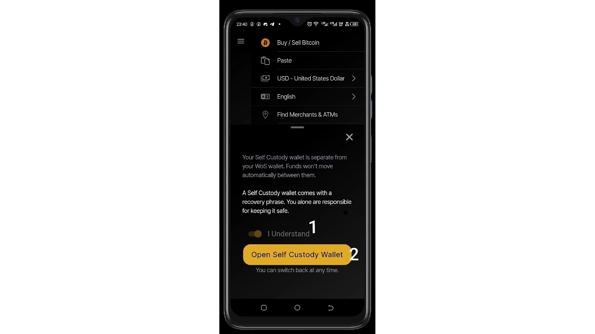

### Tworzenie własnego portfela

Po kliknięciu przycisku **Otwórz Wallet** kliknij przycisk **Utwórz nowy Wallet**.

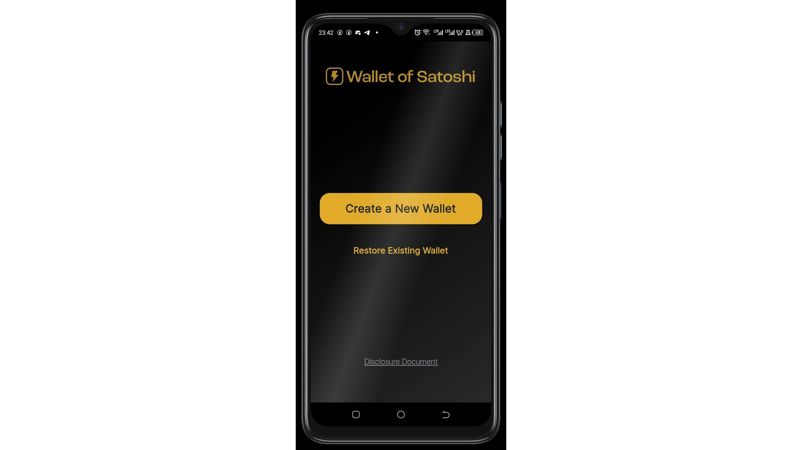

Następnie WoS utworzy dla Ciebie portfolio do samodzielnej opieki, ponownie w ramach tej samej aplikacji. Będziesz mógł przełączać się między trybem **custodial** (dostępnym w niektórych regionach) i **self-custodial** w dogodnym dla siebie momencie i w dowolnym momencie.

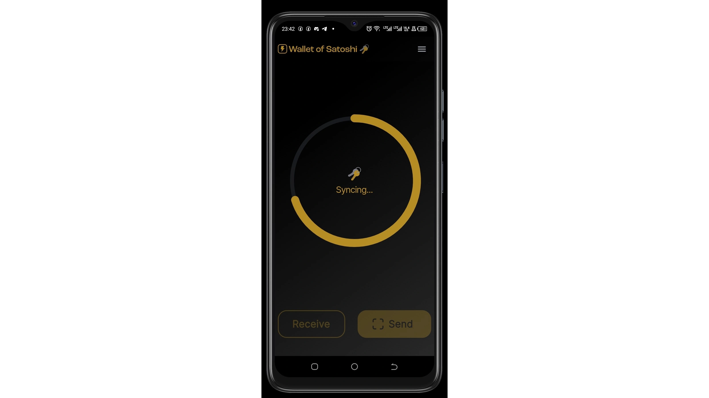

Po utworzeniu zostaniesz przekierowany do głównego interfejsu WoS self-custody. Zauważysz, że nie ma żadnych różnic między ogólnym przeglądem i interfejsami portfela WoS custody i portfela WoS self-custody.

### Zapisywanie frazy mnemonicznej

Stuknij ikonę **Keychain + Backup Wallet** znajdującą się w górnej części ekranu pomiędzy nazwą Wallet of Satoshi a menu hamburgera.

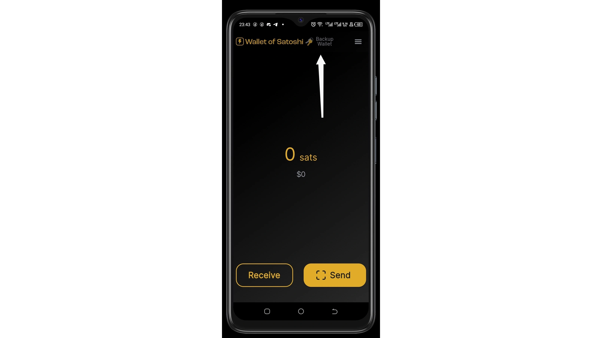

WoS oferuje dwa różne sposoby zapisywania 12 słów (fraz mnemonicznych): **backup przez Google Drive** i **ręczna kopia zapasowa**.

Chociaż sugerujemy ręczne tworzenie kopii zapasowych, które jest najbezpieczniejsze, pokażemy również, jak tworzyć kopie zapasowe za pośrednictwem Dysku Google.

#### Kopia zapasowa za pośrednictwem Dysku Google

Kliknij przycisk **Google Drive Backup**.

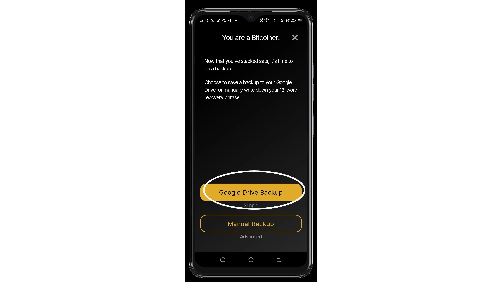

Jeśli zdecydujesz się na tworzenie kopii zapasowych za pomocą Dysku Google, istnieje wysokie ryzyko, że Twoje konto Google zostanie naruszone. Złośliwa osoba miałaby dostęp do pliku zawierającego 12 słów i mogłaby w ten sposób uzyskać dostęp do wallet.

Dodanie hasła w celu zaszyfrowania pliku zawierającego 12 słów jest z pewnością dobrym sposobem na dodanie dodatkowej warstwy zabezpieczeń.

Aktywuj więc przycisk **Encrypt with a password** w opcjach zaawansowanych.

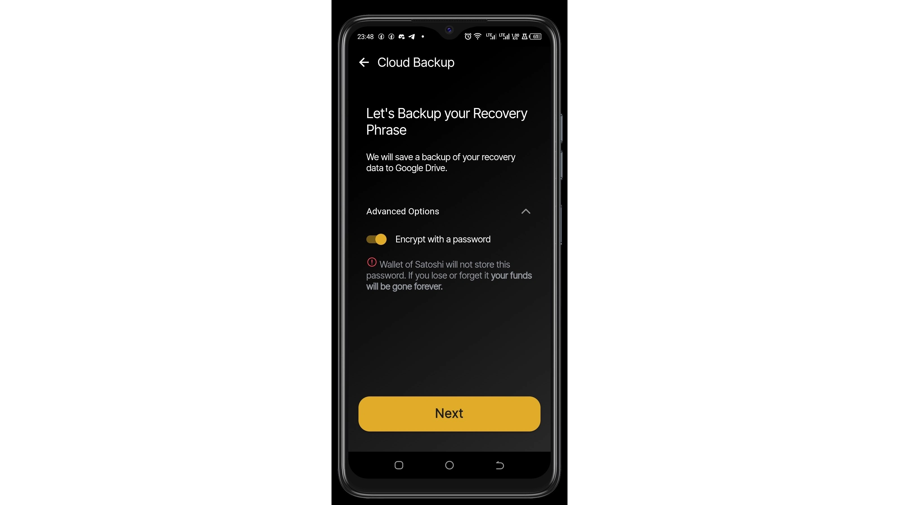

W nowym interfejsie, który się pojawi, ustaw silne hasło, a następnie potwierdź je ponownie.

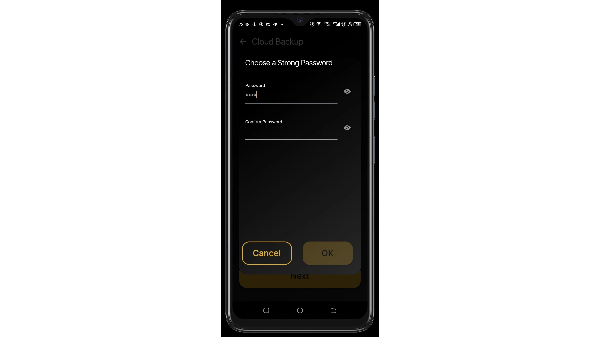

Ważne jest, aby pamiętać, że po wybraniu hasła nie wolno go zapomnieć ani zgubić nośnika, na którym zostało zapisane. Jeśli je zapomnisz lub zgubisz, nigdy więcej nie będziesz mieć dostępu do swoich 12 słów, a tym samym do swoich środków.

Po wybraniu hasła wybierz konto Google dla kopii zapasowej, a następnie przyznaj dostępy wymagane przez WoS.

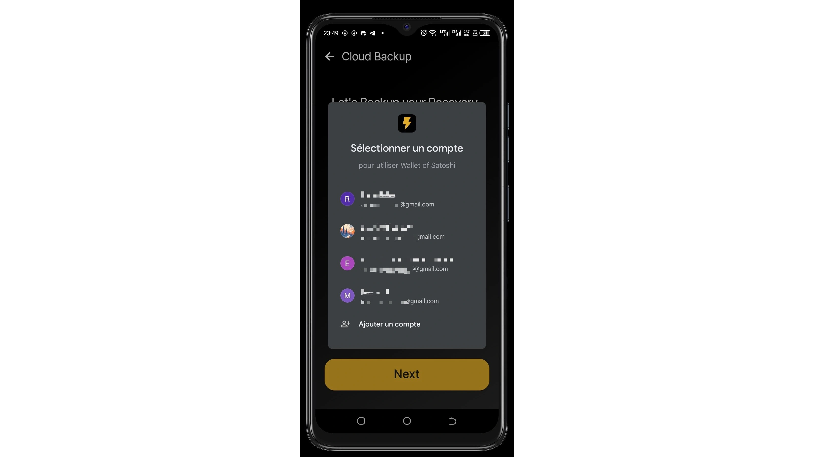

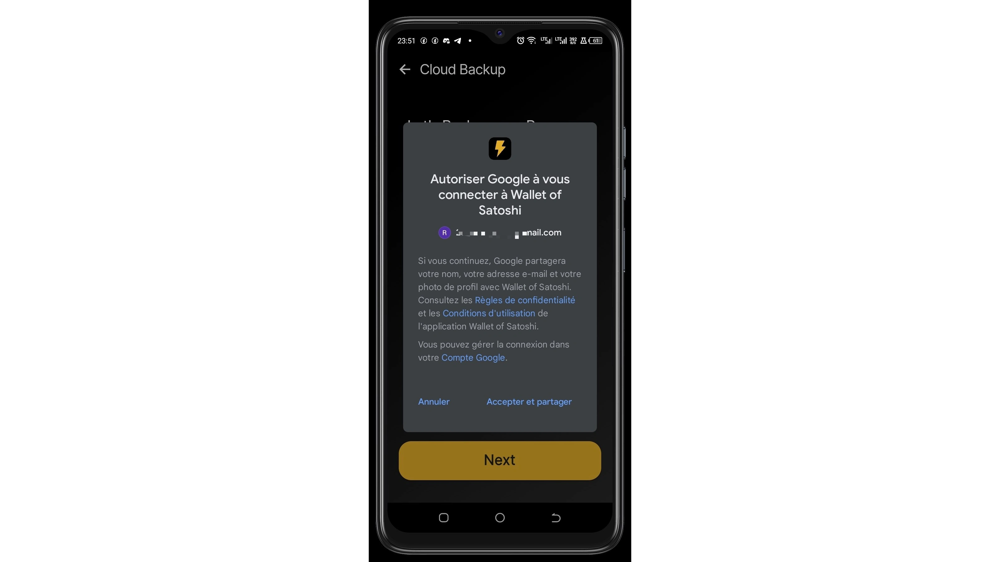

Poczekaj kilka sekund. Bingo! Kopia zapasowa została pomyślnie zakończona.

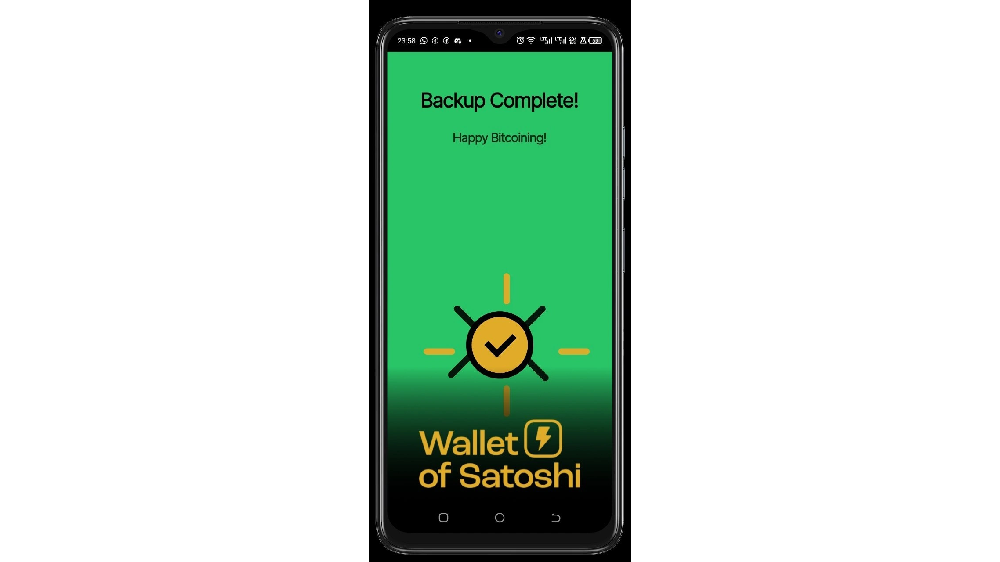

Zawsze masz możliwość wykonania dodatkowej kopii zapasowej, wybierając drugą metodę tworzenia kopii zapasowych: ręczną kopię zapasową.

#### Ręczna kopia zapasowa

Jeśli zdecydujesz się na ręczne tworzenie kopii zapasowych, zdecydowanie zalecamy zapoznanie się z tym samouczkiem, w którym omówiono najlepsze praktyki bezpiecznego tworzenia kopii zapasowych frazy mnemonicznej, aby nie stracić dostępu do swoich bitcoinów.

https://planb.academy/tutorials/wallet/backup/backup-mnemonic-22c0ddfa-fb9f-4e3a-96f9-46e2a7954270

Naciśnij przycisk **Ręczna kopia zapasowa**.

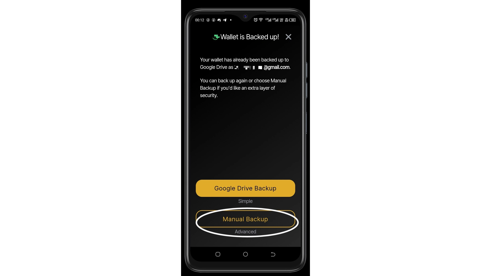

W poniższym interfejsie WoS przypomina o kilku środkach ostrożności, które należy wziąć pod uwagę przed przystąpieniem do ręcznego tworzenia kopii zapasowej.

Aktywuj przycisk **Zrozumiałem** i naciśnij przycisk **Dalej**.

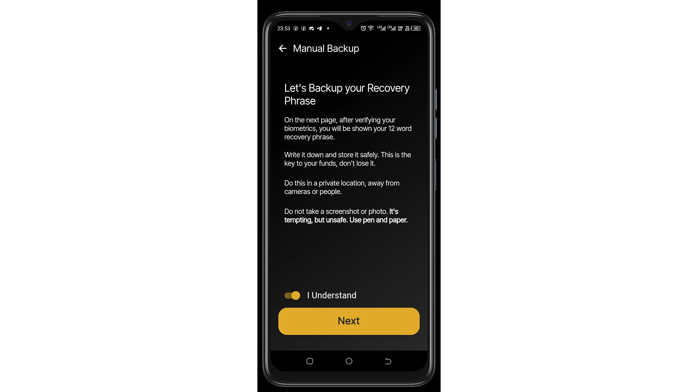

Następnie zostanie wyświetlonych 12 słów. Zapisz je, a następnie kliknij przycisk **Next**.

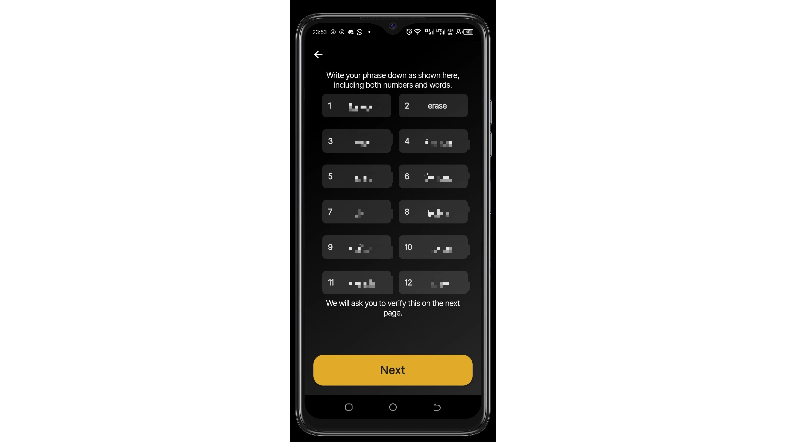

W nowym interfejsie naciśnij słowa w odpowiedniej kolejności.

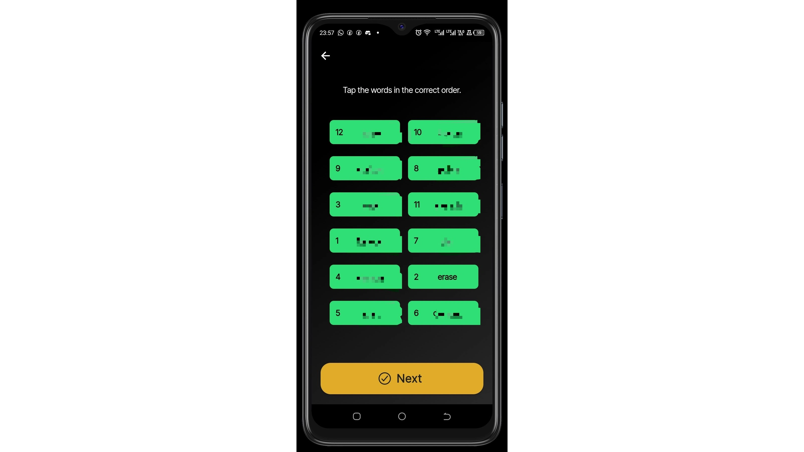

Na koniec kliknij przycisk **Dalej**. Gratulacje! Tworzenie kopii zapasowej zostało zakończone.

## Samodzielne odnawianie portfela

Jeśli chcesz odzyskać lub przywrócić WoS self-custody wallet po zmianie telefonu lub z innego powodu, wykonaj poniższe czynności.

Aby otworzyć portfolio WoS, kliknij menu hamburgera w prawym górnym rogu głównego interfejsu.

W wyświetlonym menu kliknij podmenu **Open Self Custody Wallet**.

W nowym interfejsie, który się pojawi, naciśnij przycisk **Przywróć istniejący Wallet**.

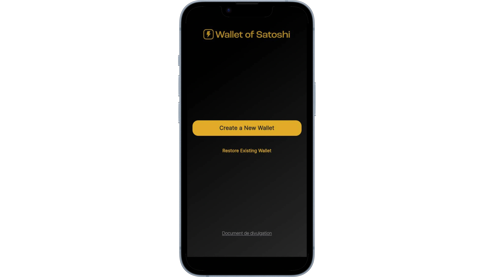

Wybierz metodę przywracania i przejdź do następnego kroku.

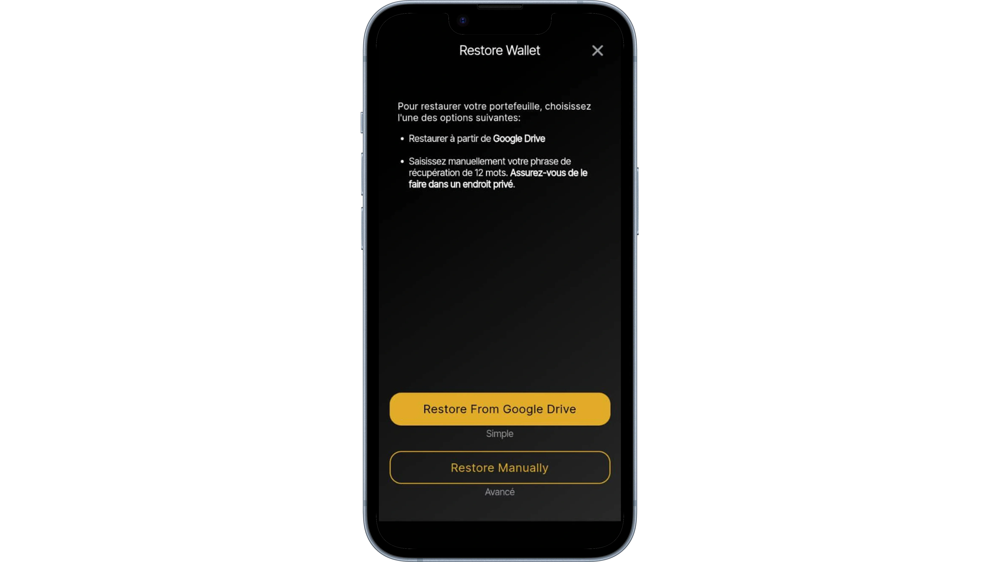

### Przywracanie przez Dysk Google

1. Naciśnij przycisk **Przywróć z Dysku Google**.

2. Wybierz konto Google i pozwól aplikacji WoS odzyskać dane zapisane na Twoim Dysku Google.

3. Następnie wprowadź hasło szyfrowania (oczywiście jeśli zostało wcześniej zdefiniowane) z pliku zawierającego 12 słów.

4. Poczekaj kilka chwil, aż przywrócenie zacznie działać i będziesz mógł ponownie uzyskać dostęp do swojego portfolio.

### Przywracanie ręczne

1. Naciśnij przycisk **Przywróć ręcznie**.

2. Następnie wprowadź 12 słów frazy mnemonicznej, zapisując każde słowo przed jego numerem początkowym.

3. Poczekaj kilka chwil, aż przywrócenie zacznie działać i będziesz mógł ponownie uzyskać dostęp do swojego portfolio.

### Przenoszenie bitcoinów między WoS custody i WoS self-custody

Jeśli posiadasz bitcoiny (sats) w WoS custody wallet i utworzysz WoS self-custody wallet, nie stracisz swoich środków. Co więcej, możesz przenieść je do portfela self-custody i odwrotnie.

W tym celu :

Możesz skopiować swój adres Lightning WoS self-custody lub utworzoną przez siebie fakturę.

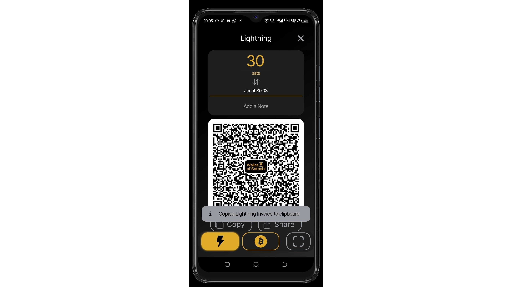

Teraz otwórz wallet i naciśnij przycisk **Envoyer**.

Następnie wklej adres lub fakturę. Naciśnij **Envoyer** po raz drugi.

Wróć do swojego portfolio self-custody i zobaczysz, że rzeczywiście otrzymałeś środki.

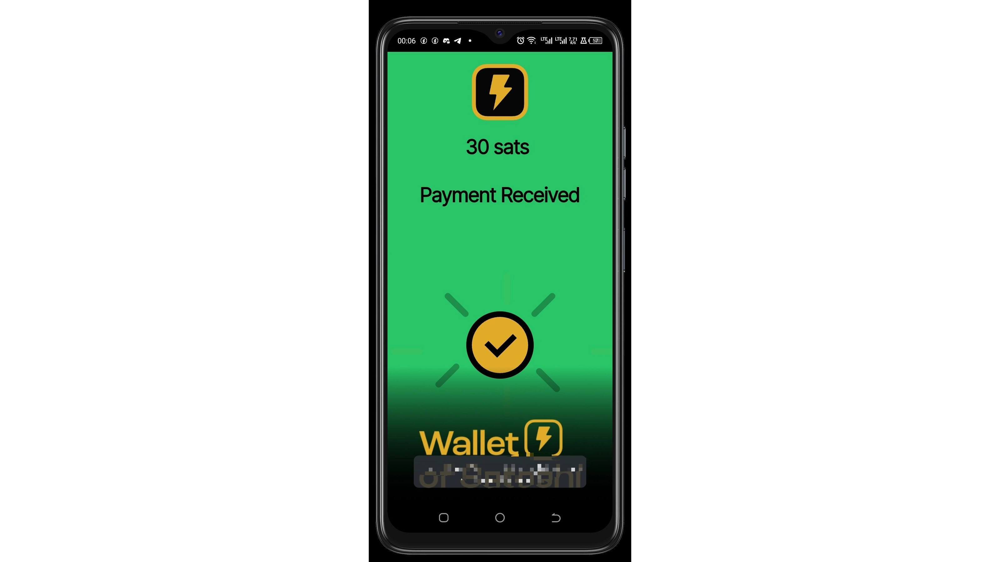

## Wysyłanie i odbieranie bitcoinów

Jeśli chodzi o wysyłanie i odbieranie bitcoinów w trybie self-custody, podobnie jak w przypadku ogólnego przeglądu i interfejsów, nie różnią się one od wysyłania i odbierania bitcoinów za pośrednictwem WoS custody wallet.

Zapoznaj się z podstawowym samouczkiem dotyczącym korzystania z Wallet of Satoshi w sieci Plan₿.

https://planb.academy/tutorials/wallet/mobile/wallet-of-satoshi-39149d86-e42b-4e8f-ae9f-7e061e7784f7

Możesz teraz samodzielnie skonfigurować i obsługiwać Wallet of Satoshi w trybie samoobsługowym.

Jeśli uważasz, że ten poradnik był przydatny, zostaw mi zielony kciuk poniżej. Dziękuję bardzo!