этот учебник написан_ [Bitcoin Campus](https://linktr.ee/bitcoincampus_)

## Загрузка, настройка и использование Wallet из Satoshi

Wallet из Satoshi - это Lightning Network Wallet, хранительский и очень простой в использовании.

Для целей курса [BTC105 - Finding Now](https://planb.network/it/courses/trovarsi-ora-d1370810-63f6-4aba-b822-e3a66bf225a5) он используется для ваучеров Redeem Lightning Network.

**Всегда помните: _не ключи, не монеты_**

Кастодиальные кошельки не позволяют пользователям полностью контролировать свои средства. Обычно их не рекомендуют использовать, за исключением новичков. WoS следует использовать в качестве переходного Wallet или для хранения карманных денег, а не для долгосрочного накопления средств.

---

Wallet of Satoshi (WoS) - это кастодиальный продукт, но он имеет определенную репутацию. Мы вполне можем обратиться к такому инструменту, как WoS, например, чтобы увеличить наши возможности по получению ликвидности. Мы временно делегируем WoS "грязную работу" по управлению ликвидностью каналов за нас. Как только будет достигнута определенная сумма, мы опустошим WoS On-Chain до нашего не хранящегося Wallet.

**WARNING⚠️: Рекомендуется прочитать учебник полностью, прежде чем приступать к работе**

### Загрузка Wallet из Satoshi

Зайдите в Play Store и загрузите WoS

**Примечание:** WoS загружается только из официальных магазинов. Если операционная система устройства запрограммирована, перед открытием WoS необходимо пройти часть верификации самой ОС. После этапа проверки выберите _Открыть_.

Wallet из Satoshi открывается со следующим экраном, на котором необходимо нажать _Start_

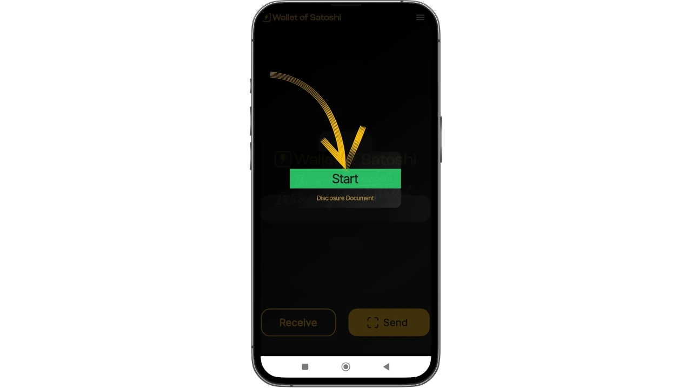

### Регистрация учетной записи для WoS

На данный момент Wallet уже работает, но для большей безопасности мы переходим к настройке логина: он понадобится для восстановления средств в случае неисправности или потери устройства. Поэтому выберите меню в левом верхнем углу.

Откроется целое окно меню, в котором нужно установить исключительно валюту (в Wallet из Satoshi по умолчанию в качестве базовой валюты представлен доллар США) и цвет темы (светлый/темный), по вкусу. Остальные команды не используйте.

Поскольку WoS является инструментом хранения, мы не можем создать резервную копию Wallet с помощью фразы Mnemonic, но мы можем позволить WoS восстановить наши средства, в случае потери или неиспользования мобильного устройства, нажав на _Вход/Регистрация_

Появится окно с предложением ввести электронную почту Address. Это может быть **почта Proton** (рекомендуется), но она должна быть функциональной, так как это позволит нам восстановить средства на Wallet в случае потери/кражи или повреждения мобильного телефона.

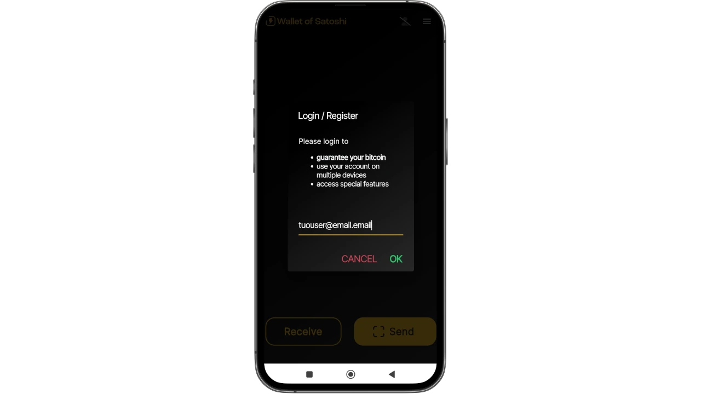

Wallet из Satoshi отправил сообщение на указанный почтовый ящик.

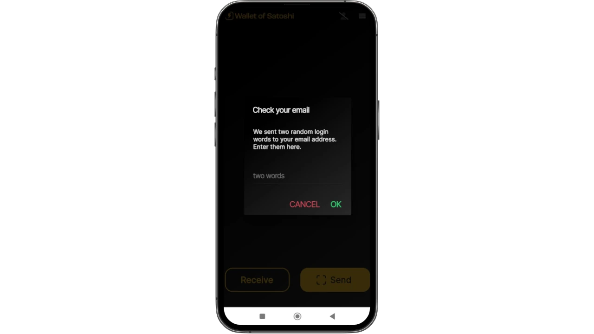

В почтовом ящике мы найдем два слова, которые нужно ввести, переписав их, в отведенное приложением место.

- не включайте переводчик: слова должны оставаться на английском языке
- перепишите два слова, обращая внимание на заглавные/прописные буквы

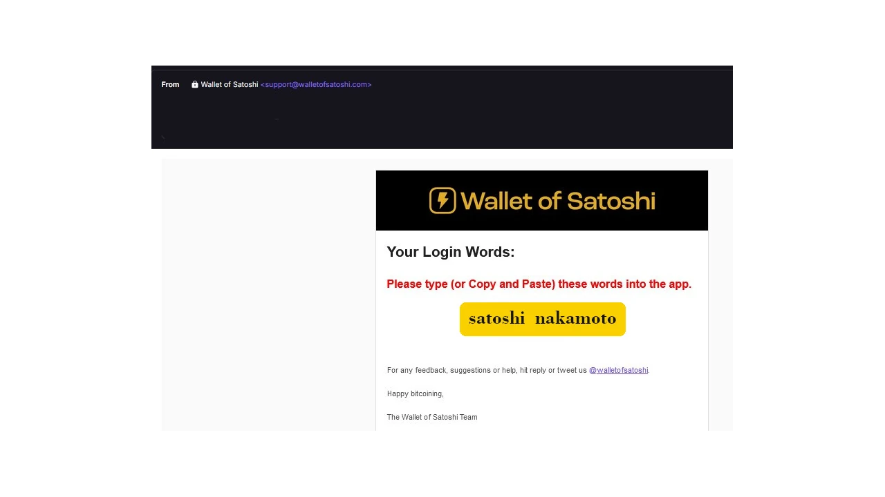

После транскрибирования двух слов нажмите _OK_.

В результате вверху должно появиться изображение с символом галочки для проверки.

в разделе настроек в красной полосе _Вход/Регистрация_ теперь отображается электронная почта пользователя Address.

### Получение платежей

Чтобы получать на WoS, нажмите _Receive_, и появится ряд команд.

Вы можете получить

- через LN-Address **a**
- через LN, установив Invoice **b**
- on chain (WoS поддерживает сеть Bitcoin, но с платными подлодками) **c**
- отсканировав QR-код LNurl-p **d**

### Создание Invoice

Нажмите на _Принять_ и выберите команду с символом Lightning Network.

Появится меню создания Invoice, где мы нажмем _Add Amount_, чтобы написать точную сумму и добавить описание, в данном примере "Мой первый Invoice".

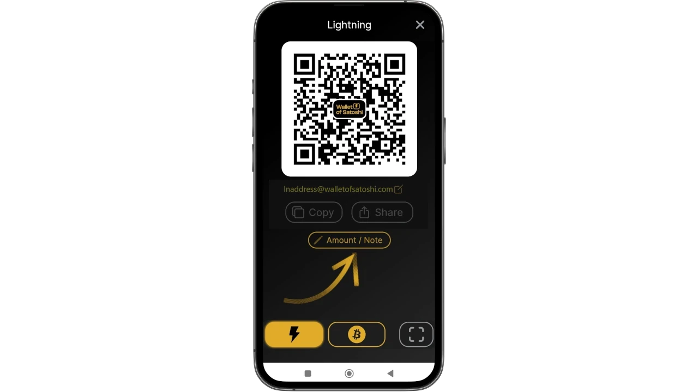

С помощью клавиатуры мы устанавливаем количество.

чтобы затем получить оплату Invoice. Полученный платеж выглядит следующим образом:

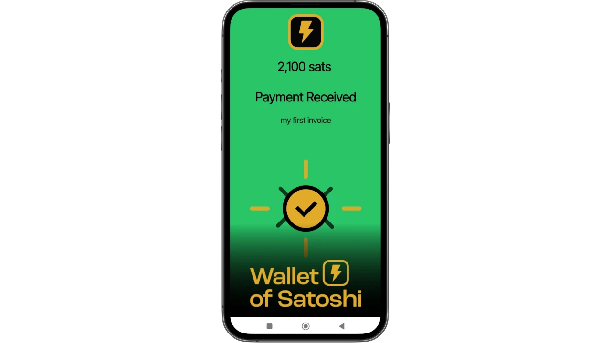

### Инкассация из кассового аппарата

Wallet из Satoshi имеет стандартную функцию, которая делает его особенно подходящим для торговцев: POS. Давайте посмотрим, как его активировать.

На главном экране выберите меню в правом верхнем углу.

Затем выберите _Точка продажи_.

В последней версии WoS обязательно выберите _клавиатуру_.

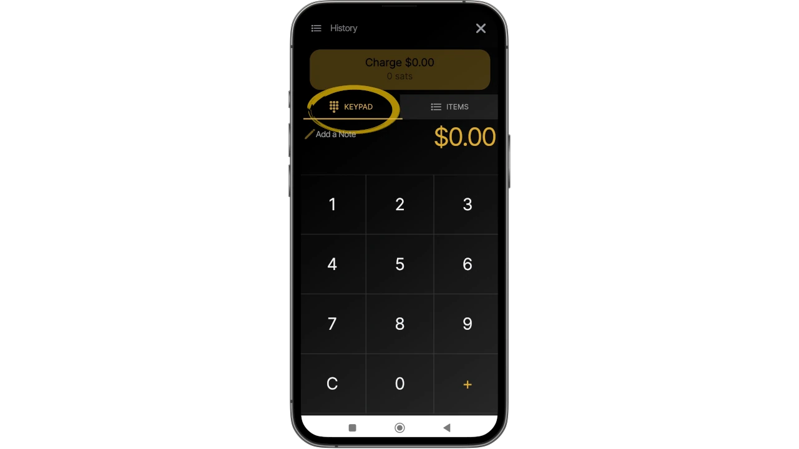

а затем введите сумму на клавиатуре, в приведенном ниже примере равную 10 центам / 118 Sats. Добавьте описание коллекции, в данном случае "моя вторая с POS". Загорается большая кнопка Green, на которую нужно нажать

gW-43 Invoice и показать его, например, клиенту.

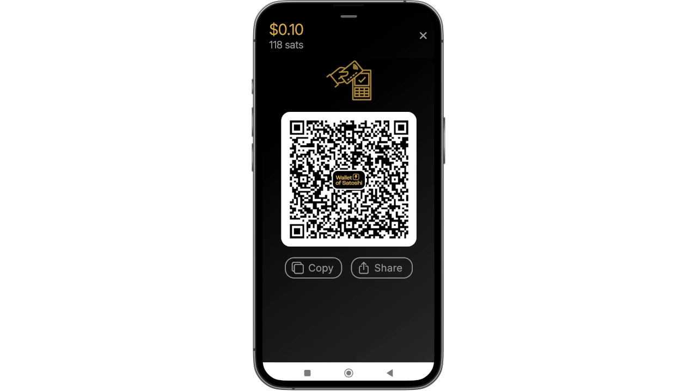

Этот платеж также взимается!

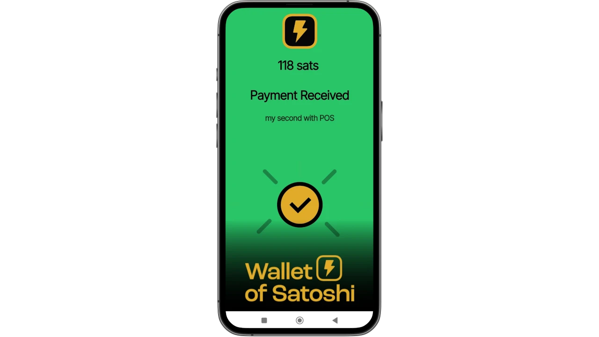

### Отправка платежей

Простота - сильная сторона главного экрана WoS. Чтобы оплатить Invoice, нажмите на кнопку _Отправить_

При первом использовании WoS запрашивает разрешение на доступ к камере

С этого момента камера активируется

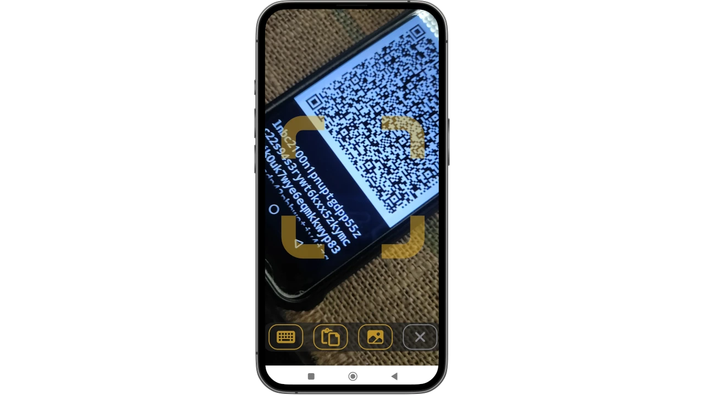

Обрамляя Invoice, мы видим, что запрошена выплата 210 Sats. Также читается описание, если проситель его задал. Этот экран - резюме, а также запрос на подтверждение: WoS "запрашивает разрешение" на отправку платежа, которое выдается нажатием кнопки Green _Отправить_

Когда платеж достигает места назначения, WoS уведомляет об этом на экране

На главном экране при нажатии на _Историю_ (чуть ниже баланса) появляется список транзакций

#### Восстановление учетной записи WoS

Теперь мы рассмотрим, как установить WoS на новое устройство; это также пригодится в случаях кражи, потери или невозможности работать с мобильным телефоном, на котором Wallet была установлена ранее. После переустановки необходимо повторить только что описанную процедуру регистрации аккаунта, с одной лишь оговоркой: в конце запроса на вход с ранее установленной электронной почтой WoS будет выглядеть следующим образом:

Сообщение предупреждает нас о том, что было отправлено письмо с процедурой повторной активации учетной записи. Вы должны открыть свой почтовый ящик.

** ВАЖНО**: открывайте письмо с компьютера или, в любом случае, с устройства, отличного от того, на котором вы собираетесь восстановить аккаунт WoS. В папке "Входящие" мы находим сообщение, в котором указан QR-код, который нужно вставить в рамку

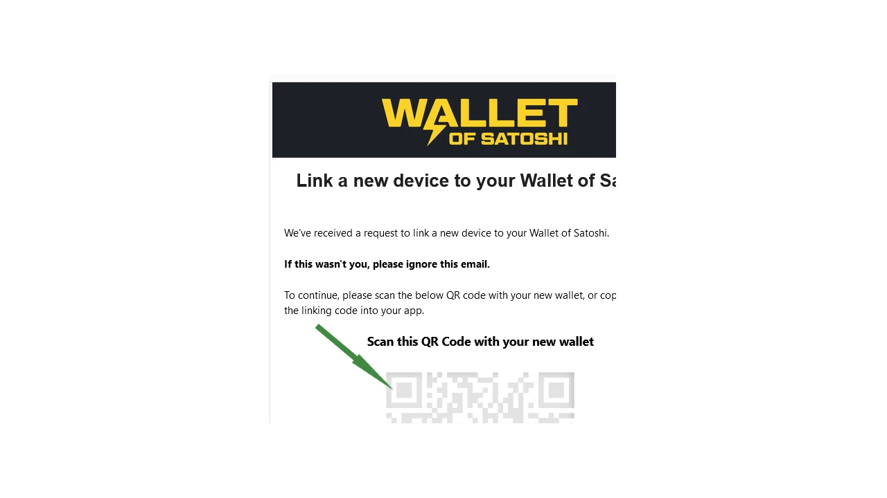

После того как QR-код будет вставлен в рамку, на главной странице WoS появится восстановленный счет с балансом и историей.